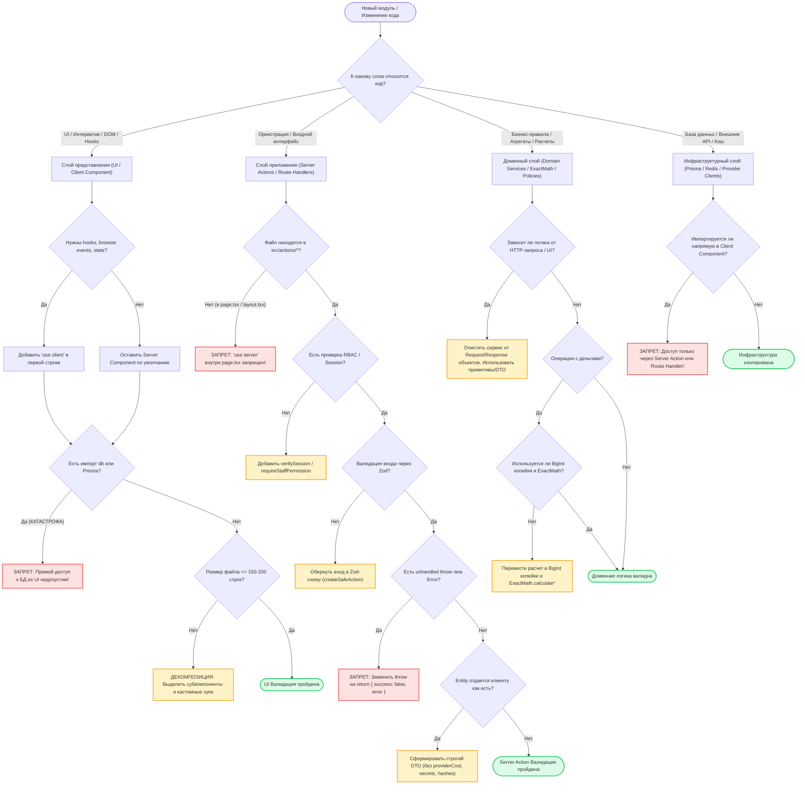

# SKILL: arch-boundary-guard — Защита архитектурных границ OmniSMM

## Назначение и границы (Overview & Scope)
Скилл `arch-boundary-guard` регламентирует строгое соблюдение архитектурных границ Clean Architecture в Next.js 16 и React 19 платформы OmniSMM 1.0 (SMMplan / SMMflux). Предотвращает утечки данных из слоя базы данных в компоненты представления, запрещает "use server" в page.tsx, форсирует контракт { success, error, data } и лимит файлов до 150-200 строк.

---

> **Статус:** Обязательный архитектурный стандарт платформы OmniSMM 1.0 (SMMplan & SMMflux).  
> **Стек:** Next.js 16 (App Router, Turbopack/Webpack), React 19, Tailwind 4, Prisma 5, PostgreSQL, TypeScript 5.7+ (strict mode).

---

## 1. Дерево решений (Decision Tree / Flowchart)

При добавлении или модификации любого модуля в платформе OmniSMM архитектурный агент обязан классифицировать код по слоям и провести валидацию через дерево решений:



### Пошаговый алгоритм проверки границ слоев:
1. **Шаг 1. Определение слоя ответственности**:
   - **UI Layer (`src/components/`, `src/app/**/page.tsx`):** Только отображение, захват ввода, анимации, вызовы Server Actions. Никакой прямой работы с базой данных, Redis или секретами.
   - **Application Layer (`src/actions/`, `src/app/api/`):** Оркестрация пользовательских сценариев, проверка прав (`requireStaffPermission`), валидация входящих данных (`Zod`), вызов доменных сервисов, маппинг доменных сущностей в клиентские DTO.
   - **Domain Layer (`src/services/`, `src/lib/financial/`):** Чистая бизнес-логика. Валидация инвариантов агрегатов, финансовые вычисления (`ExactMath`), правила смены статусов заказов, списание средств (`WalletOps`). Доменные сервисы не должны знать о структуре HTTP-запросов (`Request`, `NextRequest`, куках).
   - **Infrastructure Layer (`src/lib/db.ts`, `src/lib/redis.ts`, `src/services/providers/`):** Доступ к PostgreSQL через Prisma, драйверы очередей BullMQ, шлюзы внешних провайдеров, шифрование VaultService.
2. **Шаг 2. Проверка директивы `'use client'` и размера файла**:
   - `'use client'` объявляется строго в первой строке файла, если компонент использует хуки (`useState`, `useEffect`, `useActionState`) или браузерные события.
   - Если файл превышает **150-200 строк**, выполняется обязательное расщепление на дочерние субкомпоненты и вспомогательные селекторы/хуки.
3. **Шаг 3. Защита Server Actions**:
   - Файлы действий располагаются строго в `src/actions/` с директивой `'use server'` в заголовке файла.
   - Запрещено ставить `"use server"` внутри `page.tsx`.
   - Вход валидируется через `createSafeAction(schema, input, handler)` или Zod safeParse.
   - Ни при каких обстоятельствах не выбрасывается неперехваченный `throw new Error(...)` — Next.js 16 замаскирует ошибку в нечитаемое сообщение.
4. **Шаг 4. Барьер безопасности данных (Strict DTO)**:
   - Сущности Prisma (`User`, `Service`, `Order`, `Provider`) **никогда** не передаются клиенту в исходном виде.
   - Поля `providerCost`, `apiKeyHash`, `twoFactorSecret`, `passwordHash`, `adminNote`, `apiUrl`, `proxyId` срезаются перед возвратом.

---

## 2. Жесткие инварианты и табу (Hard Invariants & Anti-Patterns)

### Инвариант 1: Запрет доступа к БД из Client Components

> ❌ **ТАБУ:** Импортировать `db` (`@/lib/db`) или Prisma Client в клиентский компонент (`'use client'`).  
> **Последствия:** Утечка секретов подключения к PostgreSQL в клиентский бандл, краш сборки Webpack/Turbopack, уязвимость базы данных.

#### ❌ ПЛОХО (Anti-Pattern): Прямой запрос к БД из UI-компонента
```typescript
// src/components/dashboard/ServiceCatalog.tsx
'use client';

import { useEffect, useState } from 'react';
import { db } from '@/lib/db'; // ❌ КАТАСТРОФА: Импорт сервера в клиент!

export function ServiceCatalog() {
  const [services, setServices] = useState([]);

  useEffect(() => {
    // ❌ Прямое обращение к БД из браузера невозможно и взламывает архитектуру
    db.service.findMany({ where: { isActive: true } }).then(setServices);
  }, []);

  return <div>{/* Рендер */}</div>;
}
```

#### ✅ ХОРОШО (Compliant): Разделение через Server Action и DTO
```typescript
// 1. DTO контракт (src/types/service-dto.ts)
export interface ClientServiceDto {
  id: string;
  name: string;
  pricePerUnitRub: string; // Розничная цена за 1 штуку в формате "₽ / шт"
  minQty: number;
  maxQty: number;
  category: string;
}

// 2. Server Action (src/actions/order/catalog.ts)
'use server';

import { db } from '@/lib/db';
import type { ClientServiceDto } from '@/types/service-dto';
import { ExactMath } from '@/lib/financial/exact-math';

export async function getPublicCatalogAction(tenantId: string): Promise<{
  success: boolean;
  data?: ClientServiceDto[];
  error?: string;
}> {
  try {
    const rawServices = await db.service.findMany({
      where: { isActive: true, tenantId },
      select: {
        id: true,
        name: true,
        pricePerUnitCents: true,
        minQty: true,
        maxQty: true,
        category: true,
        // providerCostCents СТРОГО ИСКЛЮЧЕН — защита от утечки маржи
      }
    });

    const data: ClientServiceDto[] = rawServices.map((s) => ({
      id: s.id,
      name: s.name,
      pricePerUnitRub: ExactMath.centsToDisplayRub(s.pricePerUnitCents),
      minQty: s.minQty,
      maxQty: s.maxQty,
      category: s.category,
    }));

    return { success: true, data };
  } catch (error) {
    console.error('[CATALOG_ACTION_ERROR]', error);
    return { success: false, error: 'Не удалось загрузить каталог услуг' };
  }
}

// 3. Client Component (src/components/dashboard/ServiceCatalog.tsx)
'use client';

import { useEffect, useState } from 'react';
import { getPublicCatalogAction } from '@/actions/order/catalog';
import type { ClientServiceDto } from '@/types/service-dto';

export function ServiceCatalog({ tenantId }: { tenantId: string }) {
  const [services, setServices] = useState<ClientServiceDto[]>([]);
  const [error, setError] = useState<string | null>(null);

  useEffect(() => {
    let isMounted = true;
    getPublicCatalogAction(tenantId).then((res) => {
      if (!isMounted) return;
      if (res.success && res.data) {
        setServices(res.data);
      } else {
        setError(res.error || 'Ошибка загрузки');
      }
    });
    return () => { isMounted = false; };
  }, [tenantId]);

  if (error) return <div className="text-destructive text-sm">{error}</div>;
  return <div>{/* Чистый рендер без утечки БД */}</div>;
}
```

---

### Инвариант 2: Запрет `"use server"` внутри `page.tsx`

> ❌ **ТАБУ:** Размещать директиву `"use server"` в Page Components (`src/app/**/page.tsx`), `layout.tsx` или внутри инлайн-обработчиков страниц.  
> **Последствия:** В Next.js 16 App Router это вызывает мгновенный краш сборщика Turbopack/Webpack с ошибкой сериализации серверного контекста.

#### ❌ ПЛОХО (Anti-Pattern): "use server" внутри `page.tsx`
```typescript
// src/app/admin/users/page.tsx
export default async function UsersPage() {
  // ❌ КАТЕГОРИЧЕСКИ ЗАПРЕЩЕНО: inline Server Action внутри страницы
  async function deleteUser(formData: FormData) {
    'use server';
    const id = formData.get('id') as string;
    await db.user.delete({ where: { id } });
  }

  return (
    <form action={deleteUser}>
      <input name="id" />
      <button type="submit">Удалить</button>
    </form>
  );
}
```

#### ✅ ХОРОШО (Compliant): Вынос Server Action в изолированный файл `src/actions/`
```typescript
// 1. Изолированный файл действия (src/actions/admin/users.ts)
'use server';

import { db } from '@/lib/db';
import { requireStaffPermission } from '@/lib/server/rbac';
import { revalidatePath } from 'next/cache';

export async function deleteUserAction(userId: string): Promise<{ success: boolean; error?: string }> {
  return requireStaffPermission('clients', 'edit', async (adminUser) => {
    try {
      await db.user.update({
        where: { id: userId },
        data: { isDeleted: true, isActive: false }
      });
      revalidatePath('/admin/users');
      return { success: true };
    } catch (err) {
      console.error('[DELETE_USER_ERROR]', err);
      return { success: false, error: 'Не удалось удалить пользователя' };
    }
  });
}

// 2. Чистый Page Component (src/app/admin/users/page.tsx)
import { UserDeleteButton } from './components/UserDeleteButton';

export default async function UsersPage() {
  return (
    <main className="p-6">
      <h1 className="text-xl font-bold">Пользователи</h1>
      <UserDeleteButton userId="usr_123" />
    </main>
  );
}
```

---

### Инвариант 3: Запрет `throw new Error` в Server Actions

> ❌ **ТАБУ:** Выбрасывать необработанные исключения `throw new Error(...)` внутри Server Actions.  
> **Последствия:** Next.js в production маскирует текст исключения ради безопасности и отдает на клиент generic-строку:  
> `"An unexpected response was received from the server."`  
> Пользователь видит пугающую ошибку, а UI не может показать локализованную причину (например, "Недостаточно средств").

#### ❌ ПЛОХО (Anti-Pattern): Выбрасывание throw в Server Action
```typescript
// src/actions/order/checkout.ts
'use server';

export async function placeOrderAction(input: OrderInput) {
  const user = await db.user.findUnique({ where: { id: input.userId } });
  if (!user) {
    // ❌ КЛИЕНТ УВИДИТ: "An unexpected response was received from the server."
    throw new Error('Пользователь не найден'); 
  }
  if (user.balance < input.costCents) {
    // ❌ КЛИЕНТ УВИДИТ ТО ЖЕ САМОЕ! Причина скрыта.
    throw new Error('Недостаточно средств на балансе');
  }
}
```

#### ✅ ХОРОШО (Compliant): Строгий возврат типизированного объекта с `createSafeAction`
```typescript
// src/actions/order/checkout.ts
'use server';

import { z } from 'zod';
import { createSafeAction, type ServerActionResponse } from '@/lib/safe-action';
import { WalletOps, WalletInsufficientFundsError } from '@/services/financial/wallet-ops';
import { runSerializableTransaction } from '@/lib/transactions';

const checkoutSchema = z.object({
  serviceId: z.string().cuid(),
  quantity: z.number().int().positive(),
  link: z.string().url(),
});

type CheckoutInput = z.infer<typeof checkoutSchema>;

export async function placeOrderAction(
  rawInput: unknown
): Promise<ServerActionResponse<{ orderId: string }>> {
  return createSafeAction(checkoutSchema, rawInput, async (input: CheckoutInput) => {
    // Безопасное выполнение в доменном сервисе
    const result = await runSerializableTransaction(async (tx) => {
      // Бизнес-логика через WalletOps и агрегат Order
      return { orderId: 'ord_success' };
    });
    return result;
  });
}
```

---

### Инвариант 4: Запрет утечки сырых сущностей Prisma (Strict DTO Mapping)

> ❌ **ТАБУ:** Возвращать из Server Actions или API клиенту полные объекты Prisma моделей (`User`, `Provider`, `Service`).  
> **Последствия:** Утечка критических полей:
> - `providerCost` / `actualProviderCost` — коммерческая тайна (себестоимость услуг).
> - `apiKeyHash` / `twoFactorSecret` — токены аутентификации.
> - `adminNote` — внутренние служебные пометки о клиенте.
> - `apiUrl` / `apiKey` провайдеров — компрометация поставщиков.

#### ❌ ПЛОХО (Anti-Pattern): Прямая передача модели Prisma на клиент
```typescript
// src/actions/admin/users.ts
'use server';

export async function getUserProfile(userId: string) {
  // ❌ УТЕЧКА: Возвращает пароли, секреты 2FA, заметки операторов!
  const user = await db.user.findUnique({ where: { id: userId } });
  return { success: true, data: user };
}
```

#### ✅ ХОРОШО (Compliant): Явный белый список полей в DTO
```typescript
// src/actions/admin/users.ts
'use server';

import { db } from '@/lib/db';
import { verifySession } from '@/lib/session';

export interface UserClientProfileDto {
  id: string;
  email: string;
  role: string;
  balanceRub: string;
  isKycVerified: boolean;
  createdAt: string;
}

export async function getUserProfile(userId: string): Promise<{
  success: boolean;
  data?: UserClientProfileDto;
  error?: string;
}> {
  const session = await verifySession();
  if (!session || (session.userId !== userId && session.role !== 'OWNER')) {
    return { success: false, error: 'Доступ запрещен' };
  }

  const user = await db.user.findUnique({
    where: { id: userId },
    select: {
      id: true,
      email: true,
      role: true,
      balance: true,
      isKycVerified: true,
      createdAt: true,
      // ВСЕ СЕКРЕТНЫЕ ПОЛЯ ЯВНО ОТСЕЧЕНЫ НА УРОВНЕ SQL
    }
  });

  if (!user) return { success: false, error: 'Пользователь не найден' };

  return {
    success: true,
    data: {
      id: user.id,
      email: user.email,
      role: user.role,
      balanceRub: (Number(user.balance) / 100).toFixed(2),
      isKycVerified: user.isKycVerified,
      createdAt: user.createdAt.toISOString(),
    }
  };
}
```

---

### Инвариант 5: Лимит размера файлов и декомпозиция компонентов (150-200 строк)

> ❌ **ТАБУ:** Создавать или оставлять монолитные файлы компонентов свыше 200 строк (например, `SmmplanOrderWizard.tsx` на 1400 строк).  
> **Стандарт OmniSMM:** Компоненты декомпозируются на атомарные субкомпоненты.
> - Главный контейнер (оркестратор): до 120-150 строк.
> - Подкомпоненты (шаги визарда, карточки, строки таблиц, модалки): по 50-100 строк в директории `components/`.
> - Логика состояния выносится в кастомные хуки (`useOrderWizard`, `useOrderEngine`).

---

## 3. Премортем-анализ и моделирование отказов (Failure Scenarios / Pre-Mortem)

Перед сдачей любого изменения, затрагивающего границы слоев, проведите моделирование отказов:

| Сценарий отказа | Вероятность x Влияние | Механизм защиты в коде | Стратегия восстановления |
| :--- | :--- | :--- | :--- |
| **1. Утечка себестоимости услуги (providerCost) клиенту** | Высокая (3) x Критическое (5) = **15** | Prisma `select` строго ограничивает отдаваемые поля. Zod-валидатор DTO на выходе Server Action. Проверка `check-bundle-secrets.mjs`. | Немедленная зачистка `select`, аудит клиентских логов, инвалидация кэша каталога в Redis. |
| **2. Появление generic-ошибки "An unexpected response was received..."** | Средняя (3) x Высокая (4) = **12** | Все Server Actions обернуты в `createSafeAction` или конструкцию `try/catch` с вызовом `handleServerError(err)`. Полный запрет `throw`. | Локализация упавшего экшена по логу `[SAFE_ACTION_ERROR]`, замена `throw` на `{ success: false, error: localizedMessage }`. |
| **3. Краш сборщика Turbopack из-за `'use server'` в `page.tsx`** | Низкая (2) x Фатальное (5) = **10** | CI-скрипт линтинга проверяет отсутствие директивы `'use server'` в каталоге `src/app/**/page.tsx`. Обязательный pre-build тест `npm run build`. | Перенос функции мутации в отдельный файл `src/actions/*` с последующим импортом в страницу. |
| **4. Обход авторизации (IDOR) из-за прямого вызова Server Action** | Средняя (3) x Критическое (5) = **15** | Каждый Server Action в `src/actions/admin/` и `src/actions/operator/` обязан содержать `requireStaffPermission()` или проверку сессии с tenantId. | Блокировка уязвимого экшена через Feature Flag, добавление проверки `userId === session.userId` и аудит инцидента. |
| **5. Циклическая зависимость и раздувание бандла (Circular Imports)** | Средняя (3) x Средняя (3) = **9** | Разделение типов (`src/types/`), чистых функций (`src/utils/`) и компонентов. Запрет импорта UI-компонентов в файлы доменных сервисов. | Запуск `madge --circular src/`, устранение перекрестных ссылок через выделение общего интерфейса. |

---

## 4. Чеклист верификации (Verification Checklist)

При проведении аудита PR или ревью кода выполните следующие шаги:

### 1. Статический анализ структуры и директив
- [ ] Запустить поиск запрещенных `'use server'` в компонентах страниц:
  ```powershell
  Get-ChildItem -Path src\app -Recurse -Filter "page.tsx" | Select-String "['""]use server['""]"
  ```
  *Ожидаемый результат: 0 совпадений.*

- [ ] Запустить поиск запрещенных `throw new Error` в Server Actions:
  ```powershell
  Get-ChildItem -Path src\actions -Recurse -Filter "*.ts" | Select-String "throw new Error"
  ```
  *Ожидаемый результат: 0 совпадений (допустимы только `redirect()` и `notFound()` из `next/navigation`).*

- [ ] Проверить отсутствие импорта `db` в клиентских компонентах:
  ```powershell
  Get-ChildItem -Path src\components,src\hooks -Recurse -Filter "*.tsx","*.ts" | Select-String "from '@/lib/db'"
  ```
  *Ожидаемый результат: 0 совпадений.*

### 2. Контроль контрактов и DTO
- [ ] Все публичные экспорты Server Actions возвращают тип `Promise<{ success: boolean; data?: T; error?: string }>` или `ServerActionResponse<T>`.
- [ ] Ни одна возвращаемая сущность не содержит поля: `providerCost`, `passwordHash`, `apiKeyHash`, `twoFactorSecret`, `adminNote`.
- [ ] Все финансовые поля передаются либо в копейках (`BigInt`), либо отформатированы через `ExactMath.centsToDisplayRub()`.

### 3. Контроль размера и декомпозиции
- [ ] Ни один измененный компонент UI не превышает 200 строк кода:
  ```powershell
  Get-ChildItem -Path src\components -Recurse -Filter "*.tsx" | Where-Object { (Get-Content $_.FullName | Measure-Object -Line).Lines -gt 200 } | Select-Object FullName
  ```
  *Все компоненты свыше 200 строк должны иметь тикет на декомпозицию.*

### 4. Автоматизированная верификация типов и сборки
- [ ] Запустить строгую проверку типов TypeScript:
  ```bash
  npx tsc --noEmit
  ```
- [ ] Прогнать тесты изоляции слоев и безопасности:
  ```bash
  npx vitest run src/services/security/__tests__/dynamic-security-pentest.test.ts
  ```
