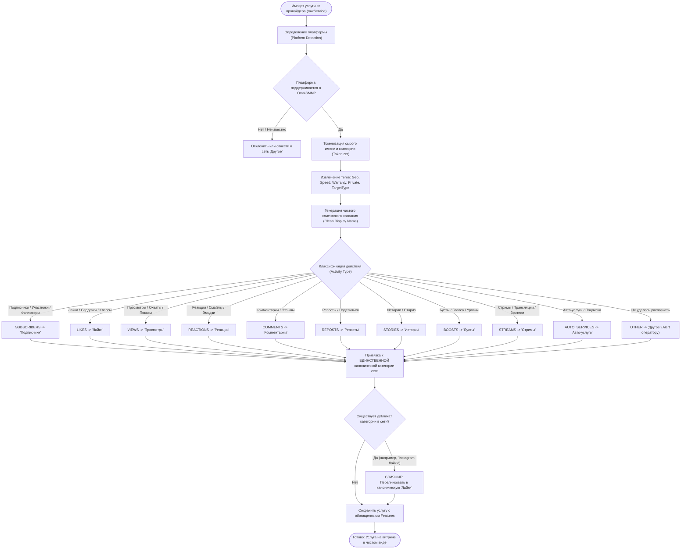

# SKILL: catalog-taxonomy-curator — Систематизация Каталога и Нормализация Импорта OmniSMM

> **Статус:** Обязательный архитектурный стандарт платформы OmniSMM 1.0 (SMMplan & SMMflux).  
> **Стек:** Next.js 16 (App Router), Prisma 5, PostgreSQL, TypeScript 5.7+ (strict mode), Redis 7+.

---

## 1. Архитектурное Назначение и Философия (Taxonomy-First)

Во внешней индустрии SMM-панелей (SMM Panels) каждый поставщик API использует произвольные, хаотичные и постоянно меняющиеся названия категорий:
* `Telegram Авто - Просмотры [Для закрытых каналов]`
* `Telegram Живые Авто - Просмотры для Tgstat и Telemetr`
* `Instagram Подписчики/Лайки [Таргетинг] [Россия]`

Если система импортирует сырые категории провайдера в базу данных «как есть», витрина неизбежно деградирует:
1. **Категориальный взрыв:** количество категорий разрастается до 100–200+, перегружая DOM, сайдбар и мобильный визард.
2. **Дублирование сущностей:** в одной соцсети одновременно существуют `Подписчики`, `Instagram Подписчики`, `Качественные подписчики`, фрагментируя трафик клиентов.
3. **Технический мусор в UI:** внутренние пометки провайдеров засоряют интерфейс клиента, снижая доверие и конверсию.

**Скилл `catalog-taxonomy-curator` утверждает принцип «Taxonomy-First»:**
> Внешний провайдер поставляет сырую услугу (Commodity Item), но витрина OmniSMM принадлежит платформе. Каждая услуга обязана пройти сквозную токенизацию и занять свое место в **строго фиксированном каноническом дереве таксономии**, а все специфические свойства провайдера извлекаются в структурированные метаданные (Features, Badges, Metrics).

---

## 2. Жесткие Архитектурные Инварианты (Hard Invariants)

1. **[INV-TAX-001] Фиксированное каноническое дерево категорий (Fixed Level-1 Taxonomy):**
   В каждой социальной сети разрешено **не более 6–9 канонических категорий первого уровня**. Категории определяют *фундаментальное действие* пользователя (`SUBSCRIBERS`, `LIKES`, `VIEWS`, `COMMENTS`, `REACTIONS`, `REPOSTS`, `STORIES`, `BOOSTS`, `STREAMS`, `AUTO_SERVICES`, `OTHER`).
2. **[INV-TAX-002] Категорический запрет Verbatim-импорта категорий (Zero Raw Provider Categories):**
   ❌ **ЗАПРЕЩЕНО** создавать категорию в таблице `Category` со строковым значением из поля `category` API провайдера без нормализации через токенизатор `SmartAnalyzerLogic`.
3. **[INV-TAX-003] Принцип очистки имен от префиксов платформ (No Brand Redundancy):**
   ❌ **ЗАПРЕЩЕНО** дублировать название соцсети в имени категории (`Telegram Подписчики`, `VK Лайки`, `Instagram Просмотры`).
   ✅ В контексте соцсети категория называется кратко и емко: **«Подписчики»**, **«Лайки»**, **«Просмотры»**. Имя платформы подставляется контекстно или формируется в SEO-хлебных крошках.
4. **[INV-TAX-004] Извлечение технических тегов в структурированные метаданные (Feature Extraction):**
   Все квадратные скобки `[...]` и технические условия провайдера ОБЯЗАНЫ извлекаться в типизированные поля модели `Service`:
   * `[Для закрытых каналов]` $\to$ `service.isPrivate = true` (бейдж «Закрытые каналы»).
   * `[Россия]` / `[СНГ]` $\to$ `service.geo = "RU"` (флаг страны).
   * `[Tgstat]` / `[Telemetr]` $\to$ `service.features.telemetr = true` (бейдж «Учитывается в Tgstat»).
   * `[30 дней]` / `[R30]` $\to$ `service.warranty = 30` (бейдж «Гарантия 30 дней»).
   * `[до 50k в сутки]` $\to$ `service.speed = "до 50k / день"`.
5. **[INV-TAX-005] Изоляция заказов от мутаций категорий (Order-Service Independence):**
   Заказы пользователей в модели `Order` привязаны строго к `serviceId` и снимку `ServiceSnapshot`. Слияние, переименование или перемещение категорий никогда не затрагивает финансовый баланс, леджер и статус выполнения заказов.
6. **[INV-TAX-006] Стабильность канонических URL и SEO-защита (Canonical Slug Hygiene):**
   Слаги категорий строятся по детерминированной схеме: `/[network-slug]/[canonical-activity-slug]` (например, `/services/telegram/subscribers`). При слиянии устаревших дублей в `proxy.ts` / Next.js настраивается 301 Permanent Redirect для сохранения ссылочного веса.

---

## 3. Дерево Решений Нормализации (Decision Tree / Flowchart)



---

## 4. Каноническая Таксономическая Матрица (Master Taxonomy Matrix)

Каждая соцсеть поддерживает только подмножество канонических категорий, строго актуальных для ее механики:

| Соцсеть (Network) | Канонические Категории (Level 1) | Поддерживаемые типы таргета (Target Types) | Специфические Features / Извлекаемые теги |
| :--- | :--- | :--- | :--- |
| **Telegram** | 1. Подписчики<br>2. Просмотры<br>3. Реакции<br>4. Бусты<br>5. Комментарии<br>6. Репосты<br>7. Истории<br>8. Боты и Рефералы<br>9. Автопросмотры | `CHANNEL`, `GROUP`, `POST`, `STORY`, `BOT` | `isPrivate` (Закрытые каналы), `telemetr` (Tgstat/Telemetr), `geo` (RU/UZ/KZ/USA), `speed` |
| **Instagram** | 1. Подписчики<br>2. Лайки<br>3. Просмотры (Reels/Видео)<br>4. Комментарии<br>5. Истории<br>6. Охваты и Сохранения<br>7. Стримы | `PROFILE`, `POST`, `REEL`, `STORY`, `LIVE` | `geo` (Живые РФ / Мир), `warranty` (С гарантией/Без), `dropRate` |
| **VK (ВКонтакте)** | 1. Подписчики / Друзья<br>2. Лайки<br>3. Просмотры (Записи/Клипы)<br>4. Репосты<br>5. Комментарии<br>6. Опросы и Голоса<br>7. Стримы | `PROFILE`, `GROUP`, `POST`, `CLIP`, `POLL`, `STREAM` | `targetType` (Группа vs Паблик vs Профиль), `geo` |
| **YouTube** | 1. Подписчики<br>2. Просмотры (Видео/Shorts)<br>3. Лайки<br>4. Комментарии<br>5. Зрители на Стрим<br>6. Часы Просмотра | `CHANNEL`, `VIDEO`, `SHORTS`, `STREAM` | `retention` (Удержание в минутах), `monetizationAware` |
| **TikTok** | 1. Подписчики<br>2. Просмотры<br>3. Лайки<br>4. Комментарии<br>5. Репосты и Сохранения<br>6. Стримы | `PROFILE`, `VIDEO`, `LIVE` | `geo`, `speed`, `warranty` |
| **Универсальные (Twitch, Kick, Discord и др.)** | Фокусные категории (Фолловеры, Зрители, Бусты, Участники сервера) | Профиль / Канал / Сервер | Платформенные фичи |

---

## 5. Конвейер Токенизации и Очистки (Smart Tokenizer Engine)

Токенизатор анализирует сырую строку названия от поставщика (`rawName`) и сырую категорию (`rawCategory`) в 4 шага:

```
┌────────────────────────────────────────────────────────────────────────┐
│               КОНВЕЙЕР ТОКЕНИЗАЦИИ И ОЧИСТКИ УСЛУГИ                    │
│                                                                        │
│ 1. Извлечение метаданных  -->  2. Очистка имени  -->  3. Определение  --> 4. Сборка      │
│    (Tags, Brackets, Regex)      (Sanitize Noise)     Activity Type      Display Item   │
└────────────────────────────────────────────────────────────────────────┘
```

### Регулярные выражения для извлечения тегов:
1. **Приватность / Закрытые каналы:** `/(?:для\s+)?закрыт\w+\s+канал\w+/i` $\to$ `isPrivate: true`
2. **Геолокация:** `/(?:\[|\()(РФ|Россия|RU|СНГ|CIS|USA|США|Мир|World|KZ|UZ)(?:\]|\))/i` $\to$ `geo: code`
3. **Статистика / Охват:** `/(?:tgstat|telemetr|тгстат|телеметр)/i` $\to$ `features.telemetr = true`
4. **Гарантия:** `/(?:гаранти\w+|refill|R)(\d+)?/i` $\to$ `warranty: N || 30`
5. **Скорость:** `/(?:до\s+)?(\d+[kк]?)\s*(?:в\s+день|\/day|\/сут)/i` $\to$ `speedText: "до N / день"`

### Очистка названия:
Из названия услуги вырезаются служебные маркеры поставщика (`[Сервер 1]`, `[Быстрый старт]`, `[ID: 1234]`, лишние эмодзи в начале строки). Формируется чистое клиентское имя вида:
* *Было у провайдера:* `Telegram Подписчики [Для закрытых каналов] [Быстрые] [Сервер 4] ♻️`
* *Стало на витрине:* **«Подписчики — Быстрый запуск для закрытых каналов»** с бейджами `Гарантия` и `Закрытые каналы`.

---

## 6. Протокол Консолидации и Слияния Существующих Дублей (Consolidation Pipeline)

Для приведения существующей базы данных (147 категорий) к каноническому виду используется скрипт:
`scripts/catalog-taxonomy-consolidator.ts`.

### Безопасный 4-шаговый протокол миграции:
1. **Шаг 1: Инспекция и картирование (Dry-Run Discovery):**
   Скрипт строит карту маппинга: `Map<LegacyCategoryId, CanonicalCategoryId>`:
   * Все категории `Instagram Подписчики`, `Подписчики/Лайки [Таргетинг]` сопоставляются с канонической `Подписчики`.
2. **Шаг 2: Создание недостающих канонических категорий:**
   Если в сети еще нет чистой категории с правильным слагом (например, `telegram-subscribers`), она создается.
3. **Шаг 3: Атомарный перенос услуг (Transaction Re-linking):**
   В рамках транзакции Prisma:
   ```ts
   await db.service.updateMany({
     where: { categoryId: legacyCat.id },
     data: { categoryId: canonicalCat.id }
   });
   ```
4. **Шаг 4: Безопасное удаление или архивация пустых категорий (Garbage Collection):**
   Категории, у которых `_count.services === 0`, безопасно удаляются. Ни одна услуга или заказ не теряется.

---

## 7. Премортем-анализ и Моделирование Рисков (Pre-Mortem Failure Simulation)

| Сценарий отказа | Вероятность x Влияние | Механизм защиты в коде |
| :--- | :---: | :--- |
| **Услуга попадает не в ту категорию** (например, «Лайки на комментарии» классифицируются как Лайки вместо Комментариев) | Средняя x Средняя | Иерархический приоритет таргета: если в названии есть «коммент», услуга привязывается к Комментариям. Возможность ручного переопределения через `RECLASSIFY_RULES` в `post-sync-rules.ts`. |
| **Сломались внешние ссылки на категории** (SEO 404 по старым слагам вида `/services/telegram/telegram-avto-prosmotry`) | Низкая x Высокая | Реестр устаревших слагов (Legacy Slugs Map) в `src/proxy.ts` с автоматическим 301-редиректом на канонический раздел `/services/telegram/views`. |
| **Провайдер удалил или переименовал услугу** во время ночного синка | Высокая x Низкая | Защитный барьер `ServiceMutationDetector`: изменение названия не меняет категорию услуги автоматически, если оператор зафиксировал ее вручную. |

---

## 8. Чеклист Приёмки и Верификации (Acceptance Gate)

Перед выпуском изменений по каталогу агент ОБЯЗАН подтвердить:
- [ ] **Количество категорий на сеть $\le 9$:** ни в одной социальной сети нет более 9 категорий первого уровня.
- [ ] **Отсутствие дублей имен:** нет одновременных `Подписчики` и `[Сеть] Подписчики`.
- [ ] **Отсутствие квадратных скобок в UI категорий:** имена чистые, без `[Для закрытых]`, `[API 5]`.
- [ ] **Сохранение всех услуг:** общее число активных услуг в БД до и после миграции совпадает (`COUNT(Service) = const`).
- [ ] **Проверка целостности заказов:** `npx vitest run src/__tests__/order-flow.test.ts` (100% PASS).
- [ ] **Визуальный аудит в браузере (BGS-2026):** сайдбар каталога выглядит компактно, отцентрованно, без скролл-баров и горизонтальных переломов.
