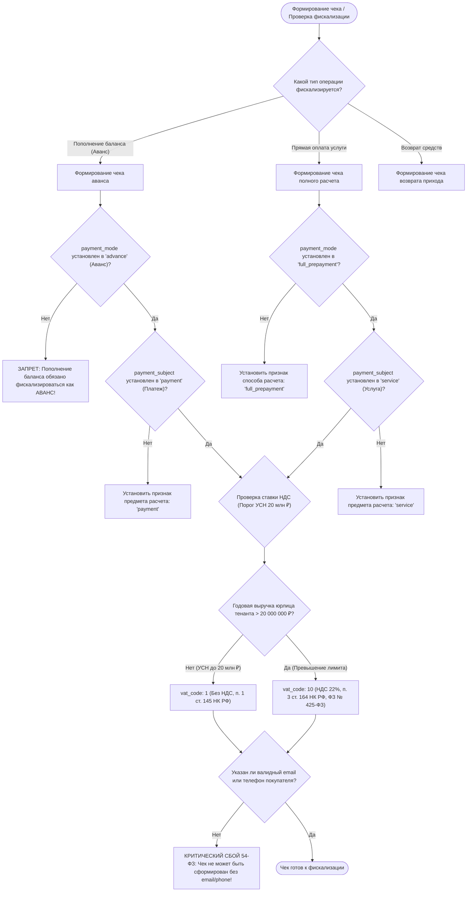

# SKILL: compliance-54fz-auditor — Фискальный контроль 54-ФЗ и НДС 2026

## Назначение и границы (Overview & Scope)
Скилл `compliance-54fz-auditor` регламентирует соответствие биллинга и платежных шлюзов платформы OmniSMM законодательству РФ о применении ККТ (54-ФЗ, 176-ФЗ, 425-ФЗ, НДС 22%, порог УСН 20 млн ₽).

---

> **Статус:** Обязательный финансово-правовой стандарт платформы OmniSMM 1.0 (BGS-2026 / RAC-2026).  
> **Законодательная база:** Федеральный закон № 54-ФЗ, ФЗ № 176-ФЗ и № 425-ФЗ (налоговая реформа 2026 г.), ст. 54.1 НК РФ, Приказ ФНС по форматам фискальных документов ФФД 1.2.

---

## 1. Дерево решений (Decision Tree)

---

## 2. Жесткие фискальные инварианты 2026 года (Hard Invariants)

1. **Базовая ставка НДС 2026 (ФЗ № 425-ФЗ):**
   * Базовая ставка НДС в РФ составляет **22%** (ранее 20%).
   * Любые калькуляторы НДС в платформе обязаны использовать `0.22` (или расчетную ставку `22/122` для чеков аванса).
2. **Порог УСН 20 000 000 ₽ (ФЗ № 176-ФЗ / 425-ФЗ):**
   * Субъекты на УСН с доходом до 20 млн ₽ освобождены от обязанностей плательщика НДС (`vat_code: 1` — Без НДС).
   * При превышении 20 млн ₽ чеки автоматически переключаются на `vat_code: 10` (НДС 22%).
3. **Разделение касс тенантов (ст. 54.1 НК РФ — Запрет дробления бизнеса):**
   * Каждый тенант (`SMMplan`, `SMMflux`) обязан использовать изолированные фискальные учетные записи и отдельные магазины ЮKassa / Robokassa.
   * Категорически запрещено смешивать фискальные чеки разных витрин в одном ИНН/кассе.
4. **Контакт покупателя (Обязательный реквизит):**
   * Поле `customer.email` или `customer.phone` является обязательным реквизитом чека по 54-ФЗ. Без него платежный шлюз отклоняет фискализацию.

---

## 3. Чеклист верификации чека (ФФД 1.2)

- [ ] В номенклатуре услуги отсутствует сокращение или нечитаемые аббревиатуры (наименование услуги понятно покупателю).
- [ ] Сумма позиций чека копейка в копейку сходится с общей суммой платежа (`sum(item.price * item.quantity) === totalAmount`).
- [ ] Чек возврата прихода (`refund`) оформляется с теми же признаками способа расчета и НДС, что и исходный платеж.
- [ ] В чеках ЮKassa передан объект `receipt` с полями `customer`, `items`, `tax_system_code`.
- [ ] В чеках Robokassa передан JSON-параметр `Receipt` в формате URL-encoded.

---

## Пошаговый алгоритм выполнения (Step-by-step Protocol)
1. **Шаг 1:** Анализ контекста задачи и определение границ влияния.
2. **Шаг 2:** Проверка соответствия архитектурным инвариантам.
3. **Шаг 3:** Реализация изменений с соблюдением контрактов.
4. **Шаг 4:** Верификация через автоматические тесты и линтеры.
5. **Шаг 5:** Документирование и сохранение точки стабильности.

---

## Предотвращаемые антипаттерны (Gotchas / Bad vs Good)
❌ **Плохо:** Игнорирование архитектурных инвариантов ради быстрой реализации.
- ✅ **Хорошо:** Строгое соблюдение чистоты слоев и контрактов платформы.
❌ **Плохо:** Отсутствие автоматических тестов на граничные условия.
- ✅ **Хорошо:** Покрытие сценариев тестами до выкатки изменений.
