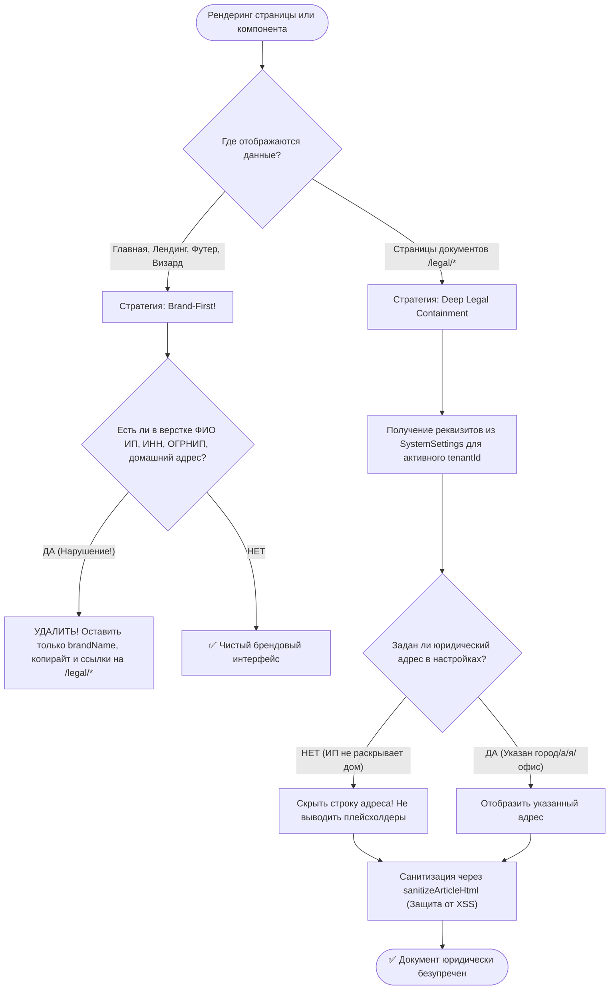

# SKILL: compliance-legal-ecommerce-ru — Защита PII Оператора и Комплаенс Дистанционной Оферты

## Назначение и границы (Overview & Scope)
Скилл `compliance-legal-ecommerce-ru` регламентирует соответствие интернет-витрин OmniSMM требованиям законодательства РФ: 152-ФЗ (персональные данные), ЗОЗПП, правила оферты и политики cookie.

---

> **Статус:** Обязательный стандарт юридической архитектуры платформы OmniSMM 1.0 (v2.0).  
> **Законодательная база:** Гражданский кодекс РФ (ст. 435, 437, 438 ГК РФ), Закон РФ № 2300-1 «О защите прав потребителей» (ст. 9, 10, 16, 32), Федеральный закон № 152-ФЗ «О персональных данных», Правила продажи товаров дистанционным способом (Постановление Правительства РФ от 31.12.2020 № 2463).

---

## 1. Концепция: Brand-First & Deep Legal Privacy

В электронной коммерции в РФ существует распространённая ошибка — публиковать паспортные данные, домашний адрес и ИНН индивидуального предпринимателя прямо на главной странице в подвале сайта (футере). 

Это создает критические угрозы безопасности владельца бизнеса:
- Раскрытие адреса постоянного проживания (места жительства) неограниченному кругу лиц (нарушение духа 152-ФЗ).
- Риски сталкерства, социальной инженерии, фишинга и целевого спама.
- Снижение конверсии витрины: клиенты ожидают видеть технологичный SaaS-бренд (`SMMplan` / `SMMflux`), а не частное лицо.

### Законное решение:
Согласно **ст. 9 Закона РФ «О защите прав потребителей»** и **Постановлению Правительства РФ № 2463**, исполнитель при дистанционном оказании услуг обязан довести до сведения потребителя информацию о себе (ФИО, ОГРНИП, ИНН, режим работы, контакты). 
**Закон НЕ обязывает размещать эти сведения на титульной странице сайта.** Достаточно разместить их в **Публичной Оферте** (договоре), ссылка на которую доступна из любой точки сайта (в футере и на чекауте).

---

## 2. Дерево Решений (Decision Tree)



---

## 3. Жесткие Инварианты (Hard Invariants)

1. **INV-1: Никаких PII в футере и на лендингах:**
   - В футерах (`MegaFooter.tsx`, `FluxCyberFooter.tsx`) разрешено выводить исключительно:
     ```tsx
     <p>© {new Date().getFullYear()} {brandName}. Все права защищены.</p>
     <p>Информационно-техническая платформа</p>
     ```
   - Запрещено выводить `ИП ...`, `ИНН: ...` в открытом виде на главной странице.
2. **INV-2: Адрес регистрации ИП не подлежит раскрытию:**
   - Для индивидуальных предпринимателей публикация домашнего адреса не требуется.
   - Если в настройках тенанта поле `legalCompanyAddress` пустое, тег `{{COMPANY_ADDRESS}}` удаляется вместе с обрамляющим блоком строки адреса.
3. **INV-3: Изоляция тенантов и запрет чужого хардкода:**
   - Категорически запрещено использовать статические заглушки с данными реальных лиц (например, «ИП Соколов А.А.», «695006320024», «г. Тверь»).
   - Если настройки в БД отсутствуют, fallback использует строго системное имя сайта (`SMMplan` / `SMMflux`), а ИНН и ОГРНИП остаются пустыми.
4. **INV-4: XSS-Иммунитет шаблонизатора оферты:**
   - Любые динамические параметры из базы (`legalCompanyName`, `legalCompanyInn`, `legalCompanyAddress`) перед подстановкой в HTML проходят обязательное экранирование и очистку.

---

## 4. Канонический шаблон блока реквизитов в Оферте

```html
<div class="bg-card p-5 rounded-xl border border-border/80 mt-6 text-xs font-mono grid grid-cols-1 sm:grid-cols-2 gap-2">
  <p><strong>Исполнитель:</strong> {{COMPANY_NAME}}</p>
  <p><strong>ИНН:</strong> {{COMPANY_INN}}</p>
  <p><strong>ОГРНИП:</strong> {{COMPANY_OGRNIP}}</p>
  {{#IF_COMPANY_ADDRESS}}
  <p><strong>Адрес:</strong> {{COMPANY_ADDRESS}}</p>
  {{/IF_COMPANY_ADDRESS}}
  <p><strong>Служба поддержки:</strong> {{SUPPORT_EMAIL}}</p>
  <p><strong>По вопросам персональных данных (152-ФЗ):</strong> {{PRIVACY_EMAIL}}</p>
  <p><strong>Telegram:</strong> {{TELEGRAM_BOT}}</p>
</div>
```

---

## 5. Чеклист приемки (Quality Gate)
- [ ] В футере главной страницы нет ни одной фамилии, ИНН или домашнего адреса.
- [ ] В тексте Оферты (`/legal/terms`) реквизиты динамически загружаются из настроек активного тенанта.
- [ ] При пустом адресе в админке строка адреса полностью отсутствует в разметке документов.
- [ ] Доменные почты тенанта изолированы (`support@smmplan.pro` vs `support@smmflux.ru`).
- [ ] Попытка внедрения XSS в поля реквизитов блокируется санитайзером.

---

## Пошаговый алгоритм выполнения (Step-by-step Protocol)
1. **Шаг 1:** Анализ контекста задачи и определение границ влияния.
2. **Шаг 2:** Проверка соответствия архитектурным инвариантам.
3. **Шаг 3:** Реализация изменений с соблюдением контрактов.
4. **Шаг 4:** Верификация через автоматические тесты и линтеры.
5. **Шаг 5:** Документирование и сохранение точки стабильности.

---

## Предотвращаемые антипаттерны (Gotchas / Bad vs Good)
❌ **Плохо:** Игнорирование архитектурных инвариантов ради быстрой реализации.
- ✅ **Хорошо:** Строгое соблюдение чистоты слоев и контрактов платформы.
❌ **Плохо:** Отсутствие автоматических тестов на граничные условия.
- ✅ **Хорошо:** Покрытие сценариев тестами до выкатки изменений.
