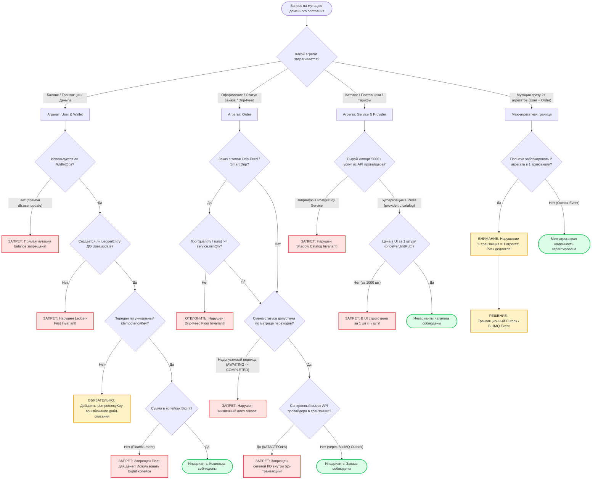

# SKILL: ddd-aggregate-invariants — Инварианты агрегатов DDD в OmniSMM

> **Статус:** Обязательный доменный стандарт платформы OmniSMM 1.0 (SMMplan & SMMflux).  
> **Стек:** Prisma 5 (PostgreSQL), TypeScript 5.7+ (Strict), BullMQ, Redis 7+, BigInt ExactMath.

---

## 1. Дерево решений (Decision Tree / Flowchart)

При проектировании мутаций состояния доменных моделей OmniSMM архитектурный агент обязан следовать дереву транзакционных границ:



### Пошаговый алгоритм проверки DDD агрегата:
1. **Шаг 1. Идентификация корня агрегата (Aggregate Root)**:
   - Все изменения внутри кластера сущностей должны проходить **строго** через методы корня агрегата.
   - Запрещено напрямую модифицировать дочерние сущности (`LedgerEntry`, `Refill`, `TicketMessage`) в обход их родителя (`User`, `Order`, `Ticket`).
2. **Шаг 2. Определение транзакционной границы (Transaction Boundary)**:
   - **Правило 1:1:** Одна транзакция базы данных мутирует строго **один** корень агрегата.
   - Если бизнес-процесс требует мутации второго агрегата (например: при списании баланса пользователя `User` необходимо создать `Order` и отправить задачу в очередь `Provider`), применяется шаблон **Transactional Outbox / Domain Event**.
3. **Шаг 3. Изоляция сетевого I/O от транзакций БД**:
   - Категорически запрещено выполнять HTTP-запросы к внешним API (ЮKassa, Robokassa, Telegram, SMM-провайдеры) внутри транзакции `db.$transaction` или `runSerializableTransaction`.
   - Транзакция должна быть максимально быстрой (< 50ms), фиксируя факт намерения в БД, а сетевые вызовы делегируются фоновым воркерам BullMQ.

---

## 2. Жесткие инварианты и табу (Hard Invariants & Anti-Patterns)

### Агрегат 1: User & Wallet / Ledger (Финансовая целостность)

#### Инвариант 1.1: Ledger-First Invariant & Запрет прямого изменения `User.balance`
> ❌ **ТАБУ:** Изменять `User.balance` напрямую через `db.user.update(...)` или создавать запись в `LedgerEntry` ПОСЛЕ изменения баланса.  
> **Закон Леджера:** Баланс пользователя является вторичным деривативом проводок Леджера. В любой финансовой операции запись `tx.ledgerEntry.create(...)` ОБЯЗАНА создаваться **ДО** изменения `User.balance`.

##### ❌ ПЛОХО (Anti-Pattern): Прямая мутация баланса и нарушение Ledger-First
```typescript
// services/financial/bad-balance.ts
export async function badDeductBalance(userId: string, amount: number) {
  // ❌ КАТАСТРОФА 1: Деньги в Float/Number
  // ❌ КАТАСТРОФА 2: Нет транзакции, состояние гонки (TOCTOU)
  const user = await db.user.findUnique({ where: { id: userId } });
  if (user.balance < amount) throw new Error("No money");

  // ❌ КАТАСТРОФА 3: Баланс обновлен ДО создания проводки
  await db.user.update({
    where: { id: userId },
    data: { balance: user.balance - BigInt(amount) }
  });

  // Если сервер упадет ЗДЕСЬ — баланс списан, а проводка не создана! Финансовая дыра!
  await db.ledgerEntry.create({
    data: { userId, amount: BigInt(-amount), reason: 'Order payment' }
  });
}
```

##### ✅ ХОРОШО (Compliant): Строго через `WalletOps` с Ledger-First и Optimistic Concurrency
```typescript
// services/financial/wallet-ops.ts
import { Prisma } from '@prisma/client';
import { ExactMath } from '@/lib/financial/exact-math';

type PrismaTx = Omit<Prisma.TransactionClient, "$connect" | "$disconnect" | "$on" | "$transaction" | "$use" | "$extends">;

export const WalletOps = {
  async charge(
    tx: PrismaTx,
    userId: string,
    amountCents: bigint,
    reason: string,
    opts: { idempotencyKey: string; tenantId: string; adminId?: string }
  ) {
    if (amountCents <= BigInt(0)) {
      throw new Error('Сумма списания должна быть строго положительной');
    }

    // 1. Проверка идемпотентности
    const existing = await tx.ledgerEntry.findUnique({
      where: { idempotencyKey: opts.idempotencyKey }
    });
    if (existing) {
      return { success: true, cached: true, entry: existing };
    }

    // 2. Блокировка и валидация пользователя
    const user = await tx.user.findUnique({
      where: { id: userId },
      select: { id: true, balance: true, tenantId: true }
    });
    if (!user || user.tenantId !== opts.tenantId) {
      throw new Error('Пользователь не найден или доступ к тенанту запрещен');
    }
    if (user.balance < amountCents) {
      throw new Error(`Недостаточно средств: требуется ${amountCents}, доступно ${user.balance}`);
    }

    // 3. LEDGER-FIRST INVARIANT: Проводка создается ДО изменения баланса
    const entry = await tx.ledgerEntry.create({
      data: {
        userId,
        tenantId: opts.tenantId,
        adminId: opts.adminId,
        amount: -amountCents, // Отрицательное значение для списания
        reason,
        status: 'APPROVED',
        idempotencyKey: opts.idempotencyKey,
        transactionType: 'ORDER_CHARGE',
      }
    });

    // 4. Атомарное обновление баланса с защитой от гонки (gte)
    const updateResult = await tx.user.updateMany({
      where: {
        id: userId,
        balance: { gte: amountCents }, // Optimistic Lock Guard
        tenantId: opts.tenantId
      },
      data: {
        balance: { decrement: amountCents }
      }
    });

    if (updateResult.count === 0) {
      throw new Error('Конфликт параллельного списания: баланс изменился');
    }

    return { success: true, entry };
  }
};
```

---

### Агрегат 2: Order (Жизненный цикл и Drip-Feed Floor Invariant)

#### Инвариант 2.1: Матрица жизненного цикла статусов (State Machine Lifecycle)
> ❌ **ТАБУ:** Совершать невалидные переходы статусов заказа.  
> **Разрешенные переходы:**
> - `AWAITING_PAYMENT` $\to$ `PENDING_CHECK` (после успешного подтверждения оплаты).
> - `PENDING_CHECK` $\to$ `IN_PROGRESS` (после успешного приема провайдером).
> - `PENDING_CHECK` $\to$ `ERROR` / `CANCELED` (при отклонении валидатором ссылки или антифродом).
> - `IN_PROGRESS` $\to$ `COMPLETED` | `PARTIAL` | `CANCELED` (по вебхуку или опросу провайдера).
> - `IN_PROGRESS` $\to$ `CANCELING` $\to$ `CANCELED` (при ручной отмене оператором).
> 
> ❌ **КАТЕГОРИЧЕСКИ ЗАПРЕЩЕНО:**
> - Переводить заказ из `AWAITING_PAYMENT` напрямую в `IN_PROGRESS` или `COMPLETED`.
> - Обрабатывать вебхуки провайдеров для неоплаченных заказов (`AWAITING_PAYMENT`, `PENDING`).

#### Инвариант 2.2: Drip-Feed Floor Invariant ($\lfloor Q/N \rfloor \ge \text{minQty}$)
> ❌ **ТАБУ:** Создавать или пересчитывать заказ Drip-Feed ($N$ запусков), если объем порции на один запуск меньше минимального объема услуги `service.minQty`.  
> **Формула:**  
> $$\text{portionQty} = \lfloor \text{quantity} / \text{runs} \rfloor \ge \text{service.minQty}$$  
> $$\text{totalRequiredQty} \ge \text{service.minQty} \times \text{runs}$$

##### ✅ ХОРОШО (Compliant): Валидатор инварианта Drip-Feed в корне агрегата Order
```typescript
// services/orders/order-aggregate.ts
export interface DripFeedValidationResult {
  isValid: boolean;
  minTotalRequired: number;
  error?: string;
}

export function validateDripFeedFloorInvariant(
  quantity: number,
  runs: number | null | undefined,
  serviceMinQty: number
): DripFeedValidationResult {
  const safeRuns = runs && runs > 1 ? runs : 1;
  const safeMin = Math.max(1, serviceMinQty || 1);
  const minTotalRequired = safeMin * safeRuns;

  if (safeRuns === 1) {
    if (quantity < safeMin) {
      return {
        isValid: false,
        minTotalRequired: safeMin,
        error: `Минимальный объем заказа: ${safeMin} шт.`
      };
    }
    return { isValid: true, minTotalRequired: safeMin };
  }

  const portionPerRun = Math.floor(quantity / safeRuns);
  if (portionPerRun < safeMin) {
    return {
      isValid: false,
      minTotalRequired,
      error: `Для ${safeRuns} запусков общее количество должно быть минимум ${minTotalRequired} шт. (не менее ${safeMin} шт. на один запуск). Текущая порция: ${portionPerRun} шт.`
    };
  }

  return { isValid: true, minTotalRequired };
}
```

---

### Агрегат 3: Service & Provider (Shadow Catalog Buffer & Retail Pricing)

#### Инвариант 3.1: Shadow Catalog Buffer Invariant (Защита от засорения БД)
> ❌ **ТАБУ:** Импортировать сырые прайс-листы провайдеров (5000+ услуг) напрямую в PostgreSQL таблицу `Service`.  
> **Архитектурный стандарт:**  
> 1. Сырой каталог провайдера загружается в **Redis-буфер (`provider:${id}:catalog`)** с TTL 24 часа.  
> 2. В PostgreSQL таблицу `Service` попадают **ТОЛЬКО** отобранные администратором позиции (Cherry-Pick).  
> 3. При изменении параметров провайдера (минимальный объем, цена) срабатывает детектор мутаций `ServiceMutationDetector`, предотвращая сбои выполнения заказов.

#### Инвариант 3.2: Единица отображения розничной цены (Price Per Unit)
> ❌ **ТАБУ:** Писать в UI цену за 1000 шт (`/ 1000 шт`) или умножать цену на клиенте.  
> **Инвариант витрины:** Пользователь всегда видит цену **за 1 штуку (`pricePerUnitRub`)**, единая подпись строго: **`₽ / шт`**.

##### ✅ ХОРОШО (Compliant): Буферизация каталога и расчет цены
```typescript
// services/providers/provider-catalog.service.ts
import { redis } from '@/lib/redis';
import { db } from '@/lib/db';
import type { Provider, Service } from '@prisma/client';

export class ProviderCatalogManager {
  /**
   * Буферизует сырой каталог поставщика в Redis без засорения PostgreSQL.
   */
  static async bufferProviderCatalog(providerId: string, rawCatalog: unknown[]): Promise<void> {
    const cacheKey = `provider:${providerId}:catalog`;
    // Кэш в Redis на 24 часа
    await redis.set(cacheKey, JSON.stringify(rawCatalog), 'EX', 86400);
  }

  /**
   * Cherry-pick одобренной администратором услуги в рабочую таблицу Service.
   */
  static async cherryPickService(
    providerId: string,
    providerServiceId: string,
    retailMarginPercent: number,
    adminId: string
  ): Promise<Service> {
    const cacheKey = `provider:${providerId}:catalog`;
    const cached = await redis.get(cacheKey);
    if (!cached) throw new Error('Каталог провайдера не найден в кэше Redis');

    const catalog = JSON.parse(cached) as Array<{
      service: string;
      name: string;
      rate: string; // Цена поставщика за 1000 в USD или RUB
      min: string;
      max: string;
    }>;

    const rawItem = catalog.find((i) => String(i.service) === String(providerServiceId));
    if (!rawItem) throw new Error('Услуга не найдена в буфере поставщика');

    // Расчет розничной цены за 1 шт в копейках BigInt
    const providerRatePer1000Kopecks = BigInt(Math.round(parseFloat(rawItem.rate) * 100));
    const retailMultiplier = 1 + retailMarginPercent / 100;
    const pricePerUnitCents = BigInt(
      Math.round((Number(providerRatePer1000Kopecks) / 1000) * retailMultiplier)
    );

    return db.service.create({
      data: {
        name: rawItem.name,
        providerId,
        providerServiceId: String(rawItem.service),
        minQty: parseInt(rawItem.min, 10),
        maxQty: parseInt(rawItem.max, 10),
        pricePerUnitCents: pricePerUnitCents < BigInt(1) ? BigInt(1) : pricePerUnitCents,
        isActive: true,
      }
    });
  }
}
```

---

## 3. Премортем-анализ и моделирование отказов (Failure Scenarios / Pre-Mortem)

Таблица гипотетических отказов и защитных механизмов:

| Сценарий отказа | Вероятность x Влияние | Механизм защиты в коде | Стратегия восстановления |
| :--- | :--- | :--- | :--- |
| **1. Рассинхронизация баланса и леджера (Balance-Ledger Drift)** | Низкая (2) x Фатальное (5) = **10** | Запрет прямого `db.user.update`. Мутации баланса строго через `WalletOps`. Регулярный джоб `NightlyLedgerAuditService`. | Выявление аномалии через `/admin/finance`, создание корректирующей проводки `COMPENSATION` через `WalletOps.adminAdjust`. |
| **2. Провал заказа у внешнего провайдера из-за нарушения Drip-Feed Floor** | Средняя (3) x Высокая (4) = **12** | Серверная валидация `validateDripFeedFloorInvariant` в `checkout.ts` и `useOrderWizard.ts`. Блокировка оформления. | Авто-возврат средств на баланс пользователя через `WalletOps.refund`, алерт оператору в админ-панели. |
| **3. Дедлок базы данных из-за блокировки двух агрегатов в одной транзакции** | Средняя (3) x Высокая (4) = **12** | Принцип «1 транзакция = 1 агрегат». Использование Transactional Outbox и BullMQ для асинхронной связи. | Таймаут транзакций PostgreSQL (statement_timeout: 5s), повтор с экспоненциальным backoff в BullMQ. |
| **4. Засорение БД тысячами мусорных услуг провайдеров (Postgres Bloat)** | Низкая (1) x Высокая (4) = **4** | Буферизация сырых данных в Redis (`provider:${id}:catalog`) с TTL 24ч. В PostgreSQL попадают только проверенные позиции. | Очистка таблицы `Service` от неактивных непривязанных услуг, вакуумирование таблицы (`VACUUM ANALYZE`). |
| **5. Модификация заказа в статусе `AWAITING_PAYMENT` по фейковому вебхуку** | Средняя (3) x Критическое (5) = **15** | Фильтр вебхуков провайдера: обработка строго заказов со статусами `IN_PROGRESS` или `PENDING_CHECK`. | Немедленный возврат 403 Forbidden, логирование подозрительного IP и алерт в `SecurityAlertService`. |

---

## 4. Чеклист верификации (Verification Checklist)

При проверке доменной логики и DDD инвариантов выполните следующие проверки:

### 1. Аудит операций с балансом
- [ ] Проверить отсутствие прямых обновлений баланса:
  ```powershell
  Get-ChildItem -Path src -Recurse -Filter "*.ts","*.tsx" | Select-String "balance:\s*\{\s*(increment|decrement|set)"
  ```
  *Все обновления баланса обязаны выполняться исключительно внутри `src/services/financial/wallet-ops.ts`.*

- [ ] Убедиться, что в `WalletOps` создание `LedgerEntry` вызывается строго **ДО** мутации `user.updateMany`.
- [ ] Проверить, что все денежные расчеты используют `BigInt` (копейки) и утилиту `ExactMath`.

### 2. Аудит Drip-Feed и заказов
- [ ] Проверить соблюдение формулы Drip-Feed Floor Invariant:
  $$\lfloor \text{quantity} / \text{runs} \rfloor \ge \text{service.minQty}$$
- [ ] Запустить специализированные тесты инварианта Drip-Feed:
  ```bash
  npx vitest run src/__tests__/dashboard/client-dashboard-master.test.ts -t "Drip-Feed Floor"
  npx vitest run src/__tests__/checkout-payments/checkout-resilience-and-bypass.test.ts -t "drip"
  ```

### 3. Аудит Shadow Catalog и провайдеров
- [ ] Убедиться, что метод `getServicesWithCache` в `src/services/providers/provider.service.ts` сохраняет сырые услуги в Redis с ключом `provider:${id}:catalog` и TTL 24ч.
- [ ] Проверить, что в UI пользователь видит цену за 1 штуку с текстом `₽ / шт`.

### 4. Комплексный прогон финансовых тестов
- [ ] Запустить полный набор стресс-тестов и сверки леджера:
  ```bash
  npx vitest run src/services/financial/__tests__/wallet-ops.test.ts
  npx vitest run src/services/financial/__tests__/ledger-reconciliation.test.ts
  npx vitest run src/services/financial/__tests__/ledger-reconciliation-adversarial.test.ts
  ```
