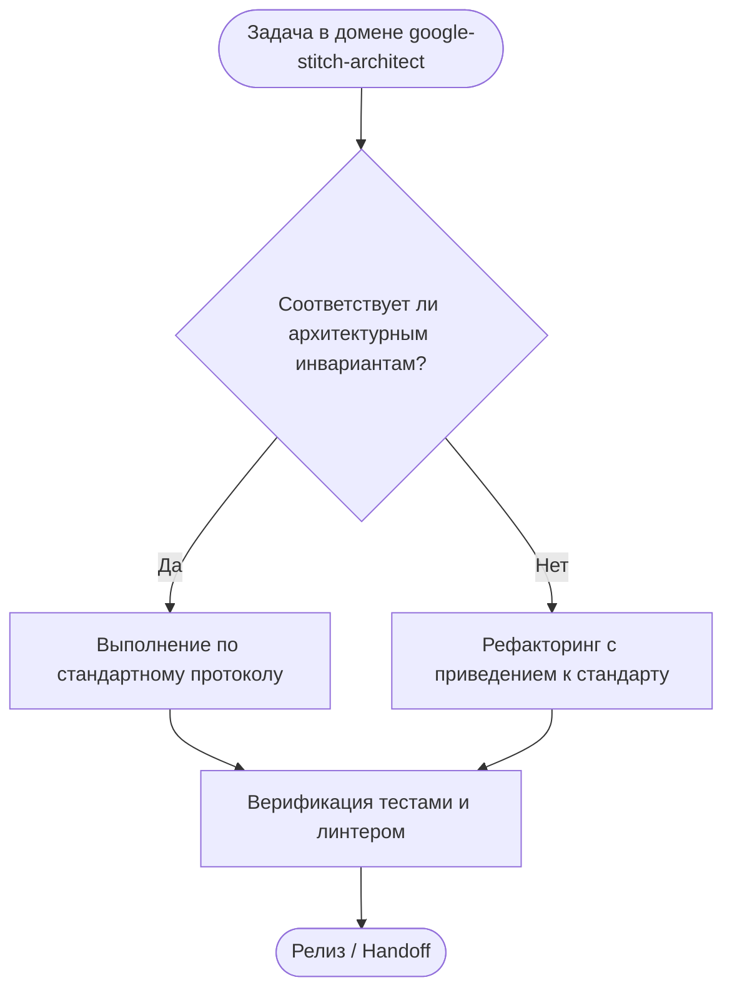

# google-stitch-architect — Google Stitch Generative UI & Zero-Slop Architecture

## Назначение и границы (Overview & Scope)
Скилл `google-stitch-architect` регламентирует работу с дизайн-системами, дизайн-токенами и макетами интерфейсов через Google Stitch MCP в платформе OmniSMM.

---

## 1. Концепция: Google Stitch Pipeline
Скилл управляет генеративным дизайн-пайплайном на базе инструментов Google Stitch, нашего моста [stitch-pipeline-bridge.ts](file:///c:/Users/Shadow/Documents/SMM/scripts/harness/stitch-pipeline-bridge.ts) и дизайн-движка [bespoke-design-engine.ts](file:///c:/Users/Shadow/Documents/SMM/scripts/harness/bespoke-design-engine.ts).

### 4-Шаговый конвейер:
1. **[State & DOM Analysis]** — Автоматический сбор структуры референса (навигация, формы, баланс, таблицы) через Playwright.
2. **[Structured Stitch Prompt]** — Формирование высокоточного промпта со строгими ограничениями layout и дизайн-токенами.
3. **[Stitch Generation]** — Получение макета и визуальной спецификации.
4. **[React 19 & Tailwind 4 Synthesis]** — Превращение макета в чистый, типизированный React 19 код с Action-First логикой.

---

## 2. Жесткие анти-клише правила (Zero-Slop Standards)
Большинство ИИ генерируют одинаковые безликие макеты. Скилл блокирует 5 главных клише:
- ❌ **Purple on Dark:** Неоновый фиолетовый на черном фоне.
- ❌ **Icon-Stuffed Bento:** Бенто-сетки, набитые случайными иконками и смайлами.
- ❌ **Pill Badge Fatigue:** Пилюли с пульсирующей точкой над каждым заголовком.
- ❌ **Blob Mesh Overuse:** Размытые цветные круги на заднем плане.
- ❌ **Gradient Keyword Fatigue:** Разноцветный градиент поперек обычных слов.

---

## 3. 6 Уникальных продуктовых дизайн-ДНК

1. **Swiss Kinetic Precision:**
   - Строгая швейцарская модульная сетка, плотная тактильность, шрифты без засечек, сдержанные акценты.
2. **High-Frequency Financial Terminal:**
   - Эстетика Bloomberg / Linear: монохромные контрасты, чистые цифры, моноширинный акцент, высокая информационная плотность.
3. **Tactile Industrial Hardware:**
   - Физические тумблеры, фрезерованные фаски, текстура анодированного алюминия, четкие границы.
4. **Neo-Editorial Luxury:**
   - Журнальная типографика, контраст крупных заголовков и тонких линий, просторный ритм.
5. **Obsidian Monolith:**
   - Глубокий монохром, игра матовых и зеркальных фактур, микро-грани света.
6. **Bio-Mechanical Precision:**
   - Органические плавные пружинные физики анимаций, кинетические ползунки.

---

## Дерево решений (Decision Tree)

---

## Жесткие инварианты (Hard Invariants)
- 🛑 **ИНВАРИАНТ 1:** Single Source of Truth: макеты Stitch синхронизируются с дизайн-токенами globals.css.
- 🛑 **ИНВАРИАНТ 2:** Zero Props Loss: экспорт компонентов сохраняет все типизированные свойства React 19.
- 🛑 **ИНВАРИАНТ 3:** Tailwind 4 Alignment: сгенерированные стили соответствуют семантическим токенам Tailwind 4.
- 🛑 **ИНВАРИАНТ 4:** Viewport Scalability: макеты проектируются с поддержкой мобильных и десктопных экранов.
- 🛑 **ИНВАРИАНТ 5:** HeroUI v3 Synergy: визуальные примитивы макетов согласованы с компонентами HeroUI.

---

## Пошаговый алгоритм выполнения (Step-by-step Protocol)
1. **Шаг 1:** Анализ контекста задачи и определение границ влияния.
2. **Шаг 2:** Проверка соответствия архитектурным инвариантам.
3. **Шаг 3:** Реализация изменений с соблюдением контрактов.
4. **Шаг 4:** Верификация через автоматические тесты и линтеры.
5. **Шаг 5:** Документирование и сохранение точки стабильности.

---

## Чеклист верификации (Verification Checklist)
- [ ] Проверены ли ключевые архитектурные инварианты?
- [ ] Укладывается ли код в лимиты сложности и размера?
- [ ] Отсутствуют ли регрессии в смежных подсистемах?
- [ ] Пройден ли автоматический запуск npm run lint:skills?
