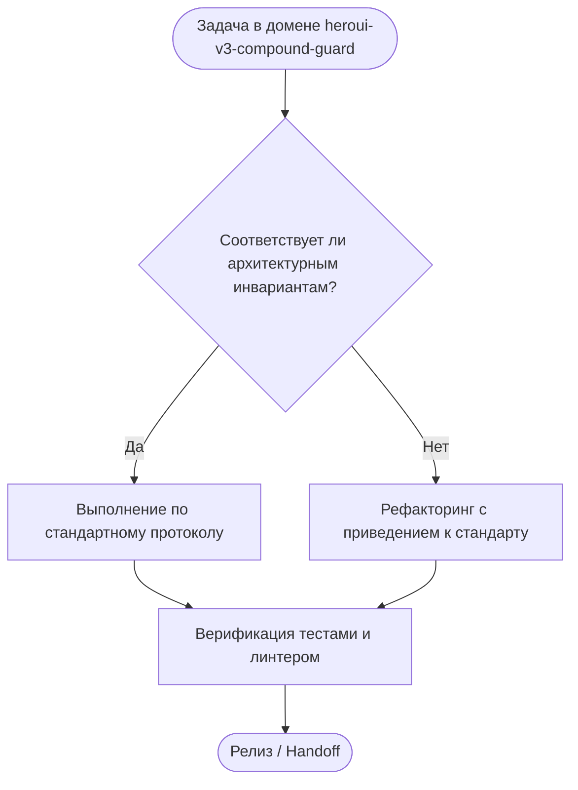

# HeroUI v3 Compound Components Standard

## 1. Назначение
Регламентирует использование компонентной библиотеки HeroUI v3 в Next.js 16 и React 19 без ошибок компиляции и гидратации.\n

---

## Дерево решений (Decision Tree)

---

## Жесткие инварианты (Hard Invariants)
- 🛑 **ИНВАРИАНТ 1:** Dot-Notation Compound API: компоненты вызываются через dot-notation (<Table.Header>, <Modal.Body>).
- 🛑 **ИНВАРИАНТ 2:** Client Component Boundaries: интерактивные оверлеи HeroUI помечаются директивой "use client".
- 🛑 **ИНВАРИАНТ 3:** Modal Hoisting Invariant: модальные окна объявляются на уровне страницы, а не внутри дропдаунов.
- 🛑 **ИНВАРИАНТ 4:** Theme Semantic Tokens: стили HeroUI наследуют CSS-переменные активной темы из globals.css.
- 🛑 **ИНВАРИАНТ 5:** Keyboard Accessibility: все интерактивные меню поддерживают навигацию с клавиатуры.

---

## Пошаговый алгоритм выполнения (Step-by-step Protocol)
1. **Шаг 1:** Анализ контекста задачи и определение границ влияния.
2. **Шаг 2:** Проверка соответствия архитектурным инвариантам.
3. **Шаг 3:** Реализация изменений с соблюдением контрактов.
4. **Шаг 4:** Верификация через автоматические тесты и линтеры.
5. **Шаг 5:** Документирование и сохранение точки стабильности.

---

## Предотвращаемые антипаттерны (Gotchas / Bad vs Good)
❌ **Плохо:** Игнорирование архитектурных инвариантов ради быстрой реализации.
- ✅ **Хорошо:** Строгое соблюдение чистоты слоев и контрактов платформы.
❌ **Плохо:** Отсутствие автоматических тестов на граничные условия.
- ✅ **Хорошо:** Покрытие сценариев тестами до выкатки изменений.

---

## Чеклист верификации (Verification Checklist)
- [ ] Проверены ли ключевые архитектурные инварианты?
- [ ] Укладывается ли код в лимиты сложности и размера?
- [ ] Отсутствуют ли регрессии в смежных подсистемах?
- [ ] Пройден ли автоматический запуск npm run lint:skills?
