# SKILL: layout-overflow-sentry — Детектор и Авто-исправитель верстки (RLS-2026)

> **Статус:** Обязательный стандарт фронтенд-верстки и UI-эргономики платформы OmniSMM 1.0.  
> **Нормативная база:** [RLS-2026 Standard](../../docs/standards/RESPONSIVE_LAYOUT_STANDARD_2026.md), W3C CSS Box Model, WCAG 2.2 AA (Target Size & Reflow), Apple Human Interface Guidelines (Touch Ergonomics), ISO 9241-110:2020.

---

## 1. Дерево решений детекции и исправления (Decision Tree)

```mermaid
flowchart TD
    Start(["Проверка верстки компонента / экрана"]) --> DefectType{"Какой симптом дефекта обнаружен?"}
    
    DefectType -->|"Горизонтальный скролл"| HorizScroll["Элемент вылезает за правый край вьюпорта"]
    DefectType -->|"Иконка / бейдж сплющены"| Squashed["Элемент сжат флекс-родителем (квадрат -> овал)"]
    DefectType -->|"Зум в iOS при клике в поле"| IOSZoom["Вход в input приближает экран в Safari"]
    DefectType -->|"Выпадающий список обрезан"| ClippedMenu["Дропдаун срезан границей карточки"]
    DefectType -->|"Таблица не влезает в экран"| TableOverflow["Появление нижнего скроллбара в таблице"]
    DefectType -->|"Ошибки гидратации / DOM"| NestingError["Невалидная вложенность (button в button, p в p)"]

    %% Horiz Fixes
    HorizScroll --> HasFixedW{"Используется w-screen или фиксированная ширина?"}
    HasFixedW -->|"w-screen"| ReplaceWScreen["Заменить на w-full max-w-full (Auto-Healer)"]
    HasFixedW -->|"w-[...px]"| AddMaxW["Заменить на w-full max-w-[...px]"]
    HasFixedW -->|"Нет"| HasFlexNoMinW{"Flex-потомок без min-w-0 с длинным текстом?"}
    HasFlexNoMinW -->|"Да"| AddMinW0["Добавить min-w-0 и truncate (Auto-Healer)"]
    HasFlexNoMinW -->|"Нет"| CheckNegativeMargin["Проверить отрицательные -mx без overflow-hidden"]

    %% Squash Fixes
    Squashed --> AddShrink0["ДОБАВИТЬ класс 'shrink-0' на Lucide Icon / Avatar / Badge!"]

    %% iOS Zoom Fixes
    IOSZoom --> CheckFontSize{"Размер шрифта в <input> меньше 16px (text-xs / text-sm)?"}
    CheckFontSize -->|"Да"| FixFont["Заменить на 'text-base sm:text-sm' (Auto-Healer)"]

    %% Menu Clipping Fixes
    ClippedMenu --> CheckOverflowHidden{"Родитель имеет overflow-hidden / overflow-clip?"}
    CheckOverflowHidden -->|"Да"| FixModalHoisting["Убрать overflow-hidden или рендерить дропдаун через Portal"]

    %% Table Fixes
    TableOverflow --> FixTableRule["Применить Viewport 100% Fit: лимит 7-8 колонок, убрать min-w-[1200px]"]

    %% Nesting Fixes
    NestingError --> FixNestingRule["Разделить теги, использовать asChild или span/div"]
```



---

## 2. Кодовые анти-паттерны и решения (Bad vs Good)

### 2.1. Искоренение горизонтального скролла (Zero Horizontal Scroll)
```tsx
// ❌ ПЛОХО: Фиксированная ширина на мобильном экране вызовет горизонтальный скролл
<div className="w-[420px] p-6 bg-card">
  <p>{user.email}</p> {/* Длинный email разорвет контейнер */}
</div>

// ✅ ХОРОШО: Эластичная ширина с ограничением и защита длинных строк
<div className="w-full max-w-[420px] min-w-0 p-4 sm:p-6 bg-card">
  <p className="truncate font-medium" title={user.email}>{user.email}</p>
</div>
```

### 2.2. Защита от сплющивания иконок и бейджей (Zero-Squash Invariant)
```tsx
// ❌ ПЛОХО: Во флекс-контейнере иконка Lucide сплющится при узком экране
<div className="flex items-center gap-3">
  <Zap className="w-5 h-5 text-primary" />
  <span className="text-sm">Очень длинное наименование услуги с описанием</span>
</div>

// ✅ ХОРОШО: shrink-0 гарантирует сохранение геометрии 20x20px
<div className="flex items-center gap-3 min-w-0">
  <Zap className="w-5 h-5 shrink-0 text-primary" />
  <span className="text-sm truncate">Очень длинное наименование услуги с описанием</span>
</div>
```

### 2.3. Защита от неконтролируемого iOS Auto-Zoom в формах
```tsx
// ❌ ПЛОХО: Шрифт 12px (text-xs) заставляет iOS Safari автоматически зумить страницу
<input type="text" className="text-xs px-3 py-2 rounded-lg" />

// ✅ ХОРОШО: На мобильных устройствах строгие 16px (text-base), на ПК компактные 14px (sm:text-sm)
<input type="text" className="text-base sm:text-sm px-3 py-2.5 rounded-lg" />
```

### 2.4. Динамическая высота экрана (Dynamic Viewport Height)
```tsx
// ❌ ПЛОХО: 100vh прыгает при открытии/закрытии панели навигации в Safari/Chrome
<div className="min-h-screen"> ... </div>

// ✅ ХОРОШО: min-h-dvh учитывает появление мобильной клавиатуры и адресной строки
<div className="min-h-dvh pb-safe"> ... </div>
```

### 2.5. Modal & Popover Hoisting Invariant
```tsx
// ❌ ПЛОХО: Вложенные модалки и всплывающие окна внутри контейнеров с overflow-hidden/overflow-x-auto
<div className="overflow-x-auto">
  <DropdownMenu>
    <DropdownMenuContent> ... </DropdownMenuContent>
  </DropdownMenu>
</div>

// ✅ ХОРОШО: Вынос порталов модалок и поповеров на уровень корня экрана (Modal & Popover Hoisting)
<Portal>
  <DropdownMenuContent> ... </DropdownMenuContent>
</Portal>
```

### 2.6. DOM Nesting Invariants (Защита от невалидной вложенности)
```tsx
// ❌ ПЛОХО: Вложенные кнопки или параграфы вызывают разрыв DOM и сбой гидратации React 19
<button onClick={handleCardClick}>
  <button onClick={handleDelete}>Удалить</button>
</button>

// ✅ ХОРОШО: Разделение действий на один уровень или использование asChild
<div className="flex items-center justify-between" role="group">
  <button onClick={handleCardClick} className="grow text-left">Открыть</button>
  <button onClick={handleDelete} className="shrink-0 p-2">Удалить</button>
</div>
```

---

## 3. DOM-скрипт детекции поплывших элементов в браузере

При аудите страниц через Playwright / Puppeteer агент инжектирует следующий скрипт для локализации виновников переполнения:

```javascript
(() => {
  const docWidth = document.documentElement.clientWidth;
  const culprits = [];

  document.querySelectorAll('*').forEach((el) => {
    const rect = el.getBoundingClientRect();
    if (rect.right > docWidth + 1) {
      culprits.push({
        element: el.tagName.toLowerCase(),
        classes: el.className,
        width: rect.width,
        overflowPixels: Math.round(rect.right - docWidth),
        snippet: el.outerHTML.slice(0, 150)
      });
    }
  });

  return culprits;
})();
```

---

## 4. Инструментарий агента: Auto-Healer Codemod & CLI

Скилл оснащен автоматическим исправителем дефектов верстки:
```bash
# Просмотр возможных исправлений без записи (Dry Run)
npm run layout:heal

# Автоматическое исправление файлов кодовой базы
npm run layout:fix

# Точечный запуск по директории или компоненту
npx tsx scripts/ui/layout-healer.ts --fix --scope=src/components/dashboard

# Проверка в CI (завершается с ошибкой 1, если есть дефекты)
npx tsx scripts/ui/layout-healer.ts --check
```

---

## 5. Интеграция Model Context Protocol (MCP Server)

Для взаимодействия с внешними автономными агентами (Claude, Gemini, Antigravity) скилл реализует протокол MCP JSON-RPC 2.0:

```bash
# Запуск MCP сервера через stdio
npm run layout:mcp
```

### Доступные MCP-инструменты:
1. `layout_audit`: сканирование директории или файла на дефекты верстки и вложенности.
2. `layout_autofix`: запуск авто-лечения (`shrink-0`, `min-w-0`, `w-screen`, `iOS zoom`) с опцией `dryRun`.
3. `layout_dom_probe`: измерение реального DOM на порту 3000/3005 для нахождения элементов, выходящих за экран.

---

## 6. Чеклист проверки верстки перед релизом
- [ ] Экран `375px` (iPhone SE): отсутствие горизонтального скроллбара (`scrollWidth === clientWidth`).
- [ ] Экран `390px` (iPhone 14/15/16): все интерактивные кнопки $\ge 44\text{px}$, кликабельные зоны не накладываются.
- [ ] Поля `<input>`: размер шрифта $\ge 16\text{px}$ для защиты от авто-зума.
- [ ] Все иконки Lucide во flex-блоках имеют атрибут `shrink-0`.
- [ ] Все таблицы растянуты на 100% ширины без горизонтального скролла на ноутбуках 1366x768.
- [ ] Выпадающие меню (`DropdownMenu`, `Popover`) не обрезаются границами карточек.
- [ ] Отсутствуют ошибки DOM Nesting (`<button>` в `<button>`, `<p>` в `<p>`, `<a>` в `<a>`).

---

## Known Anti-Patterns & Lessons Learned

### [LESSON-2026-09-14] layout-auto-heal-codemod-verified
- **Trigger Condition:** Автоматическое обнаружение антипаттернов верстки (сжатие SVG, отсутствие min-w-0)
- **Enforced Solution Pattern:** Автоисправление через healLayoutFiles() с добавлением семантических Tailwind-классов
- **Verified Date:** 2026-09-14

### [LESSON-2026-09-14-SIL-E] admin-dashboard-atomic-integrity-verified
- **Trigger Condition:** Проработка главной сводки `/admin/dashboard` в цикле Self-Improving Loop (SIL-2026 Step 1).
- **Enforced Solution Pattern:**
  1. Все ссылки KPI-карточек обязаны указывать на канонические существующие роуты (`/admin/finance`, `/admin/catalog`), исключая псевдо-подстраницы (`/overview`, `/pricing`, `/services`).
  2. Фильтр `status === 'PROBLEMATIC'` в сервисе заказов обязан быть согласован со статистикой виджетов мониторинга сбоев и включать `['ERROR', 'CANCELED', 'PARTIAL']`.
  3. Скелетоны в `loading.tsx` и виджетах обязаны строго наследовать дизайн-токены рабочего экрана (`rounded-lg p-5 border-border/70`), исключая Layout Shift (CLS).
  4. Запрещены мертвые файлы-заглушки (удален `financial-chart.tsx`).
- **Verified Date:** 2026-09-14

### [LESSON-2026-09-14-SIL-ORDERS] admin-orders-atomic-integrity-verified
- **Trigger Condition:** Атомарная проработка и аудит экрана заказов `/admin/orders` в цикле Self-Improving Loop (SIL-2026 Step 2).
- **Enforced Solution Pattern:**
  1. **Ликвидация DOM-хаков (`document.querySelector`):** Запрещено эмулировать нажатия кнопок в соседних компонентах через DOM-поиск по названию или атрибутам (`button[title*="..."]`). Координация модальных окон и действий обязана осуществляться через управляемый стейт React (`externalCancelOpen`, `onOpenCancelModal`, `onCloseCancelModal`) и регистрацию колбэков (`onRegisterRestart`).
  2. **100% Паритет фильтров и бэкенда:** Опции в выпадающих селекторах (`OrdersFilterForm`) обязаны включать все поддержанные бэкендом технические и агрегированные статусы (`PROBLEMATIC` — сбои/отмены, `PENDING_CHECK` — проверка ссылки).
  3. **Словари статусов:** В `columns.tsx` словари `STATUS_LABELS` и `STATUS_STYLES` обязаны полностью покрывать все возможные статусы схемы Prisma (`PENDING_CHECK`, `REFUNDING`), исключая необработанные undefined-лейблы.
  4. **Нормализация скелетона:** В `loading.tsx` использовать актуальный `AdminTabbedHeader` и дизайн-токены `rounded-lg border-border/70` для предотвращения Layout Shift (CLS).
- **Verified Date:** 2026-09-14

### [LESSON-2026-09-14-SIL-CATALOG] admin-catalog-atomic-integrity-verified
- **Trigger Condition:** Атомарная проработка и аудит каталога `/admin/catalog` в цикле Self-Improving Loop (SIL-2026 Step 3).
- **Enforced Solution Pattern:**
  1. **Синхронизация фильтра и ссылки отстоя (`cooldown`):** Быстрая кнопка «⏸ На отстое» обязана вести на канонический query-параметр `?providerStatus=cooldown&tenant=...`. Сервис `adminCatalogService.listServices` обязан явно фильтровать услуги со сроком отстоя в будущем (`cooldownUntil: { gt: now }`) и исключать зомби-услуги, в 100% паритете со счетчиком `catalogHealth.cooldown`. В клиентском фильтре `catalog-filters.tsx` статус обязан быть доступен в выпадающем списке.
  2. **Единый `AdminTabbedHeader`:** Все страницы раздела каталога (`/admin/catalog`, `/admin/catalog/categories`, `/admin/catalog/quarantine`) обязаны использовать единый канонический `AdminTabbedHeader` с табами `CATALOG_TABS` для предотвращения рассинхрона навигации и скачков верстки (CLS).
  3. **Дизайн-токены скелетона `loading.tsx`:** Скелетон обязан использовать `rounded-lg border-border/70` и `role="status"` с `aria-live="polite"` для плавного монтирования без сдвигов верстки.
- **Verified Date:** 2026-09-14

### [LESSON-2026-09-14-SIL-CATEGORIES] admin-categories-atomic-integrity-verified
- **Trigger Condition:** Атомарная проработка и аудит экрана соцсетей и категорий `/admin/catalog/categories` в цикле Self-Improving Loop (SIL-2026 Step 4).
- **Enforced Solution Pattern:**
  1. **Ликвидация дублирующих заголовков (Header Duplication Elimination):** Когда Server Component (`page.tsx`) уже монтирует единый канонический `AdminTabbedHeader`, вложенные клиентские компоненты-менеджеры (`CategoryManager`) не должны рендерить собственный дублирующий `<h1>` и разделители. Все действия экрана («Очистить пустые», «Объединить», «Соцсети», «Добавить категорию») консолидируются в компактный суб-бар действий над фильтрами, экономя 70-80px полезной рабочей высоты экрана.
  2. **Инвариант слияния категорий (Category Merge Invariant):** Слияние категорий допустимо СТРОГО внутри одной социальной сети (`source.networkId === target.networkId`), иначе нарушается таксономия маршрутов витрины (`/services/:networkSlug/:categorySlug`) и логика анализатора ссылок.
  3. **Канонические теги анализатора ссылок (Analyzer Tag Affinity):** Все 10 канонических тегов анализатора ссылок (`channel`, `post`, `profile`, `video`, `reel`, `story`, `poll`, `comment`, `bot`, `chat`) обязаны быть строго привязаны к специфике социальных сетей для корректного автоопределения категорий при вводе ссылки клиентом.
  4. **Нормализация скелетона `loading.tsx`:** Скелетон переводится на канонические токены `rounded-lg border-border/70` с обязательными атрибутами доступности `role="status"` и `aria-live="polite"`.
- **Verified Date:** 2026-09-14

### [LESSON-2026-09-14-SIL-QUARANTINE] admin-quarantine-atomic-integrity-verified
- **Trigger Condition:** Атомарная проработка и аудит экрана карантина цен и аномалий `/admin/catalog/quarantine` в цикле Self-Improving Loop (SIL-2026 Step 5).
- **Enforced Solution Pattern:**
  1. **Выделенный `loading.tsx` скелетон (Zero CLS):** Вложенные подстраницы со своими специфичными заголовками (`/admin/catalog/quarantine`) обязаны иметь собственный `loading.tsx`, а не наследовать общий скелетон родителя (`/admin/catalog`), предотвращая скачки заголовков и иконок (`ShoppingCart` -> `AlertTriangle`).
  2. **RBAC Guard & Изоляция Multi-Tenant в `page.tsx`:** Страница обязана вызывать `await enforceSectionAccess('catalog')` и фильтровать аномалии по контексту выбранного тенанта (`tenantServiceCondition = { category: { tenantId: tenantFilter } }`), блокируя утечки чужих услуг между витринами `smmplan` и `smmflux`.
  3. **Детектор мутаций и дрифта цен (`ServiceMutationDetector`):** При паритете названий и параметров рост тарифа квалифицируется строго как `SAFE_PRICE_ONLY`. При ухудшении гарантий (`refill: false`) или изменении лимитов услуга автоотключается (`MUTATED_PARAMS`), а при несовпадении платформы или ключевых слов активности классифицируется как критическая подмена (`SERVICE_REPLACED`).
  4. **Нормализация дизайн-токенов:** Пустые состояния, контейнеры таблиц и модалка сверки `QuarantineDiffModal` используют единые токены `rounded-lg border-border/70 shadow-xs`.
- **Verified Date:** 2026-09-14

### [LESSON-2026-09-14-SIL-PATTERNS] admin-patterns-atomic-integrity-verified
- **Trigger Condition:** Атомарная проработка и аудит экрана паттернов ссылок `/admin/catalog/patterns` в цикле Self-Improving Loop (SIL-2026 Step 6).
- **Enforced Solution Pattern:**
  1. **Выделенный скелетон загрузки (`loading.tsx`):** Страница `/admin/catalog/patterns` обязана иметь собственный `loading.tsx` с `AdminTabbedHeader` (иконка `Code2`, заголовок «Паттерны валидации ссылок», табы `CATALOG_TABS`), предотвращая сдвиг макета и подмену родительского заголовка каталога.
  2. **Иммунитет к ReDoS (`SafeRegexValidator`):** Все регулярные выражения подлежат обязательному статическому аудиту на опасные вложенные квантификаторы (`(a+)+`, `(.*)+`, `(a*)*`) и лимит длины ($\le 300$ символов). В песочнице тестирования действует жесткий guard на длину URL ($\le 512$ символов) для исключения зависания Event Loop.
  3. **Нормализация дизайн-токенов:** Фильтр-бар, таблица правил и все модальные окна (создание, редактирование, удаление) используют единые токены `rounded-lg border-border/70 shadow-xs / shadow-2xl` с мягким фоном бэкдропа `backdrop-blur-xs`.
- **Verified Date:** 2026-09-14

### [LESSON-2026-09-14-SIL-PROVIDERS] admin-providers-atomic-integrity-verified
- **Trigger Condition:** Атомарная проработка и аудит экрана провайдеров API `/admin/providers` в цикле Self-Improving Loop (SIL-2026 Step 7).
- **Enforced Solution Pattern:**
  1. **Синхронизация скелетона загрузки (`loading.tsx`):** Скелетон обязан использовать каноническую иконку `Plug`, `AdminTabbedHeader` с онбордингом и точно повторять структуру страницы (виджет глобальной ликвидности `LiquidityDashboard` + тулбар фильтров + таблица шлюзов), полностью исключая Layout Shift (CLS).
  2. **Безопасность секретов (Zero Key Exposure):** Модели DTO (`ProviderListDTO`, `ProviderDetailDTO`) строго исключают передачу открытого `apiKey` и зашифрованных полей клиенту. В карточках провайдера отображается флаг `hasApiKey: boolean` без раскрытия секретов.
  3. **Нормализация дизайн-токенов:** Экшн-кнопки в шапке, тулбар фильтрации статусов (`Все`, `Активные`, `Сбои API`, `Отключенные`), карточки ликвидности и контейнер таблицы переведены на стандартные токены `rounded-lg border-border/70 shadow-xs`.
- **Verified Date:** 2026-09-14

### [LESSON-2026-09-14-SIL-IMPORT] admin-providers-import-atomic-integrity-verified
- **Trigger Condition:** Атомарная проработка и аудит экрана импорта услуг `/admin/providers/import` в цикле Self-Improving Loop (SIL-2026 Step 8).
- **Enforced Solution Pattern:**
  1. **Выделенный скелетон загрузки (`loading.tsx`):** Страница `/admin/providers/import` обязана иметь собственный `loading.tsx` с каноническим `AdminTabbedHeader` (иконка `Download`, заголовок «Импорт Услуг», табы `CATALOG_TABS`), предотвращая сдвиг макета и подмену родительского заголовка провайдеров.
  2. **Ценовой пол и финансовая безопасность (`SAFETY_FLOOR_MARKUP`):** При импорте каталог валидирует розничные цены через формулу покрытия налогов и комиссий (`SafetyPrice = Cost * (1 + 3.0) / (1 - 0.145)`) с обязательным психологическим округлением вверх (`applyBeautifulRounding`) и защитой от аномальных цен поставщика (`checkPriceSanityLimit`).
  3. **Нормализация верстки пустых состояний:** Блоки отсутствия провайдеров/категорий и экшн-кнопки приведены к дизайн-токенам `rounded-lg border-border/70 shadow-xs`.
- **Verified Date:** 2026-09-14

### [LESSON-2026-09-14-SIL-CLIENTS] admin-clients-atomic-integrity-verified
- **Trigger Condition:** Атомарная проработка и аудит экрана клиентов `/admin/clients` в цикле Self-Improving Loop (SIL-2026 Step 9).
- **Enforced Solution Pattern:**
  1. **Синхронизация скелетона загрузки (`loading.tsx`):** В `src/app/admin/clients/loading.tsx` устаревший `AdminPageHeader` заменен на канонический `AdminTabbedHeader` с табами `FINANCE_TABS` и ключом онбординга `onboardingKey="clients"`. Структура скелетона строго повторяет рабочий экран (строка KPI обязательств Liability, тулбар фильтров-чипсов, строка поиска со скелетоном быстрой сортировки, таблица с бейджами и аватарами клиентов), полностью устраняя Layout Shift (CLS).
  2. **Иммунитет сортировки и белые списки (`USER_SORT_FIELDS`):** Все динамические сортировки клиентов валидируются по строгому белому списку полей (`createdAt`, `balance`, `totalSpent`, `orders`, `email`, `role`) с детерминированным вторичным ключом `{ id: 'desc' }`, исключая внедрение вредоносных параметров или поломку курсорной пагинации.
  3. **Защита финансовых обязательств (Liability RBAC):** Отображение общих обязательств платформы (`stats.totalLiability`) и балансов клиентов строго ограничено ролями сотрудников (`canSeeFinances`), предотвращая утечку сводных финансовых показателей.
  4. **Нормализация дизайн-токенов:** Кнопка экспорта CSV, карточка фильтрации, поисковый инпут со кнопкой, селектор сортировки `ClientQuickSort`, контейнер таблицы и экшн-кнопки перехода в карточку переведены на токены `rounded-lg border-border/70 shadow-xs`.
- **Verified Date:** 2026-09-14

### [LESSON-2026-09-14-SIL-TRANSACTIONS] admin-transactions-atomic-integrity-verified
- **Trigger Condition:** Атомарная проработка и аудит экрана транзакций `/admin/transactions` в цикле Self-Improving Loop (SIL-2026 Step 10).
- **Enforced Solution Pattern:**
  1. **Выделенный скелетон загрузки (`loading.tsx`):** Страница `/admin/transactions` обязана иметь собственный `loading.tsx` с каноническим `AdminTabbedHeader` (иконка `ArrowLeftRight`, заголовок «Транзакции платформы (Ledger)», табы `FINANCE_TABS`, `onboardingKey="finance"`), ликвидируя сдвиг макета (CLS) и рассинхрон навигации.
  2. **Резолюция типов транзакций (`resolveLedgerTypeForDisplay`):** Сквозной реестр проводок обязан однозначно разрешать типы транзакций (modern vs legacy `PAYMENT`), корректно определяя направление движения средств (дебет/кредит) по знаку суммы, наличию `adminId` (ручная корректировка) или шлюзового ID, со 100% покрытием в `LEDGER_TYPE_CONFIG`.
  3. **Двусторонний фильтр сумм и поиск потерянных платежей:** Фильтрация по суммам в проводках обязана проверять как положительные начисления (`+amount`), так и отрицательные списания (`-amount`). Поиск потерянных платежей использует окно допуска $\pm 10\%$ за последние 3 дня с предварительной выборкой по `gatewayId`.
  4. **Нормализация дизайн-токенов:** 4 KPI карточки (Всего, Одобрено, Возвраты, Карантин), тулбар фильтрации, поле поиска, чипсы типов, контейнер таблицы и пагинаторы переведены на токены `rounded-lg border-border/70 shadow-xs`.
- **Verified Date:** 2026-09-14

### [LESSON-2026-09-14-SIL-FINANCE] admin-finance-atomic-integrity-verified
- **Trigger Condition:** Атомарная проработка и аудит экрана финансов и кассы `/admin/finance` в цикле Self-Improving Loop (SIL-2026 Step 11).
- **Enforced Solution Pattern:**
  1. **Синхронизация скелетона загрузки (`loading.tsx`):** В `src/app/admin/finance/loading.tsx` устаревшая иконка `CreditCard` заменена на каноническую `Wallet`, а заголовок синхронизирован с `page.tsx` («Финансовый учёт & Касса») с добавлением онбординга `onboardingKey="finance"` и 4 табов `FINANCE_TABS`, ликвидировав Layout Shift (CLS).
  2. **P&L и порог НДС 2026 (20 млн ₽):** Калькуляция P&L (`AccountingService`) строго разграничивает Gross Revenue, возвраты Refunds, комиссии шлюзов (ЮKassa ~3.5%, CryptoBot ~1%), себестоимость COGS (пропорционально выполненным единицам при PARTIAL), налоги УСН и постоянные расходы OPEX. При превышении порога годовой выручки в 20 млн ₽ (2 млрд коп.) система автоматически применяет повышенную эффективную ставку налога с учетом НДС 5%.
  3. **Нормализация дизайн-токенов:** 4 модульные вкладки переключения, карточки KPI (Выручка, Возвраты, Закупка, Валовая маржа), блок декомпозиции EBITDA, тулбар платежей и форма настроек переведены на канонические токены `rounded-lg border-border/70 shadow-xs`.
- **Verified Date:** 2026-09-14

### [LESSON-2026-09-14-SIL-MARKETING] admin-marketing-atomic-integrity-verified
- **Trigger Condition:** Атомарная проработка и аудит экрана маркетинга `/admin/marketing` в цикле Self-Improving Loop (SIL-2026 Step 12).
- **Enforced Solution Pattern:**
  1. **Выделенный скелетон загрузки (`loading.tsx`):** Страница `/admin/marketing` обязана иметь собственный `loading.tsx` с каноническим `AdminTabbedHeader` (иконка `Gift`, заголовок «Маркетинг», табы `FINANCE_TABS`, `onboardingKey="marketing"`), ликвидируя сдвиг макета (CLS).
  2. **Финансовая целостность реферальных выплат:** При списании реферального баланса (`adminMarketingService.processPayout`) запрещены частичные выплаты (`partial payouts not supported`). Перевод на основной баланс осуществляется атомарно через `WalletOps.credit` с обязательным `idempotencyKey` и проверкой гонок по балансу (`count === 0`).
  3. **Бизнес-правила промокодов:** Ваучеры (`VOUCHER`) строго начисляют баланс без изменения цены заказа, а скидки (`DISCOUNT`) применяются к розничной стоимости с лимитом 100%. Коды промокодов строго нормализуются к верхнему регистру (`toUpperCase()`).
  4. **Нормализация дизайн-токенов:** Карточки промокодов, KPI-карточки рефералов (Выплачено, В ожидании, Топ рефоводов), графики экономики и таблица рефоводов переведены на токены `rounded-lg border-border/70 shadow-xs`.
- **Verified Date:** 2026-09-14

### [LESSON-2026-09-14-SIL-REFILLS] admin-refills-atomic-integrity-verified
- **Trigger Condition:** Атомарная проработка и аудит экрана гарантийных докруток `/admin/refills` в цикле Self-Improving Loop (SIL-2026 Step 13).
- **Enforced Solution Pattern:**
  1. **Выделенный скелетон загрузки (`loading.tsx`):** Страница `/admin/refills` обязана иметь собственный `loading.tsx` с каноническим `AdminTabbedHeader` (иконка `RefreshCw`, заголовок «Гарантийные Докрутки (Refills)», табы `OPERATIONS_TABS`, `onboardingKey="refills"`), ликвидируя сдвиг макета (CLS). Скелетон строго воспроизводит Kill-Switch баннер, тулбар фильтров статусов и строки таблицы заявок.
  2. **Целостность жизненного цикла докруток & Kill-Switch:** Глобальный Kill-Switch (`toggleRefillModuleAction` через `SettingsProvider.isRefillModuleEnabled()`) блокирует прием клиентских заявок при авариях провайдеров. Заявки в статусе `COMPLETED` являются терминальными и защищены от повторного перезапуска (`error: 'Докрутка уже успешно завершена'`), предотвращая дублирование списаний или спам в шлюз поставщика. Ручной перевод статуса в `COMPLETED` или `REJECTED` доступен строго для нетерминальных заявок (`PENDING`, `IN_PROGRESS`, `ERROR`).
  3. **Нормализация дизайн-токенов:** Kill-Switch баннер, тулбар фильтрации статусов (`Все`, `Ожидают`, `В работе`, `Выполнены`, `Сбои / Отказ`), поисковый инпут и контейнер таблицы переведены на канонические токены `rounded-lg border-border/70 shadow-xs`.
- **Verified Date:** 2026-09-14

### [LESSON-2026-09-14-SIL-TICKETS] admin-tickets-atomic-integrity-verified
- **Trigger Condition:** Атомарная проработка и аудит экрана службы поддержки `/admin/tickets` в цикле Self-Improving Loop (SIL-2026 Step 14).
- **Enforced Solution Pattern:**
  1. **Синхронизация скелетона загрузки (`loading.tsx`):** В `src/app/admin/tickets/loading.tsx` подключены онбординг `onboardingKey="tickets"` и конфигурация `ONBOARDING_CONFIGS.tickets`. Скелетон списка тикетов и тулбара нормализован под токены `rounded-lg border-border/70 shadow-xs`.
  2. **Эскроу-лимиты компенсаций & MSK Midnight:** Суточный лимит компенсаций операторов поддержки (`supportLimitCents`) строго анкерируется к 00:00 МСК (`getMSKMidnightUTC`). Начисления свыше лимита либо аномальные суммы отправляются в защитный карантин транзакций.
  3. **Поддержка SLA и смежности смен:** Реализован строгий расчет дневного и ночного SLA (`getSupportSlaInfo`: 15 мин в дневную смену с 08:00 до 22:59 МСК, 45 мин в ночное дежурство с 23:00 до 07:59 МСК).
  4. **Инварианты заказов в тикетах:** Отмена прикрепленных заказов доступна строго для статусов `PENDING`, `AWAITING_PAYMENT`, `IN_PROGRESS`, `ERROR` с проверкой прав саппорта. Терминальные заказы (`COMPLETED`, `CANCELED`, `PARTIAL`) защищены от отмены.
  5. **Нормализация дизайн-токенов воркспейса:** Аватары, карточки тикетов, плашки прикрепленных заказов и пустое состояние в `UnifiedTicketsWorkspace` и `TicketsSidebar` приведены к стандарту `rounded-lg border-border/70 shadow-xs`.
- **Verified Date:** 2026-09-14

### [LESSON-2026-09-14-SIL-SETTINGS] admin-settings-atomic-integrity-verified
- **Trigger Condition:** Атомарная проработка и аудит экрана настроек `/admin/settings` в цикле Self-Improving Loop (SIL-2026 Step 15).
- **Enforced Solution Pattern:**
  1. **Синхронизация скелетона загрузки (`loading.tsx`):** В `src/app/admin/settings/loading.tsx` подключены онбординг `onboardingKey="settings"` и подсказки конфигурации `ONBOARDING_CONFIGS.settings`. Скелетон формы настроек переведен на стандартные токены `rounded-lg border-border/70 shadow-xs`.
  2. **Архитектура кластеризации настроек (Master Clusters):** Все конфигурации сгруппированы в 3 мастер-кластера (`showcase`, `integrations`, `security`) и 9 специализированных под-вкладок (`resolveSettingsNavigation`). Обеспечена 100% обратная совместимость со старыми ссылками (`?tab=proxy`, `?tab=telegram`, `?tab=team`).
  3. **Маскирование секретов (Zero Secret Exposure):** Все 11 критических токенов и API ключей (`telegramBotToken`, `yookassaSecretKey`, `cryptoBotToken`, `resendApiKey`, `smtpPassword`, `geminiApiKeys` и др.) строго маскируются маской `••••••••••••••••` на стороне сервера перед передачей в клиентские компоненты.
  4. **Нормализация дизайн-токенов:** Карточки мастер-кластеров `SettingsClusterTabs`, под-вкладки, чек-лист готовности `OnboardingReadinessBar`, 4 куба состояния шлюзов и инфраструктуры в `SystemHealthOverview` переведены на канонические токены `rounded-lg border-border/70 shadow-xs`.
### [LESSON-2026-09-14-SIL-ROLES] admin-roles-atomic-integrity-verified
- **Trigger Condition:** Атомарная проработка и аудит экрана матрицы ролей и прав `/admin/settings/roles` в цикле Self-Improving Loop (SIL-2026 Step 16).
- **Enforced Solution Pattern:**
  1. **Выделенный скелетон загрузки (`loading.tsx`):** Для экрана `/admin/settings/roles` создан собственный `loading.tsx` с каноническим `AdminTabbedHeader` (иконка `ShieldCheck`, заголовок «Роли и матрица прав», табы `SYSTEM_TABS`), исключая сдвиг макета (CLS). Скелетон строго воспроизводит верхний тулбар действий, 3 карточки ролей-пресетов и строки матрицы прав.
  2. **Инварианты защиты ролей и целостности RBAC:**
     - Роли с признаком `isSystem: true` защищены от удаления и редактирования названия.
     - Роли, к которым привязаны активные сотрудники (`_count.users > 0`), защищены от удаления (кнопка отключена с информативным предупреждением о необходимости переназначения пользователей).
     - Полномочия сгруппированы по 16 секциям RBAC (`RbacSectionId`), гарантируя соответствие структуре `ADMIN_PERMISSIONS` и правилу Grant Ceiling.
  3. **Синхронизация заголовка в `page.tsx`:** В `src/app/admin/settings/roles/page.tsx` добавлен проп `icon={ShieldCheck}` в `AdminTabbedHeader` для 100% паритета со скелетоном.
  4. **Нормализация дизайн-токенов:** Заголовочная карточка действий, контейнер таблицы ролей, быстрые тумблеры матриц прав, разделители секций, модальные окна создания/редактирования, клонирования и удаления переведены на канонические токены `rounded-lg border-border/70 shadow-2xl / shadow-xs`.
- **Verified Date:** 2026-09-14

### [LESSON-2026-09-14-SIL-TENANTS] admin-tenants-atomic-integrity-verified
- **Trigger Condition:** Атомарная проработка и аудит экрана брендов и доменов `/admin/tenants` в цикле Self-Improving Loop (SIL-2026 Step 17).
- **Enforced Solution Pattern:**
  1. **Выделенный скелетон загрузки (`loading.tsx`):** Для экрана `/admin/tenants` создан собственный `loading.tsx` с каноническим `AdminTabbedHeader` (иконка `Globe`, заголовок «Бренды и Мульти-арендаторы», табы `SYSTEM_TABS`), исключая сдвиг макета (CLS). Скелетон строго воспроизводит верхний баннер действий, 3 карточки метрик и карточки брендов.
  2. **Инварианты мульти-тенантности OmniSMM 1.0:**
     - Системные бренды платформы (`smmplan` и `flux`) строго защищены от удаления и деактивации (`isSystem: true`, проверка в `toggleTenantStatusAction` и `deleteTenantAction`).
     - Защита от фантомных брендов: валидация и нормализация алиасов (`lovable` -> `flux`) на уровне Edge Runtime (`normalizeTenantId`).
     - Изоляция данных PostgreSQL Multi-Tenant с сохранением суверенного барьера ст. 54.1 НК РФ.
  3. **Нормализация дизайн-токенов:** Баннер действий, карточки метрик (Всего сайтов, Активные бренды, Изоляция данных), карточки витрин/брендов, внутренние боксы доменов и модальное окно добавления нового бренда переведены на канонические токены `rounded-lg border-border/70 shadow-xs / shadow-2xl`.
- **Verified Date:** 2026-09-14

### [LESSON-2026-09-14-SIL-PAGES] admin-pages-atomic-integrity-verified
- **Trigger Condition:** Атомарная проработка и аудит экрана CMS страниц `/admin/pages` в цикле Self-Improving Loop (SIL-2026 Step 18).
- **Enforced Solution Pattern:**
  1. **Выделенный скелетон загрузки (`loading.tsx`):** Для экрана `/admin/pages` создан собственный `loading.tsx` с каноническим `AdminTabbedHeader` (иконка `FileText`, заголовок «CMS Страницы», табы `SYSTEM_TABS`, `onboardingKey="pages"`), исключая сдвиг макета (CLS). Скелетон строго воспроизводит шапку таблицы и 5 скелетон-строк страниц.
  2. **Инварианты маршрутизации и предпросмотра (Preview Routing Invariant):**
     - Страницы правового контура (`privacy`, `terms`, `refund`, `rules`, `cookie`) маршрутизируются строго на `/legal/:slug`.
     - Пользовательские статические CMS страницы маршрутизируются на `/p/:slug`.
     - Маршрут создания `/admin/pages/new` перенаправляет на `/admin/cms/new`.
  3. **Нормализация дизайн-токенов:** Контейнер таблицы переведен на канонические токены `rounded-lg border-border/70 shadow-xs`.
- **Verified Date:** 2026-09-14

### [LESSON-2026-09-14-SIL-KNOWLEDGE] admin-knowledge-atomic-integrity-verified
- **Trigger Condition:** Атомарная проработка и аудит экрана базы знаний и блога `/admin/knowledge` в цикле Self-Improving Loop (SIL-2026 Step 19).
- **Enforced Solution Pattern:**
  1. **Выделенный скелетон загрузки (`loading.tsx`):** Для экрана `/admin/knowledge` создан собственный `loading.tsx` с каноническим `AdminTabbedHeader` (иконка `BookOpen`, заголовок «База знаний & Блог», табы `SYSTEM_TABS`, `onboardingKey="knowledge"`), исключая сдвиг макета (CLS). Скелетон строго воспроизводит 3 виджета метрик блога, шапку таблицы и 5 скелетон-строк статей.
  2. **Инварианты статистики и предпросмотра статей:**
     - Подтверждена точная калькуляция опубликованных статей (`status === "PUBLISHED"`) и суммарного счетчика просмотров `viewCount`.
     - Ссылки публичного предпросмотра формируются строго по каноническому маршруту `/knowledge/:slug`.
  3. **Нормализация дизайн-токенов:** Карточки метрик (Всего статей, Опубликовано, Всего просмотров), контейнер таблицы статей и кнопки действий («Просмотр», «Редактировать», `DeleteArticleButton`) переведены на канонические токены `rounded-lg border-border/70 shadow-xs`.
- **Verified Date:** 2026-09-14

### [LESSON-2026-09-14-SIL-FEATURES] admin-features-atomic-integrity-verified
- **Trigger Condition:** Атомарная проработка и аудит экрана управления фичами `/admin/system/features` в цикле Self-Improving Loop (SIL-2026 Step 20).
- **Enforced Solution Pattern:**
  1. **Выделенный скелетон загрузки (`loading.tsx`):** Для экрана `/admin/system/features` создан собственный `loading.tsx` с каноническим `AdminTabbedHeader` (иконка `ToggleLeft`, заголовок «Управление фичами (Feature Flags)», табы `SYSTEM_TABS`, `onboardingKey="features"`), исключая сдвиг макета (CLS). Скелетон строго воспроизводит легенду статусов, шапки групп флагов и строки таблицы.
  2. **Инварианты стейт-машины фича-флагов (Three-State State Machine):**
     - Циклический переход статусов строго следует графу `OFF` $\to$ `TEST` $\to$ `ON` $\to$ `OFF`.
     - Защита контуров: режим `TEST` разрешает доступ строго пользователям с признаком `isTestUser: true`, защищая публичных клиентов.
     - Инвалидация кэша: изменение флага мгновенно сбрасывает кэш `ff:{key}` в Redis (`CACHE_TTL_SECONDS = 60`).
  3. **Нормализация дизайн-токенов:** Плашка легенды режимов, карточки групп флагов и таблица переведены на канонические токены `rounded-lg border-border/70 shadow-xs`.
- **Verified Date:** 2026-09-14


