# SKILL: local-pentest-orchestrator — Локальный пентест платформы (SAST/DAST)

## Назначение и границы (Overview & Scope)
Скилл `local-pentest-orchestrator` регламентирует проведение локального тестирования на проникновение (Pentest) платформы OmniSMM по стандартам OWASP Top 10 и OWASP ASVS.

---

> **Статус:** Обязательный стандарт периодического тестирования на проникновение (RAC-2026 / PROD-SEC-2026).  
> **Нормативная база:** OWASP Top 10:2025, OWASP ASVS v4.0.3 Level 2, WSTG v4.2, PCI DSS v4.0.1 (Req 6.4, 11.3), RFC 9116.

---

## 1. Дерево решений (Decision Tree)

```mermaid
flowchart TD
    Start(["Запуск локального пентеста"]) --> ScopeChoice{"Какой скоуп пентеста требуется?"}
    
    ScopeChoice -->|"Статический анализ кода"| SAST_Path["SAST: Сканирование AST, Actions, API routes"]
    ScopeChoice -->|"Динамический фаззинг"| DAST_Path["DAST: Фаззинг live сервера 127.0.0.1:3000"]
    ScopeChoice -->|"Финансовые гонки"| Concurrency_Path["Race Condition: Параллельный стресс WalletOps"]
    ScopeChoice -->|"Сквозной аудит"| Full_Path["Full Spectrum: SAST + DAST + Concurrency + Rerank"]

    %% SAST Branch
    SAST_Path --> SAST_Agent["Субагент sast-auditor (cohere/north-mini-code + nemotron-safety)"]
    SAST_Agent --> SAST_Check{"Найдены уязвимости в коде?"}
    SAST_Check -->|"Да"| SAST_Log["Фиксация: IDOR, SQLi, Hardcoded secrets, Timing attacks"]
    SAST_Check -->|"Нет"| SAST_Pass["SAST чист"]

    %% DAST Branch
    DAST_Path --> Server_Check{"Локальный сервер 127.0.0.1:3000 активен?"}
    Server_Check -->|"Нет"| Server_Alert["ОШИБКА: Запустите локальный сервер (npm run dev)!"]
    Server_Check -->|"Да"| DAST_Agent["Субагент dast-fuzzer (gemma-4-31b + HTTP fuzzer)"]
    DAST_Agent --> DAST_Vectors["Атаки: CSP bypass, Webhook forgery, BOLA id tampering, RateLimit"]

    %% Concurrency Branch
    Concurrency_Path --> Concurrency_Agent["Субагент fintech-race-tester (nemotron-ultra-550b)"]
    Concurrency_Agent --> Concurrency_Stress["Генерация 50+ параллельных списаний/пополнений с одним idempotencyKey"]
    Concurrency_Stress --> Balance_Verify{"Баланс сошелся копейка-в-копейку без перерасхода?"}
    Balance_Verify -->|"Нет"| Alert_DoubleSpend["КРИТИЧЕСКИЙ БЛОКЕР: Обнаружен Double-Spend!"]
    Balance_Verify -->|"Да"| Concurrency_Pass["Атомарность транзакций подтверждена"]

    %% Full Triad
    Full_Path --> Rerank_Lead["Субагент triage-lead (nvidia/llama-nemotron-rerank-vl-1b-v2)"]
    Rerank_Lead --> Final_Report["Генерация docs/audits/pentest-report-latest.md"]
```

---

## 2. Оркестрация через Субагентов Antigravity

Скилл распределяет задачи между 4 изолированными субагентами:

### 1. `sast-auditor` (Статический анализ)
- **Цель:** Анализ исходного кода без выполнения.
- **Векторы:**
  - Поиск IDOR: отсутствие проверки `item.userId !== sessionUser.id`.
  - Поиск Fail-Open проверок подписей: `if (secret && signature)`.
  - Поиск небезопасных SQL/Cypher-конкатенаций: запрет шаблонов `${userInput}` в сырых запросах.
  - Поиск хардкода секретов и API-ключей в клиентских бандлах.

### 2. `dast-fuzzer` (Динамический фаззинг)
- **Цель:** Черный и серый ящик против живого локального порта `http://127.0.0.1:3000`.
- **Векторы:**
  - **Платежные вебхуки:** Отправка POST-запросов на `/api/webhooks/payment/yookassa` с невалидным `digest` / HMAC, с отрицательными суммами, с дублирующими `orderId`.
  - **Обход авторизации:** Запросы к `/api/admin/*` без сессионных кук или с поддельным JWT-токеном.
  - **Аудит безопасности заголовков:** Проверка наличия CSP (`strict-dynamic`, `nonce`), `X-Frame-Options: DENY`, `Strict-Transport-Security`, RFC 9331 `RateLimit-*`.

### 3. `fintech-race-tester` (Стресс-тест конкурентности)
- **Цель:** Исключение дефектов двойных трат (Double-Spend) и перерасхода баланса (TOCTOU).
- **Механика:**
  - Запуск пула из 20–50 одновременных `Promise.all` запросов на списание 100 рублей при остатке 100 рублей на балансе.
  - Ожидаемый результат: ровно 1 запрос успешен, остальные 49 отклонены с ошибкой `INSUFFICIENT_FUNDS`.
  - Верификация леджера: сумма записей в `LedgerEntry` строго равна `User.balance`.

### 4. `triage-lead` (Мета-арбитраж и CVSS-скоринг)
- **Цель:** Сведение всех находок, исключение ложных срабатываний (False Positives) через OpenRouter Reranker (`POST /api/v1/rerank`).
- **Выходные артефакты:** `docs/audits/pentest-report-latest.md` и JSON-структура.

---

## 3. Матрица моделей OpenRouter

| Роль в пентесте | Модель OpenRouter | Задача модели |
|---|---|---|
| **SAST Code Hunter** | `cohere/north-mini-code:free` | Анализ AST, анти-паттерны, утечки секретов |
| **Safety & Threat Sentinel** | `nvidia/nemotron-3.5-content-safety:free` | OWASP Top 10, XSS, небезопасные sinks |
| **Fintech Invariant Lead** | `nvidia/nemotron-3-ultra-550b-a55b:free` | 550B логический анализ конкурентности и леджера |
| **Perimeter Architect** | `nvidia/nemotron-3-super-120b-a12b:free` | 120B анализ мультитенантности и API-границ |
| **DAST Attack Reasoning** | `google/gemma-4-31b-it:free` | Генерация фаззинг-пэйлоадов и граничных кейсов |
| **Meta-Judge Reranker** | `nvidia/llama-nemotron-rerank-vl-1b-v2:free` | Векторное ранжирование находок через `/api/v1/rerank` |

---

## 4. Чеклист готовности к продакшену (Pentest RAC-2026)

- [ ] **A01: Broken Access Control (IDOR):** 0 уязвимостей в Server Actions и API.
- [ ] **A02: Cryptographic Failures:** Все подписи используют `crypto.timingSafeEqual` одинаковой длины.
- [ ] **A03: Injection:** 0 небезопасных конкатенаций в Prisma и Cypher.
- [ ] **A04: Insecure Design:** Двойные траты блокируются сериализацией транзакций на уровне БД (`SELECT FOR UPDATE` / Row-Level Locks).
- [ ] **A05: Security Misconfiguration:** Strict-Dynamic CSP без `'unsafe-inline'`.
- [ ] **A07: Identification and Authentication:** Яндекс SmartCaptcha на формах входа и регистрации.
- [ ] **A08: Software and Data Integrity:** Защита от Replay Attacks в вебхуках провайдеров.
- [ ] **A09: Security Logging:** Финансовые мутации фиксируются через `await auditAdminAwaitable()`.

---

## Жесткие инварианты (Hard Invariants)
- 🛑 **ИНВАРИАНТ 1:** Local Perimeter Only: пентест проводится строго в изолированном локальном контуре.
- 🛑 **ИНВАРИАНТ 2:** Zero Production Impact: запрещены деструктивные тесты, приводящие к потере данных пользователей.
- 🛑 **ИНВАРИАНТ 3:** Automated Vulnerability Gate: критические уязвимости (CVSS >= 7.0) блокируют релиз.
- 🛑 **ИНВАРИАНТ 4:** Timing Attack Audit: проверка равенства хэшей и токенов на устойчивость к утечкам времени.
- 🛑 **ИНВАРИАНТ 5:** Sanitized Evidence Reports: отчеты пентеста не должны содержать реальных паролей пользователей.

---

## Пошаговый алгоритм выполнения (Step-by-step Protocol)
1. **Шаг 1:** Анализ контекста задачи и определение границ влияния.
2. **Шаг 2:** Проверка соответствия архитектурным инвариантам.
3. **Шаг 3:** Реализация изменений с соблюдением контрактов.
4. **Шаг 4:** Верификация через автоматические тесты и линтеры.
5. **Шаг 5:** Документирование и сохранение точки стабильности.

---

## Предотвращаемые антипаттерны (Gotchas / Bad vs Good)
❌ **Плохо:** Игнорирование архитектурных инвариантов ради быстрой реализации.
- ✅ **Хорошо:** Строгое соблюдение чистоты слоев и контрактов платформы.
❌ **Плохо:** Отсутствие автоматических тестов на граничные условия.
- ✅ **Хорошо:** Покрытие сценариев тестами до выкатки изменений.
