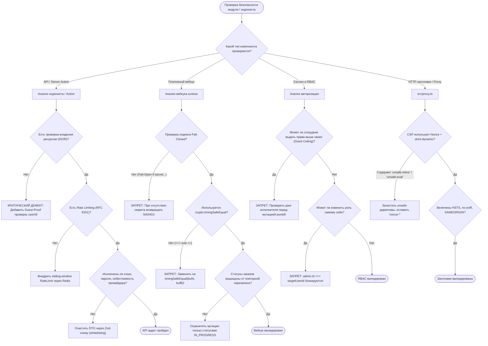

# SKILL: owasp-asvs-sentinel — Пентест-иммунитет и аудит OWASP ASVS v4.0.3

## Назначение и границы (Overview & Scope)
Скилл `owasp-asvs-sentinel` обеспечивает соблюдение стандартов кибербезопасности OWASP ASVS v4.0.3 Level 2 и OWASP Top 10:2025/2026 в платформе OmniSMM.

---

> **Статус:** Обязательный стандарт кибербезопасности платформы OmniSMM 1.0 (BGS-2026 / RAC-2026).  
> **Нормативная база:** OWASP Top 10:2025 (A01-A10), OWASP ASVS v4.0.3 Level 2, PCI DSS v4.0.1 (Req 3.4, 6.4, 8.3, 10.2), RFC 9116 (security.txt), RFC 9331 (RateLimit), 152-ФЗ / GDPR.

---

## 1. Дерево решений (Decision Tree)



---

## 2. Жесткие инварианты безопасности (Hard Invariants)

1. **Guest-Proof IDOR Invariant:**
   * Если сущность принадлежит пользователю (`item.userId`), доступ разрешается СТРОГО при соблюдении условия:
   ```typescript
   if (item.userId && (!sessionUser || item.userId !== sessionUser.id)) {
     return { success: false, error: 'Access denied' };
   }
   ```
2. **Timing-Safe HMAC Invariant:**
   * Проверка любых подписей вебхуков (ЮKassa, Robokassa, CryptoBot, Telegram) обязана использовать строго `crypto.timingSafeEqual` с буферами одинаковой длины для защиты от Side-Channel Timing Attacks:
   ```typescript
   const a = Buffer.from(calculatedSignature, 'hex');
   const b = Buffer.from(headerSignature, 'hex');
   if (a.length !== b.length || !crypto.timingSafeEqual(a, b)) {
     return new Response('Invalid signature', { status: 403 });
   }
   ```
3. **Fail-Closed Webhook Guard:**
   * Запрещены конструкции вида `if (secret && signature) { verify() }`. Если переменная секрета не задана в окружении, вебхук обязан немедленно падать с ошибкой 500 и алертом в Telegram, а не пропускать запрос.
4. **Grant Ceiling & Self-Role Protection:**
   * Ни один сотрудник платформы не может назначить роль себе (`operator.id === targetUser.id`).
   * Ни один сотрудник не может назначить права, превышающие его собственный максимальный ранг доступа.
5. **Strict-Dynamic CSP:**
   * Директива `script-src` в `src/proxy.ts` генерирует криптографический `x-nonce` (`crypto.randomUUID()`) на каждый запрос и передает его в заголовки и компоненты Next.js.

---

## 3. Чеклист верификации пентест-устойчивости

- [ ] Все входные параметры роутов и Server Actions валидируются через строгие схемы Zod (с отсечением нежелательных полей `.strip()`).
- [ ] Отсутствуют утечки приватных ключей провайдеров (`provider.apiKey`, `secretKey`, `authHash`) в клиентских DTO.
- [ ] Ошибки базы данных Prisma маскируются (клиент получает «Внутренняя ошибка сервиса», а не полный стек-трейс с именами таблиц).
- [ ] Лимиты запросов (Rate Limits) отдают заголовки `RateLimit-Limit`, `RateLimit-Remaining`, `RateLimit-Reset` по RFC 9331.
- [ ] Файл `public/.well-known/security.txt` оформлен строго по стандарту RFC 9116.

---

## Пошаговый алгоритм выполнения (Step-by-step Protocol)
1. **Шаг 1:** Анализ контекста задачи и определение границ влияния.
2. **Шаг 2:** Проверка соответствия архитектурным инвариантам.
3. **Шаг 3:** Реализация изменений с соблюдением контрактов.
4. **Шаг 4:** Верификация через автоматические тесты и линтеры.
5. **Шаг 5:** Документирование и сохранение точки стабильности.

---

## Предотвращаемые антипаттерны (Gotchas / Bad vs Good)
❌ **Плохо:** Игнорирование архитектурных инвариантов ради быстрой реализации.
- ✅ **Хорошо:** Строгое соблюдение чистоты слоев и контрактов платформы.
❌ **Плохо:** Отсутствие автоматических тестов на граничные условия.
- ✅ **Хорошо:** Покрытие сценариев тестами до выкатки изменений.
