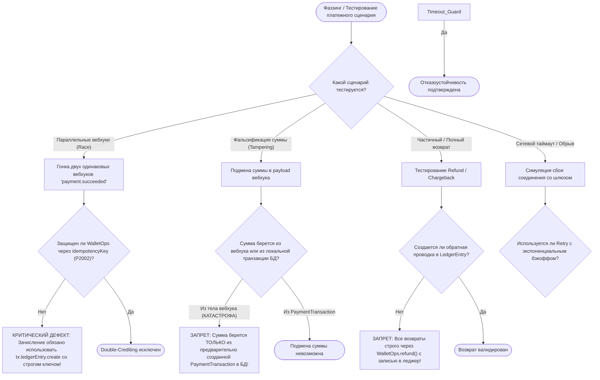

# SKILL: payment-gateway-fuzzer — Стресс-тестирование и фаззинг платежных шлюзов

> **Статус:** Обязательный стандарт финансовой надежности платформы OmniSMM 1.0 (BGS-2026 / RAC-2026).  
> **Интеграции:** ЮKassa (СБП, Карты РФ, 54-ФЗ), Robokassa (СБП, Карты), CryptoBot (USDT, TON, BTC).

---

## 1. Дерево решений (Decision Tree)

---

## 2. 5 Векторов атак платежного фаззера (Fuzzing Vectors)

| Вектор атаки | Описание симуляции | Ожидаемый результат в OmniSMM |
| :--- | :--- | :--- |
| **1. Concurrent Duplicate Webhook** | Одновременная отправка 10 идентичных HTTP POST запросов вебхука с одинаковым `payment_id` | Ровно **1 зачисление** на баланс, 9 запросов возвращают 200 OK без повторной мутации баланса (идемпотентность по `idempotencyKey`) |
| **2. Kopeck Precision Mismatch** | Отправка суммы с плавающей точкой (`100.999999` или `0.0001 ₽`) | Сумма округляется по банковскому правилу Half-Even строго в копейки `BigInt` через `ExactMath`, исключая потерю дробных долей |
| **3. Replay Attack with Old Timestamp** | Повторная отправка легитимного вебхука через 24 часа | Вебхук отклоняется либо безопасно игнорируется, так как транзакция уже находится в терминальном статусе `COMPLETED` |
| **4. Negative Amount Attack** | Попытка пополнения на отрицательную сумму (`-500.00 ₽`) | Zod-валидатор отсекает запрос до обращения к БД с ошибкой валидации суммы (`amountKopecks > 0`) |
| **5. Partial Refund Overcharge** | Попытка возврата на сумму, превышающую исходный платеж | `WalletOps.refund()` выбрасывает контролируемое исключение `Refund amount exceeds original transaction` |

---

## 3. Чеклист верификации платежного шлюза

- [ ] Сумма к зачислению вычисляется в копейках `BigInt` ДО отправки запроса в платежный шлюз.
- [ ] Ключ идемпотентности формируется по детерминированной формуле: `${gateway}_${paymentId}_${tenantId}`.
- [ ] Запись в `tx.ledgerEntry.create()` выполняется ДО обновления `tx.user.update({ balance: ... })` (Ledger-First).
- [ ] При получении неизвестного статуса платежа статус транзакции НЕ переводится в ошибочный (остается `PENDING`).
- [ ] Логирование платежных событий не содержит полных номеров карт и CVC/CVV (PCI DSS v4.0.1).
