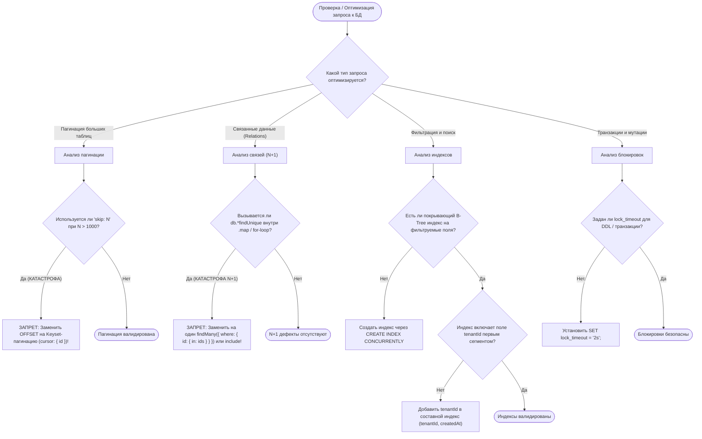

# SKILL: postgres-query-doctor — Оптимизация и аудит запросов PostgreSQL & Prisma

> **Статус:** Обязательный стандарт производительности базы данных OmniSMM 1.0 (BGS-2026 / RAC-2026).  
> **Целевые NFR-бюджеты:** P95 запроса к БД $\le 30\text{ms}$, админ-дашборд $\le 200\text{ms}$, 0 N+1 запросов.

---

## 1. Дерево решений (Decision Tree)



---

## 2. Жесткие инварианты производительности БД (Hard Invariants)

1. **Keyset Cursor Pagination Invariant:**
   * Запрещено использовать классический `skip: page * pageSize` на таблицах свыше 10 000 строк (`Order`, `LedgerEntry`, `AuditLog`, `TicketMessage`).
   * Пагинация обязана использовать курсор:
   ```typescript
   const orders = await prisma.order.findMany({
     take: pageSize + 1,
     cursor: cursorId ? { id: cursorId } : undefined,
     skip: cursorId ? 1 : 0,
     where: { tenantId },
     orderBy: { id: 'desc' },
   });
   ```
2. **Zero N+1 Query Invariant:**
   * Запрещено выполнять запросы к БД внутри циклов `.map()`, `forEach()`, `for...of`.
   * Все связанные сущности загружаются пакетно через `include`, `select` или предварительную выборку `where: { id: { in: ids } }` с маппингом через `Map<string, Entity>`.
3. **Tenant-First Composite Indexes:**
   * Любой составной индекс на таблицах с мульти-тенантностью обязан начинаться с `tenantId`:
   ```prisma
   @@index([tenantId, status, createdAt(sort: Desc)])
   @@index([tenantId, userId, createdAt(sort: Desc)])
   ```
4. **Selective Fields Projection:**
   * Запрещено запрашивать таблицы целиком (`select *`) на страницах витрины и в API. Всегда явно перечислять только необходимые поля через `select: { id: true, title: true, price: true }`, снижая объем передаваемых данных по сети и сериализации RSC.

---

## 3. Чеклист верификации производительности SQL

- [ ] Запрос проверен через `EXPLAIN (ANALYZE, BUFFERS)` — отсутствуют Sequential Scans на таблицах свыше 5 000 строк.
- [ ] Количество одновременных соединений Prisma ограничено параметром `connection_limit=10` в `DATABASE_URL`.
- [ ] Тяжелые аналитические агрегации вынесены в фоновый воркер или материализованные кэши Redis с TTL.
- [ ] Отсутствуют долгие открытые транзакции (`$transaction`), содержащие сетевые HTTP-вызовы или криптографические циклы.
