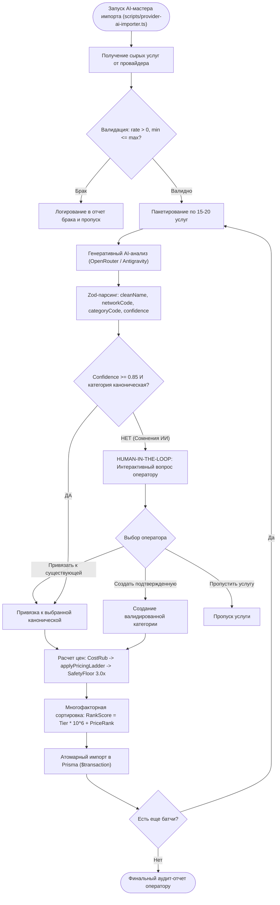

# SKILL: provider-catalog-importer — Автоматический Импорт и AI-Классификация Каталога

> **Статус:** Обязательный архитектурный и операционный стандарт платформы OmniSMM 1.0.  
> **Стек:** Next.js 16 (App Router), Prisma 5, PostgreSQL, TypeScript 5.7+ (strict mode), OpenRouter / Antigravity LLM, Redis 7+.

---

## 1. Архитектурное Назначение и Философия

Внешние SMM-провайдеры поставляют каталоги с тысячами разнородных услуг с «грязными» названиями, техническими пометками, дублирующимися категориями и нестабильными описаниями:
* `Telegram Живые Авто-Просмотры [Для закрытых каналов] [Сервер 3] ♻️`
* `Instagram Followers [Non-Drop] [HQ] [30 Days Refill]`
* `VK Просмотры клипов / Записей быстрый старт`

Если импортировать эти данные вслепую, витрина превращается в свалку, а конверсия пользователей падает.

**Скилл `provider-catalog-importer` утверждает 4 фундаментальных принципа:**
1. **Taxonomy-First & Clean Storefront:** Любая услуга обязана пройти семантический разбор через генеративный AI-пайплайн и занять место в фиксированном каноническом дереве ($\le 6\text{--}9$ категорий на сеть). Все технические теги извлекаются в типизированные бейджи (`isPrivate`, `warranty`, `geo`, `speedText`, `qualityTier`).
2. **Human-in-the-Loop Clarification Gate:** Если ИИ не уверен в соцсети или категории (`confidence < 0.85`), либо услуга имеет принципиально новый тип — автоматическая запись блокируется. ИИ обязан задать интерактивный вопрос оператору и следовать его выбору.
3. **Многофакторная витринная сортировка:** 
   - Социальные сети ранжируются по популярности в РФ и СНГ (`Telegram > Instagram > VK > YouTube > TikTok > др.`).
   - Категории внутри сети ранжируются по воронке конверсии (Подписчики $\to$ Лайки $\to$ Просмотры $\to$ Реакции $\to$ Комментарии $\to$ Репосты $\to$ Истории $\to$ Бусты $\to$ Стримы $\to$ Авто $\to$ Другое).
   - Услуги внутри категории ранжируются по сегменту качества (VIP / Рекомендуемые $\to$ С гарантией $\to$ Стандарт $\to$ Эконом), а внутри сегмента — строго по возрастанию цены закупки.
4. **Финансовая безопасность (ExactMath & Safety Floor):** Себестоимость фиксируется в рублевом эквиваленте, розничные цены вычисляются через `applyPricingLadder` с контролем `SAFETY_FLOOR_MARKUP >= 3.0x`, защитой `applyAntiNegativeMargin` и банковским округлением `applyBeautifulRounding`.

---

## 2. Жесткие Инварианты Скилла (Hard Invariants)

1. **[INV-IMP-001] Запрет нетипизированного сырого импорта (Zero Raw Injection):**  
   ❌ **ЗАПРЕЩЕНО** сохранять услугу с исходным именем провайдера без нормализации через AI-генератор клиентского имени (`cleanName`).
2. **[INV-IMP-002] Лимит категорий на соцсеть (Canonical Taxonomy Ceiling):**  
   ❌ **ЗАПРЕЩЕНО** создавать произвольные подкатегории вида `Telegram Подписчики [Россия]` или `Лайки быстрые`. Все они обязаны агрегироваться в канонические `Подписчики` и `Лайки` с флагами `geo: 'RU'`, `speed: 'Fast'`.
3. **[INV-IMP-003] Обязательный HITL-барьер при сомнениях (Mandatory Clarification):**  
   ✅ При оценке уверенности `confidence < 0.85` или при отсутствии сети/категории в белом списке ИИ **ОБЯЗАН** остановить скрипт и запросить решение человека (Human Decision Required).
4. **[INV-IMP-004] Защита от отрицательной и околонулевой маржи (Margin Floor):**  
   Розничная наценка обязана быть $\ge 3.0\times$ (300% от себестоимости) либо соответствовать лестнице `applyPricingLadder(costRub)`. Розничная цена не может быть ниже себестоимости плюс резерв эквайринга ($+5\%$).
5. **[INV-IMP-005] Идемпотентность и уникальность слагов (Deterministic Slugs):**  
   Услуга получает slug вида `[network]-[activity]-[clean-name-translit]-[externalId]`. Повторный импорт того же `(providerId, externalId)` обновляет параметры или пропускается, не плодя дубликатов в БД.
6. **[INV-IMP-006] Бескомпромиссная отбраковка мусора и нерабочих услуг (Zero-Garbage Principle):**  
   ❌ **ЗАПРЕЩЕНО** импортировать услуги со стоп-словами нерабочих позиций (`[TEST]`, `DO NOT ORDER`, `NOT WORKING`, `DISABLED`, `ТЕСТ`, `НЕ ЗАКАЗЫВАТЬ`, `DEAD`, `BROKEN`), с нулевыми/отрицательными тарифами (`rate <= 0`), сломанными диапазонами (`minQty > maxQty`), бессмысленные сироты без категории и соцсети, а также токсичные услуги (жалобы, снос каналов).

---

## 3. Дерево Решений Импорта (Decision Flowchart)



---

## 4. Канонический Реестр Сортировки и Приоритетов

### Социальные сети (Priority Sort Order):
1. **Telegram** (`sortOrder: 10`, `slug: telegram`)
2. **Instagram** (`sortOrder: 20`, `slug: instagram`)
3. **ВКонтакте** (`sortOrder: 30`, `slug: vk`)
4. **YouTube** (`sortOrder: 40`, `slug: youtube`)
5. **TikTok** (`sortOrder: 50`, `slug: tiktok`)
6. **Twitch** (`sortOrder: 60`, `slug: twitch`)
7. **Discord** (`sortOrder: 70`, `slug: discord`)
8. **Twitter (X)** (`sortOrder: 80`, `slug: twitter`)
9. **Rutube** (`sortOrder: 90`, `slug: rutube`)
10. **Дзен** (`sortOrder: 100`, `slug: dzen`)
11. **Другое** (`sortOrder: 999`, `slug: other`)

### Категории (Funnel Sort Order):
1. **Подписчики** (`SUBSCRIBERS`, `10`)
2. **Лайки** (`LIKES`, `20`)
3. **Просмотры** (`VIEWS`, `30`)
4. **Реакции** (`REACTIONS`, `40`)
5. **Комментарии** (`COMMENTS`, `50`)
6. **Репосты** (`REPOSTS`, `60`)
7. **Истории** (`STORIES`, `70`)
8. **Бусты** (`BOOSTS`, `80`)
9. **Стримы** (`STREAMS`, `90`)
10. **Авто-услуги** (`AUTO_SERVICES`, `100`)
11. **Другое** (`OTHER`, `999`)

### Услуги внутри категории (Composite Rank Score):
- `TierWeight`:
  - `1`: VIP / Премиум / Рекомендуемые
  - `2`: С гарантией (`warrantyDays > 0` или `refill === true`)
  - `3`: Стандарт
  - `4`: Эконом / Боты
- `PriceRank`: позиция услуги по возрастанию себестоимости за 1 шт.
- Итоговый индекс: `sortOrder = TierWeight * 1000 + PriceRank`.

---

## 5. Регламент Запуска CLI-Мастера

Команда запуска интерактивного мастера:
```bash
npm run catalog:ai-import
```
Флаги и параметры:
- `--provider=<id|name>`: фильтрация по конкретному провайдеру (по умолчанию интерактивный выбор).
- `--limit=<N>`: ограничение количества услуг для импорта (например, `--limit=50`).
- `--dry-run`: режим симуляции (анализ и расчет цен без записи в базу данных).
- `--tenant=<smmplan|flux|both>`: целевой тенант (по умолчанию `smmplan`).

---

## Пошаговый алгоритм выполнения (Step-by-step Protocol)
1. **Шаг 1:** Анализ контекста задачи и определение границ влияния.
2. **Шаг 2:** Проверка соответствия архитектурным инвариантам.
3. **Шаг 3:** Реализация изменений с соблюдением контрактов.
4. **Шаг 4:** Верификация через автоматические тесты и линтеры.
5. **Шаг 5:** Документирование и сохранение точки стабильности.

---

## Чеклист верификации (Verification Checklist)
- [ ] Проверены ли ключевые архитектурные инварианты?
- [ ] Укладывается ли код в лимиты сложности и размера?
- [ ] Отсутствуют ли регрессии в смежных подсистемах?
- [ ] Пройден ли автоматический запуск npm run lint:skills?
