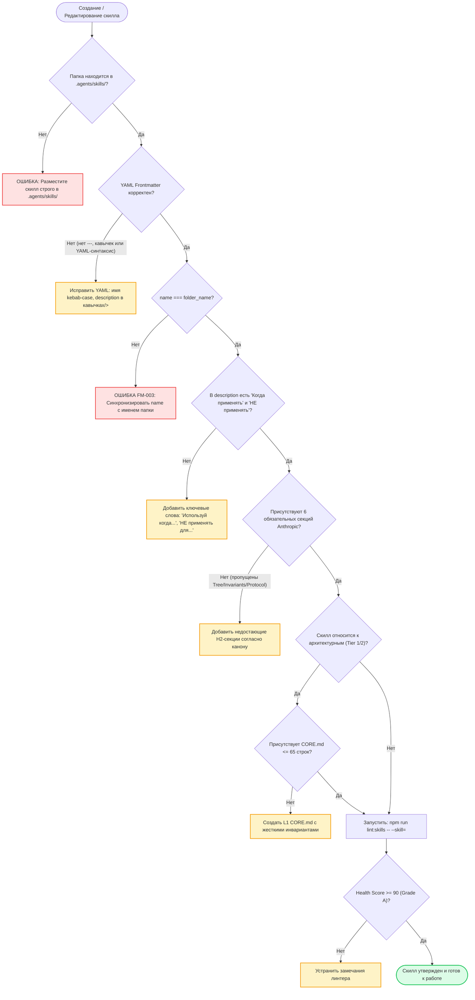

# SKILL: skill-architecture-guard — Стандарт и Аудит Архитектуры Скиллов

> **Статус:** Обязательный стандарт валидации инженерных навыков платформы OmniSMM 1.0 (SMMplan & SMMflux).  
> **Основа:** Официальная спецификация Agent Skills от создателей Claude (Anthropic) + Enterprise-расширение OmniSMM (L1/L2 Dual-Tier).  
> **Исполняемый харнес:** `scripts/audit-skills-architecture.ts` (`npm run lint:skills`).

---

## 1. Назначение и Зона Ответственности (Overview & Scope)

Концепция **Agent Skills** была разработана создателями Claude (компанией Anthropic) для того, чтобы наделять ИИ-агентов глубокой контекстной экспертизой без раздувания базового системного промпта. Скилл — это изолированный исполняемый модуль знаний, алгоритмов и инвариантов.

### Критическая проблема низкокачественных скилов:
1. **Слепота роутера (Router Failure):** Если в YAML Frontmatter отсутствует триггерная формулировка («Используй когда...») или имя `name` не совпадает с директорией, Claude и другие LLM никогда не активируют скилл.
2. **Парадокс вытеснения (Context Budget Overflow):** Раздутые описания и сотни второстепенных скилов переполняют контекстное окно агента, вытесняя критически важные архитектурные инварианты.
3. **Недетерминированное поведение:** Отсутствие четких разделов (Дерево решений, Жесткие запреты) приводит к галлюцинациям модели и нарушению системных контрактов.

**Скилл `skill-architecture-guard` — это нормативный эталон и автоматизированный цензор для всех остальных скилов.**

---

## 2. Дерево Решений (Decision Tree / Flowchart)

При создании или аудите любого скилла агент обязан следовать единому алгоритмическому дереву:



---

## 3. Жесткие Инварианты Архитектуры Скила (Hard Invariants)

Каждый скилл в проекте OmniSMM обязан безусловно соблюдать следующие нерушимые правила:

1. **FM-INV-1 (Идентификация):** Поле `name` в YAML frontmatter обязано строго совпадать с именем папки на диске и содержать только символы `^[a-z0-9-]+$`.
2. **FM-INV-2 (Двухфакторное описание):** Поле `description` обязано содержать:
   - *Позитивный триггер:* фразы «Используй этот скилл ВСЕГДА, когда...» / «Use when the user asks...».
   - *Отрицательный триггер:* границы применимости («НЕ применять для...» / «Do not use for...»).
   - *Длина описания:* от 60 до 750 символов (защита от context starvation).
3. **ST-INV-3 (6 Канонических Секций Anthropic):** Файл `SKILL.md` обязан содержать:
   - `## 1. Назначение и Зона Ответственности` (Overview & Scope Boundaries).
   - `## 2. Дерево Решений` (Decision Tree / Flowchart / Mermaid).
   - `## 3. Жесткие Инварианты` (Hard Invariants / Non-negotiables).
   - `## 4. Пошаговый Алгоритм Выполнения` (Execution Protocol / Step-by-Step).
   - `## 5. Предотвращаемые Антипаттерны` (Known Anti-Patterns & Bad vs Good).
   - `## 6. Чеклист Самопроверки` (Verification Checklist / Quality Gate).
4. **L1-INV-4 (Двухуровневый контракт L1/L2):** Для всех ключевых архитектурных навыков (Tier 1 & Tier 2) обязательно наличие файла `CORE.md` объемом **строго до 65 строк** с заголовком `HARD INVARIANTS`.
5. **HY-INV-5 (Гигиена сред):** Запрещен любой хардкод абсолютных локальных путей пользователя (например, `<DISK>:\Users\...` или `/home/...`). Все ссылки на скрипты и файлы оформляются как относительные.
6. **HY-INV-6 (Целостность ссылок):** Все ссылки на локальные файлы и скрипты `[текст](путь)` обязаны существовать на диске (отсутствие битых ссылок).

---

## 4. Пошаговый Регламент Проверки и Создания Скилов (Execution Protocol)

### Шаг 1: Инициализация и Проверка Frontmatter
- Проверить наличие `---` в строке 1.
- Убедиться, что многострочный `description` оформлен через folded block scalar (`description: >`) во избежание сбоев парсинга символов двоеточия `:`.

### Шаг 2: Алгоритмизация в Дереве Решений
- Запрещено писать скилл исключительно в виде сухого эссе. Обязательна наглядная блок-схема `mermaid` (`flowchart TD`) с ветвлением условий и исходов.

### Шаг 3: Формирование L1 `CORE.md`
- Сжать ключевые математические формулы, команды и запреты в файл `CORE.md`.
- Проверить лимит строк: `(Get-Content CORE.md).Count <= 65`.

### Шаг 4: Запуск Автоматизированного Линтера
Выполнить команду в терминале:
```bash
npm run lint:skills -- --skill=<skill-name>
```
Убедиться, что скилл получил **Health Score $\ge 90/100$ (Grade A)** и 0 критических ошибок.

---

## 5. Предотвращаемые Антипаттерны (Known Anti-Patterns)

| Плохая практика (Антипаттерн) | Почему это ломает систему | Правильное решение |
| :--- | :--- | :--- |
| ❌ Несоответствие `name: my_skill` и папки `my-skill` | LLM-роутер ищет директорию по `name`, возникает тихий сбой загрузки | `name` строго равен имени папки `my-skill` |
| ❌ Размытое `description: "Скилл для помощи в коде"` | Модель активирует скилл невпопад на любой чих или не активирует вовсе | Четкие триггеры: *«Применяй ВСЕГДА, когда редактируются Server Actions...»* |
| ❌ `SKILL.md` на 80 000 символов без `CORE.md` | Выедает 20 000 токенов контекста, провоцируя OOM и вытеснение архитектуры | Декомпозиция: L1 `CORE.md` ($\le 65$ строк) + L2 `SKILL.md` |
| ❌ Хардкод путей `file:///C:/Users/Артем/...` | Скилл не переносим на Linux CI/CD и серверные ноды | Относительные пути: `[скрипт](file:///scripts/check.ts)` |
| ❌ Сырой YAML без кавычек `description: Текст: с двоеточием` | Parser Error: `Nested mappings are not allowed in compact mappings` | Использовать `description: >` |

---

## 6. Чеклист Контроля Качества (Quality Gate Checklist)

Перед сохранением нового или отредактированного скилла убедись:

- [ ] Файл `SKILL.md` находится в директории `.agents/skills/<name>/`.
- [ ] Поле `name` валидно и совпадает с именем директории.
- [ ] Поле `description` содержит условия активации и границы применения (длина 60–750 симв.).
- [ ] Присутствуют все 6 обязательных разделов (Overview, Decision Tree, Invariants, Protocol, Anti-Patterns, Verification).
- [ ] В тексте нет локальных абсолютных путей операционной системы (`C:\Users\...`).
- [ ] Для архитектурных скилов создан файл `CORE.md` объемом $\le 65$ строк с блоком `HARD INVARIANTS`.
- [ ] Запущен `npm run lint:skills` — результат **Grade A (Health Score $\ge 90$)**, 0 CRITICAL / 0 ERROR.
