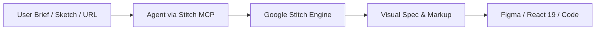

# stitch-get-started — Google Stitch Official Onboarding & Core Workflow

## 1. Overview & Architecture

Google Stitch (`stitch.withgoogle.com`) is Google Labs' generative design engine powered by Gemini models. It transforms natural language briefs, hand-drawn wireframes, screenshots, and live URLs into high-fidelity, interactive web and mobile user interfaces.

Stitch operates in coding agents (Antigravity, Cursor, Claude Code, Gemini CLI) via the **Model Context Protocol (MCP)** standard.



---

## 2. Stitch MCP Server Integration

Stitch connects to agents using standard MCP configurations (`stitch-mcp-server`):

```json
{
  "mcpServers": {
    "stitch": {
      "command": "npx",
      "args": ["-y", "@google/stitch-mcp"]
    }
  }
}
```

In OmniSMM, Stitch is tightly integrated with our internal high-performance server [`scripts/mcp/stitch-mcp-server.ts`](file:///e:/OmniSMM/scripts/mcp/stitch-mcp-server.ts) with direct Laya NPU decision pruning.

---

## 3. Core Stitch MCP Tool Matrix

| Tool Name | Parameters | Purpose |
| :--- | :--- | :--- |
| `stitch_generate_screen` | `prompt`, `brand`, `designDna`, `viewport`, `densityTier` | Generates a high-fidelity screen layout from scratch. |
| `stitch_create_variant` | `baseScreenId`, `targetViewport`, `densityTier` | Produces responsive variants (desktop, tablet, mobile). |
| `stitch_upload_design_md` | `projectId`, `content` | Syncs `DESIGN.md` design token contract to project. |
| `stitch_apply_design_system`| `projectId`, `screenId`, `designSystemId` | Applies design system tokens across screen elements. |
| `stitch_consult_laya` | `prompt`, `candidates` | Evaluates candidates against WCAG 2.2 and Slop Penalty. |
| `stitch_synthesize_react` | `screenMarkup`, `componentName` | Compiles Stitch markup into typed React 19 code. |

---

## 4. End-to-End Operational Lifecycle

### Step 1: Initialize Project & Context
- Define brand context (`smmflux` or `smmplan`).
- Load existing design tokens or extract from `DESIGN.md`.
- Establish target viewport (`desktop: 1440px`, `tablet: 768px`, `mobile: 375px`).

### Step 2: Ideate & Ingest
- **Mode A (Text Brief):** Run through `stitch-prompt-enhancer` to prevent generic AI slop.
- **Mode B (Wireframe/Sketch):** Use `wireframe-nanobanana-stitch` to generate visual base.
- **Mode C (Reverse Engineering):** Use `stitch-reverse-engineer` to extract layout from screenshot/URL.

### Step 3: Generation & Multi-Candidate Evaluation
- Invoke `stitch_generate_screen` with candidate generation.
- Prune candidates via Laya NPU System 1 evaluation.

### Step 4: Multi-Screen Baton Iteration
- Trigger `stitch-loop-orchestrator` to recursively generate linked application views.

### Step 5: Production Synthesis
- Synthesize approved layouts into React 19 + Tailwind 4 via `stitch-react19-synthesizer`.
- Verify on Stage container (:3005) before production cutover (BGS-2026).

---

## 5. Quick Verification Checklist

- [ ] Stitch MCP server responds to ping (`scripts/mcp/stitch-mcp-server.ts`).
- [ ] Brand tokens aligned with `src/app/globals.css` `@theme`.
- [ ] Mobile viewports comply with WCAG 2.2 AA ($\ge 44\text{px}$ touch targets).
- [ ] No raw AI-slop cliches (see `google-stitch-architect`).
