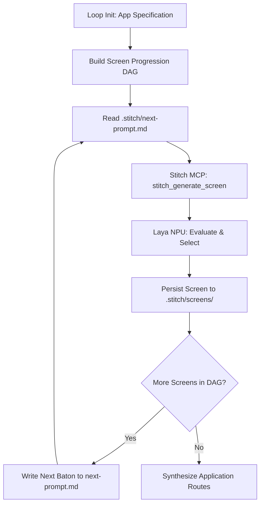

# stitch-loop-orchestrator — Autonomous Multi-Screen Stitch Generation

## 1. Overview & Architecture

Building complex multi-page applications with AI often suffers from **context fatigue** and **visual drift** (screens losing consistent styling, navigation links breaking, tokens diverging). 

`stitch-loop-orchestrator` implements an autonomous state machine that continuously drives Google Stitch through a Directed Acyclic Graph (DAG) of screens using file-based baton handoffs in the `.stitch/` directory.



---

## 2. The `.stitch/` Workspace Hierarchy

```text
.stitch/
├── workspace.json         # Master manifest (project ID, brand, global tokens, screen list)
├── next-prompt.md         # Active baton: prompt for the upcoming screen iteration
├── DESIGN.md              # Shared design token contract
├── screens/               # Generated HTML/SVG layout artifacts
│   ├── 01-landing.html
│   ├── 02-catalog.html
│   ├── 03-checkout.html
│   └── 04-dashboard.html
└── components/            # Synthesized React 19 / Next.js 16 components
```

---

## 3. Operational Invariants

1. **Token Invariance:** Every screen generated in the loop MUST inherit design tokens from `.stitch/DESIGN.md`. If a screen introduces a new color or font, the loop pauses for arbitration.
2. **Deterministic Screen Handoff:** The loop executes strictly one screen at a time. The current screen writes the next screen's requirements into `.stitch/next-prompt.md`, linking navigation routes.
3. **Fail-Safe Convergence:** The loop terminates automatically when:
   - All screens defined in `workspace.json` reach `APPROVED` status.
   - Or maximum iterations (default: 8) are exhausted to prevent infinite loops.
4. **Zero-Context Exhaustion:** Large DOM markups are stored on disk in `.stitch/screens/`, keeping the agent's active memory clean and fast.

---

## 4. Execution Command

To run the autonomous loop via the command line:
```bash
npx tsx scripts/stitch/stitch-loop-manager.ts --manifest .stitch/workspace.json
```
