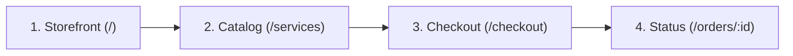

# Example: Autonomous 4-Screen E-Commerce Flow

This walkthrough documents an autonomous Stitch loop generating the primary customer journey for SMMflux.

---

## Screen Progression Graph (DAG)

---

## Iteration Log

### Iteration 1: Storefront (`/`)
- Prompt: "Radiant Aurora hero with interactive order stepper and bento trust badges."
- Stitch MCP generates 3 candidates. Laya NPU selects Candidate C (Score: 91).
- Screen saved to `.stitch/screens/01-landing.html`.
- Baton written: *Link "Каталог" button to `/services`, passing selected network filter.*

### Iteration 2: Catalog (`/services`)
- Ingests baton and `DESIGN.md`. Generates high-density two-tier platform grid with search bar.
- Laya NPU enforces Zero-Horizontal Scroll rule and WCAG contrast.
- Screen saved to `.stitch/screens/02-catalog.html`.
- Baton written: *Each service card routes to `/checkout?serviceId={id}` with exact price.*

### Iteration 3: Checkout (`/checkout`)
- Ingests baton. Generates 2-column split view (gateways on left, sticky summary on right).
- Enforces 54-FZ fiscal receipt input and BigInt kopecks pricing.
- Screen saved to `.stitch/screens/03-checkout.html`.
- Baton written: *Payment submit leads to order tracker with real-time status pills.*

### Iteration 4: Order Status (`/orders/:id`)
- Generates live status tracker (Pending, In Progress, Completed) with Telegram bot alert toggle.
- Screen saved to `.stitch/screens/04-status.html`.
- Loop detects all 4 screens marked `APPROVED`. Status changes to `COMPLETED`.
