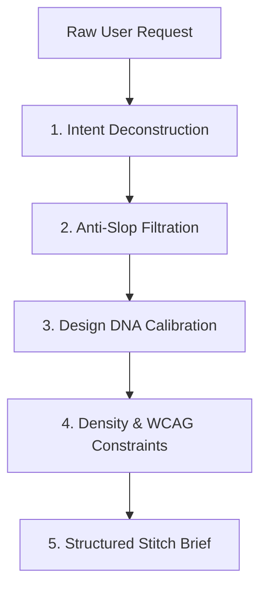

# stitch-prompt-enhancer — Stitch High-Precision Prompt Synthesis

## 1. Overview & Purpose

Standard LLM-generated UI prompts often produce generic, cliché designs (purple glow, excessive pill badges, unbalanced bento grids). `stitch-prompt-enhancer` acts as an architectural compiler that intercepts raw user requirements and translates them into mathematically structured design briefs optimized for Google Stitch.

---

## 2. The 5-Vector Enhancement Engine

### Vector 1: Intent Deconstruction
- **Primary Goal:** Transactional, analytical, navigational, or onboarding?
- **Information Hierarchy:** What is the primary focal point vs supporting data?
- **State Coverage:** Default, Loading, Empty, Error, and Success states.

### Vector 2: Anti-Slop Filtration
- Eliminates cliches: bans floating neon orbs, arbitrary icons inside badges, centered hero text with low contrast, and unneeded decoration.
- Enforces purposeful micro-interactions and tactile visual boundaries.

### Vector 3: Design DNA Calibration
Selects from the 6 canonical OmniSMM Design DNAs:
1. `Swiss Kinetic Precision` (Clean sans-serif, modular grid, intentional whitespace).
2. `High-Frequency Financial Terminal` (Linear / Bloomberg aesthetic, data density, monospace metrics).
3. `Tactile Industrial Hardware` (Beveled edges, matte textures, crisp physical borders).
4. `Neo-Editorial Luxury` (High typography contrast, expansive line heights, editorial balance).
5. `Obsidian Monolith` (Rich deep blacks, razor-thin luminous borders, subtle glows).
6. `Bio-Mechanical Precision` (Spring animations, fluid sliders, organic transitions).

### Vector 4: Density & Ergonomics
- Defines explicit density tier: `compact` (enterprise/dashboards), `standard` (e-commerce), `spacious` (marketing hero).
- Enforces WCAG 2.2 AA: minimum 4.5:1 text contrast, $\ge 44\text{px}$ touch zones on mobile.

---

## 3. Standard Enhanced Prompt Schema

Every enhanced prompt generated by this skill must output:
1. **Title & Viewport Target** (e.g., `Desktop 1440px / Mobile 375px`).
2. **Brand & Design DNA** (`smmflux` / `smmplan` + DNA style).
3. **Layout Blueprint** (Grid system, sidebar vs full-width, header anatomy).
4. **Component Wireframe** (Step-by-step element hierarchy).
5. **Interactive Directives** (Focal CTA, hover states, feedback indicators).
6. **Banned Patterns** (Explicit negative prompt constraints).
