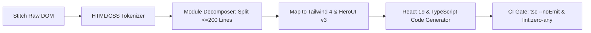

# stitch-react19-synthesizer — Production React 19 & Next.js 16 Code Synthesis

## 1. Overview & Purpose

Google Stitch outputs high-fidelity markup (HTML, SVG, styling). However, raw HTML cannot be deployed directly into modern production applications.

`stitch-react19-synthesizer` translates Stitch layouts into clean, idiomatic, fully-typed React 19 / Next.js 16 component trees conforming to OmniSMM 1.0 architectural standards.

---

## 2. Hard Invariants & Code Standards

1. **200-Line File Limit:**
   - Any component exceeding 200 lines MUST be decomposed into subcomponents (e.g., `Header`, `ItemRow`, `ActionsModal`, `helpers.ts`).
2. **Strict Typing (Zero `any`):**
   - All props, state, and event handlers must be strictly typed using TypeScript interfaces.
3. **Server / Client Boundary:**
   - Default to Server Components (`RSC`).
   - Add `"use client"` ONLY when state (`useState`), effects (`useEffect`), or user events (`onClick`, `onChange`) are strictly required.
4. **Tailwind CSS 4 Semantic Tokens:**
   - Ban raw hardcoded hex codes (`bg-[#fff]`, `text-[#000]`).
   - Use semantic design tokens: `bg-background`, `text-foreground`, `border-border`, `bg-card`.
5. **HeroUI v3 Compound Component Syntax:**
   - Use dot-notation API: `<Table.Header>`, `<Modal.Body>`, `<Tabs.Tab>`.
6. **Accessible Forms & Actions:**
   - Connect forms to typed Server Actions returning `{ success: boolean, error?: string, data?: T }`.
   - Never disable submit buttons; use pending indicators (`useActionState`, `useTransition`, `Loader2`).

---

## 3. AST Synthesis Pipeline



---

## 4. Execution Command

To run the synthesis compiler on a generated Stitch screen:
```bash
npx tsx scripts/stitch/synthesize-react.ts --input .stitch/screens/01-landing.html --output src/components/landing/
```
