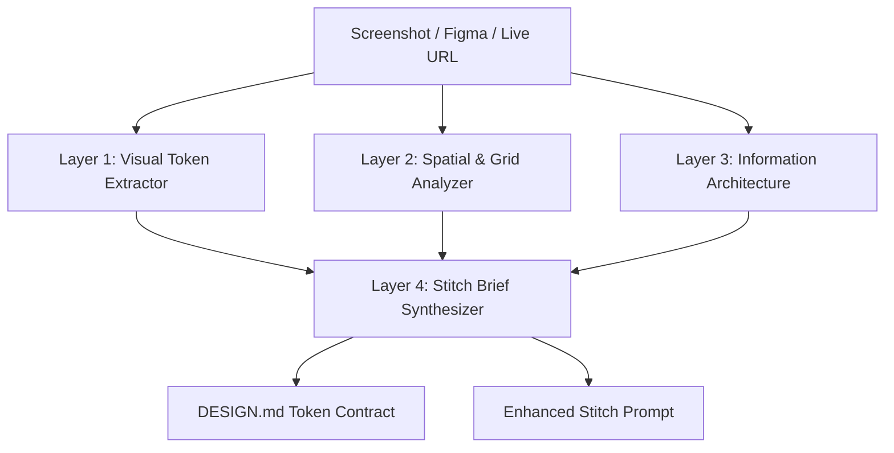

# stitch-reverse-engineer — Vision & Reference Deconstruction for Stitch

## 1. Overview & Purpose

Often the best starting point for a high-converting UI is a reference: a screenshot of a competitor's checkout, an award-winning dashboard, or a live URL.

`stitch-reverse-engineer` applies automated visual and structural deconstruction to extract:
1. **Color Palette & Contrast Tokens** (Surface, Accent, Border, Text).
2. **Typography Scale & Rhythm** (Font weights, line heights, letter-spacing).
3. **Spatial Grid & Information Density** (Padding hierarchy, column breaks).
4. **Interactive Component Primitives** (Cards, Badges, Tabs, Steppers).

The extracted data is synthesized directly into a **Google Stitch Design Brief** and a `.stitch/DESIGN.md` contract.

---

## 2. The 4-Layer Deconstruction Pipeline



### Layer 1: Visual Token Extractor
- Ingests image or uses Playwright to snapshot computed styles.
- Quantizes dominant colors into OKLCH / HEX tokens.
- Checks text-to-background contrast ratios against WCAG 2.2 AA.

### Layer 2: Spatial & Grid Analyzer
- Identifies container boundaries (fixed vs fluid, multi-column split, sticky panels).
- Measures padding/margin intervals (4px, 8px, 12px, 16px, 24px).
- Categorizes density tier (`compact`, `standard`, `spacious`).

### Layer 3: Information Architecture
- Maps cognitive reading flow (F-pattern, Z-pattern, Gutenberg diagram).
- Identifies primary conversion funnel CTA and secondary controls.

### Layer 4: Stitch Brief Synthesizer
- Compiles findings into an enhanced prompt conforming to `stitch-prompt-enhancer`.
- Saves extracted tokens into `.stitch/DESIGN.md`.

---

## 3. Execution CLI

```bash
# Deconstruct an image reference
npx tsx scripts/stitch/stitch-reverse-engineer.ts --image ./references/checkout.png --output .stitch/

# Deconstruct a live web page
npx tsx scripts/stitch/stitch-reverse-engineer.ts --url https://example.com/pricing --output .stitch/
```
