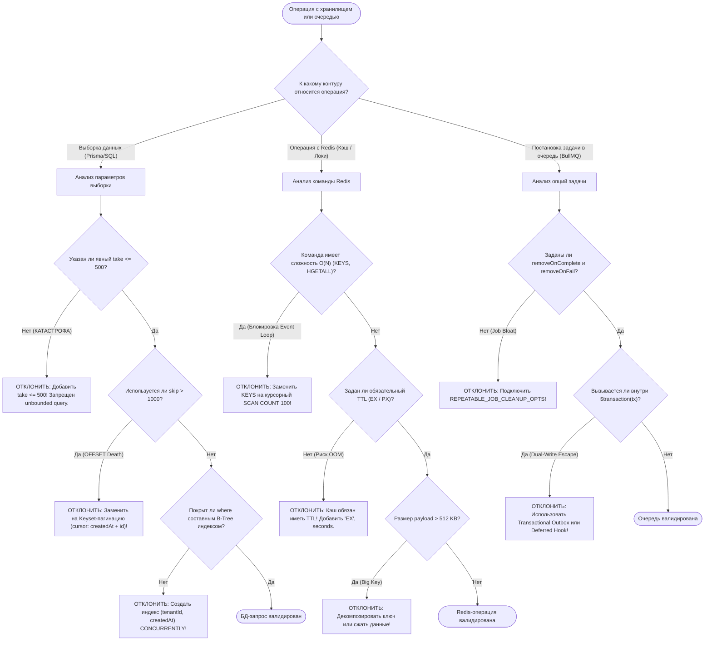

# Storage & Queue Pre-Mortem Guard — Защита БД, Redis и очередей в OmniSMM 1.0

## 1. Назначение скилла и границы ответственности (Overview & Scope)

Скилл `storage-queue-premortem-guard` регламентирует архитектурные нормы, защитные фильтры и упреждающее пре-мортем моделирование для реляционной базы данных (PostgreSQL 15+ / Prisma 5), оперативной памяти (Redis 7+) и подсистемы асинхронных очередей (BullMQ 5) в платформе OmniSMM (бренды SMMplan и SMMflux).

В высоконагруженных финтех- и SaaS-системах подавляющее большинство фатальных инцидентов (SEV-1 / P0) вызваны отложенной деградацией ресурсов под нагрузкой:
- **Разрастание таблиц и диска (Storage & Table Bloat):** бесконтрольная генерация мертвых строк (dead tuples) при частых `UPDATE`, отсутствие range-партиционирования для архивных журналов и лавинный рост WAL.
- **Вымывание кэша диска (IOPS Thrashing & Zero-FTS):** сканирование всей таблицы (`Seq Scan`) из-за отсутствия индексов или запросов без лимита (`take`), приводящее к вытеснению горячих страниц из памяти ОС и зависанию дисковой подсистемы.
- **Блокировка однопоточного цикла Redis (Event Loop Latency Spikes):** вызовы команд сложности $O(N)$ (`KEYS *`, `HGETALL` на громадных хэшах), замораживающие весь сервер на сотни миллисекунд.
- **Утечка оперативной памяти (Redis RAM Exhaustion & OOM):** хранение бесконечных коллекций без TTL и отсутствие автоматической очистки завершенных задач в очередях BullMQ.
- **Каскадный коллапс при инвалидации кэша (Cache Stampede / Thundering Herd):** одновременное обращение сотен воркеров к БД при истечении срока горячего ключа.

---

## 2. Дерево решений (Decision Tree)



---

## 3. Жесткие архитектурные инварианты (Hard Invariants)

### 3.1. Инвариант Zero-FTS и лимитированных выборок (Bounded Queries)
* **КАТЕГОРИЧЕСКИ ЗАПРЕЩЕНО** выполнять `prisma.<model>.findMany()` без явного параметра `take`.
* Максимально допустимый размер выборки для интерактивных пользовательских и админ-запросов: `take <= 500`.
* Для пакетной обработки миллионов строк обязательна потоковая чанковая обработка (Chunking / Keyset batching) по 500 записей за итерацию.

```typescript
// ❌ ПЛОХО: Сканирование всей таблицы (Seq Scan), падение ноды по OOM при росте данных
const orders = await prisma.order.findMany({
  where: { status: 'PENDING' }
});

// ✅ НАДЕЖНО: Bounded Query с жестким лимитом и составным индексом
const orders = await prisma.order.findMany({
  where: { tenantId, status: 'PENDING' },
  take: 100,
  orderBy: { createdAt: 'desc' },
  select: { id: true, status: true, totalPriceCents: true }
});
```

### 3.2. Инвариант Keyset-пагинации (Запрет глубокого OFFSET)
* **КАТЕГОРИЧЕСКИ ЗАПРЕЩЕНО** использовать `skip: page * pageSize` при `skip > 1000` на таблицах свыше 10 000 строк (`Order`, `LedgerEntry`, `AuditLog`, `TicketMessage`).
* Пагинация обязана использовать детерминированный составной курсор `(createdAt, id)`:

```typescript
// ❌ ПЛОХО: OFFSET 50000 сканирует и сбрасывает 50 000 строк с диска
const page = await prisma.ledgerEntry.findMany({
  skip: 50000,
  take: 50
});

// ✅ НАДЕЖНО: Прямой переход по B-Tree индексу в O(log N)
const page = await prisma.ledgerEntry.findMany({
  where: {
    tenantId,
    ...(cursor ? {
      createdAt: { lte: cursor.createdAt },
      id: { not: cursor.id }
    } : {})
  },
  take: 50,
  orderBy: [
    { createdAt: 'desc' },
    { id: 'desc' }
  ]
});
```

### 3.3. Инвариант чистоты однопоточного цикла Redis (Zero O(N) Commands)
* **КАТЕГОРИЧЕСКИ ЗАПРЕЩЕНО** использовать команду `KEYS *` в любом серверном коде.
* Любой поиск ключей по маске выполняется исключительно через неблокирующий `SCAN` с ограничением батча `COUNT 100`.
* **КАТЕГОРИЧЕСКИ ЗАПРЕЩЕНО** запрашивать весь хэш через `HGETALL` или всё множество через `SMEMBERS`, если число полей/элементов не гарантировано архитектурно ($\le 100$). Использовать `HSCAN` и `SSCAN`.

```typescript
// ❌ ПЛОХО: Блокирует Redis Event Loop на 400ms при 200 000 ключах
const keys = await redis.keys('order:dispatch_lock:*');

// ✅ НАДЕЖНО: Курсорное сканирование порциями по 100 ключей без блокировки потока
let cursor = '0';
const matchedKeys: string[] = [];
do {
  const [nextCursor, batch] = await redis.scan(cursor, 'MATCH', 'order:dispatch_lock:*', 'COUNT', 100);
  cursor = nextCursor;
  matchedKeys.push(...batch);
} while (cursor !== '0');
```

### 3.4. Инвариант обязательного TTL (Universal TTL Invariant)
* **КАТЕГОРИЧЕСКИ ЗАПРЕЩЕНО** выполнять `redis.set(key, value)` без явного указания времени жизни (`EX` в секундах или `PX` в миллисекундах) для кэшей, блокировок и сессий.
* Бессмертные ключи допустимы исключительно для постоянных системных счетчиков в изолированном инстансе.

```typescript
// ❌ ПЛОХО: Ключ остается в RAM навсегда, накапливая гигабайты мертвого кэша
await redis.set(`catalog:${tenantId}`, JSON.stringify(data));

// ✅ НАДЕЖНО: Строгий TTL с защитой от вымывания памяти
await redis.set(`catalog:${tenantId}`, JSON.stringify(data), 'EX', 300); // 5 минут
```

### 3.5. Инвариант очистки завершенных задач очередей (Job Queue Auto-Purge)
* **КАТЕГОРИЧЕСКИ ЗАПРЕЩЕНО** создавать очереди или добавлять задачи BullMQ без опций `removeOnComplete` и `removeOnFail`.
* Все фоновые очереди обязаны использовать стандартные лимиты:
  - `removeOnComplete: { count: 100, age: 3600 }` (хранить не более 100 выполненных задач или не старше 1 часа).
  - `removeOnFail: { count: 500, age: 86400 }` (хранить до 500 аварийных задач для ручного разбора оператором в течение 24 часов).

### 3.6. Инвариант защиты от Dual-Write в транзакциях
* **КАТЕГОРИЧЕСКИ ЗАПРЕЩЕНО** вызывать `queue.add()` или мутировать Redis напрямую внутри колбэка `db.$transaction(async (tx) => { ... })`.
* При сбое транзакции задача из Redis не может быть отозвана, порождая фантомные списания и несинхронизированные заказы.
* Использовать либо **Transactional Outbox** (`tx.providerOutbox.create(...)`), либо **Deferred Post-Commit Hook** (`runAfterCommit(...)`).

---

## 4. Пошаговый протокол пре-мортем анализа (Step-by-step Protocol)

При создании или модификации любого модуля, затрагивающего БД, кэш или очереди, инженер и AI-агент обязаны пройти 5 шагов:

1. **Шаг 1: Оценка дискового воздействия и разрастания (Disk Bloat & Retention):**
   - Вычислить ожидаемый суточный прирост строк: $\Delta N = \text{RPS} \times 86400$.
   - Если $\Delta N > 10\,000$ строк/сутки (`LedgerEntry`, `SecurityEvent`, `AuditLog`), модель обязана предусматривать range-партиционирование или регламент очистки (TTL в днях).
   - Для таблиц с высокой частотой `UPDATE` проверить наличие `fillfactor = 85` для обеспечения Heap-Only Tuples (HOT).

2. **Шаг 2: Анализ плана выполнения запроса (Execution Plan & Zero-FTS):**
   - Проверить наличие покрывающего B-Tree индекса на все предикаты в `where` и `orderBy`.
   - Убедиться, что составной индекс соблюдает правило префикса: поле с наивысшей селективностью (`tenantId`, `status`) идет первым.
   - Проверить наличие внешних ключей (`@relation`): все поля `*Id` обязаны иметь индекс `@@index([foreignId])` для предотвращения `ShareLock` всей родительской таблицы при удалении или изменении записей.

3. **Шаг 3: Аудит однопоточного цикла и памяти Redis (Event Loop & RAM Budget):**
   - Проверить все команды к Redis на соответствие $O(1)$ или $O(\log N)$.
   - Оценить максимальный размер значения (Value Size): строго $\le 512\text{ KB}$. При превышении внедрить потоковое сжатие (gzip/brotli) или вынос в S3/Postgres.
   - Проверить наличие обязательного TTL на каждом ключе.

4. **Шаг 4: Контроль жизненного цикла очередей и бэкпрешера (Queue Sizing & Purge):**
   - Проверить наличие `removeOnComplete` и `removeOnFail`.
   - Сопоставить конкурентность воркеров (`concurrency`) с пулом соединений БД:
     $$\text{Worker Concurrency} \times \text{Instances} \le \text{DATABASE\_POOL\_SIZE} / 2$$
   - Настроить экспоненциальный backoff с джиттером (`jitteredBackoff`) и лимит попыток (`attempts: 3`).

5. **Шаг 5: Моделирование каскадного отказа и защита от лавины (Pre-Mortem Failure Simulation):**
   - Проанализировать сценарий: *«Что произойдет, если база данных отвечает 5 секунд вместо 10 миллисекунд?»*
   - Проверить наличие таймаута соединения (`connect_timeout = 5s`, `statement_timeout = 5s`).
   - Убедиться, что при падении кэша приложение не уходит в синхронный Thundering Herd (применить Singleflight или XFetch).

---

## 5. Матрица моделирования отказов (Pre-Mortem Failure Simulation Matrix)

| Вектор отказа | Вероятность $\times$ Влияние | Симптом катастрофы | Защитный механизм в архитектуре |
|---|---|---|---|
| **Seq Scan на таблице заказов** | Высокая $\times$ Критическое (P0) | Всплеск Disk Read IOPS до 100%, P99 ответа API возрастает с 20ms до 15s | Жесткий лимит `take <= 500`, составные индексы `@@index([tenantId, status, createdAt])`, запрет `findMany` без индекса |
| **Память Redis забита джобами BullMQ** | Высокая $\times$ Фатальное (P0) | Redis OOM: `OOM command not allowed`, остановка авторизации и воркеров | Инвариант `REPEATABLE_JOB_CLEANUP_OPTS` (`removeOnComplete: 100`, `removeOnFail: 500`) на всех очередях |
| **Deep OFFSET при экспорте админки** | Средняя $\times$ Высокое (P1) | Повисание запроса на 30 секунд, истощение пула соединений PgBouncer | Keyset-пагинация чанками по 500 записей через детерминированный курсор `id` / `createdAt` |
| **Блокировка Redis командой KEYS** | Средняя $\times$ Критическое (P0) | Остановка обработки платежей и зависание распределенных блокировок на 500ms | Замена `KEYS` на батчированный неблокирующий `SCAN ... COUNT 100` |
| **Cache Stampede (Лавина запросов)** | Средняя $\times$ Высокое (P1) | При инвалидации кэша каталога 2 000 клиентов кладут PostgreSQL | Вероятностный алгоритм раннего прогрева XFetch либо мьютекс `SET lock NX EX 5` |
| **Deadlock при мутации баланса** | Низкая $\times$ Критическое (P0) | Ошибка `40P01 deadlock detected`, откат финансовых операций | Атомарный `UPDATE "User" SET balance = balance - :cost WHERE id = :id AND balance >= :cost` без долгих SELECT FOR UPDATE |

---

## 6. Каталог антипаттернов (Anti-patterns: Bad vs Good)

### Антипаттерн 1: Запрос без проекции полей (`SELECT *`)
```typescript
// ❌ ПЛОХО: Считывает тяжелые поля JSONB, описания и логи, забивая память Node.js и сеть
const users = await prisma.user.findMany({
  where: { tenantId },
  take: 100
});

// ✅ НАДЕЖНО: Точная проекция только необходимых колонок
const users = await prisma.user.findMany({
  where: { tenantId },
  take: 100,
  select: {
    id: true,
    email: true,
    balance: true,
    role: true
  }
});
```

### Антипаттерн 2: Ручная конкатенация ключей Redis без пространств имен
```typescript
// ❌ ПЛОХО: Риск коллизий между тенантами и невозможность безопасной очистки
await redis.set(`user_${id}`, val, 'EX', 60);

// ✅ НАДЕЖНО: Строгая иерархия с тенантом и доменом
const cacheKey = `tenant:${tenantId}:user:${userId}:profile`;
await redis.set(cacheKey, val, 'EX', 300);
```

### Антипаттерн 3: Бесконечные повторы упавших задач (Poison Pill Retry Storm)
```typescript
// ❌ ПЛОХО: Невалидный payload будет ретраиться вечно без задержки, сжигая CPU
await queue.add('sync-order', payload, {
  attempts: 100
});

// ✅ НАДЕЖНО: Ограниченные попытки, джиттер и отправка в DLQ при исчерпании
await queue.add('sync-order', payload, {
  attempts: 3,
  backoff: {
    type: 'exponential',
    delay: 3000
  },
  removeOnComplete: { count: 100, age: 3600 },
  removeOnFail: { count: 500, age: 86400 }
});
```

---

## 7. Протокол верификации и AST-валидации (Verification Protocol)

Для подтверждения соответствия стандартам `storage-queue-premortem-guard` обязательны следующие проверки:

1. **Архитектурный аудит скиллов платформы:**
   ```bash
   npm run lint:skills:arch -- --ci
   npm run test:skills
   ```
   *Критерий успешности:* 100% PASS, грейд A (100/100), 0 CRITICAL / 0 ERROR.

2. **Статическая проверка типов и контрактов:**
   ```bash
   npx tsc --noEmit
   ```
   *Критерий успешности:* 0 ошибок типизации.

3. **Сквозное тестирование надежности очередей и транзакций:**
   ```bash
   npx vitest run src/__tests__/audit/package4-bullmq-redis.test.ts
   npx vitest run src/__tests__/audit/package5-financial-acid.test.ts
   ```
   *Критерий успешности:* 100% PASS всех тестов надежности Redis и BullMQ.
