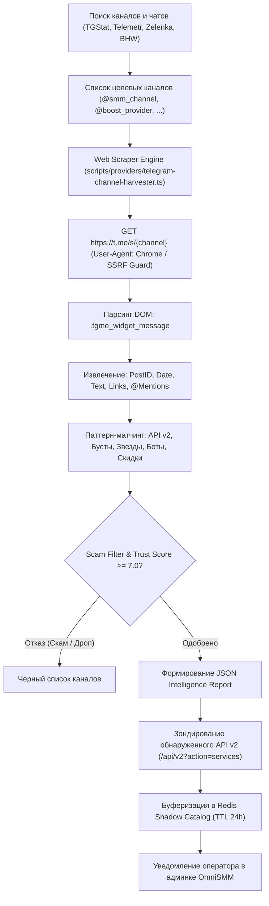

# SKILL: telegram-smm-intelligence — Разведка и Мониторинг Поставщиков SMM в Telegram

> **Статус:** Обязательный стандарт OSINT и мониторинга оптовых SMM-поставщиков в Telegram для платформы OmniSMM 1.0 (SMMplan / SMMflux).  
> **Стек:** Node.js 22, TypeScript 5.7+ (strict mode), Native Fetch, Zod, Redis 7+ Shadow Catalog, ExactMath BigInt.

---

## Назначение и Архитектурный Обзор (Overview)

Telegram является ключевым операционным пространством теневого и оптового рынка SMM-услуг в РФ и СНГ. Здесь впервые появляются прямые поставщики уникальных услуг нового поколения:
1. **Telegram Level Boosts (Бусты каналов для публикации историй и эмодзи-статусов):** фермы премиум-аккаунтов, продающие бусты оптом от 12.00–14.00 ₽ за буст;
2. **Telegram Stars (Звездные реакции):** оптовые поставщики Telegram Stars по 1.45–1.55 ₽ за звезду;
3. **Telegram Mini Apps (Рефералы и бот-трафик):** автоматизированные фермы кликеров для крипто-проектов и игр;
4. **Стриминговые боты и зрители онлайн:** Twitch, Kick, YouTube трансляции с удержанием онлайна.

Большинство прямых поставщиков ведут информационные каналы в Telegram, где публикуют:
- Зеркала и эндпоинты SMM Panel API v2 (`action=services`, `action=balance`);
- Оптовые промокоды, скидки и закрытые прайс-листы для реселлеров;
- Изменения алгоритмов Telegram (списания, антифрод, новые лимиты);
- Контакты технических саппортов и Telegram-ботов для закупки.

**Скилл `telegram-smm-intelligence` решает ключевые инженерные задачи:**
- Автоматизированный сбор данных без риска блокировки аккаунтов (Zero-Risk Web Scraper через шлюз `t.me/s/`);
- Распознавание API v2 ссылок, бот-шлюзов (`@...bot`) и прайс-матриц;
- Оценка благонадежности провайдера (Heuristic Trust Score: аудит депозитов на форумах, гарантов, возраста канала);
- Интеграция найденных тарифов в единый Shadow Catalog (`provider:{id}:catalog`) платформы OmniSMM.

---

## 1. Жесткие Инварианты Скилла (Hard Invariants)

1. **[INV-TG-001] Zero-Account-Risk Policy (Безопасность учетных записей):**  
   Для регулярного мониторинга публичных каналов **СТРОГО ЗАПРЕЩЕНО** использовать личные телефонные номера операторов или боевые сессии. Первичный сбор данных обязан производиться через публичный веб-шлюз `https://t.me/s/{channel_slug}` или официальные API агрегаторов (TGStat/Telemetr).
2. **[INV-TG-002] SSRF & Network Guard (Сетевой суверенитет):**  
   Любые сетевые обращения к внешним сайтам провайдеров или Telegram-шлюзам обязаны валидироваться через `assertSafeUrl` (блокировка локальных адресов `127.0.0.1`, `10.0.0.0/8`, `192.168.0.0/16`, `169.254.0.0/16`) и ограничиваться таймаутом `AbortSignal.timeout(8000)`.
3. **[INV-TG-003] Heuristic Scam Filter (Защита от мошенников и скамеров):**  
   ❌ **ЗАПРЕЩЕНО** добавлять в боевой реестр провайдеров каналы без проверки: каналы-однодневки (< 30 дней), каналы с закрытыми комментариями и реакциями, предложения «накрутки через софт без API», либо требующие оплату только прямым переводом на карту физлица без сайта или SMM API шлюза.
4. **[INV-TG-004] Zero Secret Leakage (Защита ключей API):**  
   Все обнаруженные тестовые API-ключи, приватные токены ботов или авторизационные заголовки **КАТЕГОРИЧЕСКИ ЗАПРЕЩЕНО** коммитить в открытый Git-репозиторий. Сохранение разрешено только в зашифрованном виде через `VaultService` или `.env.local`.
5. **[INV-TG-005] Financial Precision (ExactMath BigInt):**  
   Все обнаруженные цены и тарифы переводятся в копейки `BigInt` по формуле `ExactMath.rublesToKopecks(rate)`. Никаких операций с плавающей точкой.

---

## 2. Архитектура Сбора Данных и Поиска в Telegram



---

## 3. Регулярные Выражения и Паттерны Детекции

При парсинге постов Telegram-каналов применяются следующие сигнатуры:

### 1. Детекция SMM Panel API v2:
- URL API: `https?:\/\/[a-zA-Z0-9.-]+\/(?:api\/v2|api\/v1|api)\/?`
- Экшены API: `(?:action=services|action=add|action=status|action=balance)`
- Параметры ключей: `(?:api_key|apiKey|token|secret)=`

### 2. Детекция цен на Telegram Бусты и Звезды:
- Бусты: `(?:буст|boost|уровен|lvl)\w*\s*(?:от|—|-|:)?\s*(\d+[.,]?\d*)\s*(?:₽|руб|usd|\$|usdt)`
- Звезды: `(?:звезд|stars?)\s*(?:от|—|-|:)?\s*(\d+[.,]?\d*)\s*(?:₽|руб|usd|\$|usdt)`
- Просмотры: `(?:просмотр|views?)\s*(?:от|—|-|:)?\s*(\d+[.,]?\d*)\s*(?:₽|руб|коп)`

### 3. Детекция Telegram-ботов для автоматической закупки:
- Имя бота: `@[a-zA-Z0-9_]+(?:bot|Bot|BOT)\b`

### 4. Ключевые теги первоисточников:
- Хэштеги: `#api`, `#smm`, `#панель`, `#поставщик`, `#бусты`, `#реселлер`, `#опт`, `#stars`, `#telegramboost`

---

## 4. Матрица Оценки Благонадежности (Heuristic Trust Score)

Каждый найденный канал или бот оценивается по шкале от 0 до 10 баллов:

| Критерий проверки | Вес | Описание |
| :--- | :--- | :--- |
| **Наличие рабочего веб-сайта с SSL** | +2.5 | Домен `.ru`, `.com`, `.pro` с валидным сертификатом и защитой Cloudflare / DDoS-Guard |
| **Поддержка открытого API v2** | +2.5 | Наличие документации `/api/v2` с методами `services`, `add`, `status`, `balance` |
| **Депозит или статус на форуме (Lolz/Zelenka/BHW)** | +2.0 | Проверенная ветка с депозитом $\ge 50\,000$ ₽ или статусом «Проверенный продавец» |
| **Возраст канала > 6 месяцев** | +1.5 | Хронология постов без внезапных смен тематики канала |
| **Открытые комментарии и реакции** | +1.5 | Реальная обратная связь клиентов, отсутствие блокировки обсуждений |
| **Аномалии (Скам-маркеры)** | -5.0 | Прием оплаты только на карту физлица, отсутствие сайта, обещания «вечных бустов без списаний» |

*Порог допуска в реестр первоисточников OmniSMM:* **$\ge 7.0$ баллов**.

---

## 5. Регламент Запуска CLI-Инструмента Harvester

Инструмент сбора данных:
```bash
npx tsx scripts/providers/telegram-channel-harvester.ts <channel_slug_1> <channel_slug_2> ...
```

Флаги и опции:
- `--deep`: сбор до 50 последних постов канала (по умолчанию 15);
- `--probe-api`: автоматическое тестовое обращение к найденным API v2 эндпоинтам с проверкой `assertSafeUrl`;
- `--export-json=<path>`: сохранение результатов в JSON-файл;
- `--sync-shadow-catalog`: автоматическая буферизация подтвержденных каталогов в Redis (`provider:{id}:catalog`).

Пример запуска:
```bash
npx tsx scripts/providers/telegram-channel-harvester.ts smm_boost_news tgpanel_alerts --probe-api
```

---

## Пошаговый алгоритм выполнения (Step-by-step Protocol)

1. **Шаг 1: Формирование пула источников (Seed Targets)**  
   Сформировать список целевых публичных каналов, форумов и чатов (базы TGStat, поисковые запросы по тегам `#api #smm #бусты`).
2. **Шаг 2: Извлечение постов через Zero-Risk Web Scraper**  
   Запустить сборщик `telegram-channel-harvester.ts`. Получить HTML страницы канала `https://t.me/s/{channel}`, распарсить блоки сообщений, извлечь метаданные и ссылки.
3. **Шаг 3: Экстракция сущностей и расчет Trust Score**  
   Провести regex-анализ текстов на наличие API v2 эндпоинтов, ботов-шлюзов и тарифов. Рассчитать Heuristic Trust Score. Отфильтровать каналы с оценкой $< 7.0$.
4. **Шаг 4: Валидация API v2 Контракта**  
   Для каждого найденного домена выполнить безопасный запрос `GET {apiUrl}?action=services` (с SSRF-гардом `assertSafeUrl`). Проверить ответ через Zod-схему `RawProviderServicesListSchema`.
5. **Шаг 5: Интеграция в Shadow Catalog и Реестр**  
   Добавить валидированного провайдера в `src/data/providers/smm-direct-providers.json`, сохранить профиль в `docs/SMM_PROVIDERS_REGISTRY.md`, закэшировать каталог в Redis и уведомить оператора в админке.

---

## Чеклист верификации (Verification Checklist)

- [ ] Соответствует ли скилл структуре Agent Skills (Frontmatter, Overview, Protocol, Checklist)?
- [ ] Соблюден ли инвариант Zero-Account-Risk Policy (без телефонных номеров и авторизаций)?
- [ ] Защищены ли все HTTP-запросы через `assertSafeUrl` и `AbortSignal.timeout`?
- [ ] Проверяются ли каналы на Heuristic Trust Score ($\ge 7.0$)?
- [ ] Валидируются ли найденные услуги через Zod `RawProviderServicesListSchema`?
- [ ] Рассчитываются ли все финансовые показатели в копейках BigInt через `ExactMath`?
- [ ] Пройден ли компиляторный аудит `npx tsc --noEmit` и аудит секретов `node scripts/check-bundle-secrets.mjs`?
