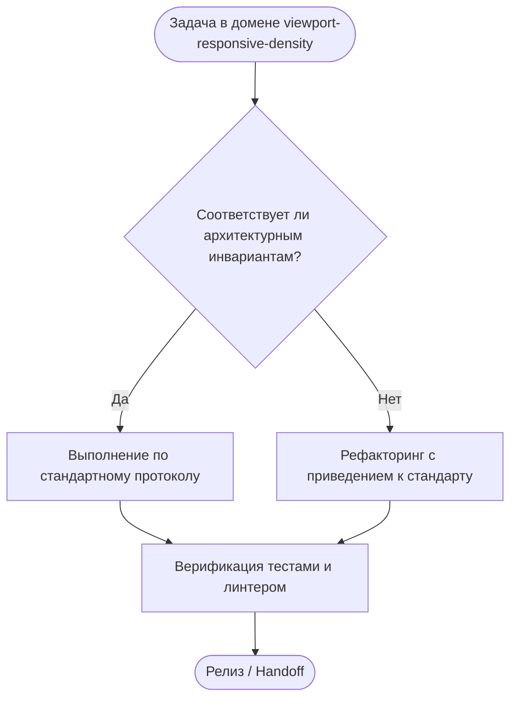

# Viewport Responsive Density & High-Density Dashboard Architecture

## 1. Назначение и Философия
В административных интерфейсах OmniSMM 1.0 операторы и менеджеры работают с большими массивами данных (заказы, транзакции, тикеты поддержки). 
Стандарт гарантирует **100% видимость информации без горизонтального скроллинга и обрезания колонок** на экранах от стандартных офисных ноутбуков ($1366\times 768\text{px}$) до Full HD ($1920\times 1080\text{px}$).

---

## 2. Формулы ширины и лимиты колонок (7–9 Column Rule)

### 2.1. Лимит видимых колонок
В любой табличной сетке допустимо максимум **7–9 основных колонок**. Все второстепенные технические поля (хеши транзакций, сырые JSON-логи, user-agent) выносятся в:
- Интерактивный Tooltip при наведении;
- Popover с компактным превью;
- Боковую шторку (Drawer) или модальное окно деталей.

### 2.2. Каноническая сетка ширин (Tailwind Tokens)
| Тип данных | Класс ширины | Типографика и стили | Пример |
|---|---|---|---|
| **Чекбокс выбора** | `w-10 text-center` | `shrink-0` | Чекбокс мульти-выбора |
| **Идентификатор (ID)** | `w-16 sm:w-20` | `font-mono text-[11px] text-muted-foreground` | `#104859` |
| **Дата и время** | `w-24 sm:w-28` | `text-xs tabular-nums text-muted-foreground` | `13.09 11:45` |
| **Статус / Бейдж** | `w-28` | `text-xs shrink-0` | `<StatusBadge status="ACTIVE" />` |
| **Основной текст (Имя / Услуга)** | `min-w-[120px] max-w-[200px] truncate` | `text-xs font-medium` | `Накрутка просмотров TG...` |
| **Клиент / Email** | `w-32 truncate` | `text-xs text-muted-foreground` | `user@example.com` |
| **Финансовая сумма** | `w-24 text-right` | `font-mono font-medium text-xs tabular-nums` | `1 450,00 ₽` |
| **Колонка действий (Actions)** | `w-20 sm:w-24 text-right` | `shrink-0` | Кнопки быстрого действия `h-7 w-7` |

---

## 3. Компактная плотность ячеек (High-Density Metrics)
Для предотвращения расползания таблиц используются сжатые паддинги:
```tsx
// ❌ РАЗДУТО: высота строки 64px, на экране помещается 8 строк
<td className="px-6 py-4 text-sm">...</td>

// ✅ ЭТАЛОННАЯ ПЛОТНОСТЬ: высота строки 36-40px, на экране помещается 20+ строк
<td className="px-2.5 py-1.5 text-xs">...</td>
```

---

## 4. Паттерн Master-Detail Split Layout
При реализации экранов со списком и деталями (например, тикеты поддержки или финансовый аудит):
- **Мобильные экраны ($< 1024\text{px}$):** Полноэкранный переход: список скрывается, открывается экран деталей с кнопкой «Назад».
- **Десктопные экраны ($\ge 1024\text{px}$):** Сплит-панель:
  - Левая колонка списка: фиксированная ширина `w-[360px] xl:w-[420px] shrink-0 border-r border-border overflow-y-auto`;
  - Правая панель деталей: эластичная `flex-1 min-w-0 overflow-y-auto`.

---

## 5. Чеклист приемки High-Density Dashboard
1. [ ] Горизонтальный скроллбар браузера отсутствует (`scrollWidth === clientWidth`) при $1366\text{px}$ и $1920\text{px}$.
2. [ ] Таблица растягивается на `w-full`, без фиксированных `min-w-[1200px]`.
3. [ ] Текстовые поля защищены связкой `truncate min-w-0` с ограничителем `max-w-[...]`.
4. [ ] Кнопки действий компактны (`h-7 w-7` или `h-8 px-2.5 text-xs`).
5. [ ] Числовые данные используют `tabular-nums` для предотвращения скачков колонок.

---

## Дерево решений (Decision Tree)


---

## Жесткие инварианты (Hard Invariants)
- 🛑 **ИНВАРИАНТ 1:** 100% Viewport Width Fit: интерфейс полностью умещается по ширине видимого экрана без скролла.
- 🛑 **ИНВАРИАНТ 2:** High-Density Admin Grids: админ-панели используют компактные отступы ячеек и шрифты text-xs.
- 🛑 **ИНВАРИАНТ 3:** Column Prioritization: вторичные колонки в таблицах скрываются в Tooltip или мобильные карточки.
- 🛑 **ИНВАРИАНТ 4:** Adaptive Breakpoints: плавная перестройка сетки на контрольных точках sm, md, lg, xl, 2xl.
- 🛑 **ИНВАРИАНТ 5:** Touch Friendly Controls: кнопки на тач-экранах масштабируются до комфортных 44px.

---

## Пошаговый алгоритм выполнения (Step-by-step Protocol)
1. **Шаг 1:** Анализ контекста задачи и определение границ влияния.
2. **Шаг 2:** Проверка соответствия архитектурным инвариантам.
3. **Шаг 3:** Реализация изменений с соблюдением контрактов.
4. **Шаг 4:** Верификация через автоматические тесты и линтеры.
5. **Шаг 5:** Документирование и сохранение точки стабильности.
