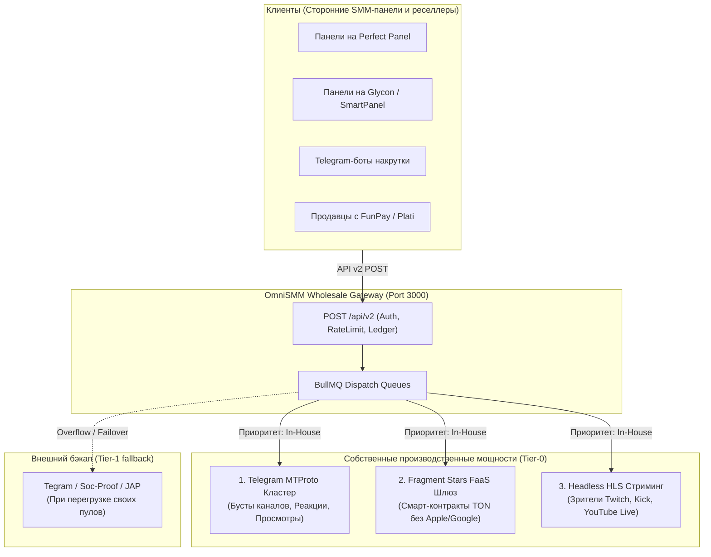

# Руководство: Как превратить OmniSMM в прямого поставщика первого эшелона (Root Provider Blueprint)

> **Статус документа:** Стратегический и технический роадмап для OmniSMM 1.0 (SMMplan / SMMflux)  
> **Версия:** 1.0 (Сентябрь 2026)  
> **Цель:** Трансформация платформы из розничной витрины/реселлера в **Оптового первоисточника (Root Provider / Wholesale SMM Gateway)**, поставляющего объемы сотням сторонних SMM-панелей по API v2.

---

## 1. Текущая инженерная готовность OmniSMM

Платформа OmniSMM уже обладает ключевым архитектурным преимуществом:
* **Полнофункциональный Reseller API v2 (`src/app/api/v2/route.ts`):**
  - Поддерживает 100% отраслевой стандарт (Perfect Panel, Glycon, SmartPanel);
  - Методы: `action=services`, `action=add`, `action=status` (одиночный и пакетный), `action=balance`, `action=refill`, `action=cancel`;
  - Встроенный Rate Limiting, защита от SSRF, аудит, строгий учет в копейках `BigInt` (ExactMath) и мульти-тенантность.
* **Что нужно для перехода в статус Root Provider:**
  - Заменить часть внешних провайдеров в бэкенде маршрутизации на **собственные аппаратные и софтверные микро-генераторы (In-House Execution Engines)**, производящие услугу с себестоимостью 0–10%.

---

## 2. Три собственных производственных цеха (In-House Production Engines)



---

### Цех 1: Собственный Telegram MTProto Кластер (Бусты, Реакции, Просмотры)

* **Что производим:**
  - Бусты каналов (Level Boost для историй);
  - Просмотры постов (мгновенные и авто-просмотры на будущие посты);
  - Кастомные реакции (эмодзи и звездные реакции).
* **Технический стек:**
  - Node.js/TypeScript библиотека `telegram` (`gramjs`) или Python `telethon`;
  - Мобильные прокси: 10 USB-модемов Huawei E3372h или приватные пулы `Proxy-Seller API`;
  - База сессий: 500–2000 прогретых аккаунтов `session+json` с отлежкой (закупка через Zelenka Market API по 15–20 ₽).
* **Себестоимость и экономика:**
  - 1 аккаунт с Telegram Premium (180 ₽) дает 4 буста. Себестоимость 1 буста на 30 дней = **45.00 ₽** (или **11.25 ₽** на 7 дней).
  - Оптовая продажа другим панелям по API v2: **25.00–35.00 ₽** за 7-дневный буст (при рыночной рознице 65–120 ₽).
  - Просмотры и реакции: себестоимость стремится к **0.00 ₽**. Продажа оптом: **0.25 ₽ / 1K просмотров**, **1.20 ₽ / 1K реакций**.
  - **Чистая маржа: от +300% до +2500%!**

---

### Цех 2: Fragment Stars & Premium FaaS Gateway (Звезды и Премиум)

* **Что производим:**
  - Пополнение баланса звезд Telegram Stars (XTR) на любой `@username`;
  - Активация подарочных подписок Telegram Premium (3 / 6 / 12 месяцев).
* **Технический стек:**
  - Горячий кошелек TON (стандарт W5 / v4R2);
  - Вызов смарт-контракта Fragment.com через модуль [`src/services/providers/deep-infrastructure-client.ts`](file:///e:/Omnismm/src/services/providers/deep-infrastructure-client.ts) с `idempotencyKey`;
  - Прямые пулы ликвидности TON, закупленные на споте бирж (OKX/Bybit) или закрытых OTC-десках создателей игр-кликеров (со скидкой 30–45%).
* **Себестоимость и экономика:**
  - Себестоимость 1 звезды: **1.15–1.35 ₽**.
  - Оптовая цена для сторонних SMM-панелей в нашем API v2: **1.55–1.70 ₽** (при рознице 2.50–3.20 ₽).
  - **Преимущество:** 100% автоматизация за 3 секунды, нулевой риск списаний, чистая прибыль 25–40 копеек с КАЖДОЙ звезды. При обороте 500 000 звезд в месяц чистая прибыль = **150 000–200 000 ₽ на полном пассиве**.

---

### Цех 3: Headless HLS Стриминг-Кластер (Twitch / Kick / YouTube Live)

* **Что производим:**
  - Стабильный онлайн зрителей на прямых трансляциях (на 60, 120, 240, 360 минут);
  - Чат-боты с реалистичными сообщениями.
* **Технический стек:**
  - Легковесный микросервис на Go/Rust (без рендеринга видеокартой);
  - Постоянный парсинг `m3u8` плейлистов и Range-запросы первых байт чанков `.ts`;
  - Удержание WebSockets пингов Twitch PubSub / Kick Pusher;
  - Пакет из 10 000 дешевых IPv6 прокси ($15/мес) + 1 VPS (2 vCPU, 4GB RAM за $15/мес).
* **Себестоимость и экономика:**
  - 100 зрителей на 1 час обходятся в **~2.50–4.00 ₽** амортизации серверов и прокси.
  - Оптовая цена в нашем API v2 для реселлеров: **120.00–160.00 ₽ за 100 чел / час**.
  - **Чистая маржинальность: +3000% – +5000%!**

---

## 3. Пошаговый план выхода на оптовый рынок (Go-to-Market)

Чтобы сотни реселлеров подключили OmniSMM к своим панелям, реализуется 4-шаговый маркетинговый пайплайн:

### Шаг 1: Интеграция в каталоги движков SMM-панелей
* **Perfect Panel Provider Directory:**
  - Perfect Panel обслуживает более 3 000 активных SMM-панелей по всему миру.
  - Подача заявки в официальный каталог провайдеров (`https://perfectpanel.com`). После верификации OmniSMM появляется в выпадающем списке провайдеров в админках тысяч панелей!
* **Glycon / SmartPanel / RentalPanel:**
  - Добавление нашего API эндпоинта в базы пресетов турецких и азиатских панелей.

### Шаг 2: Выход на зарубежный рынок (BlackHatWorld)
* **Статус Jr. VIP на BlackHatWorld (BHW):**
  - Оплата членства Jr. VIP и прохождение модерации торговой ветки в разделе *Social Media Marketplace*;
  - Тема: `[DIRECT WHOLESALE API] Telegram Boosts, Real Stars & Kick Stream Viewers | Instant API v2`;
  - Бесплатная раздача тест-балансов ($10–$25) модераторам и трастовым участникам за детальные отзывы (Review Copies);
  - Зарубежные клиенты платят в криптовалюте (USDT TRC20/TON), что обеспечивает максимальную доходность.

### Шаг 3: Захват русскоязычного оптового рынка (Zelenka / Lolzteam)
* **Депозит в Гарант-сервис:**
  - Внесение страхового депозита от 50 000 до 100 000 ₽ на форуме Zelenka Guru для получения статуса «Проверенный поставщик»;
  - Открытие коммерческой темы в разделе «SMM / Провайдеры и накрутка»;
  - Таргет на перекупов с FunPay, Plati.market, владельцев Telegram-ботов продвижения: предоставление им готового кода интеграции на Python/Node.js.

### Шаг 4: B2B Telegram-инфраструктура
* Создание публичного канала статусов шлюза (например, `@omnismm_api_status`):
  - Автоматическая публикация аптайма нод, обновлений тарифов, логов проведения акций;
  - Демонстрация стабильности SLA > 99.8%.

---

## 4. Финансовая модель и управление рисками

| Параметр | Условия B2B-провайдера |
| :--- | :--- |
| **Модель расчетов** | **100% Предоплата (Prepaid Balance)**. Никаких отсрочек и кассовых разрывов. Реселлер сначала вносит депозит, затем расходует его по API. |
| **Платежные методы** | USDT (TRC20, TON, BEP20), TON, СБП / Банковские карты РФ (54-ФЗ), Capitalist. |
| **Минимальный депозит** | От $20.00 / 2 000 ₽ для активации оптового API-ключа. |
| **Резервирование мощностей** | При исчерпании внутреннего пула сессий заказ автоматически уходит через `SmartRoutingService` на внешний Tier-1 шлюз (VexBoost, Tegram, BoostProvider). Реселлер не замечает задержки. |

---

## 5. Дорожная карта внедрения (Roadmap реализации)

```
Этап 1: Готово       Этап 2: 1-2 недели        Этап 3: 2-3 недели        Этап 4: 1 месяц
[API v2 Шлюз] ───> [Telegram MTProto] ───> [Fragment Stars] ───> [Листинг на BHW & LZT]
(Готов в OmniSMM)   (Бусты и реакции)      (Прямой TON FaaS)     (Запуск B2B продаж)
```

1. **Этап 1 (Завершено):** Платформа OmniSMM уже оснащена надежным `POST /api/v2` роутом с защитой от атак и учетом балансов.
2. **Этап 2 (Запуск собственного Telegram-пула):** Развертывание микросервиса на `gramjs` + 200 сессий для моментальной выдачи бустов и реакций.
3. **Этап 3 (Fragment FaaS):** Подключение некастодиального TON-кошелька для прямой оптовой закупки Stars без комиссий магазинов.
4. **Этап 4 (Масштабирование B2B):** Листинг на BHW, Zelenka и Perfect Panel, привлечение первых 50 оптовых партнеров.
