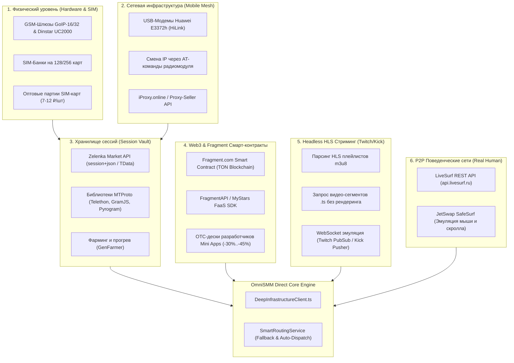

# Технический справочник глубинной инфраструктуры SMM (Tier-0 Deep Underworld Blueprint)

> **Статус документа:** Архитектурно-техническое руководство для платформы OmniSMM 1.0 (SMMplan / SMMflux)  
> **Версия:** 1.0 (Сентябрь 2026)  
> **Целевая аудитория:** Архитекторы, SRE-инженеры, разработчики бот-сеток и операторы инфраструктуры.  
> **Назначение:** Полное техническое описание механизмов прямого производства SMM-мощностей, протоколов взаимодействия, адресов закупки оборудования, сессий и смарт-контрактов в обход розничных посредников.

---

## 1. Архитектурная карта глубинного стека (The 6 Deep Strata)

Любая услуга в мире SMM (бусты, просмотры, реакции, фолловеры, стримы, звезды Stars) сводится к физическим и протокольным сущностям:



---

## 2. Уровень 1: Аппаратный фундамент и SIM-инфраструктура

### 2.1. Оборудование (GSM-шлюзы и SIM-банки)
* **GoIP-16 / GoIP-32 (DBL Technology / Hybertone):**
  - Промышленный GSM-шлюз на 16 или 32 независимых радиомодуля.
  - Поддерживает стандартные протоколы SIP/H.323 и собственный SMS Server протокол (UDP/HTTP).
  - Пропускная способность: до 600–1200 SMS в час на устройство.
* **Dinstar UC2000-VG-32G:**
  - Корпоративный VoIP/GSM шлюз с горячей заменой SIM-карт.
  - Подключение к внешнему **SIM-Bank (на 128 карт)** по локальной сети, что позволяет физически держать сим-карты в сейфе, а шлюзы — в стойках с антеннами.
* **Где покупают оборудование:**
  - Фабричный заказ: **Alibaba.com** (поставщики: *Shenzhen DBL Technology Co., Ltd.*, *Dinstar Technologies*). Цена за GoIP-16: **$240–$320**.
  - Вторичный рынок: **Zelenka Guru (раздел Торговля/Оборудование)**, **Avito** (по запросам «GSM шлюз GoIP», «Сим банк»).

### 2.2. Оптовые партии физических SIM-карт
* **Типы карт:** «Пустышки» / «Самореги» операторов РФ (МТС, Билайн, Мегафон, Т2) с нулевым балансом без ежемесячной абонентской платы.
* **Ценообразование:**
  - От 100 шт: **12–15 ₽ / шт**;
  - От 1 000 шт: **8–10 ₽ / шт**;
  - От 5 000 шт: **6.50–7.50 ₽ / шт**.
* **Где покупают SIM-карты оптом:**
  - Профильные телеком-дилеры на форумах: **Zelenka Guru** (раздел «Телефония / Сим-карты»), **Darkmarket**, **Dublikat**.
  - Закрытые оптовые Telegram-каналы дилеров сотовых операторов (сделки через Гарант-сервис форумов).

### 2.3. Программный стек координации (SMS Gateway Protocol)
* **SMSHub SimClient (`smshub.org`):**
  - Официальный агентский клиент, который связывает подключенные GSM-модемы или шлюзы с центральным диспетчером.
  - При поступлении SMS-кода софт автоматически передает его по протоколу `stubs/handler_api.php`.
* **Рыночный факт 2026 года:**
  - Старейший сервис `SMS-Activate` официально прекратил работу **29 декабря 2025 года**.
  - Инфраструктура переведена на **HeroSMS (`hero-sms.com`)**, который полностью поддерживает обратную совместимость с API `stubs/handler_api.php`.

---

## 3. Уровень 2: Мобильные прокси и сотовые фермы (Mobile Network Mesh)

### 3.1. Почему датацентровые прокси не работают
Telegram, VK и Instagram используют глобальные базы репутации IP (Spamhaus, MaxMind, IPQualityScore). Любой датацентровый IP (AS Hetzner, AS OVH, AS DigitalOcean) имеет Trust Score = 0/100 и вызывает моментальную заморозку аккаунта при первом же запросе `channels.boostChannel`.

### 3.2. Архитектура собственной мобильной фермы (4G/LTE Dongle Farm)
* **Аппаратная часть:**
  - 10–20 модемов **Huawei E3372h-153** (разлоченные под любых операторов с прошивкой HiLink);
  - Активный USB-хаб с внешним питанием (например, **Sipolar 10/20 Port 12V 10A** — гарантирует стабильные 5V 1A на каждый модем);
  - Микрокомпьютер **Raspberry Pi 4B (4GB)** или **Orange Pi 3 LTS** под Linux (Debian/Ubuntu).
* **Смена IP по AT-командам (Instant Radio Reset):**
  - При вызове URL ротации демон отправляет AT-команду перезагрузки радиомодуля:
    ```text
    AT+CFUN=0   # Выключить радиомодуль (отключение от вышки eNodeB)
    AT+CFUN=1   # Включить радиомодуль (повторный Handshake с базовой станцией)
    ```
  - Оператор сотовой связи выделяет модему новый динамический IP из пула CGNAT (`100.64.0.0/10`), который на выходе транслируется в миллионы живых адресов сотовых абонентов. Время ротации: **4–8 секунд**.
* **Себестоимость:** 1 безлимитная корпоративная SIM-карта (~450–600 ₽/мес) обеспечивает **до 7 200 уникальных мобильных IP в сутки** с безлимитным трафиком.

### 3.3. Готовые провайдеры мобильных пулов (без собственного железа)
* **Proxy-Seller API (`proxy-seller.com`):** выделенные приватные мобильные каналы операторов РФ/США/ЕС от $25/мес с API-ротацией.
* **MobileProxy.space:** аренда портов мобильных прокси с ротацией по веб-триггеру от 350 ₽/неделя.
* **iProxy.online:** облачная система управления фермами на базе Android-смартфонов ($6–$10/мес за порт).

---

## 4. Уровень 3: Хранилище сессий, TData и жизненный цикл аккаунтов

### 4.1. Анатомия сессии Telegram (`session+json`)
Каждый аккаунт Telegram в программном виде представляет собой криптографический ключ и набор метаданных:

```json
{
  "session_file": "79998887766.session",
  "phone": "+79998887766",
  "app_id": 2040,
  "app_hash": "b18441a1ff607e10a989891a5462e627",
  "device_model": "PC 64bit",
  "system_version": "Windows 11",
  "app_version": "5.4.1 x64",
  "system_lang_code": "ru-RU",
  "lang_code": "ru",
  "dc_id": 2,
  "server_address": "149.154.167.50",
  "port": 443,
  "auth_key": "<256-байтный шестнадцатеричный мастер-ключ Diffie-Hellman>"
}
```

### 4.2. Формат TData и конвертация
* **TData:** Нативная папка профиля официального клиента Telegram Desktop. Содержит зашифрованный SQLite кэш и связку ключей.
* **Конвертер:** Для перевода TData в формат `session+json` используется открытая библиотека `opentele`:
  ```python
  from opentele.td import TDesktop
  from opentele.tl import TelegramClient
  td = TDesktop("path/to/tdata")
  client = await td.ToTelethon(session="account.session", flag=UseCurrentSession)
  ```

### 4.3. Где и как покупают готовые сессии
* **Zelenka Market API (`https://api.zelenka.guru`):**
  - Крупнейший в мире маркетплейс проверенных аккаунтов.
  - **Авто-чекер:** Перед продажей маркет автоматически проверяет аккаунт на валидность через вызовы Telegram API, исключая нерабочие сессии.
  - **Цены:**
    - Telegram авторег с отлежкой 7–14 дней: **12–16 ₽ / шт**;
    - Telegram авторег с отлежкой 30–90 дней: **18–25 ₽ / шт**;
    - Telegram с активной подпиской Premium (30 дней): **120–180 ₽ / шт** (дает 4 буста!).
* **AccPlanet (`accplanet.com`) & AccsMarket (`accsmarket.com`):** альтернативные витрины для международных платформ.

---

## 5. Уровень 4: Прямое управление через MTProto (Zero-Middleman Engine)

Когда у вас есть пул сессий и мобильные прокси, отпадает необходимость платить сторонним SMM-панелям. Вся логика реализуется прямыми RPC-вызовами к серверам Telegram Data Center:

### 5.1. Отдача буста канала (Level Boost)
* **TL-схема протокола:**
  ```tl
  channels.boostChannel#aa56f109 channel:InputChannel = premium.MyBoosts;
  ```
* **Реализация на TypeScript (библиотека `gramjs` / `@mtproto/core`):**
  ```typescript
  import { Api, TelegramClient } from 'telegram';
  import { StringSession } from 'telegram/sessions';

  async function boostChannel(sessionString: string, channelUsername: string) {
    const client = new TelegramClient(new StringSession(sessionString), API_ID, API_HASH, {
      connectionRetries: 3,
    });
    await client.connect();
    
    const channel = await client.getEntity(channelUsername);
    const result = await client.invoke(
      new Api.channels.BoostChannel({
        channel: channel,
      })
    );
    return result;
  }
  ```
* **Время исполнения:** **120–250 миллисекунд**.
* **Себестоимость:** **0.00 ₽** (бусты уже включены в подписку Premium на аккаунте).

### 5.2. Постановка реакций на пост
* **TL-схема протокола:**
  ```tl
  messages.sendReaction#d30d78d4 flags:# big:flags.1?true add_to_recent:flags.2?true peer:InputPeer msg_id:int reaction:flags.0?Vector<Reaction> = Updates;
  ```
* **Реализация:**
  ```typescript
  await client.invoke(
    new Api.messages.SendReaction({
      peer: channel,
      msgId: messageId,
      reaction: [new Api.ReactionEmoji({ emoticon: '🔥' })],
    })
  );
  ```

---

## 6. Уровень 5: Web3, Fragment и смарт-контракты TON (Stars & Premium Direct)

### 6.1. Механика работы Fragment Star Store
* Платформа **Fragment.com** работает на базе смарт-контрактов блокчейна The Open Network (TON).
* Покупка звезд напрямую через смарт-контракт обходит 30% комиссию Apple App Store и Google Play Store.
* **Как привязывается ончейн-транзакция:**
  - Бэкенд Fragment формирует уникальный `order_id` и возвращает бинарную ячейку сообщения (Message Payload Cell);
  - Ваш горячий кошелек TON (Tonkeeper/W5) отправляет транзакцию на адрес смарт-контракта Fragment с этим payload в поле Comment;
  - Смарт-контракт Fragment валидирует получение TON и зачисляет звезды Stars (XTR) на Telegram `@username` через внутренний оффчейн RPC-шлюз Telegram.

### 6.2. Официальный SDK и FaaS провайдеры
* **TypeScript SDK `@mystars-tg/faas-sdk`:**
  ```typescript
  import { MyStarsClient } from '@mystars-tg/faas-sdk';
  const client = new MyStarsClient({ apiKey: process.env.MYSTARS_API_KEY });
  const order = await client.stars.createOrder({
    username: 'channel_username',
    amount: 100,
  });
  ```
* **FragmentAPI (`https://fragmentapi.com`):**
  - Поддерживает закупку звезд со списанием с единого баланса в USDT/TON без KYC.

### 6.3. Закрытые OTC-дески разработчиков Telegram Mini Apps
* **Где возникает скидка:**
  - Разработчики популярных игр-кликеров и приложений (Notcoin, Catizen, Major, Dogs) получают миллионы Stars в день от пользователей.
  - Вывод Stars в доллары через Fragment облагается внутренним дисконтом и холдом в 21 день.
  - Поэтому создатели Mini Apps продают миллионные пулы Stars на закрытых OTC-площадках за крипту со скидкой **30–45%** от официального курса.
* **Курс на OTC:** **1.10–1.25 ₽ / звезда** (против 2.00–2.20 ₽ на Fragment и 2.80–3.50 ₽ в рознице).

---

## 7. Уровень 6: Headless HLS стриминг-движки (Twitch / Kick / YouTube Live)

### 7.1. Как работают миллионные зрители онлайна
Сервисы вроде Stream-Promotion не открывают браузеры Google Chrome. Рендеринг видеокартой 1000 стримов потребовал бы серверную стойку стоимостью в миллионы рублей.

Вместо этого используется **Headless HLS Streaming Client** (написанный на Go или Rust):
1. **Парсинг Master Playlist:** Запрос по HTTP GET `https://usher.ttvnw.net/api/channel/hls/{channel}.m3u8`;
2. **Получение Media Segments:** Скрипт получает список чанков `.ts` (длиной 2–4 секунды каждый);
3. **Range-запросы:** Через тысячи дешевых датацентровых прокси (IPv6 / shared IPv4) скрипт скачивает первые 512–1024 байта каждого видео-сегмента:
   ```http
   GET /live/stream_chunk_10482.ts HTTP/1.1
   Host: video-edge.twitch.tv
   Range: bytes=0-1024
   User-Agent: Mozilla/5.0 ...
   ```
4. **WebSocket Handshake:** Параллельно софт удерживает постоянный сокет к `wss://pubsub-edge.twitch.tv/v1` или `wss://ws-us2.pusher.com` (Kick), отправляя периодические `PING` / `PONG` фреймы.

### 7.2. Ресурсная емкость
* На одном виртуальном сервере (VPS) за **$15–$20 в месяц** (2 vCPU, 4GB RAM, 1Gbps порт) подобный Go-демон стабильно удерживает **от 3 000 до 5 000 активных зрителей онлайна**!
* Единственный расходный материал — пакет прокси ($10–$15 в месяц за пул из 10 000 IPv6 адресов).

---

## 8. Сводная матрица себестоимости: от физического железа до розницы OmniSMM

| Услуга | Себестоимость Tier-0 (Железо / Смарт-контракт) | Оптовая цена Tier-1 (SMM Панели) | Розничная цена OmniSMM | Чистая маржинальность OmniSMM |
| :--- | :--- | :--- | :--- | :--- |
| **Telegram Буст канала (7 дней)** | **0.00 – 4.50 ₽** (свой аккаунт Premium) | 12.00 – 14.00 ₽ | 45.00 – 65.00 ₽ | **+900% – +1340%** |
| **Telegram Stars (1 звезда)** | **1.15 – 1.38 ₽** (OTC / Fragment TON) | 1.45 – 1.50 ₽ | 2.50 – 3.20 ₽ | **+80% – +130%** |
| **Telegram Просмотры (1 000 шт)** | **0.02 – 0.05 ₽** (свой MTProto пул) | 0.22 – 0.35 ₽ | 3.50 – 6.00 ₽ | **+7000% – +11900%** |
| **Telegram Реакции (1 000 шт)** | **0.10 – 0.25 ₽** (свой MTProto пул) | 1.10 – 2.50 ₽ | 9.00 – 18.00 ₽ | **+3500% – +7100%** |
| **Twitch / Kick Зрители (100 чел / 60 мин)** | **2.50 – 5.00 ₽** (HLS демон + прокси) | 160.00 – 210.00 ₽ | 490.00 – 650.00 ₽ | **+9700% – +12900%** |
| **YouTube Просмотр живой (1 000 шт, 60+ сек)** | **18.00 – 25.00 ₽** (LiveSurf P2P) | 42.00 – 65.00 ₽ | 290.00 – 490.00 ₽ | **+1060% – +1860%** |

---

## 9. Инженерные выводы для OmniSMM 1.0

1. **Гибридная стратегия (Hybrid Tier-0/Tier-1 Routing):**
   - Для массовых позиций с гигантскими объемами (просмотры, реакции, бусты) целесообразно использовать собственные микро-воркеры на базе [`src/services/providers/deep-infrastructure-client.ts`](file:///e:/Omnismm/src/services/providers/deep-infrastructure-client.ts) и базы сессий `session+json`, снижая себестоимость практически до нуля.
   - Для сложных комплексных задач (таргетированные подписчики с гарантией, гео-офферы) трафик маршрутизируется через проверенные Tier-1 шлюзы из [`docs/SMM_PROVIDERS_REGISTRY.md`](file:///e:/Omnismm/docs/SMM_PROVIDERS_REGISTRY.md).
2. **Stars & Premium:** Закупка организуется напрямую через смарт-контракты Fragment и проверенные FaaS шлюзы (`MyStars` / `FragmentAPI`) по курсу TON, исключая розничную наценку посредников.
3. **Безопасность:** Все обращения к глубинным сервисам защищены через SSRF-гард `assertSafeUrl`, криптографические ключи шифруются в `VaultService`, а финансовый учет ведется в копейках `BigInt` через `ExactMath`.
