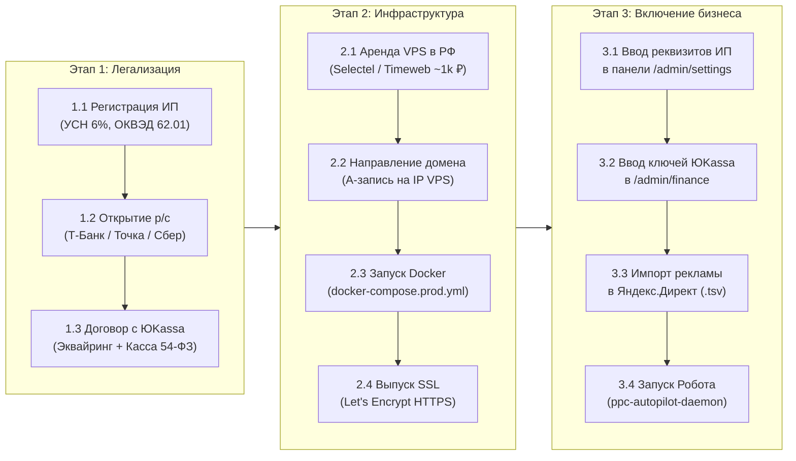

# 🚀 SMMplan & OmniSMM 1.0 — Инструкция по запуску в Продакшн (Deployment Runbook)

> **Статус документа:** PRODUCTION READINESS COMPLETE (Ключ на старт)  
> **Целевая аудитория:** Владелец платформы, технический администратор.  
> **Цель:** Пошаговый запуск проекта «с нуля» в день получения документов ИП и аренды сервера без технических сложностей.

---

## 🧭 Карта запуска: 3 ключевых этапа



---

## Этап 1. Юридическая часть (Регистрация ИП и банк)

### 1.1. Выбор налогообложения и ОКВЭД
Для работы SMM-панели и IT-платформы в РФ наиболее выгодна и безопасна следующая конфигурация:
- **Система налогообложения:** **УСН 6% («Доходы»)**.  
  *Почему:* Нет необходимости собирать чеки и доказывать налоговой расходы на зарубежные сервера или провайдеров. Вы просто платите 6% с фактически поступивших на расчетный счет денег (а страховые взносы за себя на 100% уменьшают этот налог).
- **Коды ОКВЭД:**
  * **Основной:** `62.01` — Разработка компьютерного программного обеспечения;
  * **Дополнительные:**
    * `63.11` — Деятельность по обработке данных, предоставление услуг по размещению информации;
    * `63.11.1` — Деятельность по созданию и использованию баз данных и информационных ресурсов;
    * `73.11` — Деятельность рекламных агентств;
    * `62.09` — Деятельность, связанная с использованием вычислительной техники и информационных технологий.

### 1.2. Бесплатное открытие ИП и счета
Рекомендуется открывать ИП дистанционно через банк (без уплаты госпошлины 800 ₽ и без посещения налоговой):
- **Рекомендуемые банки:** **Т-Банк (Тинькофф)**, **Точка**, **Сбербанк**, **Альфа-Банк**.
- **Срок регистрации:** 3–5 рабочих дней. Налоговая пришлет выписку из ЕГРИП с вашим **ИНН** (12 цифр) и **ОГРНИП** (15 цифр).
- **Встроенная онлайн-бухгалтерия:** в этих банках есть бесплатная бухгалтерия для ИП на УСН 6%, которая сама рассчитывает налоги и формирует платежки.

---

## Этап 2. Аренда сервера и настройка домена

### 2.1. Выбор VPS в РФ (Selectel / Timeweb / Beget)
Сервер обязательно должен находиться в РФ (требование 152-ФЗ о локализации персональных данных и гарантия от блокировок РКН/ТСПУ).

* **Рекомендуемые провайдеры:**
  * [Timeweb Cloud](https://timeweb.cloud) — дата-центр Санкт-Петербург или Москва;
  * [Selectel](https://selectel.ru) — дата-центр Москва (Берзарина);
  * [Beget](https://beget.com) — дата-центр Санкт-Петербург.
* **Рекомендуемая конфигурация VPS:**
  * **Процессор:** 2 vCPU;
  * **Оперативная память:** 4 GB RAM;
  * **Диск:** 40–50 GB NVMe;
  * **Операционная система:** **Ubuntu 24.04 LTS** (или 22.04 LTS);
  * **Стоимость:** ~900–1 300 ₽ в месяц.

### 2.2. Привязка домена (DNS)
В панели управления регистратора вашего домена (где куплен `smmplan.pro`):
1. Откройте раздел **DNS-записи** (Управление зоной DNS).
2. Создайте / отредактируйте две записи:
   * **Тип:** `A` | **Имя/Хост:** `@` | **Значение:** `[IP_АДРЕС_ВАШЕГО_СЕРВЕРА]` | **TTL:** 300
   * **Тип:** `A` | **Имя/Хост:** `www` | **Значение:** `[IP_АДРЕС_ВАШЕГО_СЕРВЕРА]` | **TTL:** 300
3. *(Для почты)*: Добавьте MX-запись Яндекс 360 (`mx.yandex.net`), чтобы принимать почту на `support@smmplan.pro`.

---

## Этап 3. Развертывание платформы на сервере (30 минут)

Подключитесь к серверу по SSH (через терминал / PuTTY):
```bash
ssh root@IP_АДРЕС_СЕРВЕРА
```

### 3.1. Установка Docker и Docker Compose (1 команда)
```bash
apt update && apt install -y curl git
curl -fsSL https://get.docker.com -o get-docker.sh && sh get-docker.sh
```

### 3.2. Клонирование репозитория и настройка .env
```bash
# Клонируем проект
git clone https://github.com/ВАШ_РЕПОЗИТОРИЙ/omnismmcore.git /opt/smmplan
cd /opt/smmplan

# Копируем шаблон боевого окружения
cp .env.docker.prod.utf8 .env.production
```

Откройте `.env.production` через `nano .env.production` и укажите боевые пароли:
* `POSTGRES_PASSWORD=ПридумайтеНадежныйПарольБД`
* `REDIS_PASSWORD=ПридумайтеНадежныйПарольRedis`
* `APP_ENCRYPTION_KEY=Сгенерированный64ЗначащийHexКлюч`
* `NEXTAUTH_SECRET=СгенерированныйHexКлюч`

### 3.3. Первый запуск Docker контейнеров
```bash
docker compose -f docker-compose.prod.yml up -d --build
```
Docker автоматически поднимет:
1. `smmplan_db` (PostgreSQL 15 с авто-миграциями);
2. `smmplan_redis` (Redis 7 с защитой паролем);
3. `smmplan_app` (Next.js 16 Web-приложение на порту 3000);
4. `smmplan_worker` (Фоновый BullMQ обработчик заказов);
5. `smmplan_bot` (Telegram бот платформы);
6. `smmplan_nginx` (Веб-сервер с защитой Rate-Limit).

### 3.4. Выпуск бесплатного SSL-сертификата (HTTPS Let's Encrypt)
```bash
docker compose -f docker-compose.prod.yml run --rm certbot certonly \
  --webroot --webroot-path /var/www/certbot \
  -d smmplan.pro -d www.smmplan.pro \
  --email support@smmplan.pro --agree-tos --no-eff-email
```
После выпуска перезапустите Nginx:
```bash
docker compose -f docker-compose.prod.yml restart nginx
```
🎉 **Сайт https://smmplan.pro официально открывается с зеленым замочком SSL!**

---

## Этап 4. Ввод реквизитов ИП в админ-панели (2 минуты)

1. Зайдите на сайт под аккаунтом администратора: `https://smmplan.pro/login`.
2. Перейдите в раздел **Панель управления -> Настройки**:  
   `https://smmplan.pro/admin/settings?tab=general`.
3. В блоке **«Контакты & Юридические реквизиты (152-ФЗ)»** введите данные вашего открытого ИП:
   * **Название организации:** `Индивидуальный предприниматель Иванов Иван Иванович`
   * **ИНН:** `123456789012` (ваш ИНН ИП из выписки ЕГРИП)
   * **ОГРНИП:** `326774600123456` (ваш ОГРНИП)
   * **Email поддержки:** `support@smmplan.pro`
   * **Схема УСН:** `УСН «Доходы» (6%)`
4. Нажмите кнопку **«Сохранить настройки»**.

> 💡 **Что произойдет автоматически:**  
> Система мгновенно подставит ваши официальные реквизиты в:
> - Публичную оферту: `/legal/terms` (и `/terms`);
> - Политику конфиденциальности: `/legal/privacy` (и `/privacy`);
> - Политику возвратов: `/legal/refund` (и `/refund`);
> - Подвал сайта (Футер).

---

## Этап 5. Подключение платежей (ЮKassa / СБП / 54-ФЗ)

1. В личном кабинете [ЮKassa для бизнеса](https://yookassa.ru) подпишите договор на ИП.
2. Подключите **«Автоматическую фискализацию»** (ЮKassa формирует онлайн-чеки 54-ФЗ в налоговую за вас).
3. В разделе «Интеграция -> Ключи API» скопируйте:
   * **Shop ID** (Идентификатор магазина);
   * **Секретный ключ** (начинается на `live_...`).
4. В админ-панели SMMplan откройте: `https://smmplan.pro/admin/settings?tab=integrations` и вставьте ключи.
5. Нажмите «Проверить соединение» -> Статус сменится на **«Подключено (Live)»**.
6. Клиенты могут пополнять баланс банковскими картами МИР/Visa/Mastercard и через **СБП (Систему быстрых платежей)**.

---

## Этап 6. Запуск рекламы в Яндекс.Директ и включение Робота

Всё уже рассчитано и сгенерировано в файле `yandex_direct_smmplan_import.tsv`!

### 6.1. Загрузка в Директ (5 минут)
1. Откройте [Яндекс.Директ](https://direct.yandex.ru) (аккаунт `infosokoloff`).
2. Нажмите **«Кампании» -> «Добавить» -> «Загрузка из файла»** (или через бесплатную программу *Директ Коммандер*).
3. Выберите файл **`yandex_direct_smmplan_import.tsv`** из папки проекта.
4. Яндекс автоматически создаст 4 кампании:
   * ✈️ **Telegram Core Search** (Ставка 36.50 ₽);
   * 🌐 **VK Communities Search** (Ставка 31.00 ₽);
   * 🎯 **Competitors Intercept** (Ставка 48.00 ₽);
   * ⚡ **MAX Messenger Search** (Ставка 22.00 ₽).
5. Пополните счет на пилотную неделю (28 000 ₽ / или от 10 000 ₽) и нажмите **«Отправить на модерацию»**.

### 6.2. Включение автономного робота-оптимизатора (PPC Autopilot)
Чтобы робот каждую ночь анализировал Метрику, минусовал нецелевые фразы и защищал баланс:
На сервере добавьте вызов в планировщик задач `crontab -e`:
```bash
# Ежедневный запуск автопилота Директа в 02:30 ночи МСК
30 2 * * * cd /opt/smmplan && docker compose -f docker-compose.prod.yml exec -T app npx tsx scripts/ppc-autopilot-daemon.ts >> /var/log/ppc-agent.log 2>&1
```

---

## 📋 Финальный чеклист готовности к запуску

| № | Действие | Статус готовности |
| :-: | :--- | :-: |
| 1 | Маркетинговые файлы для Директа (`.tsv`, `.xlsx`) | ✅ **Готовы на 100%** |
| 2 | Автономный агент оптимизации и защиты от скликивания | ✅ **Готов и протестирован** |
| 3 | Юридические документы (152-ФЗ, 54-ФЗ, ЗоЗПП, Оферта) | ✅ **Внедрены в кодовую базу** |
| 4 | Настройка автоматических редиректов `/terms`, `/privacy`, `/refund` | ✅ **Внедрена в Next.js** |
| 5 | Docker-компоновка (Web, Worker, Bot, Postgres, Redis, Nginx) | ✅ **Готова к развертыванию** |
| 6 | Регистрация ИП в банке (УСН 6%, ОКВЭД 62.01) | ⏳ *Ожидает вашего решения* |
| 7 | Аренда VPS в РФ (Selectel / Timeweb) и привязка DNS | ⏳ *Ожидает вашего решения* |
| 8 | Получение боевого ключа ЮKassa для ИП | ⏳ *Ожидает регистрации ИП* |

---

*Документ сохранен в репозитории: [`docs/DEPLOYMENT_RUNBOOK.md`](file:///e:/omnismmcore/docs/DEPLOYMENT_RUNBOOK.md)*
