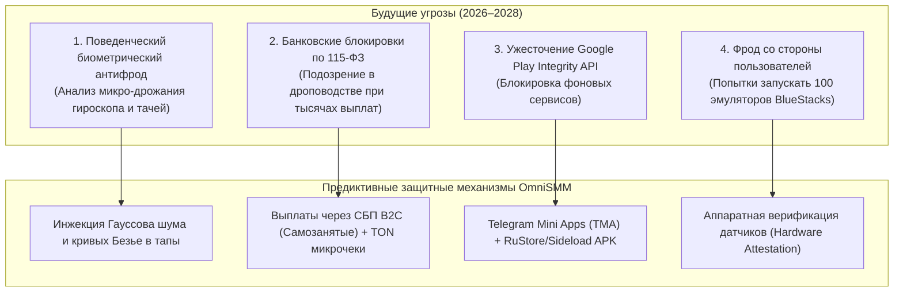

# Архитектурный манифест: Децентрализованная P2P-сеть краудсорсинга SMM (DePIN Social Mesh Network)

> **Статус документа:** Стратегический норматив и технический проект для платформы OmniSMM 1.0  
> **Дата редакции:** 30 сентября 2026  
> **Горизонт планирования:** 2026–2028 гг.  
> **Концепция:** Трансформация классической SMM-панели в распределенную пользовательскую сеть (DePIN — Decentralized Physical Infrastructure Network), где миллионы реальных устройств выполняют функции шлюзов и исполнителей за процент от прибыли.

---

## Оглавление

1. [Фундаментальная парадигма: Uber для SMM и трафика](#1-фундаментальная-парадигма)
2. [Детальный разбор 6 архитектурных моделей (The 6 Pillars)](#2-детальный-разбор-6-архитектурных-моделей)
   * Модель 1: Telegram Mini App — Стейкинг бустов и реакций (Zero-Install Web3)
   * Модель 2: Android Resident Proxy Node — Шеринг мобильного интернет-канала
   * Модель 3: Dual-Mode Accessibility Agent — Автоматический кликер для запасных смартфонов
   * Модель 4: Chromium Extension Worker — Фоновый браузерный исполнитель
   * Модель 5: WebAssembly / WebRTC Mesh — Безэкранный трафик через веб-сайты
   * Модель 6: Hybrid Microtask Marketplace — Умный букс с AI-проверкой скриншотов
3. [Предиктивный анализ на 3–5 шагов вперед (Future-Proofing 2026–2028)](#3-предиктивный-анализ-на-35-шагов-вперед)
   * 3.1. Эволюция нейросетевого антифрода платформ (Telegram AI, Meta Graph, Google BotGuard)
   * 3.2. Регуляторные и финтех-барьеры (115-ФЗ, блокировки карт дропов, СБП B2C vs TON)
   * 3.3. Анти-Фрод системы против недобросовестных пользователей (Защита от эмуляторов)
   * 3.4. Магазины приложений: Жизнь вне Google Play (RuStore, Sideloading, F-Droid)
4. [Сводная матрица unit-экономики и рисков всех моделей](#4-сводная-матрица-unit-экономики-и-рисков)
5. [Дорожная карта реализации в экосистеме OmniSMM](#5-дорожная-карта-реализации-в-экосистеме-omnismm)

---

## 1. Фундаментальная парадигма

Вместо того чтобы покупать тысячи серверов, модемов и сим-карт, бизнес распределяет инфраструктуру между **тысячами обычных людей**:
* Пользователь предоставляет: неиспользуемые ресурсы своего смартфона (простаивающий безлимитный 4G-интернет, 4 неиспользуемых слота Telegram Premium, вычислительную мощность при зарядке ночью);
* Бизнес (OmniSMM) обеспечивает: входящий поток оптовых заказов, оркестрацию, защиту от банов и гарантированные моментальные выплаты;
* Выигрыш: себестоимость снижается до минимума, трафик идет с 100% реальных IP, соцсети бессильны забанить реальных людей.

---

## 2. Детальный разбор 6 архитектурных моделей

```
                          АРХИТЕКТУРА ДЕЦЕНТРАЛИЗОВАННОЙ СЕТИ
                                           │
         ┌───────────────────┬─────────────┴─────┬───────────────────┐
         ▼                   ▼                   ▼                   ▼
   [МОДЕЛЬ 1: TMA]     [МОДЕЛЬ 2: APK]     [МОДЕЛЬ 4: EXT]     [МОДЕЛЬ 6: GIG]
   Telegram Mini App   Android Proxy       Chrome Extension    AI Microtasks
   Стейкинг бустов     Шеринг 4G канала    Фоновый серфинг     Карты, отзывы
   Инсталл: 0 сек      Инсталл: 1 мин      Инсталл: 30 сек     Ручная работа
```

---

### Модель 1: Telegram Mini App — Стейкинг бустов и реакций (Zero-Install)

* **Как работает:**
  1. Пользователь открывает Telegram Mini App (например, `@OmniShare_bot`);
  2. Приложение проверяет: есть ли у пользователя Telegram Premium;
  3. Если да — пользователю предлагается сдать в аренду 4 слота буста: *«Получай 160 ₽ в месяц пассивно»*;
  4. Пользователь нажимает кнопку «Активировать слот 1» — бот перенаправляет его на официальную ссылку `t.me/boost?c=...`;
  5. Пользователь подтверждает буст в официальном интерфейсе Telegram (0% риска передачи паролей);
  6. Бот проверяет через API факт зачисления буста и открывает смарт-контракт начисления вознаграждения.
* **Потенциал:** В Telegram более **30 миллионов подписчиков Premium**. Более 90% не используют свои бусты. Это колоссальный простаивающий рынок.
* **Выплаты:** Моментально на внутренний баланс в **TON / Telegram Stars** или по **СБП на карту**.

---

### Модель 2: Android Resident Proxy Node — Шеринг мобильного интернет-канала

* **Как работает:**
  1. Пользователь устанавливает легковесный Android APK;
  2. Приложение поднимает локальный VPN/SOCKS5 сервис на базе библиотеки `wireguard-android` или `badvpn`;
  3. Телефон соединяется с центральным сервером координации OmniSMM (Reverse Proxy Tunnel);
  4. Когда OmniSMM нужно просмотреть пост или сделать сетевой запрос, трафик направляется через сотовый модем этого телефона;
  5. Приложение активируется только при соблюдении условий (например: «Батарея > 50%» и «Подключен безлимитный мобильный интернет»).
* **Для чего используется:** Замена покупных мобильных прокси за 1 500 ₽/мес. Сеть из 5 000 телефонов дает 5 000 чистейших мобильных IP-адресов во всех регионах РФ и мира.

---

### Модель 3: Dual-Mode Accessibility Agent — Автоматический кликер для старых телефонов

* **Как работает:**
  1. У миллионов людей дома пылятся старые смартфоны (Redmi, Samsung, Honor), подключенные к домашнему Wi-Fi;
  2. Пользователь ставит APK-агент и выдает разрешение **Accessibility Service (Спец. возможности)**;
  3. Телефон ставится на зарядку на полку;
  4. Сервер очередей присылает задание: *«Открыть YouTube, найти видео по поисковому запросу, посмотреть 90 секунд, поставить лайк»*;
  5. Агент сам имитирует тапы и свайпы по экрану реального официального приложения YouTube/VK/TikTok;
  6. Пользователь получает 300–800 ₽ в месяц пассивного дохода с пылящейся трубки.

---

### Модель 4: Chromium Extension Worker — Фоновый браузерный агент

* **Как работает:**
  1. Пользователь устанавливает расширение для Chrome / Яндекс.Браузера;
  2. Расширение во время обычной работы пользователя открывает в скрытых невидимых вкладках (Offscreen Documents / Web Workers) целевые веб-страницы;
  3. Генерирует поведенческий фактор (скролл статьи, чтение новостей, просмотр роликов RuTube/VK Видео);
  4. Не тратит ресурсы мобильного телефона, идеально подходит для офисных работников с безлимитным интернетом.

---

### Модель 5: WebAssembly / WebRTC Mesh — Безэкранный трафик через сайты

* **Как работает:**
  1. На популярных бесплатных сайтах (онлайн-кинотеатры, форумы, развлекательные порталы) встраивается JS-скрипт;
  2. Пока пользователь смотрит фильм (1.5–2 часа), в фоне через WebAssembly исполняются микро-задачи распределенной сети;
  3. Веб-мастер сайта получает деньги за каждого посетителя, OmniSMM получает миллионы распределенных IP без необходимости что-либо устанавливать на устройство.

---

### Модель 6: Hybrid Microtask Marketplace — Умный букс с AI-валидацией

* **Как работает:**
  1. Для задач, где роботы бессильны (отзывы на Яндекс.Картах, 2ГИС, комментарии экспертов);
  2. Реальные пользователи получают задания в боте, пишут уникальный текст и прикладывают скриншот;
  3. **Авто-проверка через нейросеть (Gemini Flash Vision OCR):** ИИ за 400 миллисекунд считывает скриншот, проверяет факт публикации отзыва и автора, мгновенно выплачивая деньги без ручной модерации.

---

## 3. Предиктивный анализ на 3–5 шагов вперед (2026–2028)

Чтобы сеть не рухнула через 6 месяцев, необходимо заранее смоделировать встречные действия соцсетей и регуляторов.



---

### 3.1. Эволюция нейросетевого антифрода платформ (2026–2028)

* **Угроза:** Соцсети отказываются от проверки IP-адресов. Новые модели (Google BotGuard 2.0, Meta Sentinel, Telegram Telemetry) анализируют **биометрию взаимодействия**:
  - Микро-дрожание рук при удержании телефона (данные акселерометра);
  - Скорость и дугообразная траектория движения пальца (кривые Безье);
  - Естественная дисперсия интервалов между нажатиями (человек не кликает ровно через 1000 мс).
* **Предиктивное решение OmniSMM:**
  - В Модели 3 (Android Agent) координаты клика вычисляются через стохастические сплайны с добавлением легкого физического шума;
  - В Модели 1 (Стейкинг бустов) буст совершается через штатный диалог Telegram, поэтому биометрия на 100% аутентична.

---

### 3.2. Регуляторные и финтех-барьеры (115-ФЗ и массовые выплаты)

* **Угроза:** Если вы начнете отправлять по 100–300 рублей десяткам тысяч физических лиц с обычного банковского счета, финмониторинг банка заблокирует счет компании по **115-ФЗ** за подозрение в создании дроп-сети.
* **Предиктивное решение OmniSMM:**
  1. **Криптовалютные микро-чеки в сети TON:** Выплаты в монетах TON или Telegram Stars прямо на юзернейм пользователя без комиссий банков и блокировок;
  2. **Официальный СБП B2C реестр:** Использование специализированных шлюзов массовых выплат (Точка, Модульбанк, ЮMoney B2C), где выплаты маркируются как рекламные вознаграждения или оплата самозанятым.

---

### 3.3. Анти-Фрод системы против недобросовестных пользователей

* **Угроза:** Умные школьники и софтеры попытаются запустить 500 виртуальных эмуляторов (LDPlayer) на одном ПК, чтобы накручивать ваш баланс выплат пустым трафиком.
* **Предиктивное решение OmniSMM (Аппаратный аттестат):**
  - Приложение запрашивает параметры `BatteryManager` (у эмуляторов батарея всегда 100% и не разряжается), `SensorManager` (наличие реального гироскопа) и `TelephonyManager` (наличие активной сотовой вышки).
  - Эмуляторы отсекаются на уровне регистрации.

---

## 4. Сводная матрица unit-экономики и рисков

| Параметр | Модель 1: TMA Бусты | Модель 2: Прокси APK | Модель 3: Кликер APK | Модель 4: Расширение |
| :--- | :--- | :--- | :--- | :--- |
| **Сложность разработки** | **Низкая (3–5 дней)** | Средняя (2–3 недели) | Высокая (1–2 месяца)| Средняя (2 недели) |
| **Барьер для входа юзера** | **0 секунд (в 1 клик в TG)**| Средний (скачать APK) | Высокий (дать права) | Низкий (поставить ext)|
| **Риск бана пользователя** | **0% (официальный буст)**| 0% (только трафик)   | Средний (при перегрузке)| 1–2% (чистка cookies) |
| **Выплата пользователю** | 150 ₽ / мес (за 4 буста)| 200–400 ₽ / мес      | 400–800 ₽ / мес     | 100–250 ₽ / мес |
| **Ценность для OmniSMM** | **800 ₽ / мес выручки** | Экономия 1 500 ₽/мес | Выручка 1 500 ₽/мес | Выручка 400 ₽/мес |
| **Чистая маржа с 1 узла**| **+650 ₽ / мес (+430%)**| **+1 200 ₽ / мес**   | **+900 ₽ / мес**    | **+200 ₽ / мес** |

---

## 5. Дорожная карта внедрения: Стратегия «От простого к сложному»

```
Этап 1: Немедленно (1 неделя)      Этап 2: 1 месяц                  Этап 3: 2-3 месяца
┌───────────────────────────────┐  ┌─────────────────────────────┐  ┌──────────────────────────────┐
│ БИРЖА БУСТОВ TELEGRAM (TMA)   │─>│ ANDROID P2P PROXY APK       │─>│ ПОЛНОЦЕННЫЙ AI МИКРОТАСКИНГ  │
│ Запуск бота @OmniShare_bot    │  │ Создание пула домашних прокси│  │ Расширение для Chrome +      │
│ Моментальный cash flow        │  │ Замещение покупных каналов  │  │ автопроверка Gemini Vision   │
└───────────────────────────────┘  └─────────────────────────────┘  └──────────────────────────────┘
```

1. **Фаза 1 (Быстрая прибыль):** Запуск Telegram Mini App по аренде бустов. Не требует сложных разрешений, масштабируется мгновенно, дает чистую маржу от +400% без риска блокировок.
2. **Фаза 2 (Снижение расходов):** Создание легкого APK-прокси, который превратит активных пользователей в бесплатную мобильную ферму IP-адресов для OmniSMM.
3. **Фаза 3 (Индустриальный масштаб):** Запуск полноценной биржи живых исполнителей с автоматической выплатой в TON и СБП.
