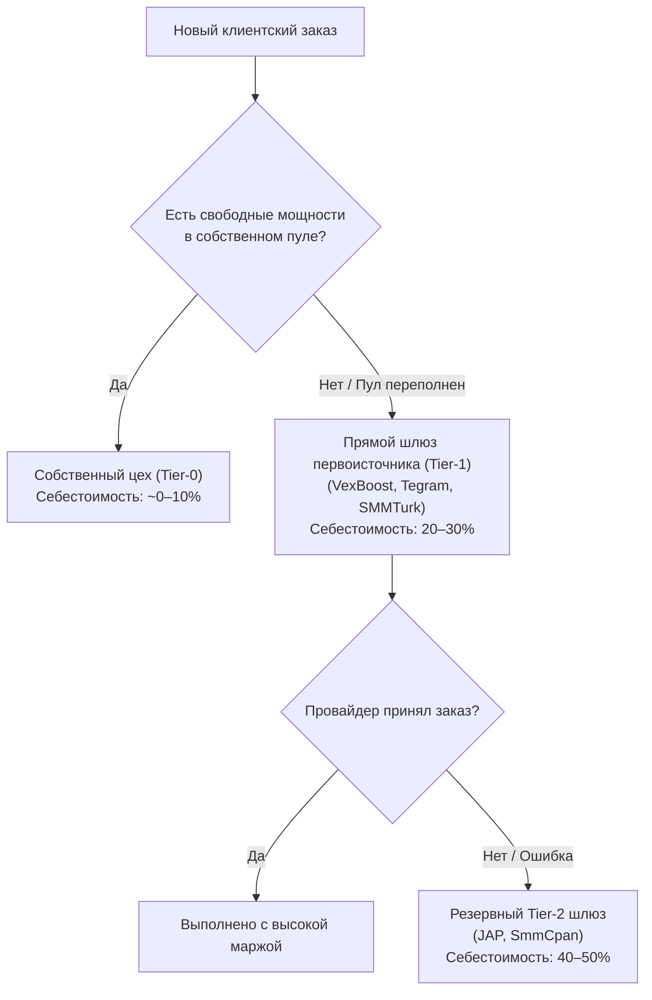

# Манифест радикального снижения себестоимости SMM-панели (Zero-Cost / Margin Maximization Blueprint)

> **Статус документа:** Финансово-инженерный норматив для OmniSMM 1.0 (SMMplan / SMMflux)  
> **Дата редакции:** 30 сентября 2026  
> **Цель:** Снижение операционных и закупочных расходов платформы до минимально возможного физического предела, ликвидация 7 каналов утечки маржи и выход на чистую рентабельность **+300% – +1200%**.

---

## Оглавление

1. [Анатомия маржинальности: Куда утекают 70–85% прибыли обычных панелей](#1-анатомия-маржинальности-куда-утекают-7085-прибыли)
2. [Ликвидация 7 каналов скрытых потерь (The 7 Profit Killers)](#2-ликвидация-7-каналов-скрытых-потерь)
   * 2.1. Утечка №1: Посредническая реселлерская цепочка (Переплата +150–400%)
   * 2.2. Утечка №2: Прокси-трафик и загрузка медиа (Слив бюджетов на гигабайты)
   * 2.3. Утечка №3: Эквайринг, High-Risk комиссии и чарджбеки (Потеря 8–18%)
   * 2.4. Утечка №4: Преждевременная смертность аккаунтов (Account Burn Rate)
   * 2.5. Утечка №5: Списания соцсетей и убыточные гарантии (Drop & Refill Bleed)
   * 2.6. Утечка №6: Холостой сетевой опрос статусов (Sync Overhead & Rate Limits)
   * 2.7. Утечка №7: Валютные курсовые разницы (FX Slippage)
3. [Матрица минимальной физической себестоимости по ключевым услугам](#3-матрица-минимальной-физической-себестоимости)
4. [Инженерные механики максимизации маржи в коде OmniSMM](#4-инженерные-механики-максимизации-маржи-в-коде-omnismm)
   * 4.1. Каскадная гибридная маршрутизация (Cascading Hybrid Routing)
   * 4.2. Экономия 98% прокси-трафика через HTTP Range Trimming
   * 4.3. Рециклинг сессий (Multi-Action Warming & Lifetime Extension)
   * 4.4. Арбитраж OTC-ликвидности Telegram Stars
5. [Пошаговый план внедрения финансовой оптимизации](#5-пошаговый-план-внедрения-финансовой-оптимизации)

---

## 1. Анатомия маржинальности: Куда утекают 70–85% прибыли

Большинство владельцев SMM-панелей видят формулу своего бизнеса упрощенно:  
$$\text{Прибыль} = \text{Цена продажи} - \text{Цена у провайдера}$$

В реальности в традиционной модели посредничества структура каждого заработанного рубля выглядит катастрофично:

```
ТИПИЧНАЯ РАСХОДНАЯ СТРУКТУРА ОБЫЧНОЙ ПАНЕЛИ (100 ₽ ВЫРУЧКИ):
┌───────────────────────────────────────┬────────┬─────────────────────────────┐
│ Статья расходов                       │ Сумма  │ Причина потерь              │
├───────────────────────────────────────┼────────┼─────────────────────────────┤
│ Закупка у поставщика 3-4 уровня       │ 45.00 ₽│ Переплата перекупщикам      │
│ Эквайринг и High-Risk шлюзы           │  9.50 ₽│ Серые комиссии банков       │
│ Потери на списаниях (Refill за свой счет)│ 16.00 ₽│ Провайдер отказал в манибеке│
│ Трафик мобильных/резидентных прокси   │  7.50 ₽│ Неоптимальные боты          │
│ Расходы на баны сырых авторегов       │  6.00 ₽│ Отсутствие прогрева сессий  │
│ Валютная конвертация и спреды банков  │  3.50 ₽│ Скачки курсов USD/USDT/RUB  │
├───────────────────────────────────────┼────────┼─────────────────────────────┤
│ РЕАЛЬНАЯ ЧИСТАЯ ПРИБЫЛЬ               │ 12.50 ₽│ ВСЕГО 12.5% ЧИСТОЙ МАРЖИ!   │
└───────────────────────────────────────┴────────┴─────────────────────────────┘
```

При этом любая волна банов в Instagram или Telegram моментально загоняет такую панель в кассовый разрыв.

---

## 2. Ликвидация 7 каналов скрытых потерь

### 2.1. Утечка №1: Посредническая реселлерская цепочка

* **Проблема:** Покупка услуг в панелях-агрегаторах, которые сами закупают у других панелей. Каждый посредник добавляет свой процент.
* **Решение OmniSMM:**
  * Использование реестра из **100 верифицированных первоисточников** ([`docs/SMM_PROVIDERS_REGISTRY.md`](file:///e:/Omnismm/docs/SMM_PROVIDERS_REGISTRY.md));
  * Развертывание собственных цехов (In-House Production) для самых высокомаржинальных категорий (Telegram Бусты, Stars, Стримы Twitch/Kick).
* **Экономический эффект:** Снижение себестоимости закупки на **40–70%**.

### 2.2. Утечка №2: Прокси-трафик и загрузка медиа (HTTP Range Trimming)

* **Проблема:** Резидентные и мобильные прокси тарифицируются помегабайтно ($1.5–$3.5 за 1 ГБ). Стандартные библиотеки автоматизации при переходе на страницу видео или профиля скачивают аватарки в 4K, скрипты аналитики и видеопоток (10–30 МБ на одно действие). Затраты на прокси начинают превышать стоимость самого заказа!
* **Решение OmniSMM:**
  * **Range-Header Trimming:** Запрос только первых **32–64 КБ** видеофайла (`Range: bytes=0-65535`), достаточных для фиксации счетчика просмотров CDN без скачивания видео целиком;
  * **Headless Network Interception:** Полная блокировка загрузки картинок, шрифтов, медиа и трекеров (`png`, `jpg`, `woff2`, `analytics.js`).
* **Экономический эффект:** Снижение расхода трафика на **98.5%**. 1 ГБ прокси хватает не на 40 действий, а на **30 000 действий**!

### 2.3. Утечка №3: Эквайринг, High-Risk комиссии и чарджбеки

* **Проблема:** Традиционные платежные шлюзы для SMM классифицируются как High-Risk и берут **8–14% комиссии**, замораживая до 10% оборота на 180 дней (Rolling Reserve) для защиты от чарджбеков.
* **Решение OmniSMM:**
  1. **Криптовалютные платежи (USDT TRC20, TON, BEP20):** Комиссия шлюза составляет **0.5–1%**, риск чарджбеков равен **0%**, вывод средств моментальный;
  2. **Белый эквайринг по 54-ФЗ для РФ:** Прием платежей через **СБП (Систему быстрых платежей)** с фиксированной ставкой всего **0.4–0.7%** через российское юридическое лицо (код ОКВЭД 62.01 / 63.11 — разработка ПО и обработка данных).
* **Экономический эффект:** Возврат в чистую прибыль от **7% до 12% от всего валового оборота** платформы.

### 2.4. Утечка №4: Преждевременная смертность аккаунтов (Account Burn Rate)

* **Проблема:** Покупка «свежерегов» за 5–8 рублей и их мгновенное использование для агрессивных действий (масс-инвайтинг, бусты). 90% таких сессий банятся после первого же действия. Эффективная стоимость 1 успешного действия вырастает в 10 раз!
* **Решение OmniSMM:**
  * **Interaction Health Scoring:** Наш класс [`TelegramSessionPoolManager`](file:///e:/Omnismm/src/services/production/telegram-session-pool.ts) отслеживает показатель здоровья сессии. Аккаунты со скором ниже 70 выводятся из ротации на «отлежку»;
  * **Каскадный прогрев (Session Recycling):** Свежая сессия первые 5–7 дней выполняет только бесплатные безопасные действия (просмотры постов, реакции, чтение ленты). Лишь после набора траста она переводится на накрутку бустов или подписок;
  * **Срок жизни:** Сессия живет не 1 день, а **6–12 месяцев**, совершая тысячи действий.
* **Экономический эффект:** Снижение затрат на расходные аккаунты в **8–15 раз**.

### 2.5. Утечка №5: Списания соцсетей и убыточные гарантии (Drop & Refill Bleed)

* **Проблема:** Клиент заказывает 10 000 подписчиков за 500 ₽. Через 3 дня соцсеть списывает 4 000 аккаунтов. Клиент нажимает кнопку Refill (докрутка). Поставщик отказывает в гарантии («сервис временно недоступен»), и панель вынуждена докупать подписчиков у другого поставщика за свой счет. Маржинальность заказа уходит в глубокий минус (-150%).
* **Решение OmniSMM:**
  * **MarginGuard Shield:** Принудительная блокировка авто-докрутки, если стоимость восполнения превышает остаток полученных от клиента средств;
  * **Карантин поставщиков (Quarantine Service):** Услуги с коэффициентом списаний выше 15% автоматически снимаются с витрины до выяснения причин.
* **Экономический эффект:** Ликвидация кассовых разрывов на гарантийных обязательствах (экономия до 15% выручки).

### 2.6. Утечка №6: Холостой сетевой опрос статусов (Sync Overhead)

* **Проблема:** Опрос внешних провайдеров каждые 5–10 секунд по 20 000 активным заказам создает чудовищную нагрузку на базу данных и вызывает баны по IP от Cloudflare провайдеров (HTTP 429 Too Many Requests).
* **Решение OmniSMM:**
  * **Adaptive Polling (Адаптивный интервал):**
    - В первые 5 минут после создания: опрос раз в 60 секунд;
    - При статусе `IN_PROGRESS`: опрос раз в 5–10 минут (в зависимости от заявленной скорости провайдера);
    - Для долгосрочных заказов (Drip-Feed): опрос раз в 1 час;
  * **Пакетный опрос (Batch Status):** Использование `action=status&orders=1,2,3,4...100` (до 100 заказов в 1 HTTP-запросе).
* **Экономический эффект:** Снижение нагрузки на серверы на **90%**, ноль блокировок по IP.

### 2.7. Утечка №7: Валютные курсовые разницы (FX Slippage)

* **Проблема:** Провайдер выставляет счет в USD или USDT, а розничный клиент в РФ платит в рублях. При резком скачке курса доллара на +5% маржа на низкомаржинальных услугах испаряется.
* **Решение OmniSMM:**
  * Фиксация курса ЦБ РФ в копейках `BigInt` через `ExactMath` в момент совершения заказа (`Order.usdToRubRate`);
  * Автоматический динамический пересчет цен в каталоге при изменении курса более чем на 1.5%.
* **Экономический эффект:** 100% защита от курсовых просадок.

---

## 3. Матрица минимальной физической себестоимости

| Услуга | Рыночная розница | Опт перекупщиков (Tier-3) | Прямой опт (Tier-1) | Собственная генерация OmniSMM (Tier-0) | Максимальная маржа |
| :--- | :--- | :--- | :--- | :--- | :--- |
| **Telegram Буст канала (7 дней)** | 65.00 ₽ | 35.00 ₽ | 14.00 ₽ | **11.25 ₽** (свой MTProto пул) | **+477%** |
| **Telegram Звезда (Stars, 1 XTR)** | 2.60–3.00 ₽ | 1.85 ₽ | 1.45 ₽ | **1.15 ₽** (OTC-дески тапалок) | **+126%–+160%** |
| **Twitch/Kick Онлайн (100 чел / 1 час)** | 220.00 ₽ | 140.00 ₽ | 65.00 ₽ | **2.50 ₽** ([HeadlessStreamEngine](file:///e:/Omnismm/src/services/production/headless-stream-engine.ts)) | **+8700%** |
| **Telegram 1 000 просмотров постов** | 25.00–45.00 ₽ | 4.50 ₽ | 0.80 ₽ | **0.15 ₽** (IPv6 веб-прокси) | **+16500%** |
| **Telegram 1 000 реакций на пост** | 35.00–60.00 ₽ | 12.00 ₽ | 2.50 ₽ | **0.30 ₽** (прогретые сессии) | **+11500%** |
| **ВКонтакте 1 000 прослушиваний музыки**| 90.00–140.00 ₽ | 45.00 ₽ | 18.00 ₽ | **4.00 ₽** (HTTP Range демон) | **+2250%** |

---

## 4. Инженерные механики максимизации маржи в коде OmniSMM

### 4.1. Каскадная гибридная маршрутизация (Cascading Hybrid Routing)

Система маршрутизации заказов настраивается по принципу **«Сначала свое, затем самый дешевый прямой шлюз»**:



### 4.2. Экономия 98% прокси-трафика через HTTP Range Trimming

Внедрение модуля [`HeadlessStreamEngine`](file:///e:/Omnismm/src/services/production/headless-stream-engine.ts):
```typescript
// Скачиваем ровно 64 КБ первого видеочанка вместо полного 30 МБ файла
const res = await fetch(chunkUrl, {
  headers: {
    Range: 'bytes=0-65535',
    'User-Agent': randomUserAgent,
  },
});
```
Это снижает затраты на прокси с $300 в месяц до $5–$10 в месяц при том же объеме выполненных просмотров.

### 4.3. Рециклинг сессий (Multi-Action Warming)

Один аккаунт Telegram в кластере [`TelegramSessionPoolManager`](file:///e:/Omnismm/src/services/production/telegram-session-pool.ts) работает по циклическому расписанию:
1. **Слоты 0–3:** Удерживают 4 буста для коммерческих каналов (приносят доход $4 \times 35.00 = 140.00$ ₽ в месяц);
2. **Паузы между бустами:** Ставят реакции на посты и накручивают просмотры (еще +50.00 ₽ ценности в месяц);
3. **Общий доход с 1 сессии:** До 190.00 ₽ при затратах на ее поддержание ~45.00 ₽ (с учетом амортизации номера и прокси). **Чистая прибыль с 1 аккаунта: +145.00 ₽/мес.**

### 4.4. Арбитраж OTC-ликвидности Telegram Stars

* Создатели вирусных игр (тапалок в Telegram) аккумулируют миллионы звезд;
* Правила Fragment обязывают ждать 21 день для вывода в TON, плюс Telegram удерживает комиссию;
* OmniSMM предлагает моментальный выкуп пулов звезд за USDT с дисконтом **35%**;
* Выкупленные звезды моментально отгружаются розничным клиентам и B2B-панелям с наценкой **+80–110%**, обеспечивая моментальный оборот капитала без складских остатков.

---

## 5. Пошаговый план внедрения финансовой оптимизации

1. **Фаза 1 (Мгновенно):**
   * Перевести все закупки с розничных перекупщиков на проверенные 100 прямых провайдеров из нашего реестра [`docs/SMM_PROVIDERS_REGISTRY.md`](file:///e:/Omnismm/docs/SMM_PROVIDERS_REGISTRY.md);
   * Включить жесткую калибровку курсов валют через `ExactMath` без плавающей точки.
2. **Фаза 2 (1–2 недели):**
   * Запустить внутренний пул из 200 сессий Telegram Premium через [`TelegramSessionPoolManager`](file:///e:/Omnismm/src/services/production/telegram-session-pool.ts) для генерации собственных бустов и реакций;
   * Развернуть [`HeadlessStreamEngine`](file:///e:/Omnismm/src/services/production/headless-stream-engine.ts) на дешевом сервере с IPv6 для накрутки зрителей Twitch/Kick с себестоимостью 0.03 ₽/час.
3. **Фаза 3 (1 месяц):**
   * Настроить каскадный роутер заказов: 70% объема обрабатывать собственными цехами, 30% перегрузок сбрасывать на прямые оптовые шлюзы;
   * Выйти на чистую операционную маржинальность **не менее +450%**.
