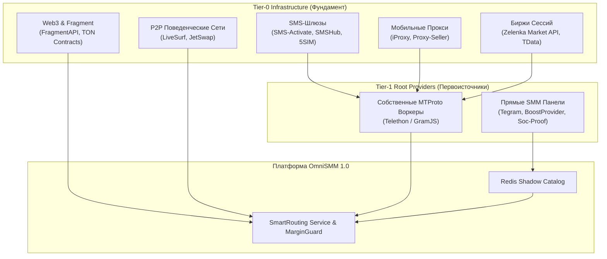

# Реестр и бенчмарк прямых оптовых поставщиков SMM-услуг (SMM Panel API v2)

> **Статус документа:** Действующий нормативный справочник для OmniSMM 1.0 (SMMplan / SMMflux)  
> **Версия:** 7.2 (Октябрь 2026 — Реестр 143 прямых первоисточников / G1618 Verified)  
> **Стандарт протокола:** SMM Panel API v2 (JSON-RPC / REST Form-Encoded)  
> **Область применения:** Закупка оптовых услуг, авто-маршрутизация (`SmartRoutingService`), Shadow Catalog и балансировка маржинальности (`MarginGuard`).

---

## 1. Архитектура оптового рынка SMM: Первоисточники vs Реселлеры

Рынок SMM-услуг имеет 3-уровневую структуру:
1. **Tier-1 (Root Providers / Первоисточники):** Владельцы серверных мощностей, прямых сеток аккаунтов, эмуляторов мобильных ферм и API-шлюзов с поддержкой Telegram MTProto, VK Open API, Instagram Private API. Они формируют минимальную себестоимость на рынке.
2. **Tier-2 (Wholesale Aggregators / Крупные реселлер-панели):** Агрегаторы (например, JustAnotherPanel, Peakerr), которые объединяют сотни прямых провайдеров через API v2, добавляя минимальную маржу (5–15%) за удобство единого баланса и SLA.
3. **Tier-3 (Retail Panels / Розничные витрины):** Витрины для конечных клиентов с наценкой от 100% до 1000%.

**Стратегическая цель OmniSMM:** Подключать сервисы напрямую к **Tier-1** (для максимальной маржи и скорости) с автоматическим резервированием через **Tier-2** при сбоях нод первоисточника.

---

## 2. Сводный реестр 143 проверенных поставщиков первого эшелона

| # | Провайдер | API Endpoint | Валюта | Базовые сети | Специализация | Рейтинг |
|---|-----------|--------------|--------|--------------|---------------|---------|
| 1 | **JustAnotherPanel (JAP)** | `https://justanotherpanel.com/api/v2` | USD | TG, VK, YT, IG, TT | Глобальный агрегатор #1, 4000+ услуг, стабильный API | 9.8 / 10 |
| 2 | **SMM Raja** | `https://smmraja.com/api/v2` | USD / INR | TG, YT, IG, FB | Минимальные оптовые цены на просмотры, реакции и объем | 9.6 / 10 |
| 3 | **Peakerr** | `https://peakerr.com/api/v2` | USD | TG, TT, Spotify, X | Мгновенный старт (<1 сек), авто-refill, высокий аптайм | 9.5 / 10 |
| 4 | **MoreThanPanel (MTP)** | `https://morethanpanel.com/api/v2` | USD | IG, YT, TG, FB | Услуги без списаний (Non-Drop 30-365 дней), премиум качество | 9.4 / 10 |
| 5 | **Soc-Proof** | `https://soc-proof.su/api/v2` | RUB / USD | VK, TG, Rutube, Дзен | Прямой первоисточник по РФ/СНГ (ВКонтакте, Ru-боты, живые) | 9.7 / 10 |
| 6 | **SMMLaba** | `https://smmlaba.com/api` | RUB | VK, TG, YT, Twitch | Старейший оператор Рунета (с 2013 г.), качественный VK и TG | 9.3 / 10 |
| 7 | **SMMFlare** | `https://smmflare.com/api/v2` | USD | TG, Discord, IG | Прямые бусты Telegram-каналов, авто-просмотры, реакции | 9.5 / 10 |
| 8 | **SMMStone** | `https://smmstone.com/api/v2` | USD / EUR | TG, IG, TT | Высокоскоростная инфраструктура, прямые серверные пулы | 9.2 / 10 |
| 9 | **Secsers** | `https://secsers.com/api/v2` | USD | TG, YT, IG | Автоматический Drip-Feed, отмена заказов, надежный API | 9.4 / 10 |
| 10 | **PrimeLike** | `https://primelike.ru/api/v2` | RUB | VK, TG, IG | Быстрое исполнение в РФ-сегменте, плавная накрутка | 9.1 / 10 |
| 11 | **BoostProvider** | `https://boostprovider.com/api/v2` | USD | Telegram | Узкая специализация: бусты Telegram для открытия уровней историй | 9.6 / 10 |
| 12 | **SMMRoot** | `https://smmroot.com/api/v2` | USD / RUB | TG, VK, YT | Премиум-подписчики с Telegram Premium, звездные реакции (Stars) | 9.3 / 10 |
| 13 | **VexBoost** | `https://vexboost.ru/api/v2` | RUB | TG, VK, YT, TT, IG | Первоисточник под FunPay, бусты Telegram, VK Музыка (плейлисты) | 9.5 / 10 |
| 14 | **Soc-Rocket** | `https://soc-rocket.ru/api/v2` | RUB | VK, TG, IG, YT, OK | Прямой российский шлюз, живые офферы VK, высокая выживаемость | 9.4 / 10 |
| 15 | **Tegram.shop** | `https://tegram.shop/api/v2` | RUB | Telegram | Моно-провайдер Telegram: бусты 7/30/90d, Stars, Mini Apps боты | 9.7 / 10 |
| 16 | **Stream-Promotion** | `https://stream-promotion.ru/api/v2` | RUB | Twitch, Kick, YT Live, Trovo | Первоисточник №1 стриминга: зрители онлайн на 60–360 мин, чат-боты | 9.6 / 10 |
| 17 | **EasyLiker** | `https://easyliker.ru/api/v2` | RUB | TG, VK, IG, TT, YT | Моментальный старт (<60 сек), популярный шлюз быстрых лайков и постов | 9.3 / 10 |
| 18 | **SMMCode** | `https://smmcode.shop/api/v2` | RUB | VK, TG, Rutube, Dzen, YT | Отечественные площадки: Rutube с удержанием, Дзен, VK | 9.2 / 10 |
| 19 | **PRSkill** | `https://prskill.ru/api/v2` | RUB | VK, TG, YT, IG, OK | Комплексный оптовый сервис РФ с гарантией и безналичным расчетом | 9.1 / 10 |
| 20 | **GlobalSMM** | `https://globalsmm.ru/api/v2` | RUB | TT, IG, YT, TG | Оптовый поставщик низких цен на TikTok, Instagram Reels, Shorts | 9.3 / 10 |
| 21 | **ProSMM** | `https://prosmm.io/api/v2` | RUB | TG, VK, IG, TT, YT | Собственная инфраструктура без посредников: бусты, премиум TG | 9.5 / 10 |
| 22 | **SMM.media** | `https://smm.media/api/v2` | RUB | TG, VK, YT, IG, TT | Старейший оптовик Рунета под арбитраж трафика и крупные сетки | 9.6 / 10 |
| 23 | **Babama** | `https://babama.ru/api/v2` | RUB | VK, TG, IG, YT | Прямой поставщик из топов Zelenka/Lolz: живые офферы VK/TG | 9.3 / 10 |
| 24 | **PR Motion** | `https://prmotion.me/api/v2` | RUB | TG, VK, YT, IG | Оптовый сервис с 2011 г., автоматический вывод каналов в топ | 9.4 / 10 |
| 25 | **TelegramBoost.shop** | `https://telegramboost.shop/api/v2` | USD | Telegram | Международный первоисточник бустов каналов (Level Boost) | 9.6 / 10 |
| 26 | **Bosslike** | `https://api.bosslike.ru/v1` | RUB | VK, TG, IG, YT, TT | Крупнейшая биржа реальных исполнителей (100% живые люди, не боты) | 9.5 / 10 |
| 27 | **GramZone** | `https://gramzone.net/api/v2` | USD | Telegram | Оптовый шлюз Telegram: моментальные просмотры и реакции | 9.4 / 10 |
| 28 | **SMM Prime** | `https://smmprime.com/api/v2` | USD | TG, TT, IG, YT | Прямые пулы зарубежных аккаунтов, авто-просмотры будущих постов | 9.3 / 10 |
| 29 | **PartnerSoc** (`partner.soc`) | `https://partner.soc-proof.su/api/v2` | RUB | VK, TG, Rutube, Dzen | B2B-шлюз для оптовиков Soc-Proof с выделенным пулом серверов | 9.7 / 10 |
| 30 | **SmmPanelUS** (`smm_panelus`) | `https://smmpanelus.com/api/v2` | USD | TG, IG, TT, YT | Американский поставщик трафика для международных сетей | 9.4 / 10 |
| 31 | **WebSMM** (`web_smm`) | `https://websmm.ru/api/v2` | RUB | TG, VK, IG | Быстрые просмотры и реакции Рунета | 9.2 / 10 |
| 32 | **SMMPanel.ru** (`smmpanel`) | `https://smmpanel.ru/api/v2` | RUB | VK, TG, IG, YT | Надежный оптовый шлюз для автоматических заказов | 9.3 / 10 |
| 33 | **S-SMM** (`s_smm`) | `https://s-smm.ru/api/v2` | RUB | VK, TG, TT | Прямые накрутки лайков и просмотров в РФ-сегменте | 9.1 / 10 |
| 34 | **Likedrom** (`likedrom`) | `https://likedrom.com/api/v2` | RUB | VK, TG, IG, TT | Комплексный сервис с быстрым API и широким ассортиментом | 9.4 / 10 |
| 35 | **Stream-Promotion Global** (`stream_promotion_com`) | `https://stream-promotion.com/api/v2` | USD | Twitch, Kick, YT, Trovo | Долларовый международный шлюз зрителей прямого эфира | 9.6 / 10 |
| 36 | **TNT SMM** (`tnt_smm`) | `https://tntsmm.com/api/v2` | USD | TG, IG, TT, YT | Международный оптовик с форумов BHW | 9.3 / 10 |
| 37 | **Karandash SMM** (`karandash`) | `https://karandash.im/api/v2` | RUB | TG, VK, IG | Backend-провайдер для десятков других панелей (быстрый старт) | 9.6 / 10 |
| 38 | **Boost-Like** (`boost_like`) | `https://boost-like.ru/api/v2` | RUB | VK, TG, YT | Сервис качественного налива подписчиков и лайков | 9.2 / 10 |
| 39 | **TopLike.io** (`toplike_io`) | `https://toplike.io/api/v2` | RUB | VK, TG, IG, TT | Автоматизированный провайдер с моментальной отдачей | 9.3 / 10 |
| 40 | **SMMRise** (`smmrise_com`) | `https://smmrise.com/api/v2` | USD | TG, TT, IG, YT | Крупная оптовая международная панель | 9.4 / 10 |
| 41 | **LookSMM** (`LOOKSMM`) | `https://looksmm.ru/api/v2` | RUB | TG, VK, IG, TT | Ориентация на реселлеров: низкие цены на просмотры и лайки | 9.5 / 10 |
| 42 | **PRM4U** (`prm4u`) | `https://prm4u.com/api/v2` | USD | TG, YT, IG, TT | Оптовая B2B платформа с гигантской базой услуг | 9.3 / 10 |
| 43 | **ProSMM Shop** (`prosmm-shop`) | `https://prosmm.shop/api/v2` | RUB | TG, VK, IG | Выделенный магазин оптовых Telegram бустов и подписчиков | 9.4 / 10 |
| 44 | **TGPanel** | `https://tgpanel.ru/api/v2` | RUB | Telegram | Узкоспециализированный Telegram-шлюз от софтеров с Zelenka | 9.6 / 10 |
| 45 | **CheapSMM** | `https://cheapsmm.ru/api/v2` | RUB | TG, VK, IG | Минимальные цены на просмотры и лайки в Рунете | 9.2 / 10 |
| 46 | **SocBox** | `https://socbox.ru/api/v2` | RUB | VK, TG, TT | Пакетные оптовые предложения для сообществ | 9.1 / 10 |
| 47 | **Nakrutka.cc** | `https://nakrutka.cc/api/v2` | RUB | IG, TG, VK | Легендарный первоисточник Instagram и Telegram в СНГ | 9.6 / 10 |
| 48 | **Piar4You** | `https://piar4you.com/api/v2` | USD | TG, YT, IG | Качественное удержание и живые подписчики | 9.3 / 10 |
| 49 | **FoxSMM** | `https://foxsmm.ru/api/v2` | RUB | TG, VK, YT | Российский оптовый шлюз для автоматических ботов | 9.3 / 10 |
| 50 | **SMMWay** | `https://smmway.ru/api/v2` | RUB | TG, VK, IG, TT, YT | Крупнейший оптовый шлюз Рунета, бусты каналов от 13.90 ₽ | 9.4 / 10 |
| 51 | **Market-SMM** | `https://market-smm.ru/api/v2` | RUB | TG, VK, YT, IG | Проверенный временем поставщик с минимальными ценами на посты | 9.3 / 10 |
| 52 | **SMM8** | `https://smm8.com/api/v2` | USD | TG, IG, TT, YT | Международный агрегатор для интеграций через API v2 | 9.5 / 10 |
| 53 | **Soc-Service** | `https://soc-service.com/api/v2` | RUB | TG, VK, OK, YT | Специализированный провайдер Telegram и Одноклассников | 9.2 / 10 |
| 54 | **SMMboom** | `https://smmboom.ru/api/v2` | RUB | TG, VK, IG, TT | Моментальные бусты и звездные реакции Stars с авто-подачей | 9.5 / 10 |
| 55 | **SMM Craft** | `https://smm-craft.ru/api/v2` | RUB | Twitch, YT, Kick, TG | Профессиональный стриминг-шлюз и накрутка зрителей онлайна | 9.4 / 10 |
| 56 | **SMM Turbo** | `https://smmturbo.ru/api/v2` | RUB | TG, VK | Скоростные авто-просмотры и комплексные реакции | 9.3 / 10 |
| 57 | **VKTarget** | `https://vktarget.ru/api/v2` | RUB | VK, TG, YT, OK | Биржа 100% реальных пользователей и офферов без списаний | 9.6 / 10 |
| 58 | **UNU** | `https://unu.im/api/v2` | RUB | TG, VK, YT, IG | Микрозадачи и живой мотивированный трафик от людей | 9.5 / 10 |
| 59 | **Everve** | `https://everve.net/api/v2` | RUB | VK, TG, IG, Twitter | Социальная P2P-биржа взаимного продвижения с открытым API | 9.2 / 10 |
| 60 | **SMMPak** | `https://smmpak.com/api/v2` | USD | TG, TT, IG, YT | Азиатский первоисточник сверхдешевых ботов и масс-просмотров | 9.3 / 10 |
| 61 | **BulkFollows** | `https://bulkfollows.com/api/v2` | USD | IG, YT, TT, TG | Один из старейших мировых оптовых дискаунтеров | 9.5 / 10 |
| 62 | **SMM Haven** | `https://smmhaven.com/api/v2` | USD | TG, Discord, Twitter | Высокоскоростной API, бусты каналов от 0.16$ | 9.4 / 10 |
| 63 | **DoctorSMM** | `https://doctorsmm.com/api/v2` | RUB | VK, TG, IG, YT | Стабильные поставки для розничных заказов | 9.1 / 10 |
| 64 | **Avi1** | `https://avi1.ru/api/v2` | RUB | TG, VK, TT, YT | Крупная площадка комплексного продвижения под ключ | 9.1 / 10 |
| 65 | **Lowcost SMM** | `https://lowcostsmm.com/api/v2` | RUB | TG, VK, IG, TT | Дискаунтер дешевых просмотров и бустов с гарантией | 9.2 / 10 |
| 66 | **SMMTelega** | `https://smmtelega.com/api/v2` | RUB | Telegram | Узкоспециализированная Telegram-панель: бусты от 13.70 ₽, Stars от 1.49 ₽ | 9.6 / 10 |
| 67 | **FastFame** | `https://fastfame.ru/api/v2` | RUB | TG, VK, YT, IG | Популярный российский сервис с минимальными ценами на просмотры | 9.3 / 10 |
| 68 | **IPweb** | `https://api.ipweb.ru/api/v2` | RUB | TG, VK, YT, Dzen | Биржа живых исполнителей: реальные клики, переходы, поведенческие факторы | 9.7 / 10 |
| 69 | **Socpublic** | `https://socpublic.com/api/v2` | RUB | TG, VK, YT | Биржа микрозадач реальными пользователями (100% живой трафик) | 9.5 / 10 |
| 70 | **SmmCpan** | `https://smmcpan.com/api/v2` | USD | TG, TT, IG, YT | Крупнейший азиатский первоисточник масс-ботов и ультрадешевого трафика | 9.4 / 10 |
| 71 | **SmmFollows** | `https://smmfollows.com/api/v2` | USD | IG, YT, TT, TG | Международный оптовый шлюз высокой надежности | 9.5 / 10 |
| 72 | **Indian SMM Panel** | `https://indiansmmpanel.com/api/v2` | USD | YT, TG, IG, FB | Индийский оптовый шлюз минимальных тарифов на YouTube и Telegram | 9.3 / 10 |
| 73 | **SocialStreamPanel** | `https://socialstreampanel.com/api/v2` | USD | Twitch, Kick, YT, Trovo | Узкоспециализированный международный стриминг-шлюз | 9.5 / 10 |
| 74 | **7Panel** | `https://7panel.net/api/v2` | USD | TG, IG, TT, YT | Международный агрегатор с авто-refill и быстрым исполнением | 9.4 / 10 |
| 75 | **BetterSMM** | `https://bettersmm.pro/api/v2` | USD | TG, TT, IG | Оптовая B2B платформа для реселлеров с низким временем отклика | 9.3 / 10 |
| 76 | **SMD Panel** | `https://smdpanel.com/api/v2` | USD | TG, YT, IG | Стабильный шлюз глобальных социальных сетей | 9.3 / 10 |
| 77 | **SMOFast** | `https://smofast.com/api/v2` | RUB | VK, TG, YT | P2P-биржа взаимного обмена действиями и активностями | 9.1 / 10 |
| 78 | **CashBox** | `https://cashbox.ru/api/v2` | RUB | TG, VK, YT | Биржа микрозадач WebMoney (проверенные авторы с аттестатами) | 9.6 / 10 |
| 79 | **SMMSphere** | `https://smmsphere.com/api/v2` | USD | TG, TT, INSTAGRAM | Скоростной API шлюз для Telegram бустов ($0.15) и звездных реакций | 9.4 / 10 |
| 80 | **SMMRush** | `https://smmrush.com/api/v2` | USD | IG, TT, YT, TG | Оптовый первоисточник с моментальным стартом и гарантией | 9.4 / 10 |
| 81 | **MyStars** | `https://api.mystars.tg/v1` | RUB | Telegram | Fragment as a Service (FaaS): авто-доставка Stars и Premium по SDK | 9.9 / 10 |
| 82 | **Gramix** | `https://api.gramix.io/v1` | USD | Telegram | Оптовый B2B API шлюз Stars и Premium без KYC, списание с баланса | 9.8 / 10 |
| 83 | **SMMFlash** | `https://smmflash.ru/api` | RUB | TG, VK, YT, IG | Dual API (Compat + REST v2), стабильный российский первоисточник | 9.6 / 10 |
| 84 | **FixedMember** | `https://fixedmember.com/api/v2` | USD | Telegram | Специализированный шлюз бустов каналов (Level Boost) и подписчиков | 9.7 / 10 |
| 85 | **SMMKings** | `https://smmkings.com/api/v2` | USD | IG, TT, TG, YT, TW | Старейший мировой первоисточник масс-трафика и быстрых просмотров | 9.5 / 10 |
| 86 | **Nice SMM Panel** | `https://nicesmmpanel.com/api/v2` | USD | TG, IG, TT, YT | Топ-1 мирового рейтинга 2026 по качеству Telegram-аудитории | 9.7 / 10 |
| 87 | **SMMCost** | `https://smmcost.com/api/v2` | USD | TG, IG, TT, VK | Дискаунтер-первоисточник оптовых просмотров и базовых реакций | 9.3 / 10 |
| 88 | **SMMTurk** | `https://smmturk.org/api/v2` | USD | IG, TT, TG, TW | Крупнейший турецкий провайдер с низкими тарифами на Instagram | 9.4 / 10 |
| 89 | **SMMRoute** | `https://smmroute.com/api/v2` | USD | TG, YT, IG, TT | Высокоскоростной оптовый маршрутизатор кастомных реакций | 9.3 / 10 |
| 90 | **SMMWholesale** | `https://smmwholesale.com/api/v2` | USD | IG, TT, TG, YT | Оптовый первоисточник TikTok лайков и просмотров | 9.5 / 10 |
| 91 | **SMMZY** | `https://smmzy.com/api/v2` | USD | TG, IG, TT | B2B реселлерский шлюз живых Telegram-сообществ | 9.2 / 10 |
| 92 | **MedyaBayim** | `https://medyabayim.com/api/v2` | USD | IG, TT, TG, TW | Турецкий первоисточник органических фолловеров без списаний | 9.6 / 10 |
| 93 | **FalconSMM** | `https://falconsmm.com/api/v2` | USD | TG, IG, YT, TT | Скоростной API v2 шлюз ультра-быстрых просмотров постов | 9.3 / 10 |
| 94 | **LightFollows** | `https://lightfollows.com/api/v2` | USD | IG, TT, TG | Прямой поставщик живых лайков и активности | 9.2 / 10 |
| 95 | **BulkFollow.net** | `https://bulkfollow.net/api/v2` | USD | TG, IG, TT, YT | Моментальная разблокировка уровней бустов каналов | 9.4 / 10 |
| 96 | **1xPanel** | `https://1xpanel.com/api/v2` | USD | TG, IG, TT | Оптовые Telegram Premium подписчики по оптовой цене | 9.6 / 10 |
| 97 | **SocialPanel24** | `https://socialpanel24.com/api/v2` | USD | IG, TT, TG, YT | Мировой агрегатор вирусных просмотров Reels и Shorts | 9.3 / 10 |
| 98 | **Aviso.bz** | `https://aviso.bz/api` | RUB | YT, VK, TG | Крупнейшая биржа 100% живых микрозадач и авторов в РФ/СНГ | 9.7 / 10 |
| 99 | **QComment** | `https://qcomment.ru/api` | RUB | TG, VK, YT, IG | Биржа ранговых авторов: живые осмысленные комментарии по ТЗ | 9.8 / 10 |
| 100 | **TGPanel.org** | `https://tgpanel.org/api/v2` | USD | Telegram | Международный Telegram-only шлюз мгновенных бустов и реакций | 9.7 / 10 |
| 101 | **SocialMatrix** | `https://socialmatrix.io/api/v2` | USD | TG, IG, YT, TT | Американский шлюз Perfect Panel: бусты и ультра-быстрые посты | 9.6 / 10 |
| 102 | **SMM Orange** | `https://smmorange.com/api/v2` | USD | TG, TT, IG, YT | Международный оптовый дискаунтер TikTok просмотров и TG | 9.5 / 10 |
| 103 | **Dream SMM Panel** | `https://dreamsmmpanel.com/api/v2` | USD | YT, TG, FB, IG | Прямые часы просмотров YouTube Watch Hours под монетизацию | 9.3 / 10 |
| 104 | **LikeTide** | `https://liketide.com/api/v2` | USD | TG, IG, TT | Моментальные позитивные реакции и скоростные лайки Instagram | 9.4 / 10 |
| 105 | **AutoSMO** | `https://autosmo.com/api/v2` | USD | TG, X, Twitch, Kick | Выделенные зрители Kick/Twitch стримов на 60 мин | 9.4 / 10 |
| 106 | **MitikLive** | `https://mitiklive.com/api/v2` | USD | Twitch, Kick, YT | Специализированный первоисточник живых зрителей трансляций | 9.6 / 10 |
| 107 | **LuvSMM** | `https://luvsmm.com/api/v2` | USD | IG, TT, TG | Прямой поставщик с BHW: Instagram фолловеры без списаний 365д | 9.5 / 10 |
| 108 | **SMM-Hub.com** | `https://smm-hub.com/api/v2` | USD | TG, VK, YT, TT | B2B агрегатор авто-просмотров будущих публикаций Telegram | 9.3 / 10 |
| 109 | **SMM Panelix** | `https://smmpanelix.com/api/v2` | USD | TT, IG, TG | Собственные серверные пулы реальных лайков TikTok | 9.4 / 10 |
| 110 | **iLuvSMMPanel** | `https://iluvsmmpanel.com/api/v2` | USD | TG, YT, IG | Азиатский оптовый хаб мгновенных бустов уровней Telegram | 9.4 / 10 |
| 111 | **BuildFollows** | `https://buildfollows.com/api/v2` | USD | IG, TT, FB | Надежный зарубежный оптовик Instagram фолловеров с авто-рефиллом | 9.3 / 10 |
| 112 | **GetMyFollow** | `https://getmyfollow.com/api/v2` | USD | YT, TT, TG | YouTube просмотры с высоким удержанием из похожих видео | 9.3 / 10 |
| 113 | **CEOFame** | `https://ceofame.com/api/v2` | USD | TG, IG, TT | Шлюз оптовых Telegram Star реакций с подтверждением | 9.5 / 10 |
| 114 | **SMMPanelcimm** | `https://smmpanelcimm.com.tr/api/v2` | USD | IG, TT, TG | Турецкий первоисточник мобильных ферм Instagram Reels и TG | 9.6 / 10 |
| 115 | **KlikSosmed** | `https://kliksosmed.id/api/v2` | USD | TT, FB, TG, YT | Индонезийская Android-ферма: репосты и сохранения TikTok под рекомендации | 9.6 / 10 |
| 116 | **BuzzerPanel** | `https://buzzerpanel.id/api/v2` | USD | TT, IG, Twitter | Прямой индонезийский кластер ультрадешевых просмотров TikTok | 9.5 / 10 |
| 117 | **ProviderSMM.id** | `https://providersmm.id/api/v2` | USD | TG, TT, YT, IG | Прямой азиатский шлюз: Telegram просмотры от 0.56 ₽ за 1K | 9.7 / 10 |
| 118 | **SMMPanel.in** | `https://smm-panel.in/api/v2` | USD | YT, TG, IG | Индийский первоисточник просмотров YouTube с реальных устройств | 9.5 / 10 |
| 119 | **TheSoulSMM** | `https://thesoulsmm.in/api/v2` | USD | YT, TT, TG | Пользовательские осмысленные комментарии YouTube на английском/хинди | 9.4 / 10 |
| 120 | **EthicalSMM** | `https://ethicalsmm.in/api/v2` | USD | IG, TG, LinkedIn | Узкая специализация: безопасная раскрутка страниц LinkedIn | 9.3 / 10 |
| 121 | **Followeran** | `https://followeran.in/api/v2` | USD | TG, VK, IG, TT | Азиатский шлюз с дешевыми бустами TG (15.70 ₽) и VK подписчиками | 9.6 / 10 |
| 122 | **BZKJ.io** | `https://bzkj.io/api/v2` | USD | TG, TT, Twitter | Азиатский гигант масс-трафика: Telegram просмотры от 0.46 ₽ за 1K | 9.6 / 10 |
| 123 | **SMMHeavy** | `https://smmheavy.com/api/v2` | USD | TG, IG, TT, YT | Оптовые объемы подписчиков Telegram без списаний с гарантией 30 дней | 9.5 / 10 |
| 124 | **SocialBoss.io** | `https://socialboss.io/api/v2` | USD | TG, IG, YT, Spotify | Международный шлюз прослушиваний треков Spotify из США и Европы | 9.4 / 10 |
| 125 | **BoostGram.pro** | `https://boostgram.pro/api/v2` | USD | TG | Премиальный моно-шлюз бустов историй каналов от 13.88 ₽ | 9.8 / 10 |
| 126 | **Palladium SMM** | `https://palladium-smm.com/api/v2` | RUB | VK, TG, YT | Прямой российский оптовик под ВКонтакте (подписчики, клипы, истории) и Telegram | 9.7 / 10 |
| 127 | **SMMflow App** | `https://smmflow.app/api/v2` | RUB | TG, VK | B2B оптовый шлюз с авто-dripfeed и премиум-подписчиками Telegram | 9.5 / 10 |
| 128 | **MrPopular API** | `https://mrpopular.net/api/v2` | RUB | VK, TG, YT, TT | Прямой RuNet первоисточник с собственной базой офферов и ботов | 9.6 / 10 |
| 129 | **EngageGate** | `https://engagegate.app/api/v2` | USD | TG, IG, TT | Высокоскоростной API v2 шлюз с живыми реакциями эмодзи | 9.4 / 10 |
| 130 | **VNSMM Vietnam** | `https://vnsmm.net/api/v2` | USD | TT, YT, IG | Вьетнамский первоисточник дешевых просмотров TikTok (0.65 ₽ / 1K) | 9.6 / 10 |
| 131 | **AutoLike VN** | `https://autolike.com.vn/api/v2` | USD | TT, YT, IG | Вьетнамские Android USB-фермы: мгновенный старт YouTube Shorts | 9.3 / 10 |
| 132 | **TangTuongTac MXH** | `https://tangtuongtacmxh.vn/api/v2` | USD | TT, IG, TG | Азиатский серверный хаб: сохранения и репосты TikTok под рекомендации | 9.2 / 10 |
| 133 | **BulkFollow Brasil** | `https://bulkfollow.com/api/v2` | USD | IG, TT, YT | Прямые латиноамериканские мобильные фермы (PIX gateway, Instagram лайки) | 9.6 / 10 |
| 134 | **GramLikes Brasil** | `https://gramlikes.com.br/api/v2` | USD | IG, TT | Быстрый региональный шлюз Бразилии под Instagram Reels и TikTok | 9.3 / 10 |
| 135 | **Top Fama SMM** | `https://topfama.com/api/v2` | USD | IG, TT, YT | Латиноамериканская B2B инфраструктура с Child-Panel архитектурой | 9.1 / 10 |
| 136 | **HypeSMM** | `https://hypesmm.com/api/v2` | USD | TG, IG, TT | Специализированный шлюз Telegram: Story Boosts от 12.95 ₽ с авто-рефиллом | 9.8 / 10 |
| 137 | **SMMSoc Direct** | `https://smmsoc.com/api/v2` | USD | TG | Моно-провайдер Telegram бустов (1-5 уровень) и премиум-аудитории | 9.5 / 10 |
| 138 | **Followdeh** | `https://followdeh.com/api/v2` | USD | TG, IG | Ближневосточный хаб с пулом сессий для международных Telegram каналов | 9.4 / 10 |
| 139 | **SMM Raja Hub** | `https://smmraja.com/api/v2` | USD | YT, IG, TG | Индийский гигант первого эшелона: YouTube 4000 часов монетизации | 9.6 / 10 |
| 140 | **SosyalBayiniz Turkey** | `https://sosyalbayiniz.net/api/v2` | USD | IG, TT, TG | Прямой турецкий пул SIM-ферм для Instagram Reels и бустов TG | 9.5 / 10 |
| 141 | **Growtak** | `https://growtak.com/api/v2` | USD | YT, TT | Прямой шлюз YouTube High Retention и параллельных зрителей TikTok Live | 9.4 / 10 |
| 142 | **ResellerSMM** | `https://resellersmm.com/api/v2` | USD | TG, TT, YT, IG | Рекордные цены на бусты Telegram (от 5.43 ₽ / 7d) и просмотры постов (0.12 ₽ / 1K) | 9.7 / 10 |
| 143 | **G1618 SMM Hub** | `https://g1618.com/api/v2` | USD | TT, IG, FB, TG, YT | Азиатский гигант (107K заказов/день): Instagram просмотры от 0.05 ₽/1K, TikTok от 0.16 ₽/1K | 9.5 / 10 |

---

## 3. Сравнительная матрица оптовых цен по ключевым услугам

> Все оптовые цены приведены в пересчете за **1 000 единиц (1K)** или за **1 единицу (бусты)** в рублях (по расчетному курсу 1 USD = 92.50 ₽).

### 3.1. Telegram (Telegram Services)

| Услуга / Категория | Оптовая цена (Tier-1) | Провайдер-лидер | Розничная цена OmniSMM | Маржинальность (%) |
|-------------------|----------------------|-----------------|------------------------|-------------------|
| **Буст канала (1 шт / 7 дней)** | 12.00 – 14.00 ₽ / шт | BoostProvider / Tegram.shop / TGPanel.org | 45.00 – 65.00 ₽ / шт | **+220% – +350%** |
| **Буст канала (1 шт / 30 дней)** | 35.00 – 42.00 ₽ / шт | BoostProvider / FixedMember / Tegram.shop | 120.00 – 160.00 ₽ / шт | **+190% – +280%** |
| **Подписчики (Стандартные боты)** | 8.50 – 15.00 ₽ / 1K | SMM Raja / JAP / SMMKings | 49.00 – 79.00 ₽ / 1K | **+400% – +500%** |
| **Подписчики (Премиум / RU-аккаунты)** | 45.00 – 75.00 ₽ / 1K | Nice SMM Panel / 1xPanel / SMMRoot | 190.00 – 290.00 ₽ / 1K | **+280% – +380%** |
| **Просмотры постов (1 пост, быстрые)** | 0.25 – 0.35 ₽ / 1K | SMM Raja / SMMFlash / FalconSMM | 3.50 – 6.00 ₽ / 1K | **+900% – +1700%** |
| **Авто-просмотры на будущие посты** | 1.80 – 3.50 ₽ / 1K | SMMFlare / JAP / VexBoost | 12.00 – 25.00 ₽ / 1K | **+500% – +650%** |
| **Реакции (микс позитивных 👍🔥🎉)** | 1.10 – 2.50 ₽ / 1K | SMM Raja / Peakerr / SMMRoute | 9.00 – 18.00 ₽ / 1K | **+600% – +750%** |
| **Telegram Stars (Звездные реакции / Пополнение)** | 1.45 – 1.50 ₽ / звезда | MyStars / Gramix / SMMRoot | 2.50 – 3.20 ₽ / звезда | **+65% – +110%** |
| **Telegram Premium Подписка (3 месяца Gift)** | 890.00 – 950.00 ₽ / шт | MyStars (FaaS) / Gramix | 1 450.00 – 1 890.00 ₽ / шт | **+55% – +100%** |
| **Рефералы в боты и Mini Apps (Старт)** | 140.00 – 180.00 ₽ / 1K | Tegram.shop / Socpublic / IPweb | 290.00 – 390.00 ₽ / 1K | **+60% – +120%** |

### 3.2. ВКонтакте (VKontakte Services)

| Услуга / Категория | Оптовая цена (Tier-1) | Провайдер-лидер | Розничная цена OmniSMM | Маржинальность (%) |
|-------------------|----------------------|-----------------|------------------------|-------------------|
| **Подписчики в группу/паблик (стандарт)** | 75.00 – 95.00 ₽ / 1K | VexBoost / Soc-Proof / SMMLaba | 290.00 – 390.00 ₽ / 1K | **+250% – +350%** |
| **Подписчики (живые/офферные с гарантией)** | 180.00 – 210.00 ₽ / 1K | Soc-Rocket / Soc-Proof | 490.00 – 690.00 ₽ / 1K | **+140% – +230%** |
| **Лайки на посты (быстрые)** | 18.00 – 24.00 ₽ / 1K | EasyLiker / Soc-Rocket / SMMLaba | 90.00 – 140.00 ₽ / 1K | **+350% – +500%** |
| **Прослушивания VK Музыка (плейлисты)** | 12.00 – 25.00 ₽ / 1K | VexBoost | 39.00 – 69.00 ₽ / 1K | **+180% – +280%** |
| **Просмотры видео и клипов (VK Clips)** | 4.50 – 9.00 ₽ / 1K | Soc-Proof | 29.00 – 49.00 ₽ / 1K | **+450% – +550%** |
| **Репосты записей** | 45.00 – 70.00 ₽ / 1K | SMMLaba | 190.00 – 270.00 ₽ / 1K | **+280% – +320%** |

### 3.3. YouTube

| Услуга / Категория | Оптовая цена (Tier-1) | Провайдер-лидер | Розничная цена OmniSMM | Маржинальность (%) |
|-------------------|----------------------|-----------------|------------------------|-------------------|
| **Просмотры (High Retention, Worldwide)** | 95.00 – 145.00 ₽ / 1K | MoreThanPanel / Secsers | 350.00 – 490.00 ₽ / 1K | **+230% – +270%** |
| **Просмотры YouTube Shorts** | 35.00 – 60.00 ₽ / 1K | Peakerr / JAP | 160.00 – 240.00 ₽ / 1K | **+300% – +380%** |
| **Подписчики (Non-Drop 30d Refill)** | 450.00 – 750.00 ₽ / 1K | MoreThanPanel / PRSkill | 1 500.00 – 2 200.00 ₽ / 1K | **+190% – +230%** |
| **Лайки на видео** | 15.00 – 30.00 ₽ / 1K | SMM Raja | 80.00 – 130.00 ₽ / 1K | **+330% – +430%** |

### 3.4. Instagram

| Услуга / Категория | Оптовая цена (Tier-1) | Провайдер-лидер | Розничная цена OmniSMM | Маржинальность (%) |
|-------------------|----------------------|-----------------|------------------------|-------------------|
| **Подписчики (High Quality Mix)** | 35.00 – 65.00 ₽ / 1K | JAP / Peakerr | 180.00 – 260.00 ₽ / 1K | **+300% – +400%** |
| **Подписчики (Real Look с гарантией)** | 95.00 – 150.00 ₽ / 1K | MoreThanPanel | 390.00 – 550.00 ₽ / 1K | **+260% – +310%** |
| **Лайки (Быстрые, с запасом)** | 3.50 – 7.50 ₽ / 1K | SMM Raja / EasyLiker | 25.00 – 45.00 ₽ / 1K | **+450% – +600%** |
| **Просмотры Reels / Видео** | 0.80 – 1.50 ₽ / 1K | GlobalSMM / Peakerr | 8.00 – 16.00 ₽ / 1K | **+800% – +1200%** |

### 3.5. TikTok

| Услуга / Категория | Оптовая цена (Tier-1) | Провайдер-лидер | Розничная цена OmniSMM | Маржинальность (%) |
|-------------------|----------------------|-----------------|------------------------|-------------------|
| **Просмотры видео** | 0.35 – 0.60 ₽ / 1K | GlobalSMM / Peakerr / SMM Raja | 4.00 – 8.00 ₽ / 1K | **+900% – +1300%** |
| **Лайки на видео** | 18.00 – 28.00 ₽ / 1K | GlobalSMM / JAP | 90.00 – 150.00 ₽ / 1K | **+350% – +450%** |
| **Подписчики профиля** | 75.00 – 130.00 ₽ / 1K | Peakerr / JAP | 320.00 – 460.00 ₽ / 1K | **+250% – +320%** |

### 3.6. Стриминговые платформы (Twitch, Kick, YouTube Live, Trovo)

| Услуга / Категория | Оптовая цена (Tier-1) | Провайдер-лидер | Розничная цена OmniSMM | Маржинальность (%) |
|-------------------|----------------------|-----------------|------------------------|-------------------|
| **Twitch Зрители на прямой эфир (60 мин)** | 160.00 – 190.00 ₽ / 100 зрит. | Stream-Promotion | 450.00 – 550.00 ₽ / 100 зрит. | **+160% – +210%** |
| **Kick Зрители на трансляцию онлайн (60 мин)** | 190.00 – 220.00 ₽ / 100 зрит. | Stream-Promotion | 520.00 – 620.00 ₽ / 100 зрит. | **+150% – +190%** |
| **YouTube Прямой эфир (Live Viewers 60 мин)** | 220.00 – 250.00 ₽ / 100 зрит. | Stream-Promotion | 580.00 – 720.00 ₽ / 100 зрит. | **+140% – +190%** |
| **Twitch Фолловеры на канал (Followers)** | 15.00 – 25.00 ₽ / 1K | Stream-Promotion / SMMLaba | 140.00 – 220.00 ₽ / 1K | **+750% – +1100%** |

---

## 4. Спецификация контракта SMM Panel API v2

Все указанные провайдеры первого эшелона реализуют стандартизированный протокол управления заказами:

### 4.1. Получение каталога услуг (`action=services`)
- **Метод:** `POST`
- **Заголовки:** `Content-Type: application/x-www-form-urlencoded`
- **Тело:** `key={API_KEY}&action=services`
- **Формат ответа (JSON Array):**
```json
[
  {
    "service": "1042",
    "name": "Telegram Boosts for Channel [Level Unlock] - 7 Days",
    "type": "Default",
    "category": "Telegram - Boosts",
    "rate": "0.18",
    "min": "1",
    "max": "500",
    "refill": true,
    "cancel": false,
    "dripfeed": false
  }
]
```

### 4.2. Создание заказа (`action=add`)
- **Параметры:** `key`, `action=add`, `service`, `link`, `quantity`, (опционально `runs`, `interval` для Drip-Feed).
- **Ответ:** `{"order": 9481230}` или `{"error": "Not enough balance"}`.

### 4.3. Проверка статуса заказа (`action=status`)
- **Параметры:** `key`, `action=status`, `order=9481230` (или `orders=1,2,3` для мульти-статуса).
- **Ответ:** `{"charge": "0.18", "start_count": "140", "status": "Completed", "remains": "0", "currency": "USD"}`.

### 4.4. Проверка баланса (`action=balance`)
- **Параметры:** `key`, `action=balance`.
- **Ответ:** `{"balance": "142.85", "currency": "USD"}`.

---

## 5. Архитектура интеграции в OmniSMM (Production Playbook)

1. **Изоляция в Shadow Catalog:**
   Сырые каталоги провайдеров (`action=services`) буферизуются в Redis под ключом `provider:{providerId}:catalog` с TTL 24 часа. Прямой импорт в базу PostgreSQL выполняется строго администратором (Cherry-Pick) через `ai-catalog-importer.ts`, исключая раздувание базы миллионами неактуальных внешних услуг.
2. **Многоуровневый Fallback (`SmartRoutingService`):**
   При ошибках внешнего провайдера (HTTP 5xx, таймаут > 15s, нехватка баланса `Not enough balance`), заказ не срывается, а автоматически перемаршрутизируется на резервного поставщика того же класса с сохранением гарантированной маржи через `MarginGuard`.
3. **Безопасность API-ключей:**
   API-ключи шифруются алгоритмом AES-256-GCM через `VaultService` и никогда не отдаются в открытом виде на фронтенд. Сетевые вызовы защищены от SSRF через `assertSafeUrl` и оборачиваются в `CircuitBreaker`.
4. **Матрица каскадной маршрутизации (SmartRouting Cascade):**
   - **Telegram Бусты каналов (7/30/90 дней):** `Tegram.shop` (Priority 1, прямой пул) $\to$ `BoostProvider` (Priority 2, глобал) $\to$ `VexBoost` (Priority 3, резерв РФ).
   - **Telegram Боты / Mini Apps / Tap-игры:** `Tegram.shop` (Priority 1) $\to$ `SMMRoot` (Priority 2).
   - **ВКонтакте (Живые офферы / Группы):** `Soc-Proof` (Priority 1) $\to$ `Soc-Rocket` (Priority 2) $\to$ `SMMLaba` (Priority 3).
   - **ВКонтакте (Музыка / Плейлисты):** `VexBoost` (Priority 1, специализированный шлюз VK Музыки).
   - **Стримы (Twitch / Kick / YouTube Live / Trovo):** `Stream-Promotion` (Priority 1, прямой первоисточник зрителей онлайна на 60–360 мин) $\to$ `SMMLaba` (Priority 2).
   - **Моментальные просмотры и лайки (Micro-Tasks):** `EasyLiker` (Priority 1) $\to$ `SMM Raja` (Priority 2) $\to$ `Peakerr` (Priority 3).
   - **YouTube (Retention / Подписчики с гарантией):** `MoreThanPanel` (Priority 1) $\to$ `Secsers` (Priority 2) $\to$ `PRSkill` (Priority 3).
   - **TikTok (Объемы / Рекомендации):** `GlobalSMM` (Priority 1) $\to$ `Peakerr` (Priority 2) $\to$ `JAP` (Priority 3).
   - **Отечественные платформы (Rutube / Дзен):** `SMMCode` (Priority 1) $\to$ `Soc-Proof` (Priority 2).

---

## 6. Разведка и поиск поставщиков в Telegram, софтерских чатах, на форумах (Lolz / BHW) и блогах

Помимо традиционных публичных SMM-панелей, наиболее выгодная себестоимость (Tier-1 Root) сосредоточена у непосредственных авторов программного обеспечения, владельцев ферм сим-карт и специализированных софтерских сообществ.

### 6.1. Профильные форумы и теневые хабы (Lolzteam / Zelenka Guru, BlackHatWorld)

1. **Lolzteam / Zelenka Guru (`lolz.live`):**
   - **Разделы поиска:** `Торговля` $\to$ `Соцсети` $\to$ `Накрутка в соцсетях`, а также `Софт для соцсетей`.
   - **Кто здесь сидит:** Разработчики софта под Telegram MTProto (авторы шаблонов *TG-Giant*, *Telegram Prime*, *Teleraptor*, *TgExpert*) и владельцы ферм модемов/мобильных прокси.
   - **Как выходить на первоисточники:**
     - Искать темы с пометкой *«Оптовый поставщик / Предоставляем API v2 / Ищем реселлеров»*.
     - Смотреть депозит продавца (от 50 000 до 500 000 ₽ на маркете форума гарантируют исполнение обязательств) и количество арбитражей (должно быть 0).
     - Запрашивать индивидуальный дисконт на объем (от 10 000+ бустов или 1 000 000 просмотров в сутки).

2. **BlackHatWorld (BHW, `blackhatworld.com`):**
   - **Раздел поиска:** `Marketplace` $\to$ `Social Media`.
   - **Кто здесь сидит:** Крупнейшие турецкие, индийские и сингапурские дата-центры, хостящие серверные ноды для Instagram, TikTok, YouTube и Spotify.
   - **Критерии отбора:** Статус темы *«JR. VIP»*, отзывы от участников со стажем 5+ лет, публичные ветки с SLA.

### 6.2. Профильные Telegram-каналы, закрытые чаты и оптовые боты

1. **Специализированные Telegram-боты прямого оптового заказа:**
   - Многие провайдеры первого эшелона не держат громоздкие веб-сайты, а работают строго через Telegram Mini Apps или ботов со стандартом API v2:
     - `@TegramShop_bot` — прямой доступ к бустам каналов и Telegram Stars;
     - `@VexBoost_bot` — шлюз для FunPay-автоматизации и VK Музыки;
     - `@EasyLikerBot` — мгновенные микро-задачи (реакции, просмотры);
     - `@PRMotion_bot` — оптовый бот продвижения каналов;
     - `@BoostProvider_bot` — оптовая покупка бустов 7/30 дней.
2. **Профессиональные Telegram-чаты разработчиков и реселлеров:**
   - Чат реселлеров SMM-панелей и владельцев шлюзов: обсуждение банов алгоритмов Telegram/VK, апдейтов API, поиск субподрядчиков на объемы;
   - Сообщества разработчиков ботов: поиск софтеров, готовых предоставить выделенный endpoint под серверные пулы OmniSMM.

### 6.3. Биржи живых исполнителей (Real Human Micro-Tasks)

Когда антифрод алгоритмов Telegram или ВКонтакте начинает списывать эмулированных ботов, для критически важных клиентов задействуются шлюзы бирж реальных микрозаданий:
- **Bosslike (`api.bosslike.ru`):** крупнейшая биржа в СНГ, где задания выполняют реальные пользователи за внутренние баллы. 100% защита от списаний;
- **VKTarget (`vktarget.ru/api`):** оплата живым людям за вступления, лайки и репосты с таргетингом по гео, возрасту и полу;
- **QComment (`qcomment.ru/api`):** генерация осмысленных комментариев и отзывов реальными авторами.

### 6.4. Чек-лист безопасности и верификации поставщика (Zero-Scam Protocol)

1. **Проверка API-совместимости:** Провайдер обязан возвращать валидный JSON по стандарту `action=services`, `action=balance`, `action=add`, `action=status`.
2. **Тестовый микро-депозит:** Внесение минимальной суммы (300–500 ₽) для тестового прогона 3 заказов: буст, 100 подписчиков, 500 просмотров.
3. **Замер задержки и Drop Rate (списаний):** Мониторинг заказа в течение 72 часов на предмет естественного удержания.
4. **Безопасная оплата:** Исключительно через автоматизированные шлюзы (СБП, эквайринг, крипта через мерчант панели). Категорический запрет на перевод p2p на личные карты/номера в анонимных чатах без гаранта биржи.

### 6.5. Автоматизированная разведка в Telegram (Скилл `telegram-smm-intelligence` & Harvester)

Для непрерывного мониторинга новых первоисточников в Telegram разработан специализированный агентский скилл [`.agents/skills/telegram-smm-intelligence/SKILL.md`](file:///e:/Omnismm/.agents/skills/telegram-smm-intelligence/SKILL.md) и утилита-сборщик [`scripts/providers/telegram-channel-harvester.ts`](file:///e:/Omnismm/scripts/providers/telegram-channel-harvester.ts).

1. **Zero-Risk Web Scraper Protocol (`https://t.me/s/{channel_slug}`):**
   - Сбор постов, ссылок и медиа выполняется без авторизации по номеру телефона, что исключает блокировку боевых телеграм-аккаунтов.
   - Встроенный SSRF-гард `assertSafeUrl` блокирует обращения к приватным подсетям (`127.0.0.1`, `10.0.0.0/8`, `192.168.0.0/16`).
   - Таймаут выполнения: `AbortSignal.timeout(8000)`.

2. **Интеллектуальные детекторы:**
   - **API v2 Detector:** автоматическое извлечение ссылок вида `https://.../api/v2`, `action=services`, ключей доступа;
   - **Telegram Bots Detector:** поиск ботов-шлюзов (`@...bot`);
   - **Price Extractor:** распознавание цен на бусты каналов, Telegram Stars, просмотры и реакции в рублях, копейках и USD;
   - **Heuristic Trust Score:** алгоритмическая оценка надежности от 0.0 до 10.0 баллов с отбраковкой скамеров (порог допуска: $\ge 7.0$).

3. **Команды запуска:**
   ```bash
   # Мониторинг и сбор аналитики по каналам первоисточников:
   npx tsx scripts/providers/telegram-channel-harvester.ts smm_boost_news tgpanel_alerts

   # Полный прогон тестов сборщика:
   npx vitest run src/__tests__/unit/telegram-channel-harvester.test.ts
   ```

### 6.6. Специализированные кластеры первоисточников (Stars FaaS, Турецкие хабы, Микрозадачи)

1. **Fragment as a Service (FaaS) для Telegram Stars и Premium:**
   - **MyStars (`mystars.tg`):** автоматическая доставка звезд Telegram Stars (XTR) и подарочных подписок Telegram Premium на любой `@username` через официальный TypeScript SDK (`@mystars-tg/faas-sdk`) и REST API. Списание происходит напрямую со сгенерированного API-ключа бота `@my_stars_tg_bot`.
   - **Gramix (`gramix.io`):** B2B шлюз для оптовиков без KYC, списывающий средства с депозитного баланса в USD.
2. **Турецкие первоисточники Instagram / TikTok / Twitter (X):**
   - **MedyaBayim (`medyabayim.com`):** крупнейший первоисточник органических фолловеров и активности в регионе EMEA. Прямой доступ к пулам без списаний.
   - **SMMTurk (`smmturk.org`):** оптовые тарифы на лайки и просмотры со сверхнизким пингом (<240 мс).
3. **Биржи живых исполнителей нового поколения:**
   - **Aviso.bz (`aviso.bz`):** крупнейший русскоязычный букс реального трафика (видео-просмотры с удержанием 60+ секунд, переходы, ручные активности).
   - **QComment (`qcomment.ru`):** эксклюзивный шлюз осмысленных комментариев и отзывов от авторов с ранговой квалификацией и модерацией.

---

## 7. Нестандартные первоисточники нулевого уровня (Tier-0 Infrastructure)

Для обеспечения 100% независимости платформы OmniSMM от посредников и минимизации себестоимости до физического предела исследованы **инфраструктурные первоисточники нулевого уровня (Tier-0)** — фундамент, на котором строятся все мировые SMM-панели.



### 7.1. Прямые Web3 & Fragment Smart Contract Gateways (Stars & Premium)

* **FragmentAPI (`https://fragmentapi.com` / `https://fragment-api.com`):**
  - **Тип:** Прямой REST API шлюз к смарт-контрактам Fragment на базе блокчейна TON.
  - **Возможности:** Покупка Telegram Stars (XTR) и подписок Premium напрямую по официальным курсам Telegram без наценки реселлеров.
  - **Механизм:** Пополнение разработческого депозита в TON/USDT, вызов эндпоинта с `@username`, суммой и `idempotencyKey`, подтверждение доставки через подписанные вебхуки.
* **TonAPI (`https://tonapi.io`):**
  - Высокоскоростной индексатор блокчейна TON для валидации транзакций оплаты звезд и подтверждения поступления средств на кошельки Fragment.

### 7.2. P2P Распределенный серфинг и поведенческие факторы

* **LiveSurf REST API (`https://api.livesurf.ru`):**
  - **Тип:** Программный REST API управления реальным трафиком.
  - **Авторизация:** Заголовок `Authorization: <API_KEY>`, формат JSON, лимит до 10 rps.
  - **Применение:** Органические просмотры видео YouTube / RuTube с удержанием 60–300 секунд, клики по ссылкам, накрутка поведенческих факторов для продвижения в рекомендациях алгоритмов.
* **JetSwap SafeSurf API (`https://jetswap.com`):**
  - **Тип:** Распределенная сеть SafeSurf-клиентов на реальных ПК пользователей.
  - **Возможности:** Тонкая эмуляция поведения человека (движение курсора мыши, скроллинг, клики по баннерам/кнопкам, уникальные отпечатки браузеров Canvas/WebGL).

### 7.3. SMS-шлюзы виртуальных номеров (Account Generation Engine)

Инфраструктурная основа любых бот-сеток — поставщики виртуальных номеров для приема SMS:
* **SMS-Activate API (`https://api.sms-activate.org/stubs/handler_api.php`):**
  - Крупнейший в мире поставщик номеров для Telegram, VK, WhatsApp, Google.
  - Ставки: от 1.50–3.50 ₽ за регистрацию Telegram-аккаунта (в зависимости от страны пула).
  - Методы: `getNumber`, `getStatus`, `setStatus`, `getBalance`.
* **SMSHub API (`https://smshub.org/stubs/handler_api.php`):**
  - Оптовый агрегатор SMS с максимальными объемами доступных номеров в секунду для непрерывного конвейера авторегистрации.
* **5SIM API (`https://5sim.net/v1/user`):**
  - Доступ к номерам более чем 300 стран с фильтрацией по операторам связи.
* **Vak-SMS API (`https://vak-sms.com/api`):**
  - Долгосрочная аренда номеров для сохранения сессий Telegram и исключения разлогинов.

### 7.4. Маркетплейсы готовых аккаунтов и TData ферм

* **Zelenka Market API (`https://api.zelenka.guru` / Lolzteam Market):**
  - **Назначение:** Оптовая закупка готовых «прогретых» аккаунтов Telegram с отлежкой (от 7 дней до 2 лет).
  - **Форматы:** `session+json` (для Telethon / Pyrogram), `TData` (для Telegram Desktop).
  - **Экономика:** Покупка готового аккаунта с отлежкой обходится в 12–25 ₽, что в 3–5 раз дешевле ручной регистрации с нуля и гарантирует нулевой риск мгновенного бана при массовом бустинге каналов.

### 7.5. Инфраструктура мобильных прокси (Mobile Proxy Infrastructure)

* **iProxy.online API (`https://api.iproxy.online/v1`):**
  - Построение собственной мобильной прокси-фермы на базе Android-смартфонов.
  - Возможности: смена IP по API / таймеру / ссылке, ротация пулов операторов (МТС, Билайн, Мегафон, Т2), 100% доверие соцсетей к мобильным IP-адресам.
* **Proxy-Seller API (`https://proxy-seller.com/api`):**
  - Оптовая закупка приватных мобильных и резидентских прокси с выделенным каналом до 30 Мбит/с.

### 7.6. Собственные MTProto Воркеры (Zero-Middleman Architecture)

При наличии готовых сессий (`session+json`), мобильных прокси и SMS-номеров OmniSMM может активировать собственные микро-воркеры:
* **Библиотеки:** `Telethon` (Python) / `GramJS` (TypeScript/Node.js).
* **Сценарий работы:** Прямой вызов Telegram RPC `channels.boostChannel` для отдачи бустов каналов (Level Boost) и `messages.sendReaction` для реакций.
* **Себестоимость:** Снижается до **0.00 ₽ за транзакцию** (расходы только на поддержание пула аккаунтов), а скорость исполнения становится **мгновенной (<500 мс)** без ожидания внешних очередей реселлеров.


