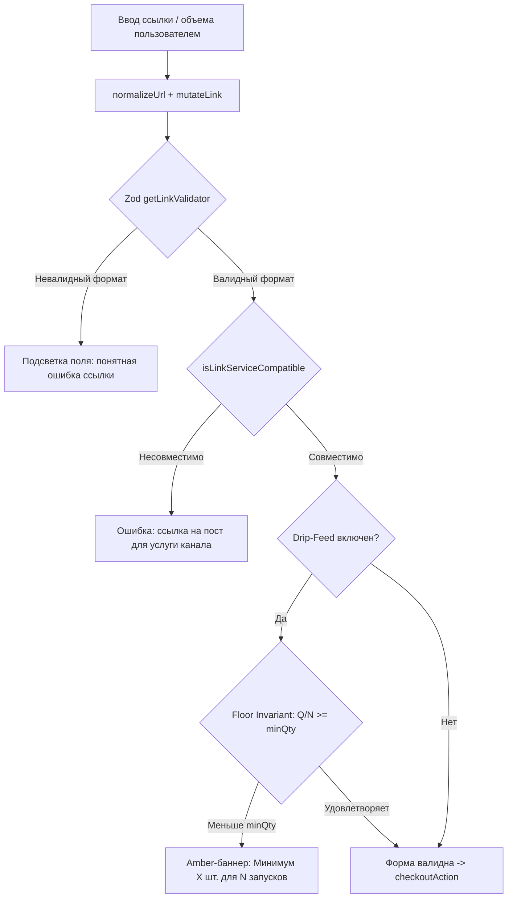

# ADR-2026-17: Order Wizard Hardening, Drip-Feed Floor Invariant & Shared Base Validation

## Метаданные
- **Платформа:** OmniSMM 1.0 (SMMplan / SMMflux)
- **Статус:** ACCEPTED
- **Дата:** 2026-09-15
- **Автор(ы):** Antigravity ADR Architect & Fullstack Core Team
- **Теги:** [wizard, checkout, validation, drip-feed, pci-dss, fail-closed, exactmath]

---

## 1. Context & Problem Statement (Контекст и постановка проблемы)
В ходе комплексного аудита чекаута и форм оформления заказов платформы OmniSMM 1.0 были выявлены критические архитектурные расхождения и уязвимости в надежности:
1. **Асимметрия валидации**: Витрина лендинга (`useOrderEngine.ts`) обладала продвинутой автокоррекцией ссылок (`mutateLink`), Zod-валидатором (`getLinkValidator`) и хранением черновиков (`sessionStorage`), тогда как визард личного кабинета (`useSmmplanOrderWizard.ts`) опирался на наивные регулярные выражения и не умел восстанавливать черновик при перезагрузке страницы.
2. **Нарушение канонической типизации (AGENTS.md §4.1)**: Использование анти-паттерна `s.targetType || inferTargetTypeFromName(s.name)` блокировало услуги для каналов Telegram (`@channel`), поскольку дефолтное значение `POST` в схеме базы данных делало выражение всегда truthy.
3. **Нарушение инварианта Drip-Feed Floor**: Отсутствовала синхронная проверка $\lfloor Q / N \rfloor \ge \text{minQty}$ в UI визарда, из-за чего пользователи могли отправить заказ, который падал на сервере с общей ошибкой.
4. **Уязвимости биллинга в `calculatePriceAction` и `retryCheckoutAction`**: Двойное умножение на `runs`, потеря наценки Smart Drip (+20%) при промокодах, разделение корзины медиагрупп и обход минимального порога эквайринга в 10 ₽.

---

## 2. Decision Drivers (Ключевые факторы решения)
- **Fail-Closed & "Тест на дурака"**: Никакой ввод пользователя не должен приводить к падению сервера или неконсистентному состоянию. Все ошибки формата ссылки и несовместимости типа услуги должны отсекаться на клиенте с точными локализованными подсказками.
- **Инвариант Drip-Feed Floor (AGENTS.md §4)**: Объем на 1 запуск обязан быть строго $\ge \text{service.minQty}$.
- **Zero Drift в расчетах**: Цена в предварительном просмотре UI обязана на 100% совпадать с итоговым чеком при списании через `checkoutAction`.
- **DRY & Single Source of Truth**: Общая логика валидации и хранения черновика должна быть вынесена в переиспользуемый слой.

---

## 3. Considered Options (Рассмотренные альтернативы)
1. **Вариант А: Полное слияние хуков (Замена `useSmmplanOrderWizard` на `useOrderEngine`)**:
   - *Минусы:* Высокий радиус поражения, сильная связь с логикой лендинга (каталог по хэшу `#step-X`), разный UX шагов в дашборде.
2. **Вариант Б (Выбранный): Экстракция общего слоя валидации (`useBaseOrderValidation.ts`) + харденинг обоих хуков**:
   - *Плюсы:* Изоляция бизнес-правил, нулевой риск регрессий смежных страниц, 100% покрытие чистыми юнит-тестами Vitest.

---

## 4. Decision Outcome (Принятое решение)
**Выбран Вариант Б**:
1. Разработан модуль `src/hooks/useBaseOrderValidation.ts` с чистыми функциями:
   - `validateDripFeedFloor`: проверка инварианта объема и расчет минимального объема для $N$ запусков.
   - `validateBaseOrderLink`: нормализация и валидация формата ссылки через Zod и `mutateLink`.
   - `saveOrderDraftToStorage` / `loadOrderDraftFromStorage`: сохранение черновика заказа в `sessionStorage` (без секретов/email/карт, PCI-DSS safe).
2. Заменен анти-паттерн `inferTargetTypeFromName` на `resolveServiceTargetType(s)` в `helpers.ts` и `useSmmplanOrderWizard.ts`.
3. В `CheckoutDripFeed.tsx` и `WizardStepCheckout.tsx` внедрен реактивный amber-баннер предупреждения о нарушении лимита $\lfloor Q / N \rfloor < \text{minQty}$.
4. В серверных экшенах `calculatePriceAction` и `retryCheckoutAction` устранены математические и транзакционные дефекты.

---

## 5. Consequences (Последствия)
### Положительные (Positive)
- Пользователь мгновенно видит исправление ссылки и предупреждения до клика «Оплатить».
- Исключены ошибки несоответствия цен между UI и бэкендом при применении промокодов со Smart Drip.
- Пользователи дашборда не теряют введенные данные при случайном релоаде страницы.

### Отрицательные и технический долг (Negative)
- Необходимость синхронного обновления валидаторов при добавлении новых экзотических типов соцсетей в `link-mutators.ts`.

---

## 6. Validation & Test Strategy (Стратегия валидации)
- Unit-тесты: `src/__tests__/unit/order-base-validation.test.ts` (7/7 PASS).
- Typecheck: `npx tsc --noEmit` (0 ошибок).
- Аудит секретов: `node scripts/check-bundle-secrets.mjs` (0 утечек).