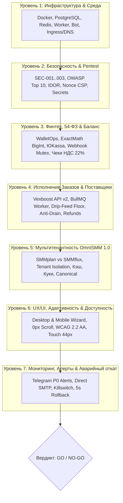

# SPEC-2026-09-13: Комплексная спецификация предпродакшен-проверки платформы OmniSMM 1.0
## (Pre-Production Verification & Go-Live Acceptance Specification)

> **Статус:** Действующий норматив приёмки (Ready for Execution)  
> **Роль составителя:** Главный Fullstack-аналитик & Архитектор качества (OmniSMM 1.0)  
> **Нормативная база:** RAC-2026, OWASP Top 10:2025, PCI DSS v4.0.1, 54-ФЗ/425-ФЗ, WCAG 2.2 AA, ISO 9241-110:2020, BGS-2026.

---

## 1. Контекст, Цель и Границы Проверки

### 1.1. Проблема
Перед переводом платформы в статус **Production (Боевой запуск)**, включением реального эквайринга и закупкой рекламы недопустимо полагаться на выборочные ручные проверки. Любой скрытый дефект в финтехе (двойное зачисление, сбой копеек), в безопасности (утечка токенов, IDOR), в диспетчеризации провайдера (зависшие заказы без возврата средств) или в верстке (горизонтальный скролл на смартфонах) приводит к прямым финансовым и репутационным потерям.

### 1.2. Цель
Сформировать исчерпывающую, детерминированную спецификацию сквозной проверки всех 7 слоев платформы OmniSMM 1.0 (витрины `smmplan.pro` и `smmflux.ru`) с четкими критериями «Годен / Не годен» (Go / No-Go Gate) и точными командами верификации.

---

## 2. Архитектурная карта 7 Уровней Проверки (7 Defense Layers)



---

## 3. Детальная спецификация проверок по слоям

### СЛОЙ 1. Инфраструктура, Сеть и Контейнеры (DevOps & Runtime)

| Объект проверки | Что проверяется | Механизм и команда проверки | Критерий успешности (PASS) |
|---|---|---|---|
| **1.1. База данных PostgreSQL (5433)** | Стабильность соединения, статус миграций Prisma, connection pool. | `npx prisma migrate status` | `Database schema is up to date!`, нет незамененных миграций. |
| **1.2. Очереди и кэш Redis (6379)** | Доступность Redis, аутентификация по паролю (SEC-001), лимиты памяти. | `npx tsx scripts/verify-production-hardening.ts` | SEC-001 PASS: пароль подтвержден, неаутентифицированные подключения отклоняются. |
| **1.3. Контейнеры сервисов Docker** | Статус контейнеров `smmplan_web`, `smmplan_lite_worker`, `smmplan_bot`, `postgres`, `redis`. | `docker ps --format "table {{.Names}}\t{{.Status}}\t{{.Ports}}"` | Все контейнеры в статусе `Up (healthy)`, 0 перезапусков (`Restarting`). |
| **1.4. Суверенный Ingress в РФ** | Доступность витрин без блокировок Cloudflare/ТСПУ (Tailscale Funnel / HTTP 302 / Worker Proxy). | `curl -sI https://test.smmplan.pro/api/health` | HTTP 200 OK, SSL-сертификат валиден, ответ `< 300ms`. |
| **1.5. Продакшен-сборка Standalone** | Корректная сборка Next.js 16 и компиляция TypeScript в строгом режиме. | `npm run typecheck && npm run audit:prod` | `0 errors`, `0 BLOCKER`, бандлы собраны без утечек путей. |

---

### СЛОЙ 2. Кибербезопасность, Секреты и Защита от взлома (CyberSec Gate)

| Объект проверки | Что проверяется | Механизм и команда проверки | Критерий успешности (PASS) |
|---|---|---|---|
| **2.1. Утечки секретов в бандле** | Отсутствие приватных ключей, паролей и токенов в клиентских JS-чанках. | `node scripts/check-bundle-secrets.mjs` | **0 утечек** (`All checks passed`). |
| **2.2. CSP Nonce & Strict-Dynamic (SEC-002)** | Защита от XSS: запрет `'unsafe-inline'` и `'unsafe-eval'` в `script-src`, крипто-nonce. | `npx vitest run src/__tests__/security/production-hardening-triad.test.ts` | 100% PASS, директива `script-src` строго следует регламенту. |
| **2.3. Guest-Proof IDOR Shield** | Невозможность получить/изменить чужие заказы или платежи как гостем, так и авторизованным. | `npx vitest run src/__tests__/pentest/comprehensive-pentest.test.ts` | Попытки доступа без прав возвращают `403 Forbidden` / `{ error: 'Access denied' }`. |
| **2.4. Timing-Safe Вебхуки** | Валидация подписей эквайринга (ЮKassa, Robokassa) через `crypto.timingSafeEqual`. | `npx vitest run src/__tests__/security/swarm-audit-remediation.test.ts` | Защита от атак по времени (Side-channel timing attacks) активна. |
| **2.5. Rate Limiting (RFC 9331)** | Ограничение частоты запросов на API авторизации, чекаута и шлюзов. | Запрос 70 вызовов в минуту на `/api/storefront/v1/*` | HTTP 429 Too Many Requests с заголовками `RateLimit-*`. |

---

### СЛОЙ 3. Финтех, Биллинг, Леджер и 54-ФЗ (Fintech Integrity)

| Объект проверки | Что проверяется | Механизм и команда проверки | Критерий успешности (PASS) |
|---|---|---|---|
| **3.1. ExactMath & Копейки BigInt** | Абсолютная точность цен, исключение ошибок IEEE 754 с плавающей точкой. | `npx dotenv -e .env.test -- npx vitest run src/__tests__/financial/exact-math.test.ts` | 100% PASS, банковское округление Half-Even, минимальный шаг 1 коп. |
| **3.2. Ledger-First Principle** | Запись в бухгалтерскую книгу создается ДО обновления поля `User.balance`. | Проверка `src/services/financial/wallet-ops.service.ts` | Нет Transaction Escape, `tx.ledgerEntry.create` вызывается первым. |
| **3.3. Защита от двойных зачислений (Double-Crediting)** | Параллельные повторные вебхуки одного и того же платежа не зачисляют баланс дважды. | Фаззинг вебхуков ЮKassa с одинаковым `payment_id` | Только 1 транзакция успешна, повторные отсекаются по Redis Mutex / P2002. |
| **3.4. Фискализация 54-ФЗ и НДС 2026** | Корректные признаки `payment_subject: service`, `payment_mode: full_prepayment`, `vat_code`. | Проверка тела чека в `yookassa.service.ts` | При обороте $< 20$ млн ₽: `vat_code: 1` (Без НДС), $\ge 20$ млн ₽: `vat_code: 10` (НДС 22%). |
| **3.5. Актуальность боевых ключей ЮKassa** | В `.env` прописан боевой (не тестовый!) `YOOKASSA_SHOP_ID` и секретный ключ. | Проверка в ЛК ЮKassa и вызов тестового создания счета | Платежная форма генерируется с боевым шлюзом СБП/карт. |

---

### СЛОЙ 4. Исполнение заказов и Провайдер Vexboost (Order Engine & Ops)

| Объект проверки | Что проверяется | Механизм и команда проверки | Критерий успешности (PASS) |
|---|---|---|---|
| **4.1. Доступность Vexboost API v2** | Валидность `VEXBOOST_API_KEY`, корректный эндпоинт `https://vexboost.ru/api/v2`. | Проверка баланса и списка услуг провайдера | Баланс поставщика $> 3000$ ₽, статус провайдера в БД `isActive: true`. |
| **4.2. Фоновый воркер BullMQ** | Процесс `smmplan_lite_worker` запущен и вычитывает очередь `smm-orders`. | `docker logs --tail 50 smmplan_lite_worker` | `Worker listening to queue smm-orders`, нет UnhandledRejection. |
| **4.3. Drip-Feed Floor Invariant** | Заказ с распределением по дням/запускам соблюдает правило $\lfloor Q/N \rfloor \ge \text{minQty}$. | `npx vitest run src/__tests__/orders/drip-feed-min-quantity-and-runs-integrity.test.ts` | 100% PASS, фронтенд и бэкенд блокируют недопустимый объем. |
| **4.4. Авто-возврат при сбоях (Refunds)** | При статусе поставщика `CANCELED` или `FAIL` средства 100% возвращаются клиенту. | Тест отмены в `src/__tests__/orders/order-ttl-and-provider-lifecycle-matrix.test.ts` | Средства возвращены в леджер с типом `REFUND`, баланс скорректирован. |
| **4.5. Частичные выполнения (Partial)** | При статусе `PARTIAL` возврат начисляется строго за недоставленный остаток (`remains`). | Проверка формулы `remains * pricePerUnit` | Возврат вычислен с банковским округлением, заказ переведен в `COMPLETED_PARTIAL`. |

---

### СЛОЙ 5. Мультитенантность OmniSMM 1.0 (Storefront Isolation)

| Объект проверки | Что проверяется | Механизм и команда проверки | Критерий успешности (PASS) |
|---|---|---|---|
| **5.1. Изоляция витрин SMMplan и SMMflux** | Домены `smmplan.pro` и `smmflux.ru` отдают свои фирменные стили, темы и метаданные. | `npx vitest run src/__tests__/proxy-tenant-override-auth.test.ts` | 100% PASS, куки не перезаписывают доменную принадлежность. |
| **5.2. Отсутствие фантомных брендов** | В кодовой базе и на витринах отсутствуют упоминания `Lovable` или `SMMboost`. | `npm run check:domains` | 0 совпадений фантомных брендов в UI и мета-тегах. |
| **5.3. Tenant-Aware Кэширование** | Кэш каталога и настроек содержит `tenantId` в ключе (`catalog-smmplan` vs `catalog-flux`). | Проверка ключей в Redis при запросах к обеим витринам | Кэши строго изолированы, услуги одного тенанта не утекают в другой. |
| **5.4. Канонические ссылки (Canonical)** | Теги `<link rel="canonical">` содержат абсолютный URL целевого тенанта. | Запрос страницы `/services` на обоих хостах | `https://smmplan.pro/services` и `https://smmflux.ru/services`. |

---

### СЛОЙ 6. UX/UI, Мобильная эргономика и Доступность (Front-End Gate)

| Объект проверки | Что проверяется | Механизм и команда проверки | Критерий успешности (PASS) |
|---|---|---|---|
| **6.1. Zero Horizontal Scroll** | Полное отсутствие горизонтальной прокрутки на экранах шириной от 320px до 2560px. | `npm run stage:visual-audit` (Playwright Chromium) | `scrollWidth === innerWidth`, 0px сдвигов. |
| **6.2. Мобильный чекаут и Fold Fit** | Поле ссылки и карточка заказа на первом экране (375x812), без вытеснения за сгиб. | Визуальный аудит на мобильных экранах (`LandingHeroArea`) | Карточка Шага 1 на 100% видна без прокрутки. |
| **6.3. Touch Targets (WCAG 2.2 AA)** | Все интерактивные кнопки, табы и селекторы имеют размер $\ge 44 \times 44$ px. | Проверка классов `min-h-[44px]`, `min-w-[44px]` в мобильном визарде | 0 элементов с меньшим кликабельным полем на touch-устройствах. |
| **6.4. Отображение цен строго за 1 шт.** | Везде на витринах цена указана в формате `... ₽ / шт` (запрещено `/ 1000 шт`). | Проверка карточек тарифов и модалки оформления | Все цены отформатированы как `₽ / шт`. |
| **6.5. Автовыделение поля «Количество»** | При клике/тапе в поле объема цифры выделяются сразу для моментального ввода. | Клик в поле ввода на десктопе и мобильном | Срабатывает `select()`, не нужно стирать предыдущее значение вручную. |

---

### СЛОЙ 7. Телеметрия, Алерты, P0 и Аварийный откат (SRE Runbook)

| Объект проверки | Что проверяется | Механизм и команда проверки | Критерий успешности (PASS) |
|---|---|---|---|
| **7.1. Telegram P0 Алерты** | Доставка критических системных уведомлений в админский Telegram-чат. | `npm run test:alerts` | Сообщение об успешном тестовом пробиге доставлено в Telegram. |
| **7.2. Прямая доставка SMTP (SEC-003)** | Доставка Magic Link на почту клиента через порт 465 (Яндекс/Mail.ru) без TUN/прокси. | `npx tsx scripts/verify-production-hardening.ts` | Сокет 465 открыт, пинг до SMTP-сервера $< 100$ мс. |
| **7.3. Аварийный Killswitch** | Мгновенная заморозка приема и диспетчеризации заказов при нештатных инцидентах. | `npm run killswitch:status` | Рубильник готов к переводу в режим `ON` в 1 команду при ЧП. |
| **7.4. Гарантия отката за 5 секунд** | Наличие бэкап-образа `smmplan_backup` для мгновенного отката контейнера. | `docker images` | Тег `smmplan_backup` присутствует и готов к мгновенному запуску. |

---

## 4. Пошаговый Регламент Предпродакшен-Прогона (Step-by-Step Execution Protocol)

### Фаза A. Автоматизированная валидация кода и типов (5 минут)
```bash
# 1. Проверка строгой типизации TypeScript (0 ошибок)
npx tsc --noEmit

# 2. Проверка производственных стандартов и отсутствия антипаттернов (0 блокеров)
npm run audit:prod

# 3. Проверка отсутствия утечек секретов в JS-бандле
npm run check:bundle-secrets

# 4. Прогон полного сьюта юнит- и интеграционных тестов (100% PASS)
npx dotenv -e .env.test -- npx vitest run -c vitest.unit.config.ts

# 5. Проверка триады производственной безопасности (SEC-001, SEC-002, SEC-003)
npx tsx scripts/verify-production-hardening.ts
```

### Фаза B. Валидация в Stage-контуре Blue-Green (Port 3005) (10 минут)
```bash
# 1. Запуск изолированного Stage-контура
npm run stage:visual-audit

# 2. Проверка экранов в браузере (Headless Chromium):
# - Главная страница: http://127.0.0.1:3005/
# - Оформление заказа: Шаг 1 -> Шаг 2 -> Шаг 3 -> Шаг 4
# - Личный кабинет пользователя: http://127.0.0.1:3005/dashboard
# - Панель администратора: http://127.0.0.1:3005/admin/dashboard
# - Пополнение баланса: http://127.0.0.1:3005/dashboard/add-funds
```

### Фаза C. Финансовый и операционный смок-тест (End-to-End Live Check) (15 минут)
1. **Тест реального пополнения:** Совершить боевой тестовый платеж на минимальную сумму (например, 10–50 ₽) через ЮKassa (СБП).
2. **Проверка леджера:** Убедиться, что в таблице `LedgerEntry` создана запись с типом `CREDIT`, а баланс пользователя увеличился ровно на сумму платежа.
3. **Тест отправки заказа:** Оформить тестовый заказ на минимальное количество в Telegram (например, 10–50 реакций/просмотров) через витрину.
4. **Проверка диспетчеризации:** Убедиться, что воркер взял заказ, статус изменился на `IN_PROGRESS`, а во внешнем кабинете Vexboost появился ID заказа.
5. **Проверка чек-листа юридического соответствия:** Открыть страницы `/legal/terms`, `/legal/privacy`, `/legal/refund`, убедиться в наличии реквизитов и корректности дат.

---

## 5. Сводная Матрица Принятия Решений (Go / No-Go Decision Gate)

| Категория отказа | Условие блокировки (NO-GO) | Действие при обнаружении |
|---|---|---|
| **Критический блокер (P0)** | Утечка секрета в бандле, ошибка типизации TypeScript, сбой ExactMath/копеек, сбой ЮKassa, падение Docker. | **НЕМЕДЛЕННАЯ БЛОКИРОВКА РЕЛИЗА.** Откат на `smmplan_backup`, исправление в ветке, повторный прогон. |
| **Высокий риск (P1)** | Горизонтальный скролл на мобильных, таймаут SMTP $> 5$ сек, задержка обновления баланса $> 3$ сек. | Устранение дефекта перед открытием трафика на витрину. |
| **Средний риск (P2)** | Мелкие визуальные неточности в темной теме админки, не влияющие на функционал. | Фиксация в бэклоге, допуск к релизу с ограниченным мониторингом. |

---

## 6. Итоговый протокол согласования (Human Approval Signature)

*Релиз на боевой домен `smmplan.pro` разрешается строго после прохождения всех 7 слоев и личного подтверждения Руководителя проекта (Owner).*
