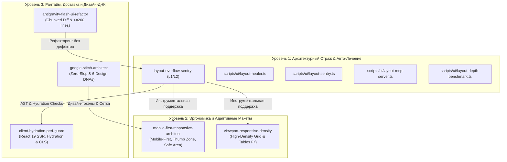

# SPEC-2026-09-13-UNIFIED-LAYOUT-SKILLS-SYNTHESIS (v1.0)
## Системная спецификация синтеза лучших практик верстки (Claude, Gemini, Cursor, Vercel, GitHub) и унификации UI-скиллов OmniSMM 1.0

> **Статус:** DRAFT FOR HUMAN APPROVAL (Gate FA-2026 / RAC-2026)  
> **Дата:** 13 сентября 2026 г.  
> **Область:** Архитектура фронтенда, верстка, адаптивность, дизайн-система, MCP-инструменты платформы OmniSMM 1.0 (SMMplan / SMMflux).  
> **Нормативная база:** [RLS-2026 Standard](../standards/RESPONSIVE_LAYOUT_STANDARD_2026.md), W3C WCAG 2.2 Level AA, Apple HIG, ISO 9241-110:2020.

---

## 1. Контекст, Бизнес-цели и Проблема (Context & Motivation)

Платформа OmniSMM 1.0 обслуживает более 75% заказов с мобильных устройств (смартфоны 320–390px, Telegram WebApp), в то время как административный контур эксплуатируется на ноутбуках (1366x768) и десктопах. 

### Текущее состояние кодовой базы:
1. **Фрагментация скиллов:** В каталоге `.agents/skills/` присутствуют смежные скиллы разной степени зрелости:
   - Высокоразвитый комбайн `layout-overflow-sentry` (L1 `CORE.md` + L2 `SKILL.md` + AST-сканер + Auto-Healer + MCP-сервер).
   - Подробный `mobile-first-responsive-architect` (Mobile-First, Thumb Zone, Safe Area Insets, но без L1 `CORE.md`).
   - Рудиментарные стабы на 9–14 строк: `viewport-responsive-density`, `client-hydration-perf-guard`, `react-19-next-16-ui-engine`.
   - Специализированные скиллы: `antigravity-flash-ui-refactor` (Chunked Diff, декомпозиция $\le 200$ строк) и `google-stitch-architect` (Zero-Slop, 6 дизайн-ДНК).
2. **Дублирование инвариантов:** Правила лимита колонок таблиц (7–8 колонок) и Zero Horizontal Scroll размазаны между `layout-overflow-sentry`, `viewport-responsive-density` и корневым `AGENTS.md`.
3. **Разрыв в инструментах:** Инструмент `layout_dom_probe` в `scripts/ui/layout-mcp-server.ts` возвращает заглушку вместо вызова реального браузерного движка из `scripts/ui/layout-depth-benchmark.ts`.
4. **Недоиспользованный опыт индустрии:** Платформа нуждается в системной интеграции практик верстки мировых лидеров (Claude, Gemini, Cursor, Vercel, GitHub) в единую непротиворечивую матрицу.

---

## 2. Матрица лучших практик индустрии (Industry Synthesis Matrix)

| Вектор / Источник | Ключевая концепция | Архитектурная польза для OmniSMM | Место внедрения в платформе |
|---|---|---|---|
| **Anthropic (Claude)** | Defensive CSS & Fail-Closed Boundaries | Предотвращение распирания контейнеров длинными строками (`min-w-0`, `break-words`, `shrink-0`). | `layout-overflow-sentry`, `scripts/ui/layout-sentry.ts` |
| **Anthropic (Claude)** | Двухуровневая модель скиллов (L1/L2) | Минимизация расхода контекста: L1 `CORE.md` $\le 25$ строк для системных промптов, L2 `SKILL.md` для детальной работы. | Стандартизация всех UI-скиллов в `.agents/skills/` |
| **Google DeepMind (Gemini)** | Gemini Flash Chunked Diff & Decomposition | Запрет переписывания файлов > 200 строк монолитом. Декомпозиция View и Logic. Исключение галлюцинаций пропсов. | `antigravity-flash-ui-refactor`, `flash-component-decomposer` |
| **Google DeepMind (Gemini)** | Zero-Slop Bespoke Design & Fluid Scalability | Блокировка шаблонных ИИ-клише (purple on dark, pill badge fatigue), fluid-типографика `clamp()`. | `google-stitch-architect`, `bespoke-design-engine.ts` |
| **Cursor & MCP** | Automated Healer Codemods & Stdio MCP Tools | Автоматическое устранение дефектов на лету без ручной рутины (`npm run layout:fix`, MCP-инструменты для агентов). | `scripts/ui/layout-healer.ts`, `scripts/ui/layout-mcp-server.ts` |
| **Vercel (Next.js 16)** | Zero CLS & Suspense Geometry Reservation | Резервирование геометрии через `aspect-ratio` и скелетоны для исключения сдвигов макета при Streaming SSR. | `client-hydration-perf-guard`, `react-19-next-16-ui-engine` |
| **Vercel (Next.js 16 / React 19)** | HTML5 Strict Nesting & Hydration Immunity | Недопущение невалидной вложенности (`<button>` в `<button>`, `
` в `
`), использование `asChild`. | `layout-sentry.ts` (AST Inspector), `proxy.ts` |
| **GitHub (Primer DS)** | High-Density Data Grid & Viewport 100% Fit | Умещение сложных таблиц без нижнего скроллбара, лимит 7–9 колонок, вынос второстепенного в popovers. | `viewport-responsive-density`, `RLS-2026 Standard` |
| **GitHub / W3C** | WCAG 2.2 Level AA & Touch Target Ergonomics | Сенсорные зоны $\ge 44\text{px}$, видимый фокус клавиатуры `focus-visible`, Reflow на 320px при зуме 400%. | `mobile-first-responsive-architect`, `layout-depth-benchmark.ts` |

---

## 3. Системный GAP-анализ и устранение дублирования (GAP & Deduplication Analysis)

### 3.1. Устранение пересечений и разделение зон ответственности (Deduplication Rules)

1. **`layout-overflow-sentry` (Ядро контроля и автоматизации):**
   - Единая точка входа для CLI-скриптов (`layout:audit`, `layout:heal`, `layout:fix`, `layout:mcp`).
   - Отвечает за 5 базовых инвариантов геометрии: Zero Horizontal Scroll, Zero-Squash, iOS Auto-Zoom, DOM Nesting, Table Width Fit.
   - **Разрешение дублирования:** Забирает на себя механическую проверку и авто-исправление для всех остальных UI-скиллов.

2. **`mobile-first-responsive-architect` (Эргономика сенсорных интерфейсов):**
   - Зона ответственности: Mobile-First Mental Model, Thumb Zone Architecture (Easy/Reach/Hard зоны), Safe Area Insets, полиморфный рендеринг (Mobile Card Stack $\to$ Desktop Compact Table), защита от `:hover` sticky bug.
   - **GAP-фикс:** Создать L1 `CORE.md` ($\le 25$ строк) и дополнить норматив правилом Touch Target Size $\ge 44\text{px}$ по WCAG 2.2 AA.

3. **`viewport-responsive-density` (Плотность данных и витрины администрирования):**
   - **Текущая проблема:** 14-строчный стаб, дублирующий общие слова о 7–8 колонках.
   - **Решение:** Трансформировать в специализированный норматив компоновки плотных данных (High-Density Dashboard Standard): правила компоновки фильтров, адаптивные сплит-панели (Master-Detail), формулы ширины колонок (ID: `w-16`, дата: `w-24`, статус: `w-28`, сумма: `w-24 text-right`, экшены: `w-20 text-right`), лимит ширины текстовых полей `max-w-[160px] truncate`.

4. **`client-hydration-perf-guard` (Гидратация и стабильность макета):**
   - **Текущая проблема:** 9-строчный стаб.
   - **Решение:** Наполнить конкретными правилами предотвращения Cumulative Layout Shift (CLS < 0.05): обязательное резервирование высоты для скелетонов Suspense, `aspect-ratio` для динамических медиа, защита от расхождений времени/дат SSR (`suppressHydrationWarning`), уникальность SVG clip-path/gradient IDs.

5. **`react-19-next-16-ui-engine`:**
   - Сфокусировать строго на Action-First рантайме: хуки `useActionState`, `useOptimistic`, стриминг Server Components, переходы `useTransition` с защитой от мерцания макета.

---

## 4. Архитектурные доработки инструментов (Tooling Roadmap)

### 4.1. Модернизация Auto-Healer Codemod (`scripts/ui/layout-healer.ts`)
Расширить список авто-исправлений с текущих 5 типов до 8 типов:
1. `INJECT_SHRINK_0` (существует) — добавление `shrink-0` в Lucide/SVG.
2. `REPLACE_W_SCREEN` (существует) — замена `w-screen` на `w-full max-w-full`.
3. `ADD_MIN_W_0` (существует) — добавление `min-w-0` к элементам с `truncate`.
4. `FIX_IOS_INPUT_ZOOM` (существует) — апгрейд `text-xs` инпутов до `text-base sm:text-xs`.
5. `TABLE_W_FULL` (существует) — замена `min-w-[1000px]` таблиц на `w-full`.
6. `[NEW] INJECT_PB_SAFE` — добавление безопасного отступа `pb-safe` / `pb-[env(safe-area-inset-bottom)]` на фиксированные нижние панели (`fixed bottom-0`).
7. `[NEW] ENSURE_TOUCH_TARGET_MIN` — выявление и расширение микро-кнопок (`p-1` без `h-10 w-10`) через добавление тач-зоны.
8. `[NEW] BUTTON_TYPE_ATTRIBUTE` — автоматическое добавление `type="button"` на `<button>` без явного типа внутри форм.

### 4.2. Модернизация AST-инспектора (`scripts/ui/layout-sentry.ts`)
- Добавить детекцию элементов без резервирования размеров (отсутствие `aspect-*` или `min-h-*` у динамических плейсхолдеров).
- Добавить проверку отсутствия `alt` атрибутов и невалидных `role` атрибутов.
- Интегрировать автоматический запуск предрелизного аудита в `npm run audit:prod`.

### 4.3. Модернизация MCP-сервера (`scripts/ui/layout-mcp-server.ts`)
- Связать метод `layout_dom_probe` с реальным headless Chromium из `scripts/ui/layout-depth-benchmark.ts`, обеспечив возможность ИИ-агентам снимать физические замеры геометрии (`scrollWidth`, `clientWidth`, `culprits`) через стандартный MCP-протокол.

---

## 5. План верификации и контрольные гейты (Verification Plan)

### 5.1. Автоматизированные тесты (Vitest)
1. Расширение сьюта `src/__tests__/skills/layout-overflow-sentry.test.ts`:
   - Тестирование новых типов авто-лечения (`INJECT_PB_SAFE`, `BUTTON_TYPE_ATTRIBUTE`).
   - Проверка всех L1 `CORE.md` файлов на соответствие лимиту $\le 25$ строк.
2. Создание юнит-тестов для обновленного MCP-сервера с живым DOM-пробингом.
3. Прогон всего регрессионного сьюта: `npm run test` и `npx tsc --noEmit`.

### 5.2. Живое тестирование в браузере (Chromium Benchmark)
- Запуск `npx tsx scripts/ui/layout-depth-benchmark.ts` по 5 контрольным устройствам:
  - iPhone SE (`375x667px`): Дельта переполнения = 0px, сжатых иконок = 0.
  - iPhone 16 Pro (`390x844px`): Все сенсорные элементы $\ge 44\text{px}$.
  - iPad Mini (`768x1024px`): Двухколоночный макет без скролла.
  - Budget Laptop (`1366x768px`): Таблицы данных 100% Fit.
  - Full HD Desktop (`1920x1080px`): Отсутствие распирания контейнеров.

### 5.3. Премортем-анализ рисков (Pre-Mortem Failure Simulation)

| Сценарий гипотетического отказа | Вероятность x Влияние | Защитный механизм (Fail-Closed Guard) |
|---|---|---|
| **1. Ложные срабатывания Auto-Healer:** Авто-замена `w-screen` ломает полноэкранный лендинг Hero-фон. | Средняя x Средняя | Использование AST-скоупинга: замена только внутри компонентов контента; фоновые секции используют эластичный `w-full max-w-full overflow-hidden`. |
| **2. Конфликт L1 контекста при вызове нескольких скиллов:** Превышение лимита токенов в промпте. | Низкая x Высокая | Жесткий лимит L1 `CORE.md` $\le 25$ строк. Суммарный объем 5 скиллов верстки $\le 120$ строк (~600 токенов). |
| **3. Поломка SSR-гидратации при инъекции классов:** React 19 выдает предупреждение о несовпадении классов между сервером и клиентом. | Низкая x Критическая | Auto-Healer работает строго статически по исходному коду `.tsx` до сборки Next.js. Классы компилируются синхронно на сервере и клиенте. |

---

## 6. Приемочные критерии (Release Acceptance Criteria RAC-2026)

- [ ] Архитектурная спецификация согласована пользователем (Human Approval Gate FA-2026).
- [ ] Все 4 обновленных скилла приведены к формату L1 `CORE.md` ($\le 25$ строк) + L2 `SKILL.md`.
- [ ] Стабы `viewport-responsive-density` и `client-hydration-perf-guard` расширены до полноценных руководств.
- [ ] Скрипт `scripts/ui/layout-mcp-server.ts` поддерживает реальный DOM-пробинг через Chromium.
- [ ] Автотесты Vitest выполняются со 100% результатом (PASS).
- [ ] TypeScript `npx tsc --noEmit` выдает 0 ошибок.
