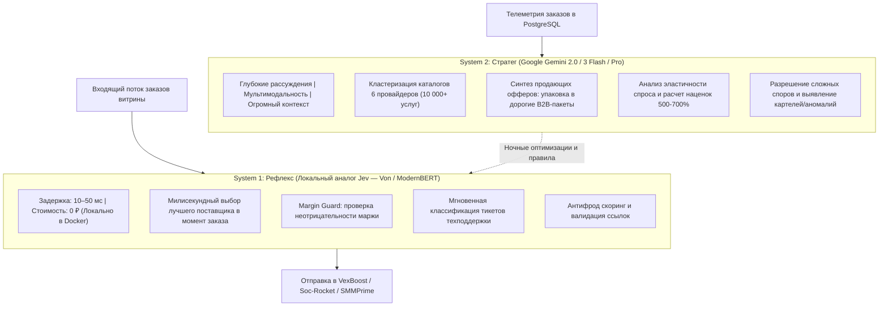

# SPEC-2026-09-24: Двухуровневый AI-движок сверхвысокой маржинальности (Gemini System 2 + System 1 Jev-Analog)

> **Статус:** 📋 APPROVED / BACKLOG  
> **Версия:** 1.0.0 (RAC-2026)  
> **Область действия:** OmniSMM 1.0 (Core Pricing, Routing, Provider Intelligence, Storefront Packaging)  
> **Бизнес-цель:** Максимизация чистой прибыли платформы через продажу премиум-услуг с наценкой 500–700%+, бесшумный кросс-провайдерный арбитраж и автоматический контроль надежности.

---

## 1. Бизнес-контекст и проблема

1. **Проблема традиционных SMM-панелей:**
   - Демпинг и конкуренция за копейки (наценка 15–30%), съедаемая эквайрингом (3.5%), налогами (6% УСН) и возвратами.
   - Клиенты с деньгами (бизнес, эксперты, крипто-проекты, агентства) избегают дешевых услуг из-за страха блокировки или списания каналов.
   - Ручной мониторинг цен поставщиков отстает от изменений курсов валют и тарифов.

2. **Ключевой инсайт:**
   - Премиум-клиенты охотно платят **500–700% наценки** (например, 245–350 ₽ за 1000 подписчиков при оптовой цене 35 ₽), если услуга гарантирует:
     - 100% отсутствие списаний и защиту от банов (органический темп, Smart Drip).
     - Прозрачные чеки 54-ФЗ и безналичные счета для юридических лиц.
     - Безупречное визуальное и смысловое оформление (отсутствие жаргона "боты/накрутка").
     - Автоматический превентивный долив (Silent Auto-Refill Sentinel) до того, как клиент заметит отписку.

---

## 2. Архитектура решения: Тандем System 1 + System 2

---

## 3. Функциональные модули системы

### Модуль 1: Golden Catalog Synthesizer (Gemini System 2)
- **Функция:** Периодический анализ сырых услуг 6 подключенных провайдеров (`VexBoost`, `Soc-Rocket`, `SMMPrime`, `Stream-Promotion`, `ProSMM-Shop`, `SMMPanelUS`).
- **Выходные данные:** 
  - Формирование «Золотого каталога» топ-50 услуг с высокой надежностью.
  - Генерация премиальных названий, продающих описаний, бейджей гарантии (без технических терминов провайдеров).
  - Упаковка в комплексные бандлы («Запуск Telegram-канала под ключ», «Упаковка бренда в VK»).

### Модуль 2: Millisecond Cross-Provider Arbitrage (System 1)
- **Функция:** В момент нажатия «Оформить заказ» System 1 за $< 30$мс:
  - Резолвит кластер услуги (находит аналоги у всех 6 провайдеров).
  - Сверяет актуальные валютные курсы (USD/RUB через `SettingsProvider.getExchangeRateUSD()`).
  - Рассчитывает показатель True Cost:
    $$\text{True Cost} = \frac{\text{Провайдерская цена}}{\text{Коэффициент надежности}} + \text{Издержки возвратов}$$
  - Направляет заказ поставщику с наименьшим True Cost.
  - Назначает горячий резерв (`failover`) на случай сбоя основного шлюза.

### Модуль 3: Dynamic 500–700% Margin Optimizer
- **Сегментация каталога:**
  1. **Traffic Drivers (KVI):** наценка 30–50% (дешевые просмотры, реакции) для привлечения базы.
  2. **High-Margin Premium:** наценка 500–700%+ (подписчики с гарантией, целевые просмотры, комментарии).
  3. **Safety Margin Floor:** жесткое аппаратное ограничение — чистая маржа после всех комиссий и налогов $\ge 18\%$.

### Модуль 4: Silent Auto-Refill Sentinel
- Фоновый демон в BullMQ:
  - Мониторит статус выполнения и динамику целевого канала/профиля после завершения заказа.
  - При обнаружении списания $> 2\%$ автоматически инициирует гарантийный долив (`Refill`) через API провайдера без участия клиента.

---

## 4. Интеграция с существующим стеком OmniSMM 1.0

- **БД (Prisma):** Переиспользование существующих моделей `Provider`, `ServiceRoute`, `Service`, `SystemSettings`.
- **Сервисы:** Расширение `AiEconomicOptimizerService`, `SmartRoutingService`, `MarginGuard`.
- **Фоновые воркеры:** Интеграция в `smmplan_lite_worker` через отдельный процессор `ai-economic-optimizer.processor.ts`.
- **Административный интерфейс:** Вкладка в `/admin/finance` и `/admin/providers/routing` с отображением матрицы маржинальности и кнопкой «Применить оптимизацию цен в 1 клик».

---

## 5. Метрики успеха (KPIs)

1. **Рост средней чистой маржи платформы:** с 25% до $\ge 65\%$.
2. **Снижение отмен заказов:** до $< 1.5\%$ за счет динамического переключения на надежных провайдеров.
3. **Автоматизация арбитража:** 100% заказов маршрутизируются без ручного вмешательства администратора.
4. **Безопасность:** 0 транзакций с отрицательной или нулевой маржой.
