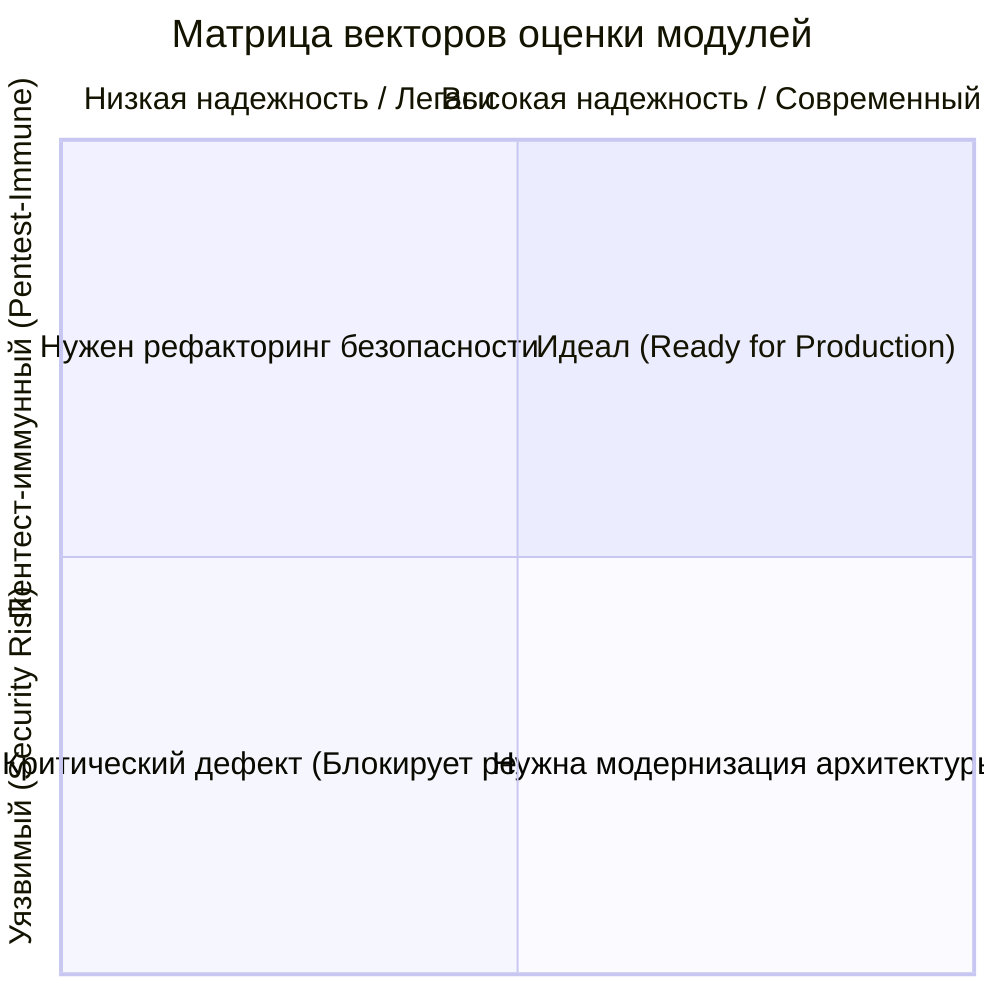
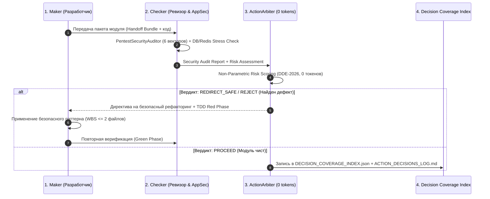

# SPEC-2026-09-29: Pre-Production Full-Spectrum Wave Audit Plan
## Сквозной волновой план предпродакшн-аудита OmniSMM 1.0 через Dual Agent Improving Loop & ActionArbiter
### (Редакция v2.0: Харденинг по результатам Состязательного Аудита Ревизора / Maker-Checker Protocol)

---

### 1. Цель и Назначение (Vision & Goals)

Перед выкаткой платформы **OmniSMM 1.0** (бренды **SMMplan** и **SMMflux**) в промышленную эксплуатацию (Production) проводится системная, 100% верификация каждого модуля системы.
Проверка выполняется с использованием автономного инженерного конвейера **Dual Agent Self-Improving Loop** (триада: **Maker** $\to$ **Checker / AppSec Red Team** $\to$ **ActionArbiter**).

**Ключевые цели:**
1. **Математически доказуемое 100% покрытие решений (Decision Coverage):** Каждое архитектурное решение в модулях проходит детерминированную проверку через `ActionArbiter` с обязательной фиксацией в машиночитаемом индексе `.planning/DECISION_COVERAGE_INDEX.json` и протоколе `.planning/ACTION_DECISIONS_LOG.md`.
2. **Ликвидация небезопасных паттернов (Zero Security Vulnerabilities):** Защита от проникновений (OWASP Top 10:2025, PCI DSS v4.0.1, 152-ФЗ, IDOR, SSRF, TOCTOU, Timing Attacks).
3. **Зачистка устаревшего кода (Zero Technical Debt & Deprecations):** Удаление устаревших API Next.js 16 / React 19, мертвых ветвей логики, дублирующих абстракций.
4. **Безупречное качество кода (No-Crutch Policy):** 0 `any`, 0 `@ts-ignore`, 0 необработанных промисов, типизированные Server Actions `{ success, error }`.
5. **Глубокий аудит Хранилищ (PostgreSQL & Redis Deep Dive):**
   - **PostgreSQL:** RLS изоляция, аудит внешних ключей без индексов (Unindexed Foreign Keys), защита от дедлоков (P2034/P2028), целостность транзакций, обязательный Pre-Flight Rollback Snapshot.
   - **Redis & BullMQ:** SEC-001 (Auth & TLS), защита от утечек памяти (BullMQ retention `removeOnComplete`/`removeOnFail`), Graceful Shutdown воркеров при `SIGTERM`, Zombie Lock TTL safety.
6. **Строгая изоляция контура (BGS-2026 Protocol):**
   - Все нагрузочные и визуальные проверки проводятся строго в изолированной Stage-песочнице (порт `:3005`), боевой прод (`:3000`) неприкосновенен.
   - Финансовые тесты запускаются на выделенной тестовой базе (`.env.test`), исключая засорение реального леджера и фискального учета 54-ФЗ.

---

### 2. Матрица 5 Векторов Аудита каждого Модуля

Каждый модуль платформы тестируется и оценивается по 5 нормативным векторам:



1. 🛡️ **Вектор 1: Безопасность и Пентест-Иммунитет (Pentest Immunity & AppSec)**
   - Проверка через `PentestSecurityAuditor` (6 векторов атак).
   - Защита от IDOR/BOLA в Server Actions и API (`verifySession`, `requireStaffPermission`).
   - Использование `crypto.timingSafeEqual` для сверки секретов и хэшей вебхуков.
   - Защита от SSRF через `safeFetch` при взаимодействии с внешними провайдерами.
   - Наличие `RateLimitService` на публичных и финансовых эндпоинтах.
   - Изоляция тенантов (RLS в PostgreSQL, барьер ст. 54.1 НК РФ между SMMplan и SMMflux).

2. ⌛ **Вектор 2: Актуальность и Отсутствие Устаревших Решений (Obsolescence & Modernity)**
   - Соответствие стеку 2026: Next.js 16 App Router, React 19, Tailwind CSS 4 (`@theme`), HeroUI v3.
   - Использование `src/proxy.ts` (Next.js 16 proxy) вместо устаревшего `middleware.ts`.
   - Запрет устаревших хуков и несовместимых библиотек.
   - Ликвидация мертвого кода (Dead-Code Pruning).

3. 🧹 **Вектор 3: Качество Кода и Стандарты (Code Hygiene & Strict Types)**
   - No-Crutch Policy: 0 `any`, 0 `eslint-disable`, 0 `@ts-ignore`.
   - Границы слоев: отсутствие `"use server"` в `page.tsx` (строго в `src/actions/`).
   - Лимит размера файлов ($\le 200$ строк на компонент/экшен, декомпозиция монолитов).
   - Единый контракт возврата Server Actions: `{ success: true, data } | { success: false, error: string }`.

4. ⚙️ **Вектор 4: Работоспособность, ACID и Хранилища (PostgreSQL & Redis SRE)**
   - **PostgreSQL:** Чистый `BigInt` (копейки, ExactMath), Ledger-First принцип, Row-Level Locking, устранение TOCTOU и дедлоков (P2034/P2028), аудит Unindexed FK, Pre-Flight Rollback Snapshot.
   - **Redis:** SEC-001 (Redis Auth & TLS), очереди BullMQ с уникальными `jobId` и экспоненциальным бэкоффом, Graceful Shutdown (`SIGTERM`), жесткие лимиты Retention (`removeOnComplete`/`removeOnFail`), Singleflight Mutex, Lock TTL.

5. 🌐 **Вектор 5: Контурная изоляция и протокол BGS-2026 (Stage Isolation)**
   - Изоляция боевого трафика `:3000` от стейджа `:3005`.
   - Тестирование многоролевых пользовательских путей через Puppeteer / Playwright.
   - Изоляция финансовой БД (тестовая песочница, 0 реальных вызовов в боевой фискальный учет).

---

### 3. Регламент работы Триады в каждой Волне



---

### 4. Детализированная Карта 6 Волн Аудита

#### 🌊 ВОЛНА 1: Ядро Хранилищ & Конкурентность (PostgreSQL, Prisma, RLS, Redis & BullMQ)
*Приоритет: КРИТИЧЕСКИЙ (Фундамент платформы).*
* **Обязательный Pre-Flight Rollback Snapshot:** Перед началом любых модификаций схемы или транзакций создается логический/физический снимок базы данных (`pg_dump -Fc smmplan_backup_preflight.dump`).
* **Модули аудита:**
  1. `prisma/schema.prisma` — аудит моделей, типов полей (`BigInt` vs `Decimal`/`Float`), составных уникальных индексов, каскадных удалений (`Cascade` vs `Restrict`).
  2. **Аудит Unindexed Foreign Keys (PostgreSQL):** Проверка всех внешних ключей через системные каталоги PostgreSQL на наличие покрывающих B-Tree индексов для исключения Sequential Scan и блокировок всей таблицы при каскадных операциях.
  3. `src/lib/transactions.ts` & `src/lib/db.ts` — `runSerializableTransaction`, retry-политика дедлоков (P2034, P2028), тайм-ауты транзакций, предотвращение Transaction Escape (`db` vs `tx`).
  4. `src/lib/prisma-tenant-enforcer.ts` & RLS — изоляция `tenantId` в PostgreSQL, проверка `SET LOCAL ROLE app_user` и `set_config('app.current_tenant')`.
  5. `src/lib/redis.ts` — SEC-001 Hardening (Auth & TLS), изоляция ключей по тенантам, обработка сбоев сокета.
  6. `src/lib/queue-manager.ts` & `src/workers/**`:
     - **Graceful Shutdown:** Обработка `SIGTERM` / `SIGINT` воркерами через `await worker.close()` с завершением текущих активных задач.
     - **Retention Safety:** Наличие `removeOnComplete` (100) и `removeOnFail` (500) на 100% очередей для предотвращения OOM Redis.
     - **Дедупликация:** Уникальный `jobId` с таймстемпом, экспоненциальный бэкофф.
  7. `src/services/core/rate-limit.service.ts` & Redis Locks — атомарные lua-скрипты лимитирования, жесткий TTL блокировок (Zombie Lock Prevention) с освобождением в `finally`.

#### 🌊 ВОЛНА 2: Финтех, Леджер и Платежные Шлюзы (ExactMath, Ledger-First, 54-ФЗ, Webhooks)
*Приоритет: КРИТИЧЕСКИЙ (Финансовая безопасность и законность).*
* **Строгая изоляция тестового контура (Test DB Partitioning):** Все финансовые тесты исполняются строго на изолированной тестовой БД (`.env.test`) или в виртуальных песочных тенантах с `ROLLBACK`. Нулевой риск загрязнения боевого леджера.
* **Модули аудита:**
  1. `src/services/financial/wallet-ops.ts` — Ledger-First принцип, `idempotencyKey` на всех операциях списания и пополнения, предотвращение отрицательного баланса.
  2. `src/lib/financial/exact-math.ts` — 100% отсутствие плавающей точки (`Math.round`, `parseFloat`) в денежных расчетах.
  3. `src/services/financial/payment.service.ts` & `unified-payment.service.ts` — идемпотентное подтверждение платежей, сверка с банковскими шлюзами.
  4. `src/app/api/webhooks/payment/**` (YooKassa, CryptoBot, Robokassa) — сверка подписей через `crypto.timingSafeEqual`, Fail-Closed, Tenant-Bypass первичного поиска. Изоляция: 0 реальных вызовов в боевые банки при тестах.
  5. `src/services/financial/compensation.service.ts` & `refund-policy.service.ts` — защита от двойных возвратов, суточный лимит компенсаций оператора (`supportLimitCents`).
  6. 54-ФЗ и фискализация (НДС 22%, контроль совокупной выручки 20 млн ₽ по ст. 145 НК РФ, исключение нефискализируемых операций `referral_transfer`, `test`).

#### 🌊 ВОЛНА 3: Движок Заказов, Диспетчеризация и Поставщики (Order Engine, Providers, Hot-Swap, Workers)
*Приоритет: ВЫСОКИЙ (Выручка и стабильность исполнения).*
* **Модули аудита:**
  1. `src/services/orders/checkout-pipeline.service.ts` & `checkout-transaction.service.ts` — Drip-Feed Floor инвариант ($\lfloor Q/N \rfloor \ge \text{minQty}$), списание и создание заказа в одной атомарной транзакции.
  2. `src/services/provider/order-dispatch.service.ts` — безопасная отправка заказов внешним API, санитизация ссылок через `safeFetch`.
  3. `src/services/provider/smart-recovery.engine.ts` — проверка `MarginGuard.checkMargin` при Hot-Swap провайдеров (защита от отрицательной маржи).
  4. `src/workers/processors/sync.processor.ts` — защита от затирания терминальных статусов заказов (`COMPLETED`, `CANCELLED`, `PARTIAL`).
  5. `src/workers/processors/refill.processor.ts` — CAS-переходы статусов, дедупликация задач гарантийного восстановления.
  6. `src/services/provider/shadow-catalog.service.ts` — SHA-256 буферизация в Redis, Singleflight Mutex против Cache Stampede.

#### 🌊 ВОЛНА 4: Безопасность Периметра, Auth & Multi-Tenant (Proxy, RBAC, IDOR Gate, Sessions)
*Приоритет: ВЫСОКИЙ (Защита от проникновения).*
* **Модули аудита:**
  1. `src/proxy.ts` — CSP Strict-Dynamic (зачистка `'unsafe-inline'`), Nonce-генерация, RFC 9116 (`security.txt`), RFC 9331 (`RateLimit`).
  2. `src/lib/session.ts` — криптографическая стойкость JWT/Cookie, флаги `HttpOnly`, `SameSite=Lax`, `Secure`.
  3. `src/lib/server/rbac.ts` — гранулярный доступ `requireStaffPermission()`, блокировка IDOR/BOLA для действий над чужими аккаунтами.
  4. `src/actions/admin/**` (100% Server Actions админки) — проверка прав персонала, самоблокировка изменения своих прав (Lesson 4).
  5. `src/actions/customer/**` & `src/actions/user/**` — верификация сессий, защита от подмены `userId`.
  6. Мульти-тенантная изоляция брендов SMMplan (`smmplan.pro`) и SMMflux (`smmflux.ru`).

#### 🌊 ВОЛНА 5: Омниканальный Саппорт и Коммуникации (OmniChat, Telegram Bot, Inbound Email, SSE, AI Copilot)
*Приоритет: СРЕДНИЙ-ВЫСОКИЙ (Клиентский опыт и безопасность общения).*
* **Модули аудита:**
  1. `src/services/support/ticket.service.ts` — Single-Active-Thread Invariant (1 Пользователь = 1 Чат на тенант), исключение фрагментации тикетов при проверке платежей и email.
  2. `src/services/support/support-bot.service.ts` — Telegram Bot интеграция, обработка медиафайлов, ретраи.
  3. `src/app/api/webhooks/inbound-email/route.ts` — безопасный парсинг входящих писем, санитизация вложений.
  4. `src/services/support/ai-copilot.service.ts` & `ai-response-sanitizer.ts` — защита от Prompt Injection (MITRE ATLAS), фильтрация системных промптов и внутренних инструкций от утечки клиенту.
  5. `src/services/support/sse.service.ts` — Server-Sent Events стриминг, закрытие зависших соединений.
  6. `src/app/admin/tickets/**` — User-Centric Sidebar (1 карточка на 1 клиента, Zero-Scroll компоновка).

#### 🌊 ВОЛНА 6: Витрины, Клиентский Чекаут и Доступность (Storefront, Checkout Wizard, Mobile CRO, React 19)
*Приоритет: СРЕДНИЙ (Конверсия и надежность интерфейса).*
* **Протокол BGS-2026 на порту `:3005`:** Визуальный аудит и проверка верстки проводятся строго в Stage-контуре (`:3005`) без влияния на боевой порт `:3000`.
* **Модули аудита:**
  1. `src/components/landing/order-engine/**` & `PlanFullscreenCheckout.tsx` — Never-Disabled Submit, Live Target Preview, мобильная эргономика (Touch Target $\ge 44\text{px}$).
  2. HeroUI v3 Compound Components — использование Dot-Notation API (`<Table.Header>`, `<Table.Column>`), исключение устаревших плоских пропсов.
  3. Доступность WCAG 2.2 Level AA (контрастность $\ge 4.5:1$, навигация с клавиатуры).
  4. React 19 Hydration — Zero Hydration Mismatch, CLS $< 0.05$.
  5. Отсутствие утечек секретов в клиентском бандле (`node scripts/check-bundle-secrets.mjs`).

---

### 5. Машиночитаемый Контроль 100% Покрытия Решений

1. Все архитектурные решения по каждому модулю фиксируются в машиночитаемом файле **`.planning/DECISION_COVERAGE_INDEX.json`**:
   ```json
   {
     "lastUpdated": "2026-09-29T11:15:00Z",
     "totalDecisionPoints": 42,
     "evaluatedDecisions": 42,
     "coveragePercentage": 100.0,
     "decisions": [
       { "id": "DEC-W1-001", "wave": 1, "module": "prisma/schema.prisma", "verdict": "PROCEED", "riskScore": 15 },
       { "id": "DEC-W1-002", "wave": 1, "module": "src/lib/queue-manager.ts", "verdict": "REDIRECT_SAFE", "riskScore": 20 }
     ]
   }
   ```
2. Валидация выполняется через автоматический скрипт:
   ```bash
   npx tsx scripts/ci/verify-decision-coverage.ts
   ```
   Скрипт проверяет `coveragePercentage === 100.0` и отсутствие нерассмотренных модулей.
3. По каждой волне создается отчет в `.planning/WAVE_{N}_AUDIT_REPORT.md`.
4. Каждое архитектурное улучшение сопровождается юнит-тестами в `src/__tests__/unit/` (Red $\to$ Green Phase) и фиксацией `ADR` в `MEMORY.md`.
5. Итоговый статус фиксируется в `CURRENT_STATE.md`.
