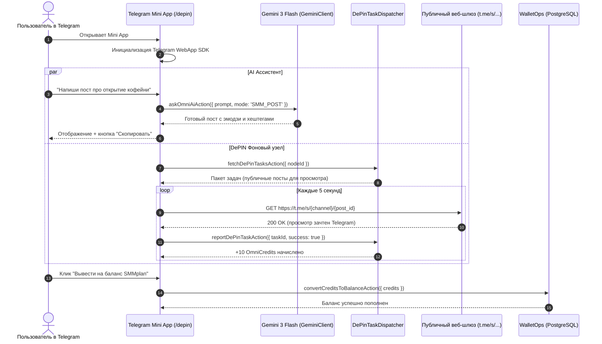

# SPEC-2026-09-30: DePIN Phase 1 — Telegram Mini App AI-Ассистент и фоновый узел микро-задач

## 1. Назначение и Архитектура

### 1.1. Цель этапа
Создать виральный клиентский Telegram Mini App (TMA), совмещающий:
1. **Потребительскую ценность:** Бесплатный карманный ИИ-помощник (Gemini 3 Flash) для авторов каналов, маркетологов и обычных пользователей (генерация постов, рерайт, суммаризация, хештеги).
2. **Производственную мощность платформы:** Клиентский узел распределенной сети (DePIN Node), который во время работы приложения выполняет фоновые веб-просмотры постов Telegram без серверной нагрузки и риска бана аккаунтов.
3. **Экономику вознаграждения:** Начисление баллов `OmniCredits` за подтвержденные просмотры с возможностью конвертации в реальный баланс кошелька OmniSMM (`WalletOps.credit`).

---

## 2. Архитектурная диаграмма



---

## 3. Спецификация контрактов (Zod DTO)

```typescript
export const AskOmniAiSchema = z.object({
  prompt: z.string().min(1, 'Промпт не может быть пустым').max(4000, 'Слишком длинный промпт'),
  mode: z.enum(['CHAT', 'SMM_POST', 'SUMMARIZE', 'REWRITE']).default('CHAT'),
  systemPrompt: z.string().max(1000).optional(),
});

export const DePinTaskReportSchema = z.object({
  nodeId: z.string().min(3),
  taskId: z.string().min(3),
  target: z.string().min(5),
  success: z.boolean(),
  durationMs: z.number().int().nonnegative().optional(),
});

export const ConvertCreditsSchema = z.object({
  credits: z.number().int().min(100, 'Минимум 100 кредитов для конвертации (1.00 ₽)'),
  userId: z.string().min(1),
});
```

---

## 4. План реализации и критерии приемки

- [ ] **Компонент 1:** `DePinTaskDispatcher` (`src/services/depin/task-dispatcher.ts`) — генерация очереди микро-заданий, валидация отчетов, баланс кредитов.
- [ ] **Компонент 2:** Server Actions `src/actions/depin/ai-assistant.ts` — `askOmniAiAction`, `fetchDePinTasksAction`, `reportDePinTaskAction`, `convertCreditsToBalanceAction`.
- [ ] **Компонент 3:** Telegram Mini App UI `src/app/depin/page.tsx` — эргономичный мобильный интерфейс с вкладками AI-Чата и DePIN Узла.
- [ ] **Компонент 4:** Интеграция в меню Telegram-бота (`src/bot/utils/menu-navigation.ts`).
- [ ] **Компонент 5:** 100% покрытие TDD юнит-тестами, `npm run lint:zero-any`, `npx tsc --noEmit`.
