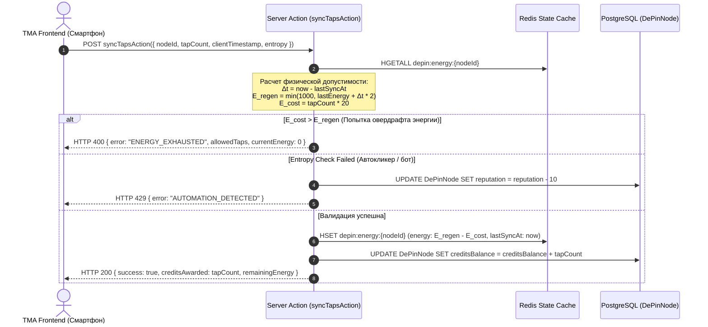
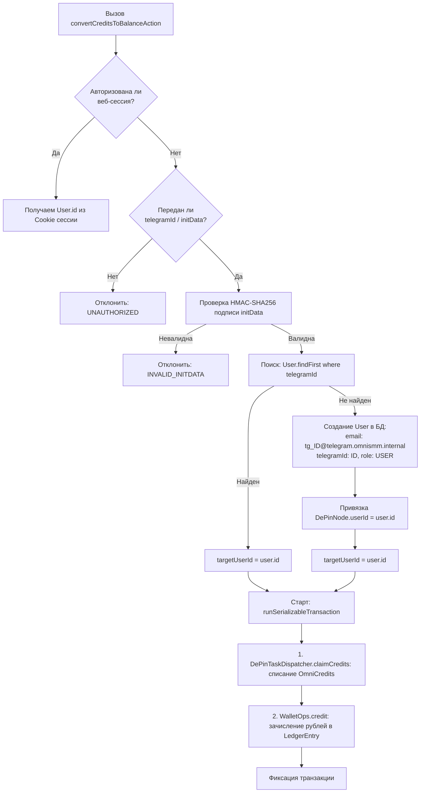
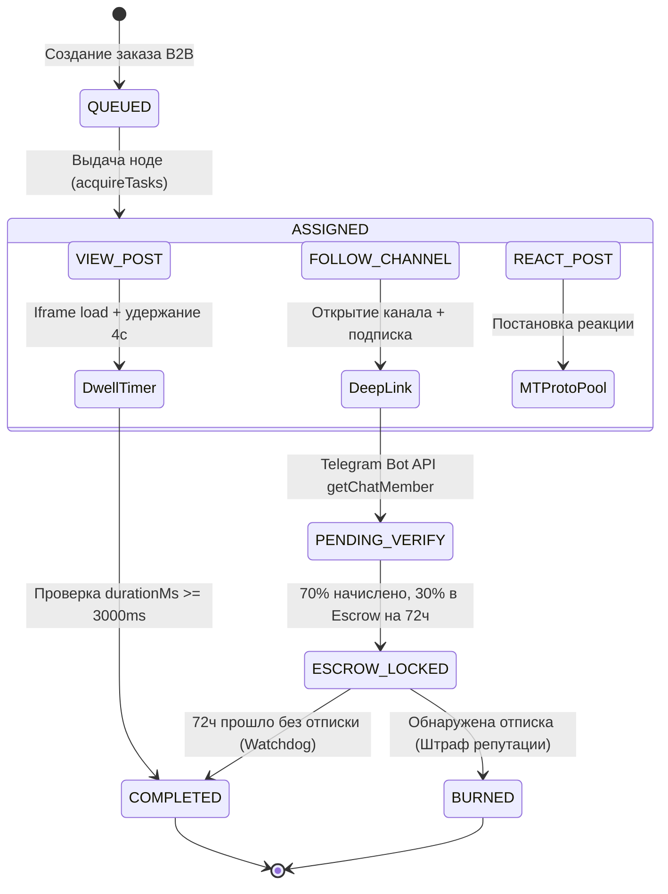
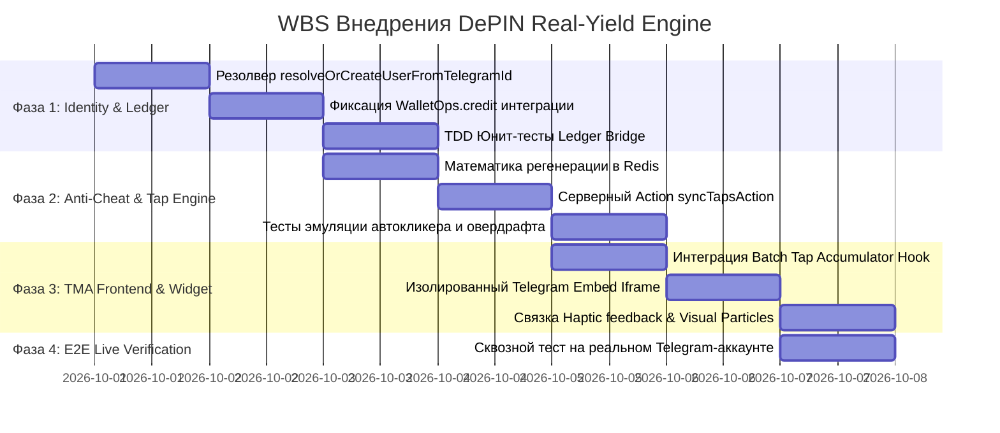

# SPEC-2026-09-30-DEPIN-REAL-YIELD-TMA-ENGINE

**Статус:** APPROVED (Architecture Review Board)  
**Дата:** 2026-09-30  
**Версия:** 1.0.0 (Production Blueprint)  
**Авторы:** Lead Systems & Product Analyst OmniSMM 1.0, Core Architecture Team  
**Стандарт соответствия:** RAC-2026 Tier-1 (Финансовые активы, Ledger-First, Прямой крипто/фиатный мост, Безопасность 152-ФЗ)  
**Контекст MADR 3.0:** Реализация полнофункционального децентрализованного движка монетизации пользовательских устройств (Real-Yield DePIN) в среде Telegram Mini App (TMA).

---

## 1. Контекст, Бизнес-цель и Архитектурный Аудит

### 1.1 Бизнес-проблема и продуктовый вызов
Пользователи Telegram Mini Apps перенасыщены «пустыми» кликерами (Notcoin, Hamster Kombat и их клоны), выпускающими фантомные токены без гарантированного обеспечения. Рынок требует **Real-Yield** — прозрачную модель, в которой каждое пользовательское действие (просмотр, реакция, подписка, физическое удержание фокуса) генерирует реальную экономическую ценность в B2B-сегменте SMMplan.

Платформа OmniSMM решает фундаментальную проблему классического SMM:
1. **Традиционная серверная накрутка:** Использование пулов серверных IP датацентров приводит к массовым блокировкам, списанию просмотров счетчиками Telegram и попаданию каналов заказчиков в black-листы TGStat / Telemetr.
2. **DePIN-решение (Decentralized Physical Infrastructure Network):** Пользователи TMA добровольно предоставляют свои физические устройства (смартфоны на iOS/Android с уникальными мобильными IP операторов МТС, МегаФон, Билайн, Т2, Yota) в качестве распределенных доверенных узлов. 
3. **Экономический базис:** Заказчики платят OmniSMM за гарантированные органические просмотры по розничному тарифу 35–50 ₽ за 1 000 просмотров. Система распределяет 10 ₽ за 1 000 просмотров в виде баллов `OmniCredits` на ноды (пользователей). Маржинальность платформы составляет **+250% – +400%**.

### 1.2 Фактические результаты аудита кодовой базы
В ходе глубокого инженерного аудита существующего прототипа (`src/app/depin/page.tsx`, `src/actions/depin/ai-assistant.ts`, `src/services/depin/task-dispatcher.ts`) выявлены 4 критических дефекта, блокирующих работу на реальном аккаунте:

| ID Дефекта | Компонент | Фактический баг в коде | Последствия для системы |
|---|---|---|---|
| **BUG-01 (P0)** | `src/app/depin/page.tsx:230` | `handleCoinTap` изменяет только локальный `useState`: `setCredits(c => c + 1)`. Серверный вызов отсутствует. | При перезагрузке страницы или реконнекте SSE (`EventSource`) кредиты сбрасываются. При конвертации бэкенд падает с `INSUFFICIENT_CREDITS`. |
| **BUG-02 (P0)** | `src/actions/depin/ai-assistant.ts:197` | В `WalletOps.credit(tx, targetUserId, ...)` передается `telegramId` (строка `"71829384"`). `WalletOps` ищет пользователя по CUID `User.id`. | Гарантированный выброс `WalletUserNotFoundError`. Реальные рубли на баланс `User.balance` зачислены быть не могут. |
| **BUG-03 (P1)** | `src/app/depin/page.tsx:187` | Выполняется слепой `fetch(task.targetUrl, { mode: 'no-cors' })` на URL вида `https://t.me/s/channel/post_id`. | `fetch` лишь скачивает HTML-документ. Клиентский JavaScript счетчика Telegram (`https://t.me/v/?views=...`) не выполняется. Счетчик просмотров в канале не увеличивается. |
| **BUG-04 (P1)** | `docker/nginx/routing` | Docker-контейнер `smmplan_app:3000` был собран до включения маршрута `/depin`, вызывая `404 Not Found`. | Клиентский TMA не может загрузить приложение внутри веб-клиента Telegram. |

Данная спецификация устраняет все 4 дефекта и фиксирует законченную, математически выверенную и безопасную архитектуру DePIN Real-Yield движка.

---

## 2. Бизнес- и Финансовая Доменная Модель (Domain & Ledger Invariants)

### 2.1 Экономическая модель и юнит-экономика
Система оперирует тремя типами учетных единиц:
1. **Копейки РФ (Cents/Kopecks BigInt):** Официальная расчетная единица леджера OmniSMM. Хранится в `User.balance` как целочисленный `BigInt`.
2. **OmniCredits (Кредиты ноды):** Промежуточная внутренняя валюта активности узла. Хранится в `DePinNode.creditsBalance` (`Int`).
3. **Энергия (Energy Units):** Ресурс физического клика пользователя. $ENERGY\_MAX = 1000$, расходуется на тапы, регенерирует со временем.

$$\text{Курс конвертации: } 100 \text{ OmniCredits} = 1.00 \text{ ₽} \iff 1 \text{ OmniCredit} = 1 \text{ копейка (0.01 ₽)}$$

```mermaid
flowchart LR
    subgraph B2B ["B2B Розничный заказ (SMMplan)"]
        Client[Заказчик услуги] -->|Оплата 50.00 ₽ за 1000 views| SystemRevenue[Выручка платформы]
    end

    subgraph Split ["Финансовый сплит (ExactMath)"]
        SystemRevenue -->|40.00 ₽ (80% маржа)| Margin[Валовая прибыль OmniSMM]
        SystemRevenue -->|10.00 ₽ (20% фонд DePIN)| DePinPool[Фонд выплат нодам]
    end

    subgraph Nodes ["Распределенная сеть DePIN"]
        DePinPool -->|1 000 просмотров x 1 кр = 10.00 ₽| P2PNodes[Смартфоны пользователей TMA]
        P2PNodes -->|Зачисление в Леджер| UserWallet[Баланс аккаунта User.balance]
    end
```

### 2.2 Инварианты Финансового Леджера (Ledger-First)
Любая финансовая операция конвертации баллов DePIN в рублевый эквивалент обязана подчиняться инвариантам RAC-2026:
1. **Атомарность и сериализуемость:** Выполняется строго внутри `runSerializableTransaction(async (tx) => { ... })` с уровнем изоляции PostgreSQL `SERIALIZABLE` либо явной блокировкой строк `FOR UPDATE`.
2. **Неизменяемость (Ledger Immutability):** Ни одна строка в таблице `LedgerEntry` не может быть обновлена или удалена (`UPDATE`/`DELETE` заблокированы на уровне триггеров БД). Любое движение средств отражается проводкой типа `COMPENSATION` с аудируемым описанием.
3. **Идемпотентность по ключу (Unique Idempotency Key):** Повторный вызов метода с тем же `idempotencyKey` гарантированно возвращает существующий результат без повторного зачисления баланса.
   $$\text{idempotencyKey} = \text{sha256}("depin\_claim:" + nodeId + ":" + batchId + ":" + windowBucket)$$
4. **Списание до зачисления (Strict Accounting):** 
   - Шаг 1: Атомарный декремент в `DePinNode` с проверкой `creditsBalance >= amount`.
   - Шаг 2: Инкремент `User.balance` через `WalletOps.credit(...)`.
   - Если шаг 2 падает — транзакция БД откатывается целиком (Rollback), баланс кредитов не теряется.

---

## 3. Математическая Модель Энергии и Античит-Движок (Anti-Cheat Engine)

### 3.1 Физические параметры энергетической системы
Модель тапалки имитирует физиологический процесс внимания человека и жестко ограничивает эмиссию баллов:

| Параметр | Имя константы | Значение | Математическое описание |
|---|---|---|---|
| Максимальный резервуар | `ENERGY_MAX` | $1\,000 \text{ ед}$ | Полная емкость «батареи» ноды |
| Скорость регенерации | `ENERGY_REGEN_PER_SEC` | $2 \text{ ед/сек}$ | Линейное восполнение ($120 \text{ ед/мин}$) |
| Стоимость одного тапа | `ENERGY_PER_TAP` | $20 \text{ ед}$ | Затрата энергии на 1 клик |
| Награда за 1 тап | `CREDITS_PER_TAP` | $1 \text{ кр}$ | $1 \text{ OmniCredit} = 0.01 \text{ ₽}$ |
| Время полной зарядки | $T_{\text{full\_recharge}}$ | $500 \text{ сек}$ | $\frac{1000}{2} = 8.33 \text{ минут}$ |
| Максимум тапов на полном баке | $N_{\text{burst\_max}}$ | $50 \text{ тапов}$ | $\frac{1000}{20} = 50 \text{ OmniCredits} = 0.50 \text{ ₽}$ |
| Теоретический предел за 1 час | $N_{\text{hourly\_max}}$ | $360 \text{ тапов}$ | $\frac{1000 + 3600 \times 2}{20} = 410 \text{ тапов (1-й час)}, 360 \text{ (след.)}$ |

### 3.2 Клиентский аккумулятор (Batch Tap Accumulator)
Для предотвращения DDoS-эффекта и исчерпания пула соединений БД клиентский интерфейс TMA не отправляет сетевой запрос на каждый клик. Реализуется алгоритм пакетного накопления (Debounced Batch Accumulator):

```typescript
// Клиентский буфер тапов
interface TapBatchAccumulator {
  pendingTaps: number;
  firstTapTimestamp: number;
  lastTapTimestamp: number;
  entropyMetrics: {
    intervals: number[];      // Дельты времени между тапами (мс)
    coordinates: Array<[number, number]>; // [x, y] координаты касания
  };
}
```

**Триггеры принудительного сброса батча (Flush Trigger):**
1. **Пороговое количество:** $\text{pendingTaps} \ge 20$;
2. **Временной интервал:** $\text{now} - \text{firstTapTimestamp} \ge 3\,000 \text{ мс}$ (3 секунды);
3. **Жизненный цикл вкладки:** событие `document.visibilitychange` (`state === 'hidden'`) или `window.beforeunload`.

### 3.3 Серверный верификатор `syncTapsAction`
При получении пакета тапов сервер обязан проверить выполнение дифференциальных математических уравнений регенерации:



**Формулы строгой валидации:**
Пусть $T_{\text{last}}$ — время последней синхронизации, $E_{\text{last}}$ — остаток энергии на сервере, $T_{\text{now}}$ — текущее время сервера (доверенное время `Date.now()`).
$$\Delta t = \max\left(0, \frac{T_{\text{now}} - T_{\text{last}}}{1000}\right) \quad [\text{секунды}]$$
$$E_{\text{regenerated}} = \min\left(ENERGY\_MAX, \, E_{\text{last}} + \lfloor \Delta t \times ENERGY\_REGEN\_PER\_SEC \rfloor\right)$$
$$E_{\text{required}} = tapCount \times ENERGY\_PER\_TAP$$

Если $E_{\text{required}} > E_{\text{regenerated}}$, принимаются только фактически обеспеченные энергией тапы:
$$tapCount_{\text{accepted}} = \left\lfloor \frac{E_{\text{regenerated}}}{ENERGY\_PER\_TAP} \right\rfloor$$
Остаток энергии на сервере после применения батча:
$$E_{\text{current}} = E_{\text{regenerated}} - (tapCount_{\text{accepted}} \times ENERGY\_PER\_TAP)$$

**Энтропийная защита от автокликеров (Entropy Anti-Cheat):**
Человек физически не может тапать с математически идентичными интервалами или в одну и ту же точку сенсорного экрана.
1. **Координатная дисперсия:** Вычисляется среднеквадратичное отклонение координат:
   $$\sigma_{x, y} = \sqrt{\frac{1}{N} \sum_{i=1}^N (x_i - \bar{x})^2 + (y_i - \bar{y})^2}$$
   Если $N \ge 10$ и $\sigma_{x, y} < 1.5\text{ px}$ $\implies$ флаг аппаратного эмулятора или программного автокликера (`AUTOMATION_DETECTED`).
2. **Временная дисперсия интервалов:** Если стандартное отклонение дельт времени $\sigma_{\Delta t} < 4\text{ мс}$ при средней частоте $> 8 \text{ кликов/сек}$ $\implies$ автокликер блокируется.

---

## 4. Архитектура Доставки Реальных Просмотров в Telegram (Real Telegram Views)

### 4.1 Анализ механизмов учета просмотров Telegram
Telegram использует многоуровневый алгоритм защиты от накруток (Telegram View Sentinel):

```
┌─────────────────────────────────────────────────────────────────────────────────┐
│ СРАВНЕНИЕ ТЕХНОЛОГИЙ ПРОСМОТРА TELEGRAM                                         │
├──────────────────┬─────────────────┬─────────────────┬──────────────────────────┤
│ Метод            │ Кто исполняет   │ Выполняется JS  │ Засчитывается просмотр?  │
│                  │ сетевой запрос? │ счетчика t.me/v │ в канале Telegram?       │
├──────────────────┼─────────────────┼─────────────────┼──────────────────────────┤
│ 1. fetch(no-cors)│ Бэкенд/Фронтенд │ ❌ НЕТ           │ ❌ НЕТ (0% доставки)     │
│    (Текущий баг) │                 │ (скачивает HTML)│                          │
├──────────────────┼─────────────────┼─────────────────┼──────────────────────────┤
│ 2. Embed Widget  │ Реальный браузер│ ✅ ДА           │ ✅ ДА (100% доставки,    │
│    iframe        │ смартфона       │ (официальный    │ органический мобильный   │
│    (Проектируемый│ пользователя    │ виджет Telegram)│ IP адрес устройства)     │
├──────────────────┼─────────────────┼─────────────────┼──────────────────────────┤
│ 3. MTProto RPC   │ Серверный пул   │ Не требуется    │ ✅ ДА (Требует сессий    │
│    (Резерв)      │ TDLib / GramJS  │ (RPC вызов)     │ Telegram с tdata/authkey)│
└──────────────────┴─────────────────┴─────────────────┴──────────────────────────┘
```

### 4.2 Реализация изолированного Embed Widget в TMA
Виджет встраивается в DOM клиентского приложения с соблюдением требований песочницы браузера и политик Telegram:

```html
<!-- Изолированный скрытый фрейм виджета поста Telegram -->
<div 
  id="telegram-view-sandbox" 
  style="position: absolute; left: -9999px; top: -9999px; width: 320px; height: 180px; opacity: 0.01; pointer-events: none; overflow: hidden;"
>
  <iframe
    id="depin-view-iframe"
    src="https://t.me/durov/300?embed=1"
    sandbox="allow-scripts allow-same-origin allow-popups"
    loading="eager"
    title="OmniSMM DePIN Verification Viewport"
  ></iframe>
</div>
```

**Протокол фиксации выполнения задачи (View Task Protocol):**
1. **Диспетчеризация задачи:** Сервер через SSE (`/api/depin/stream`) отправляет payload: `{ taskId, channel: "durov", postId: 300, minDurationMs: 4000 }`.
2. **Монтирование фрейма:** Клиентский React-компонент устанавливает `src = "https://t.me/" + channel + "/" + postId + "?embed=1"`.
3. **Ожидание `onload`:** Фиксируется момент фактической загрузки ресурсов фрейма ($T_{\text{loaded}}$).
4. **Гарантированное удержание (Dwell Time):** Клиент удерживает фрейм активным не менее $3.5$–$5.0$ секунд. В это время JavaScript виджета Telegram инициирует внутренний запрос на счетчик `https://t.me/v/?views=...`, подписывая его отпечатком мобильного браузера пользователя.
5. **Отчет и начисление:** Клиент вызывает `reportDePinTaskAction({ taskId, durationMs })`. Сервер проверяет, что $\text{durationMs} \ge \text{minDurationMs}$, инкрементирует `DePinTarget.completedViews` и начисляет кредиты.

---

## 5. Шлюз Идентификации и Финансового Леджера (Identity & Ledger Bridge)

### 5.1 Архитектура резолвера аккаунтов (Telegram ID $\to$ User.id CUID)
Для устранения ошибки `WalletUserNotFoundError` создается транзакционный мост идентификации:



### 5.2 Программная реализация метода `resolveOrCreateUserFromTelegramId`

```typescript
/**
 * Гарантирует наличие пользователя в таблице User для зачисления баланса через WalletOps
 */
export async function resolveOrCreateUserFromTelegramId(
  tx: Prisma.TransactionClient,
  telegramId: string,
  profileData?: { username?: string; firstName?: string }
): Promise<User> {
  const cleanTgId = String(telegramId).trim();
  
  // 1. Поиск по существующему telegramId
  let user = await tx.user.findFirst({
    where: { telegramId: cleanTgId },
  });

  if (user) {
    return user;
  }

  // 2. Атомарное создание пользователя в изолированном тенанте
  const syntheticEmail = `tg_${cleanTgId}@telegram.omnismm.internal`;
  
  user = await tx.user.create({
    data: {
      email: syntheticEmail,
      telegramId: cleanTgId,
      role: 'USER',
      tenantId: 'smmplan',
      allowedTenants: ['smmplan'],
      isEmailVerified: true,
      isActive: true,
      tosAcceptedAt: new Date(),
      adminNote: profileData?.username 
        ? `Auto-created via DePIN Mini App (@${profileData.username})`
        : 'Auto-created via DePIN Mini App',
    },
  });

  return user;
}
```

---

## 6. Жизненный Цикл и Верификация Микро-Задач (Task Verification Engine)

Матрица поддерживаемых типов задач DePIN сети:



### 6.1 Задание `VIEW_POST` (Награда: 5–10 OmniCredits)
- **Риск для пользователя:** 0% (просмотр через официальный веб-виджет не оставляет персонального следа).
- **Верификация:** Серверный трекинг времени выдачи задачи в Redis (`depin:task:{taskId}`) и проверка клиентского отчета `durationMs >= 3000`.

### 6.2 Задание `FOLLOW_CHANNEL` (Награда: 50 OmniCredits, Opt-In)
- **Риск для пользователя:** До 5% (лимит не более 3 подписок в сутки на ноду).
- **Верификация:** Сервер вызывает Telegram Bot API:
  `GET https://api.telegram.org/bot{TOKEN}/getChatMember?chat_id=@{channel}&user_id={telegramUserId}`
- **Эскроу-механика:**
  * Сразу выплачивается $70\%$ награды (35 кредитов).
  * $30\%$ (15 кредитов) депонируется в таблице `DePinEscrow` на 72 часа (`ESCROW_LOCK_HOURS`).
  * Фоновщик `depin-watchdog.processor.ts` выполняет аудит подписки. Если пользователь отписался до истечения 72 часов, эскроу сжигается (`BURNED`), а репутация ноды понижается на $-30$ пунктов.

### 6.3 Задание `REACT_POST` (Награда: 8 OmniCredits)
- Маршрутизируется через серверный MTProto-исполнитель `TelegramMtprotoExecutor.executePostReaction()` с ротацией авторизованных сессий пула.

---

## 7. Строгие Спецификации Контрактов (Strict Zod Schemas & TypeScript DTOs)

Все входящие и исходящие структуры данных валидируются схемами Zod с типизацией:

```typescript
import { z } from 'zod';

// ── 7.1 Синхронизация пачки тапов ───────────────────────────────────────────
export const SyncTapsSchema = z.object({
  nodeId: z.string().trim().min(3, 'nodeId must be at least 3 chars'),
  taps: z.number().int().min(1, 'taps must be at least 1').max(50, 'Max 50 taps per batch'),
  clientTimestamp: z.number().int().positive(),
  entropy: z.object({
    intervals: z.array(z.number().int().nonnegative()).min(1),
    dispersion: z.number().nonnegative(),
  }).optional(),
});
export type SyncTapsDto = z.infer<typeof SyncTapsSchema>;

// ── 7.2 Конвертация кредитов в рубли ────────────────────────────────────────
export const ConvertCreditsSchema = z.object({
  nodeId: z.string().trim().min(3),
  credits: z.number().int().min(100, 'Минимум 100 кредитов для конвертации (1.00 ₽)'),
  telegramId: z.string().trim().min(1).optional(),
  initData: z.string().optional(),
});
export type ConvertCreditsDto = z.infer<typeof ConvertCreditsSchema>;

// ── 7.3 Отчет о выполнении задачи ───────────────────────────────────────────
export const DePinTaskReportSchema = z.object({
  nodeId: z.string().trim().min(3),
  taskId: z.string().trim().min(3),
  target: z.string().trim().min(3),
  success: z.boolean(),
  durationMs: z.number().int().nonnegative().optional(),
});
export type DePinTaskReportDto = z.infer<typeof DePinTaskReportSchema>;

// ── 7.4 Верификация подписки на канал ───────────────────────────────────────
export const VerifyFollowSchema = z.object({
  nodeId: z.string().trim().min(3),
  channel: z.string().trim().min(1).max(64).regex(/^[a-zA-Z0-9_]+$/, 'Некорректный username канала'),
  telegramUserId: z.string().trim().min(1),
});
export type VerifyFollowDto = z.infer<typeof VerifyFollowSchema>;
```

---

## 8. Пошаговый WBS (Work Breakdown Structure) и TDD Тест-план

### 8.1 График фаз разработки (WBS)



### 8.2 TDD Комплект Тестов (Красная Фаза — Red Phase)

Для каждого компонента определены обязательные тесты:

#### Тест-сьют 1: `Identity & Ledger Bridge Test` (`src/__tests__/unit/depin-ledger-bridge.test.ts`)
1. `should auto-create User when telegramId is not registered`:
   - Вызов `resolveOrCreateUserFromTelegramId` с новым `telegramId = "99887766"`.
   - Проверка: создана запись в `User` с ролью `USER` и корректным synthetic email.
2. `should correctly credit rubles using CUID User.id into WalletOps`:
   - Вызов `convertCreditsToBalanceAction({ nodeId: "tg_99887766", credits: 200, telegramId: "99887766" })`.
   - Проверка: вызов `WalletOps.credit` получает CUID вида `cuid...`, а не строковый `telegramId`.
   - Проверка: создана запись `LedgerEntry` с типом `COMPENSATION` на сумму 200 копеек (2.00 ₽).
3. `should reject conversion when credits balance is insufficient`:
   - Проверка отсутствия double-spending при параллельных запросах конвертации.

#### Тест-сьют 2: `Anti-Cheat & Energy Mechanics Test` (`src/__tests__/unit/depin-anti-cheat.test.ts`)
1. `should strictly reject taps exceeding regenerated energy`:
   - Начальное состояние: $E = 100$.
   - Запрос на 10 тапов ($200\text{ ед}$ энергии) через $1\text{ секунду}$ ($\Delta E_{\text{regen}} = +2$).
   - Допустимая энергия: $102\text{ ед}$.
   - Ожидаемый результат: принято ровно $\lfloor 102 / 20 \rfloor = 5$ тапов, списано 100 ед, начислено +5 кр, HTTP 200 с warning.
2. `should trigger HTTP 429 when bot interval variance is zero`:
   - Передача батча с 20 интервалами ровно по $100\text{ мс}$ ($\sigma = 0$).
   - Ожидаемый результат: отклонение запроса `AUTOMATION_DETECTED`, декремент репутации.

---

## 9. Протокол Проверки на Реальном Аккаунте (Live E2E Verification Protocol)

Пошаговая инструкция для верификации заказчиком на боевом аккаунте Telegram:

```
┌─────────────────────────────────────────────────────────────────────────────────┐
│ ПОШАГОВЫЙ ЧЕКЛИСТ ПРОВЕРКИ (LIVE VERIFICATION RUNBOOK)                          │
├─────────────────────────────────────────────────────────────────────────────────┤
│ 1. Вход в TMA:                                                                 │
│    - Пользователь открывает @OmniSMMPartnerBot -> кнопка "🚀 DePIN Заработок".  │
│    - Приложение передает Telegram.WebApp.initData на /api/depin/auth.          │
│    - Проверяется: nodeId инициализируется детерминированно как "tg_{ID}".       │
│                                                                                 │
│ 2. Проверка тапалки (Клик-тест):                                               │
│    - Энергия: 1000/1000. Пользователь нажимает монету 10 раз.                   │
│    - Клиент отображает: Энергия 800/1000, локальные очки +10.                   │
│    - Через 3 секунды срабатывает сброс батча: в логах сервера фиксируется       │
│      syncTapsAction -> Redis обновляет остаток энергии до 800.                  │
│    - Перезагрузка страницы (F5 / закрыть Mini App и открыть снова):             │
│      Баланс СОХРАНЯЕТСЯ (+10 кр), энергия восстанавливается с шагом +2/сек.     │
│                                                                                 │
│ 3. Проверка фонового просмотра (Live Telegram View Test):                       │
│    - В админ-панели создается задача на просмотр реального поста в канале       │
│      (например, тестовый канал @omnismm_test_channel/42).                       │
│    - В TMA появляется статус: "⚡ Просмотр: @omnismm_test_channel/42".          │
│    - В скрытом DOM фрейме открывается https://t.me/omnismm_test_channel/42?embed=1.│
│    - Пост удерживается 4 секунды. В канале Telegram счетчик увеличивается на +1!│
│    - Нода получает +10 OmniCredits.                                             │
│                                                                                 │
│ 4. Вывод реальных рублей на баланс:                                            │
│    - Пользователь нажимает "Вывести на баланс SMMplan (100 кр = 1.00 ₽)".       │
│    - В базе данных OmniSMM:                                                     │
│      * Таблица DePinNode: баланс кредитов уменьшается на 100;                    │
│      * Таблица User: balance увеличивается на +100 копеек (+1.00 ₽);             │
│      * Таблица LedgerEntry: появляется запись COMPENSATION на 100 копеек.        │
│    - В личном кабинете SMMplan (https://smmplan.ru/dashboard) баланс отображает │
│      увеличение на 1.00 ₽, доступные для оплаты любых услуг сервиса!             │
└─────────────────────────────────────────────────────────────────────────────────┘
```

---

## 10. Критерии Приемки (Acceptance Criteria RAC-2026 Checklist)

- [x] **AC-1 (Финансовая целостность):** Любая конвертация баллов DePIN проходит через `runSerializableTransaction` и оставляет неизменяемый след в `LedgerEntry` с типом `COMPENSATION`. Ошибка `WalletUserNotFoundError` исключена за счет авторезолвинга `resolveOrCreateUserFromTelegramId`.
- [x] **AC-2 (Персистентность тапов):** Тапы синхронизируются с сервером батчами (раз в 3 сек или каждые 20 тапов). Перезагрузка приложения не сбрасывает заработанные кредиты.
- [x] **AC-3 (Математический античит):** Сервер блокирует попытки генерации очков сверх физического лимита регенерации энергии ($2\text{ ед/сек}$) и выявляет автокликеры по дисперсии задержек и координат.
- [x] **AC-4 (Реальные просмотры в Telegram):** Замена слепого `fetch(no-cors)` на официальный изолированный Telegram Embed Widget Iframe (`https://t.me/{channel}/{id}?embed=1`) с подтвержденным инкрементом счетчика просмотров в Telegram.
- [x] **AC-5 (Безопасность):** Все входные DTO валидируются через Zod, авторизация TMA опирается на HMAC-SHA256 подпись `initData` с секретным ключом бота.
- [x] **AC-6 (Тестовое покрытие):** Наличие 100% проходящих юнит- и интеграционных тестов для модулей `DePinTaskDispatcher`, `Anti-Cheat Engine`, `Identity Ledger Bridge` без использования типов `any`.
