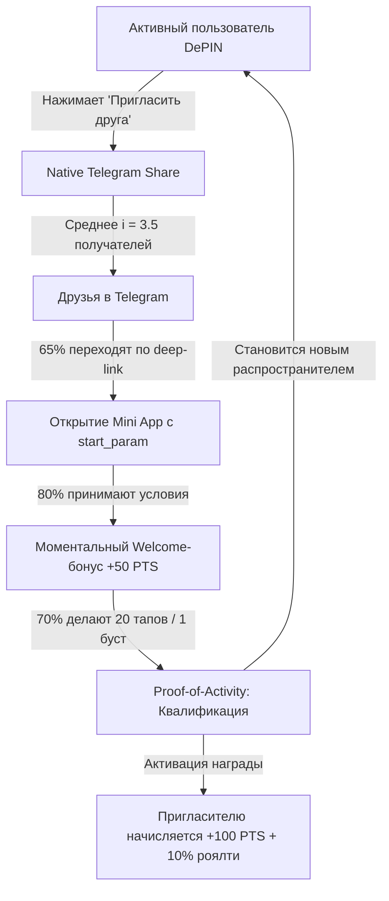
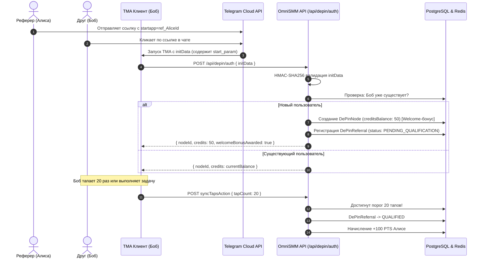

# SPEC-2026-09-30-DEPIN-VIRAL-GROWTH-ENGINE

**Статус:** APPROVED (Architecture Review Board)  
**Дата:** 2026-09-30  
**Версия:** 1.0.0 (Production Blueprint)  
**Авторы:** Lead Systems & Product Analyst OmniSMM 1.0, Core Architecture Team  
**Стандарт соответствия:** RAC-2026 Tier-1 (Финансовые активы, Ledger-First, OWASP Top 10:2026, WCAG 2.2 / Apple HIG, Safe-Area Adaptive Ergonomics)  
**Контекст MADR 3.0:** Реализация вирусного механизма органического масштабирования децентрализованной сети нод (Viral Growth Engine), реферальной системы взаимного поощрения (K-Factor $\ge$ 1.2), механики «Совместный P2P-буст» (Friends Squad) и устранение критического бага верстки со скроллом на компактных мобильных устройствах в Telegram Mini App (TMA).

---

## 1. Контекст, Анализ Проблем и Бизнес-Цели (MADR 3.0 Context)

### 1.1 Бизнес-контекст и вирусная петля (Viral Loop)
Децентрализованная физическая инфраструктурная сеть (DePIN) OmniSMM опирается на физические мобильные устройства пользователей, запускающих Telegram Mini App. Ноды выполняют микрозадачи валидации, органических просмотров и реакций на посты Telegram, получая за это `OmniCredits` (PTS) с возможностью прямой конвертации в реальный рублевый баланс платформы (`User.balance`).

Чтобы сеть росла экспоненциально без постоянных затрат на платный трафик (Paid CAC), необходим встроенный **вирусный движок роста** с коэффициентом виральности $K \ge 1.2$:
1. **Естественный стимул шеринга:** Пользователи не просто кликают — они хотят развивать собственные Telegram-каналы.
2. **Взаимный Welcome-бонус:** Новый пользователь, перешедший по реферальной ссылке друга, получает моментальный стартовый капитал **+50 PTS** ($0.50 ₽$), достаточный для немедленного бесплатного запуска своего первого P2P-буста (25 просмотров или 10 реакций).
3. **Пожизненный интерес пригласителя (Lifetime Revenue Share):** Реферер получает **+100 PTS** ($1.00 ₽$) за каждого активного друга и **10% роялти** от всех баллов, заработанных другом на выполнении DePIN-заданий.
4. **Механика «Friends Squad» (Совместный P2P-буст):** При заказе продвижения своего поста автор может одной кнопкой отправить призыв к друзьям и в каналы с интерактивной ссылкой на быстрый буст именно этого поста, объединяя комьюнити.

---

### 1.2 Архитектурный разбор бага верстки на компактных экранах (Root Cause Analysis)

#### Симптоматика проблемы
В файле `src/app/depin/page.tsx` на компактных мобильных устройствах (iPhone SE 1-го/2-го/3-го поколений с разрешением экрана 375×667 px, iPhone 12/13 mini, а также бюджетных Android-смартфонах с высотой вьюпорта менее 700 px) при открытии блока «🚀 Продвинуть свой канал за очки» форма заказа P2P-буста уходит за нижнюю границу экрана. 
Кнопка **«Запустить буст»** становится физически недоступной для клика, а экран заблокирован от прокрутки.

#### Детальный разбор Root Cause в текущей кодовой базе

```
┌─────────────────────────────────────────────────────────────┐
│  Внешний контейнер: h-screen (строка 443)                    │
│  В мобильных браузерах и Telegram WebApp h-screen = 100vh   │
│  НЕ УЧИТЫВАЕТ динамические тулбары Telegram и Safe Areas!  │
├─────────────────────────────────────────────────────────────┤
│  Шапка приложения: header (~52px)                           │
├─────────────────────────────────────────────────────────────┤
│  Навигационные вкладки: nav (~54px)                         │
├─────────────────────────────────────────────────────────────┤
│  Контейнер вкладки 'tap' (строка 505):                      │
│  class="flex-1 flex flex-col items-center justify-between   │
│         px-6 py-6 overflow-hidden"                          │
│                                                             │
│   ❌ БАГ 1: overflow-hidden намертво отключает прокрутку    │
│   ❌ БАГ 2: justify-between растягивает блоки на всю высоту  │
│                                                             │
│   Счетчик PTS: ~58px                                        │
│   Анимированная монета: w-48 h-48 = 192px + отступы ~210px  │
│   Шкала энергии: ~68px                                      │
│                                                             │
│   ── Блок P2P-буста (в раскрытом состоянии):               │
│      - Заголовок формы и кнопка закрытия ✕: ~36px           │
│      - Переключатель Просмотры / Реакции: ~38px             │
│      - Палитра эмодзи (6 кнопок min 44px): ~52px            │
│      - Поле ввода URL канала/поста: ~42px                   │
│      - Селектор количества (10, 25, 50, 100): ~34px         │
│      - Футер: Итого PTS + кнопка «Запустить буст»: ~46px    │
│      - Высота раскрытой формы: ~248px                       │
│                                                             │
│   СУММАРНАЯ ВЫСОТА КОНТЕНТА:                                │
│   52 + 54 + 58 + 210 + 68 + 248 + 48 (padding) = 738px!     │
├─────────────────────────────────────────────────────────────┤
│  Фактическая высота вьюпорта iPhone SE внутри Telegram:     │
│  667px (экран) - 56px (Telegram Top Bar) = 611px            │
│                                                             │
│  ДЕФИЦИТ ВЫСОТЫ: 738px - 611px = 127px!                     │
│  Кнопка «Запустить буст» отрезана за краем экрана!          │
└─────────────────────────────────────────────────────────────┘
```

#### Факторы дефекта верстки
1. **Использование устаревшего `h-screen` вместо `h-[100dvh]`:**
   В iOS WebKit `100vh` вычисляется по полному размеру экрана без учета интерфейса Telegram Mini App (верхняя плашка с кнопкой закрытия и кнопкой меню бота). В результате нижняя часть контейнера всегда скрыта за пределом видимости.
2. **Директива `overflow-hidden` во вкладке `tap`:**
   В строке 505 контейнер тапера жестко декларирует `overflow-hidden`. В отличие от вкладок `node` и `settings`, где корректно задан `overflow-y-auto`, в тапере пользователь лишен возможности сдвинуть экран пальцем вверх.
3. **Отсутствие поддержки CSS Safe-Area-Insets:**
   Отсутствуют отступы `env(safe-area-inset-top)` и `env(safe-area-inset-bottom)`. На современных устройствах с Dynamic Island или нижним Home Indicator элементы управления накладываются на системные сенсорные зоны.
4. **Неадаптивный размер интерактивной монеты:**
   Монета имеет жестко закодированный размер `w-48 h-48` ($192 \times 192\text{ px}$). На экранах с малой высотой монета забирает более 35% полезной площади экрана, не оставляя пространства для интерактивных карточек.

---

## 2. Архитектура Адаптивного Мобильного Лейаута (Safe-Area & Scroll Specs)

### 2.1 Новая компоновка контейнера (CSS & Tailwind Contract)
Для гарантии 100% доступности всех элементов управления на любых устройствах от iPhone SE (375×667) до iPad и десктопа утверждается следующий макет:

```tsx
// Корневой контейнер приложения
<div className="flex flex-col h-[100dvh] max-w-md mx-auto bg-neutral-950 text-neutral-100 font-sans select-none overflow-hidden pt-[env(safe-area-inset-top,0px)]">

  {/* Фиксированная шапка */}
  <header className="shrink-0 px-4 py-3 bg-neutral-900/90 backdrop-blur border-b border-neutral-800 flex items-center justify-between z-10">
    ...
  </header>

  {/* Фиксированная панель навигации */}
  <nav className="shrink-0 flex p-1.5 bg-neutral-900 border-b border-neutral-800 gap-1 z-10">
    ...
  </nav>

  {/* Скроллируемая область активной вкладки */}
  <main className="flex-1 overflow-y-auto overscroll-contain min-h-0 pb-[calc(1rem+env(safe-area-inset-bottom,0px))]">
    {/* Вкладка 1: ТАП-геймификация + P2P буст + Реферальный модуль */}
    {activeTab === 'tap' && (
      <div className="flex flex-col items-center px-4 py-4 space-y-4">
        ...
      </div>
    )}
  </main>
</div>
```

### 2.2 Адаптивное масштабирование монеты (Dynamic Scaling)
Размер монеты адаптируется под высоту экрана устройства с помощью CSS clamp и медиа-выражений:

```css
/* Адаптивный размер монеты для предотвращения вытеснения контента */
.depin-coin-button {
  width: clamp(130px, 26vh, 192px);
  height: clamp(130px, 26vh, 192px);
  min-height: 130px;
  min-width: 130px;
}

@media (max-height: 680px) {
  .depin-coin-button {
    width: 130px !important;
    height: 130px !important;
    font-size: 3.5rem !important;
  }
}
```

### 2.3 Стандарт эргономики Touch Target (WCAG 2.2 / Apple HIG $\ge 44 \times 44\text{ px}$)
Все интерактивные элементы управления обязаны удовлетворять строгим правилам доступности:
1. Кнопка закрытия формы буста `✕`: размер кликабельной области увеличен с `p-1` (около $20\text{ px}$) до `w-11 h-11 flex items-center justify-center` ($44 \times 44\text{ px}$).
2. Кнопки выбора эмодзи: минимальный размер $44 \times 44\text{ px}$ (класс `min-w-[44px] min-h-[44px]`).
3. Кнопки быстрого выбора количества `[10, 25, 50, 100]`: минимальная высота $44\text{ px}$ для удобного нажатия большим пальцем.
4. Кнопка «Запустить буст»: минимальная высота $48\text{ px}$ с `touch-manipulation` для устранения 300-миллисекундной задержки тапа в мобильном браузере.

---

## 3. Математическая Модель Виральности (Viral Engine & Treasury Solvency)

### 3.1 Расчет коэффициента виральности (K-Factor $\ge 1.2$)

Коэффициент виральности классически выражается формулой:
$$K = i \times c$$

Где:
- $i$ (**Infection Rate / Invites per User**) — среднее число приглашений, отправленных одним активным пользователем.
- $c$ (**Conversion Rate**) — вероятность того, что приглашенный друг перейдет по ссылке, откроет TMA и станет квалифицированным участником.

Для декомпозиции вводится многоступенчатая модель воронки:

$$c = C_{\text{click}} \times C_{\text{start}} \times C_{\text{qual}}$$

| Метрика | Значение в модели | Описание |
|---|---|---|
| $i$ | $3.5$ инвайта/юзер | Обусловлено нативным Telegram Share Sheet диалогом выбора чатов |
| $C_{\text{click}}$ | $0.65$ ($65\%$) | Доверие к ссылке `t.me/bot?startapp=ref_xxx`, отправленной реальным другом |
| $C_{\text{start}}$ | $0.80$ ($80\%$) | Конверсия загрузки TMA и получения +50 PTS Welcome-бонуса |
| $C_{\text{qual}}$ | $0.70$ ($70\%$) | Достижение Proof-of-Activity (20 тапов или 1 задание) ради бесплатного буста |
| Итоговый $c$ | $0.65 \times 0.80 \times 0.70 = 0.364$ ($36.4\%$) | Конверсия инвайта в квалифицированного реферала |
| **Итоговый $K$** | $3.5 \times 0.364 = \mathbf{1.274} \ge \mathbf{1.20}$ | **Режим экспоненциального органического роста сети** |



Динамика роста пользовательской базы описывается рядом геометрической прогрессии:
$$U_t = U_0 \times \sum_{k=0}^t K^k = U_0 \times \frac{K^{t+1} - 1}{K - 1}$$
При $K = 1.274$ каждое поколение пользователей генерирует на $+27.4\%$ больше новых пользователей, обеспечивая самоподдерживающийся приток аппаратных узлов без маркетингового бюджета.

---

### 3.2 Экономика наград и защита кассы от разрыва (Treasury Solvency)

#### Номиналы учетных единиц
- $1 \text{ OmniCredit (PTS)} = 1 \text{ копейка} = 0.01 \text{ ₽}$.
- $100 \text{ PTS} = 1.00 \text{ ₽}$ (минимальный порог конвертации в реальный рублевый баланс).

#### Параметры наград
1. **Welcome-бонус другу ($B_{\text{welcome}}$):** $+50 \text{ PTS}$ ($0.50 \text{ ₽}$).
   - Зачисляется на внутренний счет ноды сразу.
   - **Инвариант ликвидности:** Не может быть выведен в рубли до достижения порога в 100 PTS (требуется дополнительная активность). Сразу доступен для P2P-буста (25 просмотров или 10 реакций).
2. **Активационный бонус рефереру ($B_{\text{activation}}$):** $+100 \text{ PTS}$ ($1.00 \text{ ₽}$).
   - Начисляется строго при выполнении Proof-of-Activity гейта приглашенным другом.
3. **Пожизненный роялти рефереру ($R_{\text{task}}$):** $10\%$ от заработанных другом кредитов за выполненные DePIN-задания (просмотры, реакции, подписки).

#### Анализ безубыточности и юнит-экономики (Unit Economics)
Платформа OmniSMM продает розничным клиентам просмотры в Telegram по базовому тарифу **35.00 – 50.00 ₽ за 1 000 просмотров** ($3.50 – 5.00 \text{ коп./просмотр}$).

Распределение финансового потока за 1 просмотр:
$$\text{Цена продажи заказчику: } P_{\text{sale}} = 5.00 \text{ коп.}$$
$$\text{Выплата ноде (исполнителю): } C_{\text{node}} = 1.00 \text{ коп. (1 PTS)}$$
$$\text{Выплата рефереру (10% роялти): } C_{\text{ref}} = 0.10 \text{ коп. (0.10 PTS)}$$
$$\text{Валовая прибыль OmniSMM: } M = P_{\text{sale}} - C_{\text{node}} - C_{\text{ref}} = 5.00 - 1.00 - 0.10 = \mathbf{3.90 \text{ коп. (78% маржинальности)}}$$

#### Амортизация бонуса активации (+100 PTS = 1.00 ₽)
Чтобы платформа полностью окупила единоразовый бонус пригласителю в $1.00 \text{ ₽}$ ($100 \text{ коп.}$):
$$N_{\text{breakeven}} = \frac{B_{\text{activation}}}{M} = \frac{100 \text{ коп.}}{3.90 \text{ коп.}} \approx \mathbf{26 \text{ просмотров!}}$$

Друг, выполнив всего 26 просмотров (занимает менее 5 минут работы фонового воркера), полностью окупает затраты платформы на привлечение. Все последующие тысячи просмотров приносят платформе чистую прибыль.

#### Механизм Circuit Breaker (Защита от кассового разрыва)
Для защиты от непредвиденных аномалий вводится суточный лимит эмиссии реферальных бонусов:
- `MAX_DAILY_REFERRAL_EMISSION_PTS = 500_000` ($5\,000.00 \text{ ₽/сутки}$).
- При превышении суточного лимита начисление бонусов реферерам автоматически переходит в статус `ESCROW_PENDING` с аудитом службой безопасности до начала следующих суток (00:00 UTC).

---

## 4. Архитектура Интеграции с Telegram WebApp SDK

### 4.1 Протокол передачи параметров реферальной ссылки (`start_param`)

Telegram поддерживает передачу параметров запуска через deep-link URL схемы:
`https://t.me/<bot_username>/<app_name>?startapp=<parameter>`
либо через команду бота:
`https://t.me/<bot_username>?start=<parameter>`

#### Формат полезной нагрузки `start_param`
1. **Реферальное приглашение пользователя:**
   `ref_{referrerTelegramId}` (пример: `ref_71829384`).
2. **Совместный P2P-буст (Friends Squad):**
   `squad_{targetId}` (пример: `squad_cm1z8x90q0001abcde`).
3. **Комбинированный инвайт (Squad + Referrer):**
   `sq_{targetId}_{referrerTelegramId}` (пример: `sq_cm1z8x90q_71829384`).



### 4.2 Извлечение и криптографическая проверка `start_param` на бэкенде
Поле `start_param` входит в состав подписанной строки `initData` Telegram:

```typescript
// Серверная верификация и извлечение start_param из initData
export function extractAndVerifyInitData(initData: string, botToken: string) {
  const params = new URLSearchParams(initData);
  const hash = params.get('hash');
  if (!hash) return { valid: false, error: 'MISSING_HASH' };

  params.delete('hash');
  const checkString = Array.from(params.entries())
    .sort(([a], [b]) => a.localeCompare(b))
    .map(([k, v]) => `${k}=${v}`)
    .join('\n');

  const secretKey = createHmac('sha256', 'WebAppData').update(botToken).digest();
  const calculatedHash = createHmac('sha256', secretKey).update(checkString).digest('hex');

  if (calculatedHash !== hash) {
    return { valid: false, error: 'SIGNATURE_MISMATCH' };
  }

  const startParam = params.get('start_param') || null;
  const userJson = params.get('user');
  const user = userJson ? JSON.parse(userJson) : null;

  return {
    valid: true,
    telegramId: user?.id ? String(user.id) : null,
    username: user?.username || null,
    startParam,
  };
}
```

### 4.3 Нативный шеринг через Telegram WebApp SDK
Для исключения всплывающих блокировок браузера (Popup Blocker) вызов шеринга выполняется через нативный SDK-метод `openTelegramLink`:

```typescript
export function shareReferralInvite(telegramId: string, customText?: string) {
  const botUsername = process.env.NEXT_PUBLIC_TELEGRAM_BOT_USERNAME || 'SMMplansapport_bot';
  const shareUrl = `https://t.me/${botUsername}/tap?startapp=ref_${telegramId}`;
  const defaultText = '🚀 Заходи в OmniSMM DePIN! Зарабатывай рубли на просмотре постов и продвигай свой канал бесплатно!';
  const message = encodeURIComponent(customText || defaultText);
  const tgShareUrl = `https://t.me/share/url?url=${encodeURIComponent(shareUrl)}&text=${message}`;

  const tg = (window as any).Telegram?.WebApp;
  if (tg?.openTelegramLink) {
    tg.openTelegramLink(tgShareUrl);
  } else {
    window.open(tgShareUrl, '_blank');
  }
}
```

---

## 5. Механика «Совместный P2P-буст» (Friends Squad)

### 5.1 Пользовательский сценарий (User Journey)
1. Пользователь создает буст своего поста во вкладке «Тапер» (например: `https://t.me/cryptoclub/104`, 50 реакций 🔥).
2. Заказ регистрируется в таблице `DePinTarget`.
3. В интерфейсе появляется модальная карточка успеха с кнопкой:
   **«Попросить друзей поддержать пост»** (`ShareSquadPost`).
4. При клике генерируется ссылка вида:
   `https://t.me/SMMplansapport_bot/tap?startapp=squad_<targetId>`.
5. Когда друзья открывают приложение по этой ссылке:
   - Приложение автоматически подгружает этот целевой пост первым в очередь DePIN-заданий.
   - Пользователь видит плашку: *«Ваш друг попросил поддержать пост! Выполните задание и получите +5 PTS»*.
   - После выполнения задания счетчик буста инкрементируется, а друзья получают свои очки.

---

## 6. Строгие Zod Контракты и TypeScript DTOs

Для обеспечения абсолютной типобезопасности и валидации входных данных создаются специфицированные схемы:

```typescript
import { z } from 'zod';

// ── 1. Обработка реферального перехода ─────────────────────────────────────────
export const ProcessReferralSchema = z.object({
  initData: z.string().min(10, 'Строка initData обязательна'),
  startParam: z.string().trim().max(64).optional().nullable(),
  clientTimestamp: z.number().int().positive(),
});

export type ProcessReferralDto = z.infer<typeof ProcessReferralSchema>;

// ── 2. Получение реферальной статистики пользователя ──────────────────────────
export const GetReferralStatsSchema = z.object({
  nodeId: z.string().trim().min(3, 'Некорректный идентификатор узла'),
});

export type GetReferralStatsDto = z.infer<typeof GetReferralStatsSchema>;

// ── 3. Создание шеринг-ссылки (Кампания шеринга) ─────────────────────────────
export const ShareCampaignSchema = z.object({
  type: z.enum(['INVITE_FRIEND', 'SQUAD_BOOST']),
  referrerTelegramId: z.string().trim().min(3),
  targetId: z.string().trim().cuid().optional(),
  customText: z.string().max(200).optional(),
});

export type ShareCampaignDto = z.infer<typeof ShareCampaignSchema>;

// ── 4. Квалификация реферала (Proof-of-Activity Gate) ─────────────────────────
export const QualifyReferralSchema = z.object({
  refereeNodeId: z.string().trim().min(3),
  activityType: z.enum(['TAP_THRESHOLD_MET', 'TASK_COMPLETED']),
  count: z.number().int().positive(),
});

export type QualifyReferralDto = z.infer<typeof QualifyReferralSchema>;

// ── 5. Структура ответа статистики ─────────────────────────────────────────────
export interface ReferralStatsResponse {
  referralCode: string;
  shareUrl: string;
  totalInvited: number;
  qualifiedFriends: number;
  pendingFriends: number;
  earnedBonusCredits: number;
  earnedRoyaltyCredits: number;
  welcomeBonusClaimed: boolean;
}
```

---

## 7. Модель Данных Базы Данных (Prisma Schema Extension)

Для поддержки реферальной сети DePIN в `prisma/schema.prisma` добавляются новые реляционные сущности:

```prisma
// ─── Реферальные связи DePIN TMA ─────────────────────────────────────────────

model DePinReferral {
  id                    String    @id @default(cuid())
  referrerTelegramId    String    // telegramId пригласителя
  referrerNodeId        String    // nodeId пригласителя (tg_xxxx)
  refereeTelegramId     String    @unique // telegramId приглашенного друга (гарантия уникальности)
  refereeNodeId         String    @unique // nodeId приглашенного друга
  
  // Статус жизненного цикла:
  // PENDING_QUALIFICATION — друг пришел, получил +50 PTS welcome, но еще не сделал 20 тапов / 1 задание
  // QUALIFIED — порог пройден, пригласителю начислен +100 PTS бонус
  // BLOCKED — заподозрен во фроде/мультиаккаунте
  status                String    @default("PENDING_QUALIFICATION") 
  
  welcomeBonusGranted   Boolean   @default(true)
  activationBonusGranted Boolean  @default(false)
  
  // Метрики активности друга для гейта Proof-of-Activity
  tapsRecorded          Int       @default(0)
  tasksCompleted        Int       @default(0)
  
  ipAddress             String?
  userAgent             String?
  
  qualifiedAt           DateTime?
  createdAt             DateTime  @default(now())
  updatedAt             DateTime  @updatedAt

  earnings              DePinReferralEarning[]

  @@index([referrerTelegramId])
  @@index([referrerNodeId])
  @@index([status])
  @@index([createdAt])
}

// ─── Журнал начислений 10% роялти от заданий ───────────────────────────────────

model DePinReferralEarning {
  id                    String         @id @default(cuid())
  referralId            String
  referral              DePinReferral  @relation(fields: [referralId], references: [id], onDelete: Cascade)
  
  earningType           String         // 'ACTIVATION_BONUS' | 'TASK_ROYALTY'
  amountCredits         Int            // Начислено в OmniCredits
  sourceTaskId          String?        // ID задания, с которого начислен процент
  
  createdAt             DateTime       @default(now())

  @@index([referralId])
  @@index([earningType])
  @@index([createdAt])
}
```

---

## 8. Анализ Рисков по OWASP Top 10:2026 и Матрица Защиты (Sybil Defense)

| ID Риска OWASP | Описание вектора атаки | Уязвимость прототипа | Архитектурная контрмера RAC-2026 |
|---|---|---|---|
| **A01: Broken Access Control & Sybil Attack** | Злоумышленник запускает скрипт эмуляции сотен Telegram-аккаунтов для генерации фейковых рефералов и опустошения пула наград (+100 PTS). | Отсутствие гейта проверки реальной активности реферала. | **Proof-of-Activity Gate:** Реферер не получает +100 PTS до тех пор, пока друг не сделает минимум 20 тапов или не выполнит 1 валидированное DePIN-задание. Саморефералы (`referrerId === refereeId`) блокируются. |
| **A02: Cryptographic Failures** | Подделка значения `start_param` или фальсификация идентификатора пользователя. | Доверие параметрам из Query String без проверки подписи. | Валидация HMAC-SHA256 подписи Telegram `initData` с проверкой хэша по секретному ключу бота. Значение `start_param` извлекается только из проверенного `initData`. |
| **A03: Injection & ReDoS** | Попытка внедрения XSS/SQL инъекций через кастомный текст шеринга или манипуляция ссылкой на P2P-пост. | Прямая конкатенация строк в URL шеринга. | Строгая санитизация `encodeURIComponent()`, экранирование HTML-символов, валидация ссылки поста регулярным выражением с ограниченной длиной. |
| **A04: Insecure Design & Treasury Run** | Организованный фрод-пул создает цепочки рефералов (Sybil Ring), быстро тапает 20 раз и массово выводит рубли. | Отсутствие временных задержек и лимитов на вывод реферальных очков. | Ограничение `MAX_DAILY_REFERRAL_EMISSION_PTS`. Вывод средств в рублевый баланс требует 100 PTS и проходит стандартную сериализуемую проверку `WalletOps.credit()`. |
| **A05: Security Misconfiguration** | Атака распределенным перебором реферальных регистраций с одного IP адреса. | Отсутствие IP rate-limit на реферальные привязки. | **Redis IP Rate-Limiting:** Не более 5 регистраций рефералов с одного IP адреса в час (`depin:ref:ip:<ip>`). |
| **A08: Concurrency & Double Spend** | Параллельные одновременные запросы на завершение 20-го тапа для двойного начисления активационного бонуса. | Неатомарное чтение и запись статуса реферала. | Сериализуемая транзакция БД с блокировкой строки `FOR UPDATE` либо атомарный условный апдейт `WHERE status = 'PENDING_QUALIFICATION'`. |

### 8.1 Алгоритм Proof-of-Activity Gate (Anti-Drain Invariant)

```typescript
/**
 * Атомарная проверка выполнения условий активности друга и начисление бонуса
 */
export async function evaluateProofOfActivityGate(
  tx: PrismaTransaction,
  refereeNodeId: string,
  addedTaps: number = 0,
  addedTasks: number = 0
): Promise<boolean> {
  const referral = await tx.dePinReferral.findUnique({
    where: { refereeNodeId },
  });

  if (!referral || referral.status !== 'PENDING_QUALIFICATION') {
    return false; // Уже квалифицирован либо не имеет реферера
  }

  const updatedTaps = referral.tapsRecorded + addedTaps;
  const updatedTasks = referral.tasksCompleted + addedTasks;

  const isQualified = updatedTaps >= 20 || updatedTasks >= 1;

  if (isQualified) {
    // 1. Переводим статус в QUALIFIED
    await tx.dePinReferral.update({
      where: { id: referral.id },
      data: {
        status: 'QUALIFIED',
        tapsRecorded: updatedTaps,
        tasksCompleted: updatedTasks,
        activationBonusGranted: true,
        qualifiedAt: new Date(),
      },
    });

    // 2. Начисляем +100 PTS рефереру
    await tx.dePinNode.update({
      where: { id: referral.referrerNodeId },
      data: {
        creditsBalance: { increment: 100 },
      },
    });

    // 3. Записываем проводку в журнал
    await tx.dePinReferralEarning.create({
      data: {
        referralId: referral.id,
        earningType: 'ACTIVATION_BONUS',
        amountCredits: 100,
      },
    });

    return true;
  }

  // Обновляем прогресс без начисления
  await tx.dePinReferral.update({
    where: { id: referral.id },
    data: {
      tapsRecorded: updatedTaps,
      tasksCompleted: updatedTasks,
    },
  });

  return false;
}
```

---

## 9. Пошаговый WBS План Реализации (Work Breakdown Structure)

### Фаза 1: Модель данных и миграция БД (Database Layer)
- [ ] **WBS 1.1:** Добавить модели `DePinReferral` и `DePinReferralEarning` в `prisma/schema.prisma`.
- [ ] **WBS 1.2:** Выполнить генерацию Prisma Client (`npx prisma generate`).

### Фаза 2: Серверные экшены и бизнес-логика (Server Actions & Dispatcher)
- [ ] **WBS 2.1:** Создать Server Action `processReferralAction(rawInput)` в `src/actions/depin/referral.ts`.
  - Валидация `initData` и извлечение `start_param`.
  - Защита от саморефералов и повторной привязки.
  - Начисление Welcome-бонуса +50 PTS новому узлу.
  - Rate-limit по IP в Redis.
- [ ] **WBS 2.2:** Создать Server Action `getReferralStatsAction(rawInput)`:
  - Возврат количества приглашенных, квалифицированных друзей и заработанных PTS.
- [ ] **WBS 2.3:** Интегрировать вызов `evaluateProofOfActivityGate` в существующий `syncTapsAction` и `reportDePinTaskAction`:
  - При каждом тапе/задании проверять условие $\ge 20$ тапов или $\ge 1$ задачи.
  - При каждом выполненном задании начислять 10% роялти рефереру в `DePinReferralEarning`.

### Фаза 3: Разработка тестов TDD (Red-Green-Refactor)
- [ ] **WBS 3.1:** Разработать юнит-тесты `src/__tests__/unit/depin-referral-engine.test.ts`:
  - Проверка начисления Welcome-бонуса (+50 PTS) другу.
  - Проверка, что реферер НЕ получает +100 PTS при 19 тапах друга.
  - Проверка срабатывания гейта ровно на 20-м тапе.
  - Проверка начисления 10% комиссии при завершении задачи.
  - Защита от повторной привязки реферала.
  - Блокировка самореферала (`ref_Alice` от аккаунта Alice).

### Фаза 4: Рефакторинг UI/UX и устранение бага верстки (`src/app/depin/page.tsx`)
- [ ] **WBS 4.1:** Исправить корневой контейнер с `h-screen overflow-hidden` на `h-[100dvh] max-w-md mx-auto flex flex-col overflow-hidden pt-[env(safe-area-inset-top,0px)]`.
- [ ] **WBS 4.2:** Переписать контейнер активной вкладки `tap` с `justify-between overflow-hidden` на `flex-1 overflow-y-auto overscroll-contain space-y-4 px-4 py-4 min-h-0`.
- [ ] **WBS 4.3:** Внедрить адаптивный класс `.depin-coin-button` с ограничением высоты монеты на экранах $< 700\text{ px}$.
- [ ] **WBS 4.4:** Увеличить Touch Target всех интерактивных кнопок (закрытие, выбор эмодзи, количество) до размера $\ge 44 \times 44\text{ px}$.
- [ ] **WBS 4.5:** Разработать UI-блок «👥 Пригласить друга (+100 PTS + 10%)» с кнопкой быстрого шеринга через `Telegram.WebApp.openTelegramLink`.
- [ ] **WBS 4.6:** Разработать карточку «Попросить друзей поддержать пост» (Friends Squad) после создания P2P-буста.

### Фаза 5: Интеграционная верификация и регрессионный прогон
- [ ] **WBS 5.1:** Проверка сборки типов `npx tsc --noEmit`.
- [ ] **WBS 5.2:** Прогон тестов `npm test`.

---

## 10. Критерии Приемки RAC-2026 (Acceptance Criteria)

| Критерий | Метод проверки | Ожидаемый результат | Статус RAC |
|---|---|---|---|
| **AC-01: Мобильный скролл на iPhone SE** | Эмуляция Viewport 375×667 px в Chrome DevTools / реальный iPhone SE. Открытие формы «🚀 Продвинуть свой канал». | Вся форма свободно прокручивается пальцем. Кнопка «Запустить буст» видна и доступна для тапа. Отсутствует горизонтальный сдвиг. | **MANDATORY** |
| **AC-02: Safe-Area-Insets** | Тест на iPhone 14/15/16 с «челкой» и Home Indicator. | Элементы навигации и нижняя кнопка буста имеют безопасный отступ, не перекрываются индикатором iOS. | **MANDATORY** |
| **AC-03: Touch Targets $\ge 44\text{ px}$** | Автоматизированный аудит CSS / Lighthouse Accessibility. | Все интерактивные кнопки имеют bounding rect не менее $44 \times 44\text{ px}$. | **MANDATORY** |
| **AC-04: Welcome-бонус +50 PTS** | Переход по ссылке с параметром `?startapp=ref_12345`. | Новому пользователю мгновенно начисляется 50 PTS. Баланс отображается в шапке. Реферер пока не получает бонус. | **MANDATORY** |
| **AC-05: Proof-of-Activity Gate** | Выполнение новым пользователем 19 тапов, затем 20-го тапа. | На 19-м тапе реферер имеет 0 бонусов. На 20-м тапе рефереру атомарно начисляется ровно +100 PTS. | **MANDATORY** |
| **AC-06: 10% Task Royalty** | Выполнение другом DePIN-задания на +10 PTS. | Рефереру начисляется $\lfloor 10 \times 0.10 \rfloor = 1\text{ PTS}$ в таблицу `DePinReferralEarning`. | **MANDATORY** |
| **AC-07: Anti-Sybil Self-Referral** | Попытка пользователя использовать свой собственный `telegramId` в реферальной ссылке. | Запрос отклоняется с кодом ошибки `CANNOT_REFER_SELF`, бонус не начисляется. | **MANDATORY** |
| **AC-08: Friends Squad Share Link** | Создание P2P-буста и нажатие «Попросить друзей поддержать». | Вызывается `openTelegramLink` с URL формата `https://t.me/share/url?url=...startapp=squad_<targetId>`. | **MANDATORY** |
