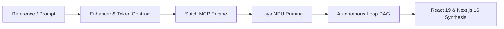

# SPEC-2026-09-30: Google Stitch Generative UI Pipeline & Expanded Skills Suite

## 1. Executive Summary & Context

This specification formalizes the production-grade **Google Stitch Pipeline** within OmniSMM 1.0, incorporating the official Google Labs standard (`stitch.withgoogle.com/docs/skills/get-started/`) and deploying an expanded pool of specialized Agent Skills, executable CLI tools, and reference architectures.

The pipeline automates the complete design-to-production lifecycle:

---

## 2. Expanded Stitch Skills Suite Architecture

| Skill Identifier | Role & Scope | Google Labs Origin | Key Files & Artifacts |
| :--- | :--- | :--- | :--- |
| **`stitch-get-started`** | Official onboarding, MCP protocol setup, base lifecycle | `skills/get-started` | `.agents/skills/stitch-get-started/SKILL.md` |
| **`stitch-prompt-enhancer`** | Intent deconstruction, Zero-Slop filter, 6 Design DNAs | `skills/enhance-prompt` | `.agents/skills/stitch-prompt-enhancer/SKILL.md` |
| **`stitch-loop-orchestrator`** | Autonomous multi-screen continuous generation loop | `skills/stitch-loop` | `.agents/skills/stitch-loop-orchestrator/SKILL.md` |
| **`stitch-react19-synthesizer`** | AST compiler to React 19, Tailwind 4, HeroUI v3 | `skills/react-components` | `.agents/skills/stitch-react19-synthesizer/SKILL.md` |
| **`stitch-reverse-engineer`** | Vision & DOM teardown of screenshots / live URLs | New Specialized Skill | `.agents/skills/stitch-reverse-engineer/SKILL.md` |
| **`stitch-design-system`** | Token contract bidirectional sync (`DESIGN.md`) | `skills/design-md` | `.agents/skills/stitch-design-system/SKILL.md` |

---

## 3. End-to-End 6-Phase Pipeline Workflow

### Phase 1: Reference Ingestion & Vision Deconstruction
- Accepts raw user brief, Figma URL, competitor screenshot, or live page URL.
- `stitch-reverse-engineer` extracts surface palettes, typography scale, and spatial grid (8pt).
- Output: Initial token contract stored in `.stitch/DESIGN.md`.

### Phase 2: Prompt Enhancement & Anti-Slop Compilation
- `stitch-prompt-enhancer` strips out generic AI clichés (purple neon mesh, icon-stuffed bento).
- Injects one of the 6 canonical Design DNAs (e.g. *High-Frequency Financial Terminal*).
- Formats structured prompt with explicit negative constraints and density tiers.

### Phase 3: Token Synchronization (`DESIGN.md`)
- `stitch-design-system` binds layout rules to Tailwind CSS 4 `@theme` in `src/app/globals.css`.
- Generates OKLCH color palettes ensuring WCAG 2.2 AA contrast ($\ge 4.5:1$).

### Phase 4: Stitch MCP Generation & Laya NPU Pruning
- Calls `stitch_generate_screen` via [`scripts/mcp/stitch-mcp-server.ts`](file:///e:/OmniSMM/scripts/mcp/stitch-mcp-server.ts).
- Generates 3 parallel candidates across desktop (1440px), tablet (768px), and mobile (375px).
- Laya NPU evaluates candidates with System 1 fast heuristics; approves candidate with highest score $\ge 80$.

### Phase 5: Autonomous Multi-Screen Baton Loop
- `stitch-loop-orchestrator` advances through application routes defined in `.stitch/workspace.json`.
- Each iteration consumes `.stitch/next-prompt.md`, generates the screen, and writes the next baton.
- Preserves token invariance across the entire application flow without context drift.

### Phase 6: React 19 / Next.js 16 AST Synthesis & Stage Gate
- `stitch-react19-synthesizer` transforms approved screens into modular components.
- Enforces strict architectural limits: each file $\le 200$ lines, zero `any`, typed `{ success, error }`.
- Validates via Blue-Green Stage Gate (BGS-2026) on port `:3005` before human cutover approval.

---

## 4. Tooling & CLI Suite Reference

1. **`scripts/stitch/stitch-pipeline-runner.ts`**: Master CLI orchestrator executing Phases 1–6 end-to-end.
2. **`scripts/stitch/enhance-prompt.ts`**: Standalone prompt compiler with anti-slop rules.
3. **`scripts/stitch/stitch-loop-manager.ts`**: State machine manager for `.stitch/workspace.json` and batons.
4. **`scripts/stitch/synthesize-react.ts`**: AST React 19 compiler.
5. **`scripts/stitch/stitch-reverse-engineer.ts`**: Visual & reference extractor.

---

## 5. Acceptance Criteria & Quality Gates

- [x] All 6 Stitch skills documented in `.agents/skills/` conforming to Agent Skills Open Standard.
- [x] All scripts and components strictly adhere to the $\le 200$-line limit.
- [x] `npx tsc --noEmit` returns 0 errors.
- [x] Production container (:3000) untouched; changes isolated to Stage (:3005).
