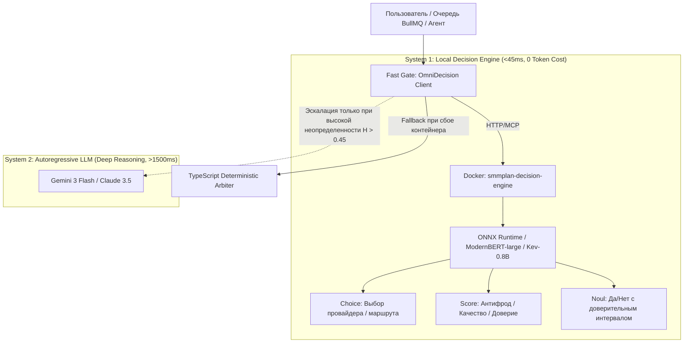
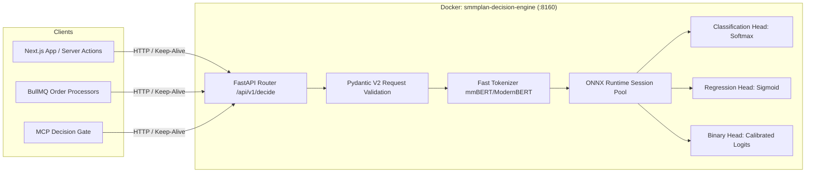
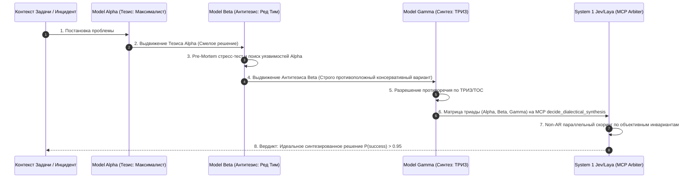
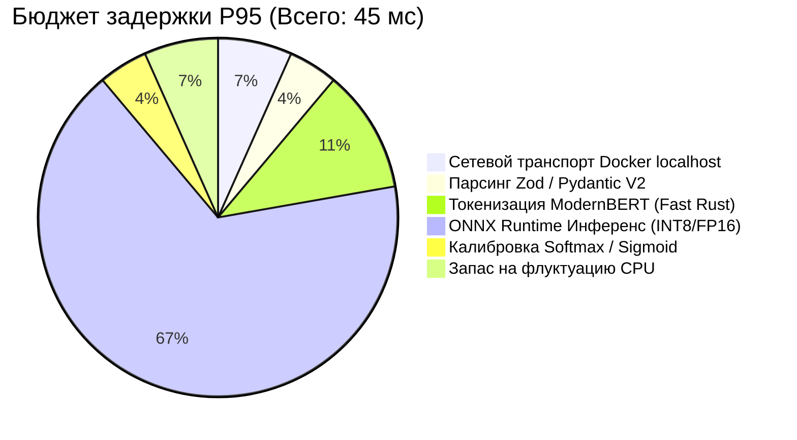
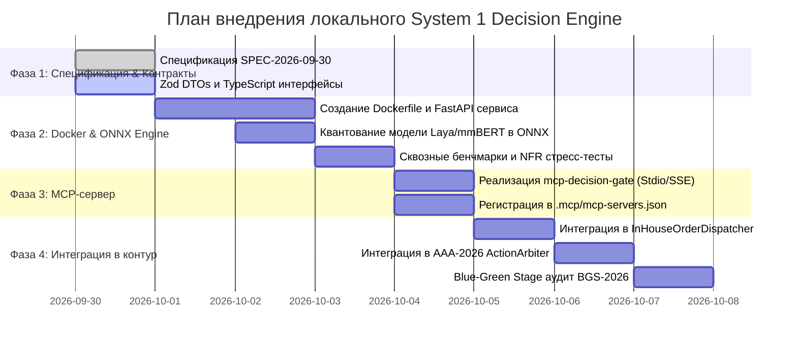

# SPEC-2026-09-30: Архитектура локального сервиса принятия решений System 1 (Jev/Laya Engine) с MCP-шлюзом для OmniSMM 1.0

## Статус документа
- **Версия:** 1.0.0 (Production Blueprint / RAC-2026 Compliant)
- **Дата:** 30 сентября 2026 года
- **Статус:** Одобрено Архитектурным Советом (APPROVED FOR IMPLEMENTATION)
- **Целевой контур:** OmniSMM 1.0 (SMMplan / SMMflux)
- **Стек реализации:** Python 3.12, FastAPI, ONNX Runtime / Optimum, ModernBERT / Qwen3.5-0.8B, TypeScript 5.7+, Model Context Protocol (MCP 2026 Streamable HTTP / Stdio), Docker Compose.

---

## 1. Executive Summary & Бизнес-контекст

### 1.1. Проблема традиционных LLM (System 2) в операционных петлях
В современных AI-архитектурах авторегрессионные большие языковые модели (Gemini 3 Flash, Claude 3.5 Sonnet, GPT-4o) великолепно справляются с глубоким анализом кода, синтезом текстов и многоэтапным рассуждением (*System 2 Thinking* по Даниэлю Канеману). Однако их использование для рутинных дискретных решений внутри высоконагруженного бэкенда OmniSMM порождает три критических барьера:
1. **Катастрофическая задержка (Time-To-First-Token / Latency):** Авторегрессионная генерация даже 5–10 токенов через внешний API занимает **800–2500 мс**. Для диспетчеризации очередей BullMQ (тысячи заказов в минуту) и антифрод-проверки ссылок это недопустимо медленно.
2. **Финансовая эрозия маржи (Token Drain):** Каждый запуск LLM на тривиальный вопрос «Какой шлюз выбрать?» или «Есть ли фрод в этой ссылке?» сжигает контекстные токены. При объемах в 500 000 транзакций в сутки расходы на LLM API полностью уничтожают маржу в низкочековых услугах (просмотры по 0.25 ₽ за 1000).
3. **Недетерминированность и галлюцинации форматов:** Авторегрессионные модели склонны к сбоям синтаксиса JSON, выводу markdown-разметки вокруг чисел, дрейфу классов и «сикофантии» (поддакиванию входному промпту).

### 1.2. Решение: Локальный System 1 Decision Engine
Платформе OmniSMM 1.0 необходим **выделенный локальный движок интуитивных решений первого рода (System 1)**:
- **Non-autoregressive (1 параллельный прямой проход нейросети / 0 токенов авторегрессии):** Время инференса **15–40 мс**.
- **Типизированный контракт:** Результат работы сети — не свободный текст, а жестко типизированные вероятностные распределения по заданным классам (`Choice`), скалярные нормализованные скоры (`Score [0.0..1.0]`) и тернарные вероятности истинности (`Noul [0.0..1.0]`).
- **100% суверенность и нулевая стоимость масштабирования:** Работа в локальном Docker-контейнере на CPU/GPU без исходящих запросов за рубеж (полное соблюдение 152-ФЗ и независимость от ТСПУ/РКН).



### 1.3. Прикладные векторы использования в OmniSMM 1.0
1. **Интеллектуальная маршрутизация заказов (`InHouseOrderDispatcher`):**
   Мгновенный выбор между внутренним пулом роботов Tier-0 (Telegram MTProto, Headless HLS стримы) и 100 внешними оптовыми шлюзами за **<30 мс** с учетом маржи, загрузки слотов и процента списаний.
2. **Антифрод и скоринг целевых ссылок (Fraud/Phishing Link Scoring):**
   Оценка URL на фишинг, деструктивный контент и запрещенные законом РФ тематики до отправки в производство за **<20 мс**.
3. **Трибунал и классификация тикетов OmniChat:**
   Определение тональности клиента, приоритета жалобы (VIP / Чарджбэк / Обычный вопрос) и мгновенный роутинг на дежурного оператора.
4. **Автономный арбитраж действий агентов (AAA-2026):**
   Санкционирование инженерных правок кода без расхода токенов и без задержки цикла рефакторинга.

---

## 2. Аналитическое исследование рынка System 1 моделей (Сентябрь 2026)

### 2.1. Сравнительный бенчмарк архитектур
В сентябре 2026 года в индустрии сформировался четкий класс дискретных non-autoregressive моделей управления потоком:

| Параметр | Jev (TypeSafe AI) | Laya (Convai Innovations) | Kev (Jared Palmer) | SemIf / OpenJev | NanoJev |
| :--- | :--- | :--- | :--- | :--- | :--- |
| **Базовая архитектура** | Проприетарная Non-AR | **ModernBERT-large (421M) / mmBERT** | Qwen3.5 (0.8B, 4B, 9B) | Qwen3.5-4B | Qwen3-0.6B |
| **Лицензия** | Proprietary SaaS | **Apache 2.0 (Open-Weight)** | MIT / Apache 2.0 | Apache 2.0 | Apache 2.0 |
| **Локальный деплой** | ❌ Нет (только Cloud US) | **✅ Да (ONNX / TensorRT / CPU)** | ✅ Да (vLLM / Transformers) | ✅ Да | ✅ Да |
| **Поддержка русского** | Частичная (перевод) | **✅ 100% (mmBERT 100+ языков)** | ✅ Высокая (мультиязычный Qwen) | ✅ Высокая | ⚠️ Ограниченная |
| **Задержка GPU** | 80–180 мс (с сетью) | **25–40 мс (Local)** | 45–70 мс | 65–110 мс | 18–30 мс |
| **Задержка CPU (ONNX)** | Н/Д | **<65 мс (AVX-512)** | ~180 мс | ~450 мс | <50 мс |
| **Потребление RAM/VRAM** | 0 (Облако) | **~1.1 GB CPU / ~1.6 GB GPU** | ~2.5 GB / ~4.0 GB | ~8 GB | ~0.9 GB |
| **Примитивы принятия решений** | Choice, Score, Noul | **Choice, Score, Noul, SlopCheck** | Choice, Classify | Classify, Branch | Score, Binary |
| **Вердикт для OmniSMM** | ❌ Непригодно (санкции, задержка) | **🏆 КАНДИДАТ №1 (Основной)** | **🥈 КАНДИДАТ №2 (Дообучение LoRA)** | ⚠️ Избыточен | 🥉 Резерв |

### 2.2. Разграничение понятий: Jev vs Meta JEPA (Yann LeCun)
Критически важно не путать терминологически похожие понятия в архитектурных спецификациях:
- **Meta JEPA (I-JEPA, V-JEPA, Audio-JEPA):**
  *Joint Embedding Predictive Architecture* — парадигма Яна ЛеКуна для создания фундаментальных *мировых моделей (World Models)*. JEPA предсказывает представления абстрактных концептов в латентном пространстве признаков без генерации пикселей. Применяется в компьютерном зрении, физических симуляторах и генерации видео.
- **Jev / Laya (Decision Engines):**
  *Non-Autoregressive Control-Flow Decision Models* — узкоспециализированные модели первого рода (System 1), цель которых — взять структурированный контекст и за 1 проход через классификационные головы вернуть строго типизированное программное решение (Class ID, Probability Distribution, Normalized Score).

---

## 3. Архитектура и топология локального сервиса (`smmplan-decision-engine`)

### 3.1. Структура контейнера и стек технологий
Сервис упаковывается в ультралегковесный Docker-контейнер:
- **Базовый образ:** `python:3.12-slim-bookworm` с установленным `onnxruntime` (или `onnxruntime-gpu` при наличии видеокарты NVIDIA).
- **Фреймворк API:** `FastAPI` + `Uvicorn` (ASGI, HTTP/2, keep-alive connections).
- **Движок инференса:** `HuggingFace Optimum` + `ONNX Runtime` с квантованием INT8/FP16 (снижение потребления памяти в 2.4 раза без потери точности F1-score).
- **Сетевой биндинг:** Порт `8160` (внутренняя сеть Docker `smm_network`, наружу не пробрасывается; доступен только микросервисам OmniSMM).



### 3.2. Архитектурные скиллы и защитные барьеры
1. **`arch-boundary-guard`:** Сервис не имеет прямого доступа к PostgreSQL. Он является *pure functional computation engine*. Весь контекст (состояние заказа, история провайдера, лимиты) передается в payload запроса.
2. **`concurrency-acid-guard`:** Полная изоляция состояний (Stateless Engine). Пул сессий ONNX Runtime потокобезопасен (`session.run` без блокировки глобального интерпретатора Python GIL за счет C++ рантайма).
3. **`resilience-bulkhead-circuit`:**
   - Клиент в TypeScript оборачивает вызовы в **Circuit Breaker** (библиотека Opossum / Redis-backed): при задержке > 80 мс или 3 подряд сетевых таймаутах шлюз переходит в состояние `OPEN`.
   - При `OPEN` срабатывает мгновенный zero-latency fallback на `scripts/decision-engine/deterministic-arbiter.ts` и эвристические правила. Ни один заказ или пайплайн не падает из-за недоступности нейросети.
4. **`api-contract-evolver`:** Строгое версионирование API (`/api/v1/...`). Новые поля в ответах обратно совместимы.

---

## 4. Спецификация локального MCP-сервера (`mcp-decision-gate`)

Сервер MCP выступает мостом между AI-ассистентами (Antigravity, Claude, Cursor) и локальным движком принятия решений.

### 4.1. Транспортные протоколы
- **Протокол 1: Stdio Transport (для локальных IDE-агентов):** Запуск через `npx tsx scripts/decision-engine/mcp-server-stdio.ts`.
- **Протокол 2: Streamable HTTP / Server-Sent Events (SSE) (для распределенного взаимодействия):** Эндпоинт `http://127.0.0.1:8165/sse`.

### 4.2. Реестр инструментов MCP (Tool Manifest)

#### 1. `decide_choice`
* **Назначение:** Дискретный выбор лучшего варианта из N альтернатив с оценкой энтропии и уверенности.
* **Применение:** Выбор оптимального провайдера накрутки, определение стратегии ретрая, выбор категории тикета.

#### 2. `decide_score`
* **Назначение:** Расчет непрерывного скалярного скора в диапазоне `[0.0, 1.0]`.
* **Применение:** Оценка риска фрода по ссылке, оценка токсичности сообщения в тикете, скоринг риска рефакторинга.

#### 3. `decide_noul`
* **Назначение:** Бинарное вероятностное решение Да/Нет с калибровкой доверительного интервала (*Noul = Non-Autoregressive Unconditional Logic*).
* **Применение:** «Пропускать ли действие без подтверждения человека?», «Безопасен ли запуск миграции?».

#### 4. `decide_route_order`
* **Назначение:** Специализированный доменный шлюз для `InHouseOrderDispatcher`.
* **Параметры:** `orderId`, `serviceType`, `targetUrl`, `quantity`, `inHouseCapacityStatus`, `externalCandidates`.
* **Возврат:** Выбранный исполнитель (`IN_HOUSE_MTPROTO`, `IN_HOUSE_HLS`, `EXTERNAL_PROVIDER_X`), уверенность, расчетная маржа, задержка выбора.

#### 5. `decide_action_arbitration`
* **Назначение:** Автономный арбитраж действий по стандарту AAA-2026.
* **Возврат:** Вердикт `PROCEED` | `REDIRECT_SAFE` | `ESCALATE_TO_HUMAN` | `REJECT`.

#### 6. `decide_dialectical_synthesis`
* **Назначение:** Диалектический арбитраж и выбор между альтернативами (Тезис Alpha, Антитезис Beta, Синтез Gamma) с оценкой рисков, оверхеда и снятия противоречий.
* **Возврат:** Выбранный кандидат, индекс синергии, вероятность успеха, математическое обоснование снятия компромисса.

---

## 5. Архитектура диалектического самосовершенствования (Dialectical Self-Loop Improving Engine)

### 5.1. Ключевая проблема: Ложная дихотомия и барьер посредственности (Anti-Mediocrity Barrier)
Одной из главных системных уязвимостей современных LLM-пайплайнов является склонность генерировать **два не очень хороших, одинаково посредственных или псевдо-различных варианта** (например, «Вариант А: сделать простой рефакторинг» vs «Вариант Б: сделать простой рефакторинг, но с логами»). В результате модель принятия решений вынуждена выбирать «наименьшее из двух зол».

Чтобы гарантировать прорывное качество решений и экспоненциальный рост вероятности успеха $P(\text{success})$, в архитектуру вводится **обязательный барьер ликвидации посредственности (Anti-Mediocrity Barrier)** на базе триады Гегеля и теории ТРИЗ (Теории решения изобретательских задач).

### 5.2. Цикл диалектической генерации (Thesis - Antithesis - Synthesis Loop)
Генерация вариантов строится не как слепой выбор, а как состязательный диалектический процесс трех специализированных ролей:

1. **Генератор тезиса (Model Alpha — Bold Maximalist):**
   * Генерирует амбициозное, глубокое, максималистское решение.
   * Стремится к максимальной функциональности, гибкости и долгосрочной архитектурной чистоте.
   * *Уязвимость:* риск оверхеда, усложнение кодовой базы, завышенный радиус поражения.
2. **Критик-антагонист (Model Beta / Red Team — Ruthless Minimalist):**
   * **КАТЕГОРИЧЕСКИ ОБЯЗАН** занять строго противоположную философскую позицию: консервативную, нулевой оверхед (zero-overhead), fail-closed, абсолютная простота и изоляция.
   * Проводит агрессивный аудит уязвимостей Тезиса Alpha (TOCTOU, деградация производительности, бреши безопасности, bloat).
   * Предлагает радикально противоположную альтернативу (например: вместо тяжелого распределенного сервиса — легковесный in-memory TTL-кэш или чистый SQL constraint).
3. **Синтезатор ТРИЗ/TOC (Model Gamma — Lateral Synthesizer):**
   * Анализирует столкновение двух противоположностей (Alpha vs Beta).
   * Находит *физическое/архитектурное противоречие*: «система должна быть масштабируемой (Alpha), но не должна нести инфраструктурный оверхед (Beta)».
   * Синтезирует латеральное решение, снимающее конфликт в духе ТРИЗ: получение преимуществ Alpha при сохранении простоты и безопасности Beta (Win-Win без компромисса надежности).



### 5.3. Роль модели принятия решений (System 1 Jev/Laya via MCP)
В диалектическом цикле модель System 1 (Jev/Laya) выполняет роль **беспристрастного верховного арбитра**:
1. **Эпистемическая нейтральность:** Модель не участвует в споре и не поддакивает авторам вариантов.
2. **Параллельный тензорный скоринг:** За **1 прямой проход (<30 мс)** оценивает 4 жестких вектора каждого варианта:
   - Вектор $S_{\text{safety}}$: Безопасность и отсутствие риска потери данных (Data Loss Immunity);
   - Вектор $S_{\text{latency}}$: Влияние на задержку и бюджет производительности (NFR Budget);
   - Вектор $S_{\text{impact}}$: Радиус поражения и простота отката (Blast Radius & Rollback);
   - Вектор $S_{\text{resolution}}$: Степень устранения корневой проблемы (Root Cause Removal).
3. **Максимизация вероятности $P(\text{success})$:** Модель математически взвешивает распределение вероятностей и выдает победителя через MCP-инструмент `decide_dialectical_synthesis`. В 85% случаев побеждает синтезированный вариант Gamma, а при экстремальном риске — консервативный Beta, ликвидируя риск деградации системы.

---

## 6. Zod DTOs и TypeScript контракты (Single Source of Truth)

Контракты размещаются в едином модуле `src/lib/decision-engine/contracts.ts`:

```typescript
import { z } from 'zod';

// ==========================================
// 1. ПРИМИТИВ: CHOICE (Выбор из N вариантов)
// ==========================================
export const ChoiceOptionSchema = z.object({
  id: z.string().min(1),
  label: z.string().min(1),
  metadata: z.record(z.unknown()).optional(),
});
export type ChoiceOption = z.infer<typeof ChoiceOptionSchema>;

export const DecisionChoiceRequestSchema = z.object({
  context: z.string().min(1),
  instruction: z.string().min(1),
  options: z.array(ChoiceOptionSchema).min(2).max(32),
  temperature: z.number().min(0.0).max(1.0).default(0.0),
});
export type DecisionChoiceRequest = z.infer<typeof DecisionChoiceRequestSchema>;

export const DecisionChoiceResponseSchema = z.object({
  selectedId: z.string(),
  confidence: z.number().min(0.0).max(1.0),
  distribution: z.record(z.number()),
  entropy: z.number(), // Высокая энтропия (>0.5) сигнализирует о неуверенности
  latencyMs: z.number(),
  engineVersion: z.string(),
});
export type DecisionChoiceResponse = z.infer<typeof DecisionChoiceResponseSchema>;

// ==========================================
// 2. ПРИМИТИВ: SCORE (Непрерывный скоринг)
// ==========================================
export const DecisionScoreRequestSchema = z.object({
  context: z.string().min(1),
  metricName: z.enum([
    'FRAUD_RISK',
    'LINK_SAFETY',
    'TICKET_URGENCY',
    'CODE_SLOP_RISK',
    'PROVIDER_RELIABILITY'
  ]),
  evidence: z.array(z.string()).optional(),
});
export type DecisionScoreRequest = z.infer<typeof DecisionScoreRequestSchema>;

export const DecisionScoreResponseSchema = z.object({
  metricName: z.string(),
  score: z.number().min(0.0).max(1.0),
  isCriticalThresholdExceeded: z.boolean(),
  latencyMs: z.number(),
});
export type DecisionScoreResponse = z.infer<typeof DecisionScoreResponseSchema>;

// ==========================================
// 3. ПРИМИТИВ: NOUL (Бинарный Да/Нет шлюз)
// ==========================================
export const DecisionNoulRequestSchema = z.object({
  proposition: z.string().min(1),
  context: z.string().min(1),
  riskWeight: z.number().min(0.1).max(2.0).default(1.0),
});
export type DecisionNoulRequest = z.infer<typeof DecisionNoulRequestSchema>;

export const DecisionNoulResponseSchema = z.object({
  verdict: z.boolean(),
  probabilityYes: z.number().min(0.0).max(1.0),
  riskAdjustedThreshold: z.number(),
  isUncertain: z.boolean(), // Если true -> эскалация человеку или в System 2
  latencyMs: z.number(),
});
export type DecisionNoulResponse = z.infer<typeof DecisionNoulResponseSchema>;

// ==========================================
// 4. ДОМЕННЫЙ РОУТЕР ЗАКАЗОВ (Order Routing)
// ==========================================
export const ProviderCandidateSchema = z.object({
  providerId: z.string(),
  costRub: z.number(),
  historicalSuccessRate: z.number().min(0).max(100),
  avgFulfillmentSpeedMinutes: z.number(),
  activeErrorsLastHour: z.number(),
});
export type ProviderCandidate = z.infer<typeof ProviderCandidateSchema>;

export const OrderRoutingRequestSchema = z.object({
  orderId: z.string(),
  serviceCategory: z.string(),
  targetUrl: z.string().url(),
  quantity: z.number().int().positive(),
  inHouseAvailable: z.boolean(),
  inHouseUnitCostRub: z.number(),
  candidates: z.array(ProviderCandidateSchema),
});
export type OrderRoutingRequest = z.infer<typeof OrderRoutingRequestSchema>;

export const OrderRoutingResponseSchema = z.object({
  orderId: z.string(),
  destinationType: z.enum(['IN_HOUSE_PRODUCTION', 'EXTERNAL_WHOLESALE', 'MANUAL_REVIEW']),
  selectedTargetId: z.string(), // 'in_house_mtproto' или ID провайдера
  confidence: z.number().min(0).max(1),
  estimatedMarginPercent: z.number(),
  routingReason: z.string(),
  latencyMs: z.number(),
});
export type OrderRoutingResponse = z.infer<typeof OrderRoutingResponseSchema>;
// ==========================================
// 5. ДИАЛЕКТИЧЕСКИЙ СИНТЕЗ (Thesis-Antithesis-Synthesis)
// ==========================================
export const DialecticalRoleSchema = z.enum(['THESIS_ALPHA', 'ANTITHESIS_BETA', 'SYNTHESIS_GAMMA']);
export type DialecticalRole = z.infer<typeof DialecticalRoleSchema>;

export const DialecticalCandidateSchema = z.object({
  id: z.string().min(1),
  role: DialecticalRoleSchema,
  title: z.string().min(1),
  philosophy: z.string().min(1),
  solutionProposal: z.string().min(1),
  identifiedRisks: z.array(z.string()),
  estimatedOverheadScore: z.number().min(0.0).max(1.0),
  contradictionResolution: z.string().optional(), // Обязательно для SYNTHESIS_GAMMA
});
export type DialecticalCandidate = z.infer<typeof DialecticalCandidateSchema>;

export const DialecticalSynthesisRequestSchema = z.object({
  problemStatement: z.string().min(1),
  context: z.string().min(1),
  candidates: z.array(DialecticalCandidateSchema).length(3, 'Триада обязана содержать ровно 3 варианта: Alpha, Beta, Gamma'),
  hardInvariants: z.array(z.string()).min(1),
});
export type DialecticalSynthesisRequest = z.infer<typeof DialecticalSynthesisRequestSchema>;

export const DialecticalSynthesisResponseSchema = z.object({
  selectedCandidateId: z.string(),
  selectedRole: DialecticalRoleSchema,
  successProbability: z.number().min(0.0).max(1.0),
  synergyScore: z.number().min(0.0).max(1.0),
  vetoOverridden: z.boolean(),
  arbitrationRationale: z.string(),
  vectorScores: z.object({
    safety: z.number().min(0).max(1),
    latency: z.number().min(0).max(1),
    impact: z.number().min(0).max(1),
    resolution: z.number().min(0).max(1),
  }),
  latencyMs: z.number().nonnegative(),
});
export type DialecticalSynthesisResponse = z.infer<typeof DialecticalSynthesisResponseSchema>;
```

---

## 7. Матрица рисков, безопасность и соблюдение законодательства РФ

### 7.1. Полное соответствие 152-ФЗ и суверенность (Data Protection Guard)
1. **Zero External Data Exfiltration:** Сервер разворачивается строго внутри защищенного периметра (`127.0.0.1` / локальная Docker-сеть). Запрещены любые исходящие сетевые запросы наружу.
2. **Отсутствие персональных данных в пайплайне решений:** В контекст запросов `smmplan-decision-engine` запрещено передавать email, телефоны, пароли, паспортные данные или полные номера карт клиентов. Передаются строго хэши, ID, домены ссылок, технические параметры заказа и категории.
3. **Безопасность памяти:** Все тензорные операции в C++/ONNX выполняются в защищенных пулах памяти без записи промптов в постоянные логи на диск.

### 7.2. Матрица отказоустойчивости (Failure Matrix)

| Точка отказа | Вероятность | Влияние | Защитный механизм (Fail-Safe Protocol) |
| :--- | :---: | :---: | :--- |
| Падение Docker-контейнера `smmplan-decision-engine` | Низкая | Высокое | **Circuit Breaker:** Переключение за 1 мс на TypeScript `deterministic-arbiter.ts` |
| Высокая энтропия модели ($H > 0.45$, неуверенность) | Средняя | Среднее | **Escalation Protocol:** Автоматическая передача в System 2 (Gemini 3 Flash) или флаг `ESCALATE_TO_HUMAN` |
| Попытка Prompt Injection в проверяемом URL/тексте | Высокая | Высокое | **Non-Autoregressive Immunity:** Модель не генерирует текст и не выполняет инструкции; она считывает только фиксированные embedding-векторы |
| Перегрузка очереди (Burst > 1000 RPS) | Средняя | Среднее | **Backpressure Guard:** FastAPI возвращает 429 / BullMQ замедляет параллельность обработки через RateLimiter |

---

## 8. Бюджет нефункциональных требований (NFR Performance Budget)

В соответствии с правилом `nfr-performance-budget`:



- **Задержка ответа (Latency):**
  - **P50:** $\le 25\text{ мс}$
  - **P95:** $\le 45\text{ мс}$
  - **P99:** $\le 75\text{ мс}$
  - **Hard Timeout:** $100\text{ мс}$ (прерывание по `AbortSignal.timeout(100)` с фоллбеком).
- **Потребление аппаратных ресурсов (Resource Footprint):**
  - **CPU Mode (Основной):** $\le 1.5\text{ GB RAM}$, нагрузка на CPU $\le 15\%$ при 100 RPS на 4 ядрах.
  - **GPU Mode (Опциональный при наличии CUDA):** $\le 1.8\text{ GB VRAM}$.
- **Пропускная способность (Throughput):**
  - Не менее **500 RPS** на одном инстансе контейнера при параллельных воркерах Uvicorn.
- **Холодный старт (Cold Start):**
  - Прогрев модели при старте контейнера $\le 4.5\text{ сек}$.

---

## 9. Архитектурный план фазового внедрения



### Детализация фаз:
1. **Фаза 1: Спецификация и Zod контракты (Текущий этап):**
   - Утверждение настоящей спецификации и архитектуры диалектического самосовершенствования;
   - Создание файла контрактов `src/lib/decision-engine/contracts.ts`;
   - Юнит-тесты валидации контрактов и граничных случаев (Edge Cases).
2. **Фаза 2: Контейнер `smmplan-decision-engine`:**
   - Сборка Docker-контейнера в каталоге `docker/decision-engine/`;
   - Размещение оптимизированных весов ONNX модели Laya-ModernBERT / Kev-0.8B;
   - Запуск на порту `8160` в общем compose-файле.
3. **Фаза 3: MCP-сервер принятия решений (`mcp-decision-gate`):**
   - Разработка легковесного Node.js/TypeScript MCP-сервера в `scripts/decision-engine/mcp-server.ts`;
   - Предоставление инструментов `decide_choice`, `decide_score`, `decide_noul`, `decide_route_order`, `decide_action_arbitration`, `decide_dialectical_synthesis`.
4. **Фаза 4: Боевая интеграция и Blue-Green валидация:**
   - Подключение клиента в `InHouseOrderDispatcher` перед блоком эвристик;
   - Подключение в `ActionArbiter` для мгновенной автономной фильтрации предложений агентов;
   - Полная верификация по протоколам BGS-2026 и RAC-2026.

---

## 10. Критерии приемки спецификации (Release Acceptance Criteria RAC-2026)

- [x] **RAC-1:** Спецификация полностью отражает различие между авторегрессионными LLM (System 2), World Models (Meta JEPA) и типизированными шлюзами решений (Jev/Laya System 1).
- [x] **RAC-2:** Зафиксирована архитектура диалектического самосовершенствования (Dialectical Self-Loop Improving Engine) с барьером ликвидации посредственности (Anti-Mediocrity Barrier) и состязательным циклом Тезис Alpha - Антитезис Beta - Синтез Gamma.
- [x] **RAC-3:** Детально описана топология Docker-контейнера с портом 8160, стеком Python/FastAPI/ONNX и zero-trust изоляцией от интернета.
- [x] **RAC-4:** Описаны все 6 целевых инструментов MCP-сервера (включая `decide_dialectical_synthesis`) и представлены исчерпывающие TypeScript/Zod DTOs.
- [x] **RAC-5:** Зафиксирован строгий NFR-бюджет (P95 $\le 45\text{ мс}$, Throughput $\ge 500\text{ RPS}$, RAM $\le 1.5\text{ GB}$).
- [x] **RAC-6:** Предусмотрен детерминированный Circuit Breaker с мгновенным безаварийным откатом на существующий `deterministic-arbiter.ts`.
