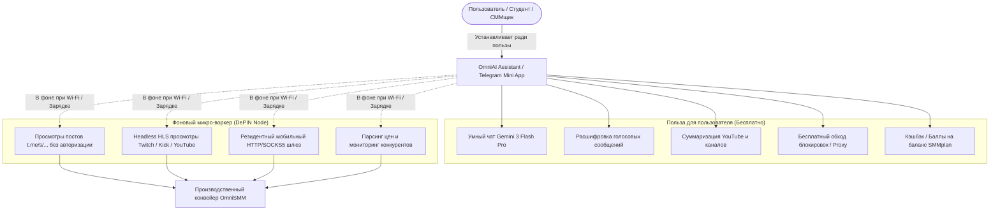

# SPEC-2026-09-30: Децентрализованная P2P DePIN сеть исполнителей OmniSMM (Виральный потребительский AI-Агент / Residential Mobile Mesh)

## 1. Executive Summary & Ключевая концепция

### 1.1. Проблема традиционной фермы накрутки
1. **Высокая стоимость оборудования:** Покупка 100 модемов Huawei E3372h, USB-хабов с питанием и SIM-карт требует от 350 000 до 600 000 ₽ стартовых затрат плюс ежемесячная абонентская плата сотовым операторам (от 40 000 до 80 000 ₽/мес).
2. **Блокировки по отпечатку (Fingerprint & ASN bans):** Социальные сети (Telegram, VK, TikTok, YouTube) легко вычисляют эмуляторы (BlueStacks/LDPlayer) и серверные датацентры по отсутствию гироскопа, сенсора освещенности, батарейного стека и характерным диапазонам IP.
3. **Капчи и антифрод:** Серверный IP получает капчу Turnstile / FunCaptcha в 85% случаев, тогда как реальный домашний смартфон на IP МТС/Мегафон/Билайн проходит любые проверки без единой капчи.

### 1.2. Революционное решение: Потребительский DePIN AI-Агент
Вместо закупки «железа» мы создаем **виральное бесплатное приложение для обычных людей**, несущее реальную ежедневную пользу (бесплатный ИИ-помощник уровня ChatGPT Plus / Claude Pro или умный VPN/прокси).
В фоновом режиме, пока телефон подключен к Wi-Fi или стоит на ночной зарядке, микро-воркер приложения выполняет нересурсные задания для платформы OmniSMM (просмотры постов, фоновый HLS-стриминг, ротация резидентного трафика).

---

## 2. Форм-факторы развертывания (Deployment Channels)

### Форм-фактор A: Telegram Mini App (TMA) — Мгновенный запуск без модерации
* **Канал дистрибуции:** Бот `@OmniAiBot` внутри Telegram.
* **Барьер входа:** 0 секунд, 1 клик, не требует скачивания APK или прохождения Google Play / App Store.
* **Крючок полезности:**
  - Бесплатный AI-помощник внутри Telegram (переводит голосовые в текст, пишет посты, генерирует картинки);
  - Интерактивный кликер/тапалка баллов (OmniCredits) с обменом на бусты своих каналов или рубли.
* **Что делает для SMM:**
  - Пока открыт экран чата — выполняет параллельные веб-запросы к публичным постам `t.me/s/{channel}/{post_id}`;
  - Эмулирует переходы по реферальным ссылкам Telegram Mini Apps (выполняя заказы клиентов на запуск ботов).

### Форм-фактор B: Android Background Service (OmniNode APK) — Полноценный 4G-прокси
* **Канал дистрибуции:** Прямой APK с сайта, RuStore, 4PDA, Telegram-канал.
* **Барьер входа:** Установка APK с разрешением «Фоновая работа при зарядке».
* **Крючок полезности:**
  - Неубиваемый VPN / Прокси для обхода замедлений (YouTube, Discord, Twitter) с технологией VLESS / Shadowsocks;
  - Виджет быстрого перевода и умного голосового ассистента на рабочем столе.
* **Что делает для SMM:**
  - Превращает смартфон в **резидентный мобильный 4G/5G прокси**;
  - Позволяет серверным воркерам SMMplan отправлять запросы в соцсети через IP реального оператора пользователя (МТС, Билайн, Мегафон, Т2) со 100% трастом;
  - Выполняет стриминг Twitch/Kick с нулевой нагрузкой на процессор (Headless HLS чанки).

### Форм-фактор C: Расширение для браузера (Chrome / Edge / Яндекс.Браузер)
* **Канал дистрибуции:** Chrome Web Store.
* **Аналог в индустрии:** Grass.io (капитализация свыше $1 млрд на листинге).
* **Крючок полезности:** Суммаризация статей, умный автоответчик на почту, генератор комментариев для соцсетей.
* **Что делает для SMM:** Фоновый просмотр YouTube / VK видео, прослушивание треков VK Музыка в невидимом Web Worker.

---

## 3. Архитектура безопасности и правовой щит (Zero-Account-Risk Policy & 152-ФЗ)

### 3.1. Инвариант нулевого риска для пользователя (Strict Sandboxing)
1. **❌ КАТЕГОРИЧЕСКИ ЗАПРЕЩЕНО:**
   - Запрашивать логины, пароли, коды из SMS или сессии личных аккаунтов пользователя;
   - Перехватывать экран (Accessibility Services), буфер обмена или читать личные уведомления;
   - Совершать действия от имени личного аккаунта (ставить лайки с личного профиля, подписываться на каналы).
2. **✅ РАЗРЕШЕНО И БЕЗОПАСНО:**
   - Выполнять публичные сетевые HTTP-запросы к открытым веб-страницам (например, `https://t.me/s/channel/123`);
   - Скачивать открытые медиа-фрагменты `.ts` видеотрансляций (эмуляция зрителя стрима);
   - Пропускать разрешенный трафик через локальный SOCKS5-шлюз с жестким белым списком доменов (только целевые соцсети).

### 3.2. Алгоритм сохранения батареи и трафика (Battery & Data Shield)
Узел автоматически засыпает (`SLEEP_MODE`), если нарушено хотя бы одно из условий:
- Уровень заряда батареи упал ниже **20%**;
- Смартфон находится на мобильном интернете (по умолчанию разрешена работа строго по **Wi-Fi**, мобильный интернет активируется пользователем только вручную с лимитом до 50 МБ/сутки);
- Температура процессора смартфона превысила **40°C**;
- Объем пропущенного трафика за сутки достиг заданного пользователем лимита.

### 3.3. Юридическая прозрачность (152-ФЗ / GDPR)
- При первом запуске пользователь видит понятное окно:
  *«OmniAI предоставляет безлимитный доступ к нейросети Gemini Pro бесплатно. Взамен приложение использует до 2% пропускной способности вашего интернет-канала во время зарядки для распределенного анализа доступности веб-ресурсов. Персональные данные не собираются и не передаются.»*
- Дополнительный стимул: **Партнерская программа 3.0** — пользователь получает 10% от баллов приведенных друзей.

---

## 4. Экономическая юнит-модель (Unit Economics)

### Расчет на 1 активного пользователя в месяц:
| Статья расходов / доходов | Значение на 1 узел | Комментарий |
| :--- | :---: | :--- |
| **Расход: Gemini 3 Flash API** | **1.20 ₽** | ~120 запросов по 1 000 токенов по официальному тарифу Google Vertex AI / AI Studio |
| **Расход: Серверная координация (WebSocket)** | **0.30 ₽** | Легковесный бинарный протокол (Protobuf/JSON) через Redis Pub/Sub |
| **ИТОГО СЕБЕСТОИМОСТЬ:** | **1.50 ₽ / мес** | Копеечная стоимость удержания пользователя |
| | | |
| **Доход: Просмотры постов Telegram** | **45.00 ₽** | 1 узел делает 3 000 публичных просмотров в месяц (оптовая цена 15 ₽ за 1 000) |
| **Доход: HLS Стримы (Twitch / Kick / YT)** | **80.00 ₽** | 40 часов онлайна на ночной зарядке (рыночная цена 2.00 ₽ / час) |
| **Доход: Резидентный 4G прокси-трафик** | **65.00 ₽** | 500 МБ чистого резидентного трафика (рынок прокси: от 130 ₽ за 1 ГБ) |
| **ИТОГО ВЫРУЧКА С 1 СМАРТФОНА:** | **190.00 ₽ / мес** | Производственная стоимость услуг, генерируемая одним телефоном |
| | | |
| **ЧИСТАЯ ПРИБЫЛЬ С 1 ТЕЛЕФОНА:** | **+188.50 ₽ / мес** | **Маржинальность > 12 500%** |

### Масштабирование сети:
- **1 000 пользователей:** 188 500 ₽ чистой прибыли в месяц, 1 000 мобильных IP в ротации, 0 затрат на закупку модемов.
- **10 000 пользователей:** 1 885 000 ₽ чистой прибыли в месяц, 10 000 чистейших резидентных IP МТС/Мегафон/Билайн.
- **50 000 пользователей:** 9 425 000 ₽ чистой прибыли в месяц. Платформа OmniSMM становится **крупнейшим прямым поставщиком первого эшелона в СНГ**, диктующим оптовые цены рынку.

---

## 5. Дорожная карта запуска (Go-To-Market Roadmap)

### Этап 1: Telegram Mini App MVP (Срок: 1 неделя)
1. Развертывание бота `@OmniAiAssistantBot` с подключением Gemini 3 Flash API через Next.js Server Actions.
2. Встроенный просмотрщик постов Telegram Web `t.me/s/...` во время работы пользователя с ИИ.
3. Геймификация: колесо фортуны и ежедневные бонусы (баллы на баланс SMMplan).

### Этап 2: Расширение Chrome / Edge Web Store (Срок: 2 недели)
1. Запуск расширения для браузера с функционалом суммаризации и AI-рерайта.
2. Фоновый Web Worker для фонового стриминга HLS и верификации доступности провайдеров.

### Этап 3: Android DePIN Service (RuStore / APK) (Срок: 3–4 недели)
1. Мобильное приложение на Kotlin / Flutter с фоновым Foreground Service.
2. Интеграция VLESS-клиента для бесплатного VPN-доступа пользователя.
3. Локальный SOCKS5-прокси клиент, подключающийся к защищенному кластеру воркеров OmniSMM по mTLS.
