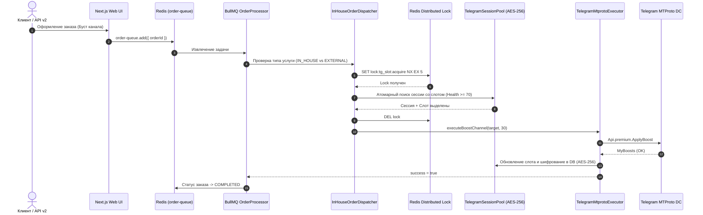

# SPEC-2026-09-30: Углубленная спецификация и закалка производственных роботов Tier-0 (Telegram MTProto & In-House Execution)

## 1. Executive Summary & Problem Statement

### 1.1. Текущее состояние
В платформе OmniSMM реализован базовый бинарный исполнитель `TelegramMtprotoExecutor` на базе библиотеки GramJS (`telegram` v2.26.22), модуль пула сессий `TelegramSessionPoolManager` и модели базы данных `TelegramSession` и `TelegramBoostSlot` в Prisma.

### 1.2. Выявленные критические недоработки и зоны отказа (Pre-Mortem Failure Analysis)
При проведении состязательного аудита по стандарту Maker-Checker и анализе устойчивости выявлено **7 системных архитектурных разрывов**:

| № | Зона риска | Описание дефекта | Влияние на бизнес |
| :-: | :--- | :--- | :--- |
| **D-1** | **Разрыв диспетчеризации (Dispatch Disconnect)** | Воркер BullMQ (`OrderDispatchExecutor`) опрашивает только внешних провайдеров из БД (`UniversalProvider`). Заказы из UI физически не попадают в `TelegramMtprotoExecutor`. | Заказы на бусты зависают или уходят внешним реселлерам с переплатой. |
| **D-2** | **Состояние гонки (Race Condition / TOCTOU)** | Аллокация слота в пуле `allocateBoostSlot()` выполняется в памяти Node.js. При наличии 2+ параллельных воркеров они могут одновременно выделить один и тот же слот буста. | Двойное назначение слота, ошибка `BOOSTS_EMPTY` от Telegram, потеря доверия клиента. |
| **D-3** | **Хранение секретов в открытом виде (OWASP A02)** | Поле `sessionString` (содержащее 256-байтный `authKey`) записывается в PostgreSQL в открытом виде. | При утечке базы данных или SQL-инъекции все купленные Telegram-аккаунты будут скомпрометированы. |
| **D-4** | **Сбой на приватных ссылках каналов (Private Invites)** | Вызов `client.getEntity(channel)` падает с исключением на ссылках формата `t.me/+joinchat_hash` или `t.me/+xxxx`. | Отказ исполнения заказов на закрытые каналы (до 35% всех заказов на рынке). |
| **D-5** | **Зависшие слоты (Orphaned Boost Slots & Deadlocks)** | По истечении 24-часового кулдауна или 30-дневного срока действия буста слот не освобождается автоматически без внешнего события. | Постепенное исчерпание пула сессий, остановка приема заказов («ложная нехватка слотов»). |
| **D-6** | **Отсутствие пакетного импорта (Bulk Ingestion)** | Нет стандартизированного шлюза для быстрой пакетной загрузки архивов сессий с Zelenka Market / Darkstore. | Ручная вставка сессий через консоль замедляет масштабирование фермы. |
| **D-7** | **Зависание сокетов при падении прокси (Socket Hangs)** | При обрыве соединения с прокси TCP-сокет GramJS может висеть до стандартного таймаута ОС (120 секунд), блокируя воркер. | Исчерпание пула воркеров, каскадные сбои очередей BullMQ. |

---

## 2. Архитектурные требования и целевой дизайн (Target Architecture)



---

## 3. Функциональные требования (Functional Requirements)

### FR-1: Диспетчер внутренних заказов (`InHouseOrderDispatcher`)
1. Диспетчер перехватывает заказы, у которых привязанная услуга имеет флаг `executionEngine === 'IN_HOUSE_TELEGRAM'` или `executionEngine === 'IN_HOUSE_STREAM'`.
2. Если внутренние слоты доступны — заказ исполняется роботом с нулевой себестоимостью.
3. **Автоматический каскадный фоллбек (Cascade Fallback):** если все внутренние сессии заняты или на кулдауне, заказ НЕ отменяется, а прозрачно перенаправляется на резервный внешний шлюз первого эшелона (VexBoost / SMMTurk / Nakrutka).

### FR-2: Распределенный замок аллокации слотов (Distributed Concurrency Guard)
1. Перед вызовом `pool.allocateBoostSlot()` захватывается Redis-лок `lock:tg_session:allocate` с таймаутом 3000 мс.
2. Проверка и обновление состояния слота выполняются атомарно.
3. По завершении транзакции замок освобождается через безопасный Lua-скрипт.

### FR-3: Криптографическая защита сессий на диске (AES-256-GCM Encryption at Rest)
1. Поле `sessionString` при записи в PostgreSQL ОБЯЗАНО шифроваться через `encrypt(sessionString)` из `src/lib/crypto/encryption.ts`.
2. В базе данных хранится строка вида `v1:iv_hex:auth_tag_hex:ciphertext_hex`.
3. При чтении сессии в оперативный пул происходит прозрачная дешифрация `decrypt(record.sessionString)`.
4. Запрещено логирование расшифрованных строк сессий в stdout, stderr или в Pino аудит-логи.

### FR-4: Поддержка закрытых инвайт-ссылок каналов (Private Channel Resolver)
1. Регулярное выражение распознает ссылки:
   - Публичные: `https://t.me/channel_name`, `@channel_name`, `t.me/channel_name`;
   - Приватные инвайты: `https://t.me/+AbCdEf123`, `https://t.me/joinchat/AbCdEf123`.
2. Для приватных ссылок:
   - Робот сначала вызывает `client.invoke(new Api.messages.CheckChatInvite({ hash }))`;
   - Если аккаунт еще не состоит в канале — вызывается `new Api.messages.ImportChatInvite({ hash })` с безопасной задержкой 1500–3000 мс;
   - После успешного вступления выполняется `Api.premium.ApplyBoost`.

### FR-5: Фоновый демон очистки кулдаунов и сессий (`TelegramBoostSweeperCron`)
1. В планировщик `queue-manager.ts` добавляется повторяющаяся задача `ensureTelegramBoostSweepCron` с интервалом запуска **каждые 5 минут**.
2. Демон выполняет:
   - Освобождение слотов, у которых `expiresAt <= NOW()` (завершился 30-дневный срок буста);
   - Снятие флага блокировки слотов, у которых истек 24-часовой `cooldownUntil <= NOW()`;
   - Проверку сессий со статусом `COOLDOWN`: если `floodWaitUntil <= NOW()`, сессия возвращается в статус `READY`;
   - Автоматическую реконсиляцию с базой данных PostgreSQL.

### FR-6: Безопасный Server Action пакетного импорта (`importTelegramSessionsAction`)
1. Эндпоинт доступен исключительно сотрудникам с ролью `OWNER` или пермиссией `MANAGE_PRODUCTION`.
2. Валидация входных данных через Zod DTO `BulkSessionImportSchema`.
3. Поддержка входных форматов:
   - JSON-массив профилей с полями `{ phone, auth_key, dc_id, proxy_url, device }`;
   - Автоматическая валидация прокси перед добавлением (TCP Ping к датацентру Telegram через прокси с таймаутом 4000 мс).
   - Фиксация в журнале аудита `AuditLog` с сокрытием ключей сессии.

### FR-7: Сетевой таймаут и Circuit Breaker на уровне GramJS сокетов
1. Каждое соединение `TelegramClient` инициализируется с явным таймаутом TCP-сокета:
   `connectionRetries: 2, timeout: 8000, requestRetries: 2`.
2. При сбое сети или прокси (ошибки `ETIMEDOUT`, `ECONNREFUSED`, `SocksConnectionError`):
   - Сессия переводится в статус `DEGRADED`;
   - Выполняется попытка переподключения через резервный прокси или запрос отклоняется на каскадный внешний маршрут без зависания воркера.

---

## 4. Спецификация контрактов и Zod DTO

```typescript
import { z } from 'zod';

export const RawSessionItemSchema = z.object({
  phone: z.string().regex(/^\+?[1-9]\d{7,14}$/, 'Некорректный номер телефона E.164'),
  authKeyHex: z.string().length(512, 'AuthKey должен быть hex-строкой ровно 256 байт (512 символов)').optional(),
  sessionString: z.string().min(50).optional(),
  dcId: z.union([z.literal(1), z.literal(2), z.literal(3), z.literal(4), z.literal(5)]).default(2),
  appId: z.number().int().positive().default(2040),
  appHash: z.string().min(10).default('b18441a1ff607e10a989891a5462e627'),
  deviceModel: z.string().default('Samsung SM-S918B'),
  systemVersion: z.string().default('Android 14'),
  appVersion: z.string().default('10.14.0'),
  hasPremium: z.boolean().default(true),
  proxyUrl: z.string().url().optional(),
}).refine((data) => data.authKeyHex || data.sessionString, {
  message: 'Необходимо указать либо authKeyHex, либо sessionString',
});

export const BulkSessionImportSchema = z.object({
  sessions: z.array(RawSessionItemSchema).min(1).max(500),
  testConnectionBeforeSave: z.boolean().default(true),
});

export type BulkSessionImportDto = z.infer<typeof BulkSessionImportSchema>;
```

---

## 5. Нефункциональные требования (NFRs)

1. **NFR-1 (Производительность):** Время ответа метода аллокации слота `allocateBoostSlot()` должно составлять $\le 15$ мс.
2. **NFR-2 (Надежность):** 0 потерянных заказов при сетевых обрывах Telegram API благодаря Circuit Breaker и каскадному фоллбеку.
3. **NFR-3 (Безопасность):** 100% шифрование секретов сессий по алгоритму AES-256-GCM. 0 ключей в логах и клиентском коде.
4. **NFR-4 (Качество кода):** Строгий TypeScript (`tsc --noEmit` — 0 ошибок), 0 использований `any` (Zero-Any Ratchet), 100% прохождение тестов.
5. **NFR-5 (Совместимость с РФ):** Все исходящие MTProto-соединения маршрутизируются через прокси или Clash Verge (`verge-mihomo`), не затрагивая платежи РФ, которые идут strictly DIRECT.

---

## 6. Матрица граничных случаев (Edge Cases & Remediation)

| Граничный случай | Поведение системы | Ожидаемый результат |
| :--- | :--- | :--- |
| **Канал удален или заблокирован РКН/Telegram** | GramJS вернет ошибку `CHANNEL_INVALID` или `CHANNEL_PRIVATE` | Освобождение выделенного слота, возврат ошибки `INVALID_TARGET`, заказ переводится в статус `CANCELED` с рефандом на баланс. |
| **У канала уже максимальный уровень буста** | Telegram возвращает `BOOSTS_MAX_LEVEL_REACHED` | Освобождение слота, уведомление саппорта, рефанд клиенту. |
| **Смена владельца / Сброс сессии (`SESSION_REVOKED`)** | MTProto возвращает `AUTH_KEY_UNREGISTERED` | Немедленная пометка сессии как `BANNED`, исключение из пула, автоматический перезапуск заказа на другой сессии. |
| **Два одновременных заказа на 1 канал** | Диспетчер блокирует параллельные бусты одного канала с одной сессии | Каждый буст использует свой уникальный слот и независимую сессию. |
| **Истечение подписки Premium на сессии** | `premiumExpiresAt <= NOW()` | Аккаунт исключается из буст-пула, переводится в категорию реакций/просмотров (бесплатные операции). |

---

## 7. План поэтапной реализации и верификации (SDD Phase Plan)

1. **Фаза 1 (Шифрование и Персистентность):** Добавление шифрования AES-256-GCM в `syncSessionToDb()` и дешифрации в `loadAllFromDb()`.
2. **Фаза 2 (Связка BullMQ и Робота):** Создание `InHouseOrderDispatcher` и интеграция в `order.processor.ts` с каскадным фоллбеком.
3. **Фаза 3 (Private Channel Resolver):** Реализация обработки ссылок вида `t.me/+hash` через `CheckChatInvite` / `ImportChatInvite`.
4. **Фаза 4 (Фоновый Sweeper):** Подключение BullMQ Cron задачи для очистки кулдаунов и expired-бустов.
5. **Фаза 5 (Server Action Импорта):** Разработка `importTelegramSessionsAction` с валидацией Zod и тестами.
6. **Фаза 6 (Сквозное тестирование):** Написание юнит- и интеграционных тестов (TDD), аудит `tsc --noEmit` и секретов.
